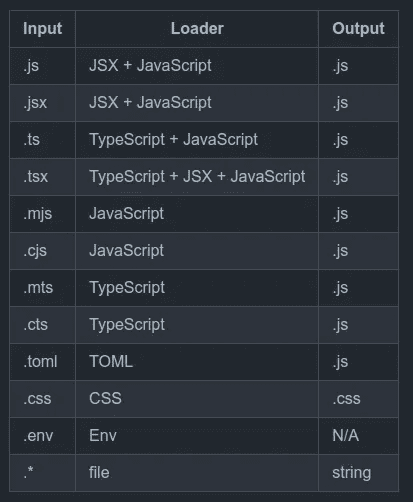
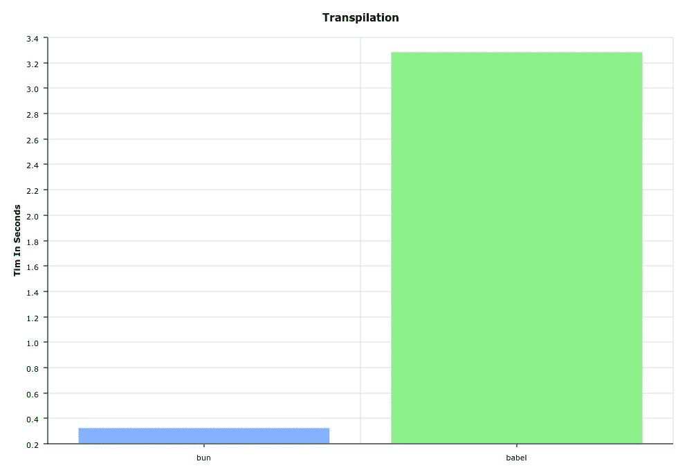
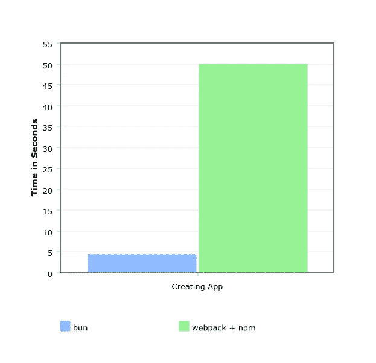
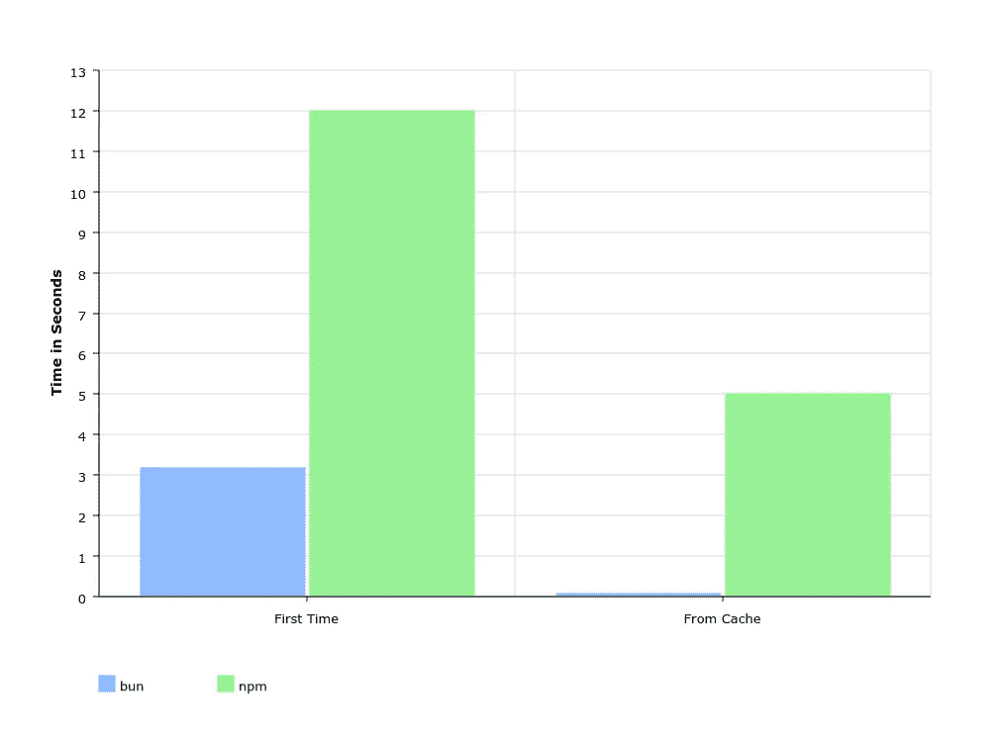
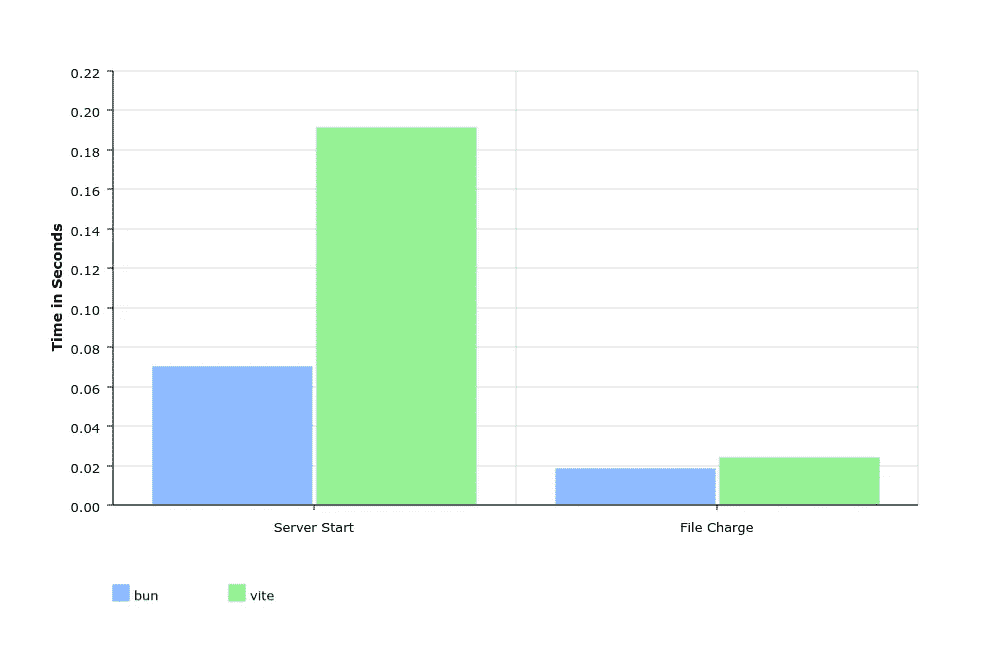
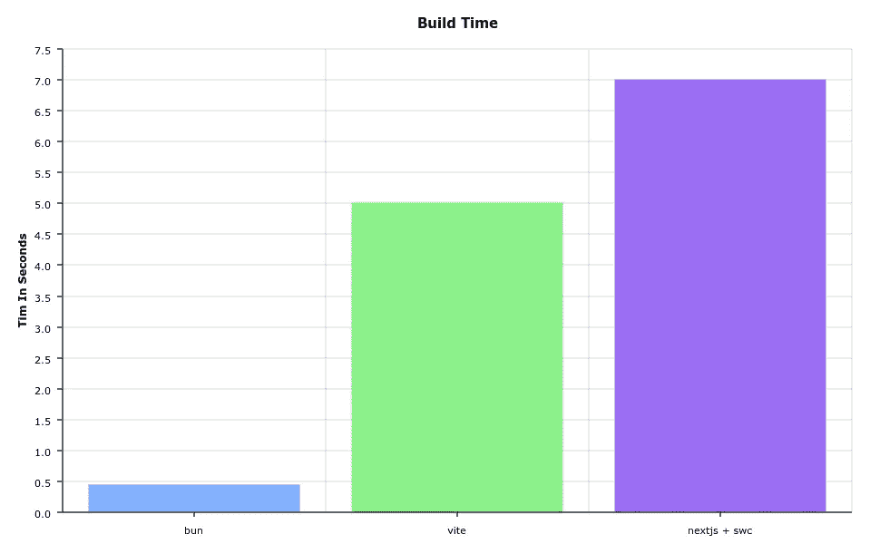

# Bun 是继 Webpack 之后的下一个大事件吗？

> 原文：<https://betterprogramming.pub/is-bun-the-next-big-thing-after-webpack-d683441f77b9>

## bun vs . SWC vs . es build vs . NPM vs . babel 等等。


作者图片

JavaScript 工具的未来远离 JavaScript 语言。像 Webpack 和 Babel 这样的工具正日益失去其相关性。为什么？

像`Rust`、`Go`甚至`Zig`这样的语言已经被证明在捆绑、传输和编译过程中比 JavaScript 更高效。它们不是单线程的，这在处理大量文件时是有益的。

在 JavaScript 中保留生态系统工具的原因是什么？这些工具应该在开发人员的机器上执行，而不是在浏览器上。此外，JS 开发人员不需要调试它们的内部。

`SWC`是 JavaScript 之外最早的工具项目之一。不久之后，`esbuild`宣布了，每个人都为此大肆宣传。由于他们的表现，两人都是真正的游戏规则改变者。

`Vite 2.0`项目现在正在幕后使用`esbuild`来提供一种高性能的建筑体验。

最近，我们看到了 JavaScript 工具生态系统中的一个新玩家:`bun`。它旨在使整个 JavaScript 开发更快。这是一个包含所有电池的工具。它不仅加速了编译和解析，还提供了自己的依赖管理器工具和捆绑。

它还没有准备好投入生产，但是这个工具的前景看起来很光明。在本文中，我们将通过`npm`、`esbuild`、`babel`和`Webpack`来检查这一新工具及其地位。

```
***Update:*** *the Bun tool has been made more exciting after the release of this article. It is now also a JavaScript runtime execution and is adding more features by the day.*
```

# 概观

`bun`没有像它的顶级竞争对手一样被写成`Rust`或者`Go`，而是用`Zig`打造。`Zig`是一种通用编程语言和工具链，用于维护健壮、最优和可重用的软件。

即使它是从零开始构建的，开发者也是基于`esbuild`项目来开发的。

`bun`工具支持开箱即用的复杂特性，如`TypeScript`、`CSS in Js`、`JSX`。它仍然缺少一些基本功能，如`Source Maps`、`Minifier`、`Tree-shaking`等等。

一个显著的特性是`bun`有自己的节点模块解析器实现。这是最引人注目的优化之一。

就像`Npm`和`Yarn`会创建一些关联的锁文件一样，`bun`也会。它将创造一个`bun.lockb`。有一个小小的警告。它不是生成一个纯文本文件，而是生成一个二进制文件。为什么是二进制的？因为性能原因。我们将不得不处理无法轻易检查减贫战略变化的不利方面。

检查这个锁文件的唯一方法是通过以下命令:

```
bun install -y
```

`Bun`像现在一样支持以下装载机:



从 https://github.com/jarred-sumner/bun[捕获](https://github.com/jarred-sumner/bun)

# 建立

`bun`项目还没有公开。你必须在这里加入他们的不和[才能得到邀请。一旦你加入，你需要做的就是导航到他们的`#invites`频道。在那里，您可以通过在频道`I want bun`上写信来请求邀请。](https://bun.sh/discord)

您将获得一个一次性的`jarred-sumner/bun`资源库邀请。

要安装`bun`，您需要执行以下命令:

```
curl -fsSL https://bun.sh/install | bash*# Manually add the directory to your $HOME/.bashrc (or similar)* BUN_INSTALL="/home/jgranja/.bun"
PATH="$BUN_INSTALL/bin:$PATH"
```

要检查它是否正常工作:

```
**bun --version**
```

你会注意到它还没有到达`1.0.0`版本。正如我之前提到的，它还没有准备好投入生产。

# 使用

它的用法很简单。如果你熟悉`yarn`或`npm`的话，结果也差不多。

要安装软件包:

```
bun install
```

就像`yarn`一样，它将使用现有的`package.json`和锁文件(如果存在的话)。

要添加或删除任何软件包:

```
bun remove react
bun add preact
```

我们可以使用`bun`作为跑步者:

```
*# instead of `npm run clean`* bun run clean*# if added to the `scripts` in package.json* bun clean
```

它确实通过最新的 React 生态系统的`create`命令提供了一些集成。

让我们创建一个 Next.js 应用程序:

```
bun create next ./app
cd app
bun
```

让我们创建一个 Create React 应用程序:

```
bun create react ./app
cd app
bun
```

如何生成捆绑文件？

通过运行`bun bun ./path-to.js`，我们生成了`node_modules.bun`文件。它包含所有导入的依赖项。

只要做`./node_modules.bun > build.js`就可以检查内容。

# 基准

让我们运行几个基准测试来了解它的速度。当然，这些都是近似的测量值，会因计算机而异。因为这是开发人员的工具，所以我将重点放在最常见的开发任务上:

*   启动开发服务器
*   在文件中进行更改
*   安装软件包
*   建立生产分布
*   创建新的 web 应用程序

*作为参考，我的笔记本电脑运行的是 16GB 的 AMD 雷禅 7，使用的是 Ubuntu 20.04。*

我使用了一个生成随机`jsx`文件的工具。你可以在这里查看。我已经生成了一组 21 个随机的`jsx`文件，我已经将它们包含在所有创建的测试项目中。

## 1.面包大战巴别塔

这不是一场真正公平的战斗，但它凸显了与传统使用的工具相比，这个工具有多快。



bun vs. babel 传输 React 文件

## 2.创建一个创建-反应应用程序

我们可以看到通过`bun`或`webpack + npm`创造一个`Create React App`的明显区别。使用前者几乎没有任何延迟，只需要`4.4s`就能让你一切就绪。



bun 与 webpack 创建 CRA

## 3.创建 Next.js 应用程序

之前的惊人结果并不令人印象深刻。我们习惯了工具痛打`Webpack`。让我们来一场公平的比赛。现在让我们比较一下`bun`和内部使用`swc`的`Next.js`。


Next.js 框架的 bun 与 swc

两者之间的差异非常明显。尤其是在处理文件更改方面的差异。在我的笔记本电脑上，`bun`只需要`10ms`，而`SWC`则需要`70ms`。

## 4.包管理器

在模块中，安装和操作是`bun`的基础。其他工具依靠`npm`或`yarn`来完成工作。它的性能比`npm`快大约`4x — 100x`倍。

我们已经看到了`2\. Create React App`步骤中的巨大差异。然而，现在让我们做一个更基本的例子。让我们创建一个具有以下依赖关系的`package.json`文件:

*   日期-fns@2.28.0 — 89.5 kB
*   jspdf@2.5.1 — 339.1kB
*   反应@17.0.2 — 6.9 kB

然后我们可以测试它在`first install`和`cached installs`上的表现。我选择了一个像`jspdf`这样的大型库，让差异更加明显。



bun 与 npm 安装包

时差很明显。使用网络时速度更快，从缓存中解析包时速度更快。

## 5.维特 vs. bun

`esbuild`才是真正的竞争对手或者小圆面包。对于这个测试，我使用了内部有`esbuild`的`Vite`。



开发服务器上的 bun 与 vite

我使用了上面相同的代码来生成三个主要竞争对手的包。值得记住的是，不建议将`bun`用于生产，因为它仍然缺少一些功能。尽管结果令人印象深刻，但也不能全信。

还要注意，在最坏的情况下，最大构建时间是`5 secs`。这不是不合理的，这三个工具在这里做了一个可怕的工作。



bun、vite 和 swc 在构建产品包时

# 包裹

JavaScript 工具看起来从来没有这么好过。即使这个工具还没有准备好投入生产，看到新的竞争对手也是很棒的。Webpack 的未来并不明朗，它在 JavaScript 领域内外都有很多竞争对手。

`bun`工具不是万能工具。它有一个特定的用例:构建网站和 web 应用程序。构建库，bun 团队推荐`esbuild`甚至`Rollup`。

现在重点还是不在生产上。它专注于开发以及与现有框架和工具的兼容性。

[](/5-awesome-http-headers-web-developers-should-master-332a1a332084) [## Web 开发人员应该掌握的 5 个非常棒的 HTTP 头

### 以更简洁的方式提高页面安全性和性能

better 编程. pub](/5-awesome-http-headers-web-developers-should-master-332a1a332084) [](/6-javascript-dos-and-don-t-e020a4228dfa) [## 6 JavaScript 应该做和不应该做的事情

### 优化和拥有可读一致代码的技巧

better 编程. pub](/6-javascript-dos-and-don-t-e020a4228dfa)