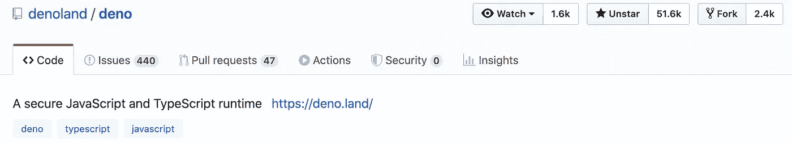

# Deno 对 Node 有威胁吗？

> 原文：<https://betterprogramming.pub/is-deno-a-threat-to-node-1ec3f177b73c>

## Deno 1.0 于 2020 年 5 月 13 日由 Node 的创始人 Ryan Dahl 发布


图片版权 Deno 团队— [deno.land](https://deno.land/)

现在已经有两年了。我们听到了术语 *Deno* ，开发者社区，尤其是 JavaScript 社区，非常兴奋，因为它来自于 [Node](https://en.wikipedia.org/wiki/Node.js) 的作者 Ryan Dahl。在本文中，我们将讨论 [Deno](https://deno.land/) 和 Node 的简史，以及它们的显著特性和流行程度。

Deno 是在 JSConf EU 2018 上由 Ryan Dahl 在他的演讲“关于 Node.js 我后悔的 10 件事”中宣布的。

JSConf EU 2018 — YouTube

在他的 JSConf 演示中，他解释了他在开发 Node 时的遗憾，比如没有坚持承诺、安全性、构建系统(GYP)、`package.json`和`node_modules`等。但在同一场演讲中，在解释了所有的遗憾后，他推出了名为 *Deno* 的新作。当时它还在发展过程中。

但在大约两年后的 2020 年 5 月 13 日，Ryan 和团队(Ryan Dahl、Bert Belder 和 Bartek Iwań czuk)推出了 Deno 1.0。那么我们来说说 Deno 的一些特性。

# 什么是德诺？

Deno 是一个 JavaScript/TypeScript 运行时，具有安全的默认值和出色的开发人员体验。Deno 建立在三大支柱之上:

1.  [**Chrome V8**](https://v8.dev/)—JavaScript 运行时引擎
2.  [**锈**](https://www.rust-lang.org/) 编程语言
3.  [**Tokio**](https://github.com/tokio-rs/tokio)**——正如 GitHub 上提到的，“一个用于编写可靠、异步和精简应用程序的运行时”**

**Deno 的目标是为现代程序员提供一个高效的脚本环境。与 Node 类似，Deno 强调[事件驱动架构](https://en.wikipedia.org/wiki/Event-driven_architecture)，提供一组非阻塞的核心 IO 实用程序，以及它们的阻塞版本。**

## **安装步骤**

**Deno 作为一个单独的可执行文件发布，没有依赖性。您可以使用下面的安装程序来安装它。**

**使用外壳:**

```
curl -fsSL https://deno.land/x/install/install.sh | sh
```

**或者使用自制软件:**

```
brew install deno
```

**更多安装选项见 [deno_install](https://github.com/denoland/deno_install) 。**

**Deno 中的基本 Hello-World 程序如下所示(与 Node 中的相同):**

```
console.log("Hello world");
```

> **我们将在整篇文章中尝试比较 Deno 和 Node 的特性。最后，我们会试着找出它是否真的是一个威胁。**

**毫无疑问，Node 是一个非常成功的 JavaScript 运行时环境。今天，超过数千个生产版本正在使用 Node。这一成功的另一个原因是 NPM，**JavaScript 运行时环境节点的包管理器，它为每个 JavaScript 开发人员提供了数百万个可重用的库和包。Node 现在已经有十年的历史了:它最初于 2009 年 5 月 27 日推出。另一方面，Deno 相对来说是非常新的，仍然没有在产品构建中使用很多。它可以用来创建像 Node 这样的 web 服务器，执行科学计算等。****

# ****Deno 的突出特点****

*   ****安全(默认情况下没有文件、网络或环境访问 _****
*   ****仅提供一个可执行文件****
*   ****对`node_modules`和`package.json`说不****
*   ****现成的类型脚本支持****

## ****安全性****

****Deno 中的程序在安全的沙箱中执行(默认情况下)。未经许可，脚本无法访问硬盘、打开网络连接或进行任何其他潜在的恶意操作。例如，以下代码在没有任何读/写/网络权限的情况下运行基本 Deno 脚本:****

```
**deno run index.ts**
```

****公开相应的权限需要显式标志:****

```
**deno run --allow-read --allow-net index.ts**
```

## ******单个可执行文件******

****Deno 试图提供一个独立的工具来快速编写复杂功能的脚本。Deno 是一个单个文件，它可以定义任意复杂的行为，而不需要任何其他工具，因此每个库都将被显式调用并包含在程序中。****

## ****模块系统****

****在这里，我们没有任何`package.json`或`node_modules`。可以使用源文件的相对路径、绝对路径或完全限定的 URL 来导入源文件。如下图所示:****

```
**import { serve } from “https://deno.land/std@0.50.0/http/server.ts";for await (const req of serve({ port: 8000 })) { req.respond({ body: “Hello from Deno\n” });}**
```

## ****类型脚本支持****

****TypeScript 是一种由微软开发和维护的开源编程语言。最终，TypeScript 只能转换成 JavaScript。这是近来另一种流行的语言，在 [Angular Framework](https://angular.io/) 和 React.js UI 库中大量使用。Deno 支持 TypeScript，不需要额外的工具。****

****Deno 是一个新的运行时，用于在 web 浏览器之外执行 JavaScript 和 TypeScript，比如 Node。但是重要的是要理解 Deno 不是 Node 的扩展——它完全是一个新编写的实现。****

****慢慢的，Deno 也开始流行了，像 Node。你可以通过 Deno 的官方 twitter 手柄 [@deno_land](https://twitter.com/deno_land) 在 Github【https://github.com/denoland/deno】上拥有 [11.5K 粉丝](https://twitter.com/deno_land/followers)和 50k+明星来看人气。****

********

****GitHub 上的 Deno****

# ****Deno 的局限性****

*   ****Deno 与节点(NPM)程序包不兼容。这让大型 JavaScript 开发社区非常失望。****
*   ****因为它在内部使用 TypeScript 编译器将代码解析为普通的 JavaScript，所以相对来说它仍然非常慢。****
*   ****它滞后于 HTTP 服务器性能。****

****最后，我们可以得出结论，Node 和 Deno 完全是两个不同的 JavaScript 运行时环境——所以最好不要比较它们。选择取决于给定的要求。看了十年来 Node 在开发者中逐渐增加的受欢迎程度，我认为 Deno 将很难在更短的时间内覆盖这一点。但事实上，对于新功能，人们绝对可以尝试 Deno。我们将继续关注 Deno 的进一步发展，并在未来几年中了解更多信息。所以，今天我们可以声明:****

> ****截至 2020 年，Deno 对 Node 根本不是威胁。****

****在下面的评论区写下你的建议和反馈。****

****阅读我下面的其他文章，在 Medium 上关注我。****

****[](https://medium.com/swlh/revisit-all-10-angular-versions-in-a-glance-f7f778498160) [## 一目了然地重温所有 10 款棱角分明的款式

### 谷歌最近发布了其广受欢迎的网络和移动框架的 v10。

medium.com](https://medium.com/swlh/revisit-all-10-angular-versions-in-a-glance-f7f778498160) [](https://towardsdatascience.com/face-detection-in-just-5-lines-of-code-5cc6087cb1a9) [## 仅用 5 行代码实现人脸检测

### 使用世界上最简单的人脸识别 python 库来识别和操作人脸。

towardsdatascience.com](https://towardsdatascience.com/face-detection-in-just-5-lines-of-code-5cc6087cb1a9) 

让我们在 LinkedIn([@ kapilraghuwansh](https://www.linkedin.com/in/kapilraghuwanshi/)I)和 Twitter ( [@techygeeek](https://twitter.com/techygeeeky) y)上保持联系，以获取更多此类引人入胜的技术文章和教程。🤝****