# Deno 准备好黄金时段了吗？

> 原文：<https://betterprogramming.pub/is-deno-ready-for-primetime-a1ea5cd4bea1>

## Deno 模块的评估


由 DALL-E 2 生成

我们已经介绍了 Deno T2，一个基于 V8 JavaScript 引擎和 Rust 编程语言的 JavaScript、TypeScript 和 WebAssembly 的运行时。

这里有一个有趣的时间线，比较了 [Node.js](/5-major-features-of-node-js-18-5f4a164cc9fc) 和 Deno(销毁节点)，以及与 Node 深度耦合的世界上最大的软件注册表 npm(节点包管理器):

*   npm 诞生于 2009 年 9 月 21 日。
*   node 0.1.14 发布于 2011 年 8 月 2 日。
*   node 0.6.3 于 2011 年 11 月 24 日捆绑 npm。
*   节点 14 发布于 2020 年 4 月 21 日。
*   Deno 1.0 于 2020 年 5 月 13 日发布。
*   节点 16 发布于 2021 年 4 月 20 日。
*   节点 18 发布于 2022 年 4 月 19 日。
*   Deno 1.24.1 于 2022 年 7 月 28 日发布。

作为后来者，Deno 建立在 node . js 10 年经验的基础上，拥有最新的互联网技术和网络标准。

Deno 准备好黄金时段了吗？

尽管坚实的架构带来了有前途的特性，Deno 仍然年轻，不稳定，不适合许多环境。这是黄金时间的黎明。它需要一个大的社区来认可这种方法并为开源项目做出贡献。

在本文中，我们将尝试和评估 Deno 模块。

# Deno 模块

根据维基百科的说法，在主要的 npm 注册表中有超过 130 万个可用的包。它是强大的，有能力的，但也是一个需要维护的庞大数字。

Deno 只支持 [ES 模块](/what-might-be-coming-in-npm-9-6985cf2678a6)。对于本地文件，Deno 需要完整的模块名，包括扩展名。当处理远程导入时，它期望 web 服务器通过 URL 路径解析模块，并提供代码的媒体类型。Deno 的远程 HTTP 导入不使用`package.json`。Deno 有一个标准库、第三方模块和 cdn(内容交付网络)。

## 标准库

Deno 有一个标准库，`[https://deno.land/std](https://deno.land/std)`，其中包含了所有 Deno 项目都可以无所畏惧地使用的高质量代码的模块。例如，`[https://deno.land/manual/node/std_node](https://deno.land/manual/node/std_node)`模块，poly 填充 Node 的内置模块。Deno 模块没有外部依赖性，它们由 Deno 核心团队审查。[两周前](/the-comprehensive-guide-to-deno-an-alternative-to-node-ea0db4fdec77)，在`std@0.148.0`版本，现在在`std@0.150.0`版本。

## 第三方模块

Deno 为第三方模块提供托管服务`[https://deno.land/x](https://deno.land/x)`。它缓存存储在 GitHub 上的开源模块版本，并在一个易于记忆的域中提供服务。

[两周前](/the-comprehensive-guide-to-deno-an-alternative-to-node-ea0db4fdec77)，它有 4895 个第三方模块，现在它有 4961 个第三方模块。

## CDNs

一些 Deno 友好的 cdn 托管来自 npm 的包，并将它们作为 Deno 可消费的 es 模块提供。`esm.sh`、`[https://esm.sh/](https://esm.sh/)`，就是这样的 CDN。

# 建立全新的工作环境

我们选择 [Fresh](https://github.com/denoland/fresh) 作为工作环境，这是一个面向 JavaScript 和 TypeScript 开发者的全栈现代 web 框架。前两篇文章详细描述了以下两个步骤的工作原理:

[第一步:在 macOS 上，使用 brew 安装 Deno](https://medium.com/p/ea0db4fdec77) 。

```
% brew install deno
```

[第二步:使用 Deno CLI 搭建一个新项目](/the-comprehensive-guide-on-fresh-a-new-web-framework-by-deno-b1ebc94007cb)。

```
% deno run -A -r https://fresh.deno.dev my-project
```

这个项目也可以从资源库`[my-deno-fresh-project](https://github.com/JenniferFuBook/my-deno-fresh-project)`下载。

下面是在项目目录下生成的文件和目录的 VS 代码显示。

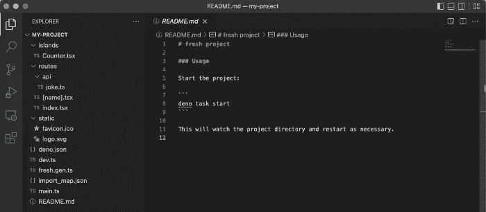

作者图片

顶层文件为`deno.json`、`dev.ts`、`main.ts`、`fresh.gen.ts`、`import_map.json`和`README.md`。

顶层目录是`routes`、`islands`和`static`。

运行`deno task start`启动应用程序。页面`http://localhost:8000`显示以下应用程序:

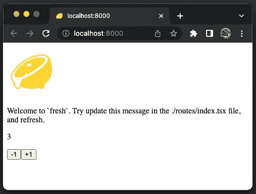

作者图片

# 示例路线

路由是一种机制，它决定通过哪条路由来处理给定的传入请求。新路由请求基于其 URL 路径。`routes`目录包含项目中的所有路线。每个文件的名称对应于访问该页面的 URL 路径。

我们创建一些示例路由来测试 Deno 模块。

## 拉姆达路线

[Ramda](https://ramdajs.com/) 是一个函数式编程库。它旨在将函数式编程添加到 JavaScript 中，而不改变其本质和感觉。

`R.max`是一个返回两个参数中较大值的函数。例如，`R.max(200, 300)`返回`300`。

我们可以在`[https://esm.sh/](https://esm.sh/)`得到 ramda 模块。在浏览器地址栏中，键入`[https://esm.sh/ramda](https://esm.sh/ramda)`和`enter`。会重定向到最新版本的`ramda`，可以导入使用。

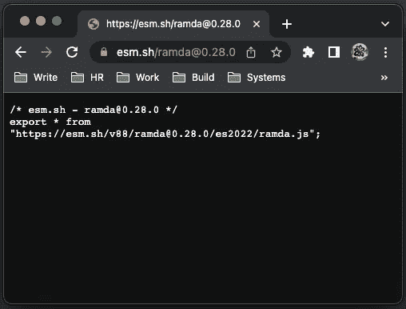

作者图片

创建一条新航路`routes/ramda.tsx`，如下所示:

*   在第 3 行，我们导入了最新版本的`ramda`。它也适用于特定版本的 ramda，如`[https://esm.sh/v88/ramda@0.28.0/es2022/ramda.js](https://esm.sh/v88/ramda@0.28.0/es2022/ramda.js)`。
*   在第 6 行，调用`ramda`函数，并返回`300`。

转到页面，`http://localhost:8000/ramda`，有效。

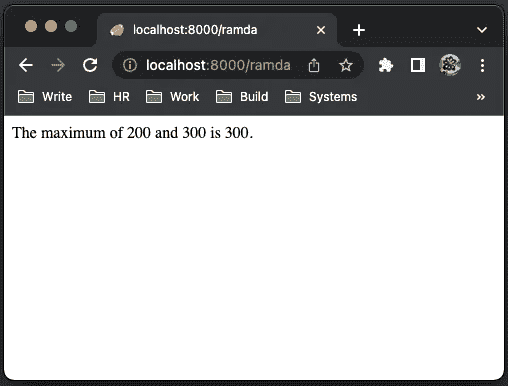

作者图片

或者可以试试 Deno 的托管服务，`[https://deno.land/x](https://deno.land/x)`。在`[https://deno.land/x](https://deno.land/x)`页面，在下面的红色框中输入查询字符串`ramda`。按下`enter`，页面将被重定向到`[https://deno.land/x?query=ramda](https://deno.land/x?query=ramda)`。

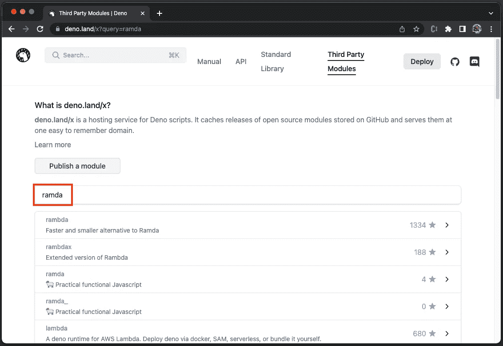

作者图片

第一选择，`rambda`，有 1334 颗星。让我们点击它，进入以下页面:

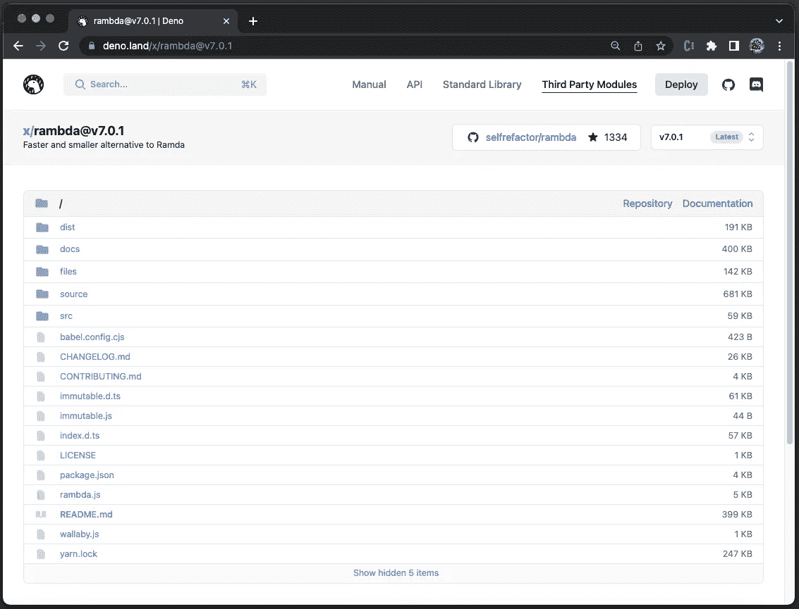

作者图片

页面上没有用法。无论如何，尝试以下导入:

```
import * as R from "https://deno.land/x/rambda";
```

它会显示一个错误，说明找不到模块。

1334 颗星是从 [Github](https://github.com/selfrefactor/rambda) 继承来的，但这并不意味着它适用于 Deno。

## json 路线

JSON 是一种轻量级的数据交换格式。`JSON.stringify(value)`返回指定`value`对应的 JSON 字符串。这个 API 对于查看字符串格式的对象值很有用。

添加路线，`routes/json.tsx`。

转到页面，`http://localhost:8000/json`，有效。

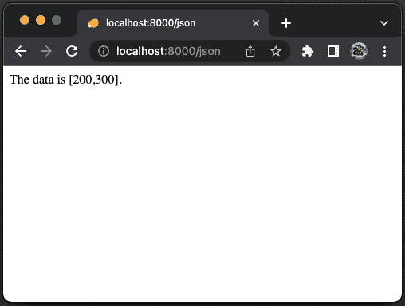

作者图片

JSON5 是 JSON 的超集，旨在通过扩展其语法来减轻 JSON 的一些限制。在`[https://deno.land/x](https://deno.land/x)`，我们找到了 json5 页面`[https://deno.land/x/json5@v1.0.0](https://deno.land/x/json5@v1.0.0)`，上面有一个使用示例。

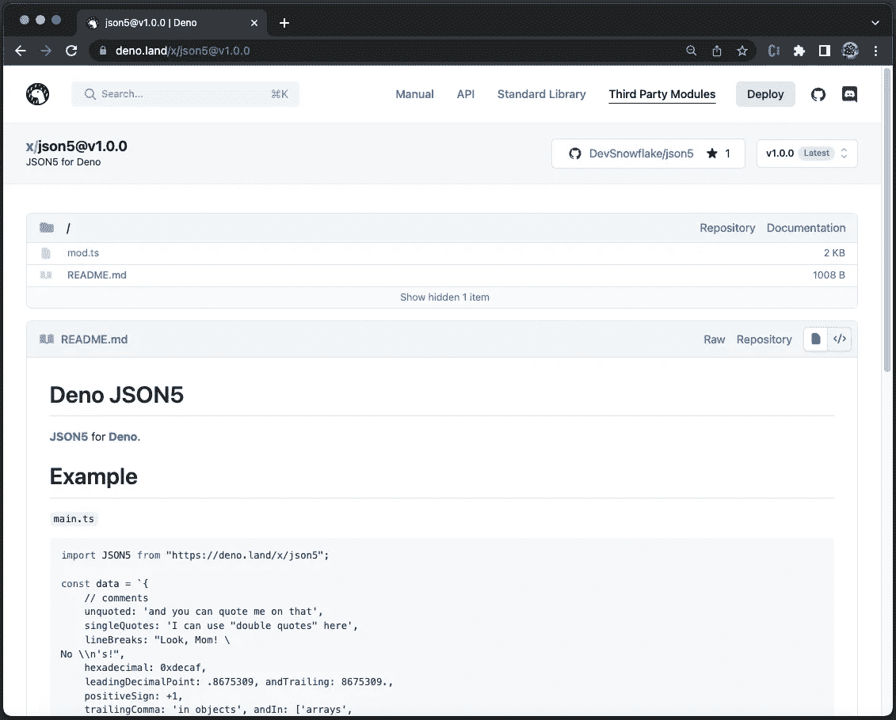

作者图片

修改路线`routes/json.tsx`以使用`json5`。

它显示一个错误:

它必须与提供的例子一起工作，但是我们现在找不到模块。

我们试试`[https://esm.sh/](https://esm.sh/)`。

转到页面，`http://localhost:8000/json`，就可以了。


作者图片

## mysql 之路

我们已经在 Create React App environment 和 Remix 中使用了 [MySQL。我们把它作为 Deno 的标杆吧。](/set-up-and-use-mysql-in-create-react-app-environment-22a4c7dc077f)

`[https://deno.land/x/mysql@v2.10.2](https://deno.land/x/mysql@v2.10.2)`是一个定义良好的页面，带有详细的文档。

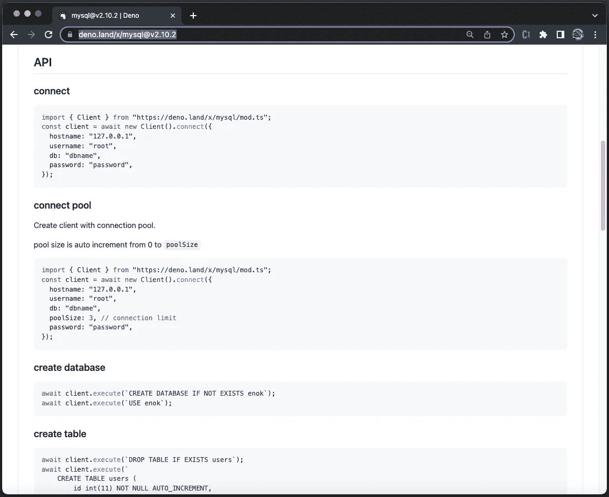

作者图片

按照文档创建`mysql`路线，`routes/mysql.tsx`:

*   在第 7–12 行，它创建了一个到 MySQL 的连接。
*   在第 14–19 行，页面处理程序查询已经在数据库中定义的`students`表。
*   在第 21–23 行，页面内容基于 MySQL 查询结果呈现。

我们用配置好的`myDB`运行 MySQL 8.0.28。

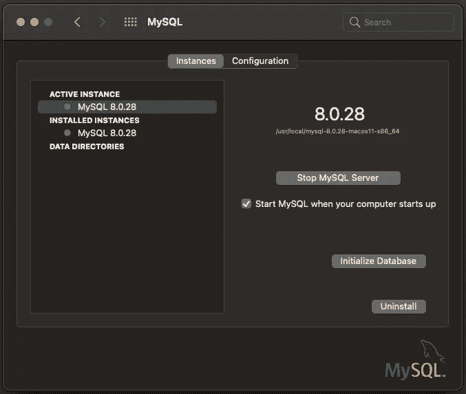

作者图片

执行`deno task start`，显示错误:

发生了什么事？

[本期](https://github.com/denodrivers/mysql/issues/37)显示 MySQL 8.0 的默认认证插件没有实现。Deno 不支持`caching_sha2_password`，因此只支持低于 8.0 的 MySQL 数据库。

问题开了两年多了，至今没有任何进展。

## mongodb 路线

MySQL 模块不工作。其他数据库呢？尤其是较新类型的数据库？

SQL 数据库使用具有固定行和列的表，自 20 世纪 70 年代以来一直在发展。MySQL 最初版本发布于 1995 年 5 月 23 日。

自 2000 年代末以来，NoSQL 数据库一直在发展。MongoDB 使用带有可选模式的类 JSON 文档，版本 1.0 于 2009 年 8 月 27 日发布。

我们相信在 MongoDB 开发者中应该有更多的 Deno 采用者。让我们试一试。

在 macOS 上安装 MongoDB 的最新社区版本:

有多种方法可以运行 MongoDB:

*   要将 MongoDB 作为 macOS 服务运行:

*   要将 Mongo DB 作为后台进程运行:

*   要在命令行运行 Mongo DB:

MongoDB Shell`mongosh`是一个全功能的 JavaScript 和 Node.js 环境，用于与 MongoDB 部署进行交互。它显示了 mongoDB 实例的 URL 路径(第 4 行)。

`[https://deno.land/x/mongo@v0.31.0](https://deno.land/x/mongo@v0.31.0)`是一个定义良好的页面，带有详细的文档。

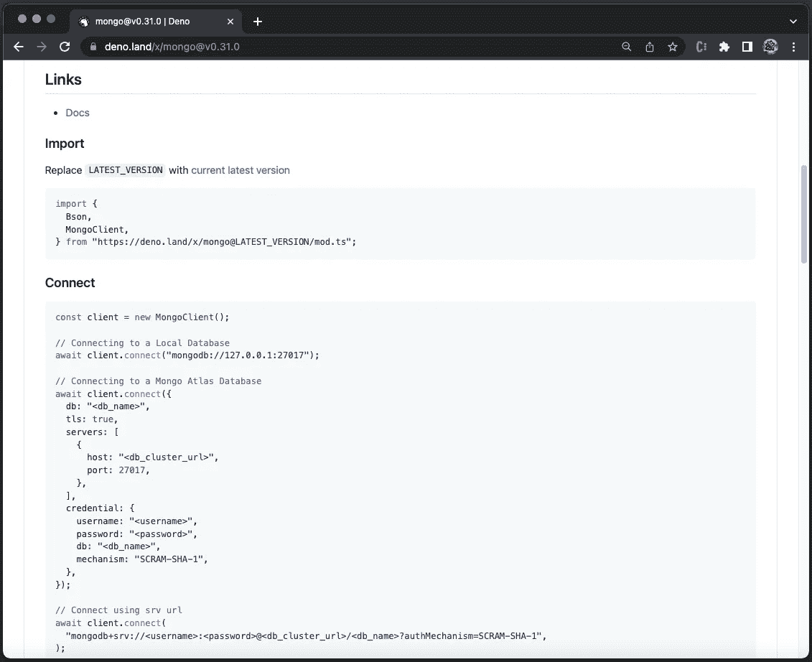

作者图片

创建`mongodb`路线，`routes/mongodb.tsx`:

*   在第 7 行，它创建了一个`MongoClient`。
*   在第 8 行，它连接到 MongoDB，地址显示在`mongosh`中。
*   在第 9 行，它设置为`test`数据库实例。
*   在第 10 行，它访问了`users`集合。
*   在第 12–22 行，页面处理程序查询`users`计数(第 14 行)并插入一个新的计数(第 15–18 行)。然后，它检索所有用户(第 19 行)，并将结果传递给`_ctx.render()`。
*   在第 24–27 行，页面内容呈现给所有用户，其中第 25 行记录了`props`内容。

通过命令`mongod —-config /usr/local/etc/mongod.conf`启动 mongoDB，并转到页面`http://localhost:8000/mongodb`。它显示了四个现有用户。

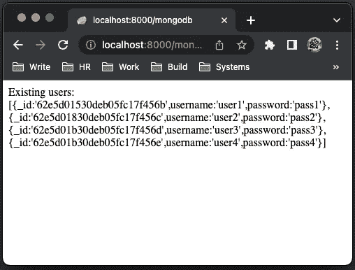

以下是控制台消息:

# 结论

Deno 是一个大型项目。架构设计采用最新的互联网技术和网络标准。它相对年轻，构建和维护分布式模块具有挑战性。就像 React 有 Meta 做后盾，Angular 有 Google 做后盾，Deno 拿一个村子把它推向下一个阶段。

这是黄金时间的黎明。加入社区来支持 Deno，并为开源项目做出贡献。通过反复试验，我们可以成为推动指针前进的力量。

我们期待 Deno 2.0，以及一些可预测的发布日期。

感谢阅读。

如果你有兴趣，可以看看[我的 web 开发文章目录](https://jenniferfubook.medium.com/jennifer-fus-web-development-publications-1a887e4454af)。