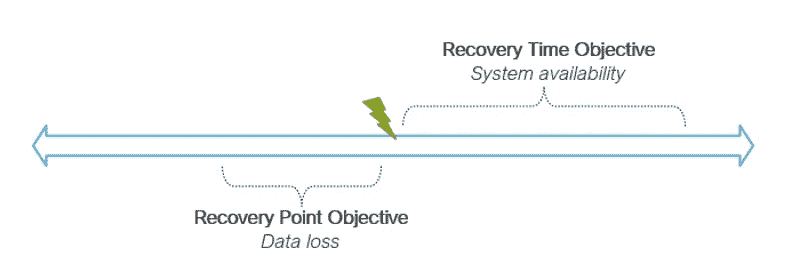

# 在无服务器应用中，灾难恢复值得吗？

> 原文：<https://betterprogramming.pub/is-disaster-recovery-worth-it-in-serverless-applications-1a4fbccfe6fd>

## 无服务器已经具有现成的高可用性。你需要在那之上增加吗？

凯利·西克玛在 [Unsplash](https://unsplash.com/s/photos/disaster?utm_source=unsplash&utm_medium=referral&utm_content=creditCopyText) 上的照片

灾难是你认为“T4”永远不会发生在我身上的事情之一。当发生在你身上而你没有计划的时候，你会想“为什么是我？”

去年，我参加了一个全天经理会议，积极参与为 2022 年做准备的对话。有人拍了一下我的肩膀，然后有人问“嘿，你的应用程序关闭了吗？”

对此，我笑着说“只有 AWS 区域关闭，它才会关闭。”

大约 30 秒钟后，我收到了 AWS 的一封电子邮件，说他们在部署我的应用程序的地区范围内遇到了一些内部网络问题。

当我试图登录我的应用程序时，我立即开始冒汗，并面对一个 [502 错误网关](https://developer.mozilla.org/en-US/docs/Web/HTTP/Status/502)。我的老板和我老板的老板在房间里，问我有什么计划让它恢复运行。因为没有计划，我变得结结巴巴。像这样的停机在无服务器领域是不会发生的。

所以我不得不等待。当我坐在那里一遍又一遍地刷新我的应用程序时，等待 AWS 弄清楚发生了什么。

糟糕透了。

还是做到了？

# 灾难恢复与高可用性

人们通常认为灾难恢复和高可用性是一回事。事实上，许多人甚至不知道高可用性这个词，因为他们认为这就是灾难恢复。

我今天在这里告诉你*它们不是一回事*。

**灾难恢复**是指在重大事件发生后让您的系统保持稳定的能力。[重大事件](https://www.dpsolutions.com/blog/types-of-disasters)可能是像*自然灾害*(龙卷风或地震)*物理灾害*(建筑火灾或服务器机房洪水)，或*技术灾难*(黑客攻击或勒索软件)。

高可用性是指您的系统在不停机的情况下保持正常运行的能力。当我们想到灾难时，这就是我们倾向于想到的。我们的解决方案有多强大？如果灾难真的发生，我们的响应速度有多快？

你可以看到这两个术语是如何被混为一谈的。当涉及到用户满意度时，它们是齐头并进的。

> 在理想情况下，您的最终用户永远不会知道灾难是否发生。

让我们来谈谈灾难恢复的两个主要焦点，[恢复时间目标(RTO)和恢复点目标(RPO)](https://www.druva.com/blog/understanding-rpo-and-rto/) 。

*RTO 和 RPO 在灾难恢复中的作用。来源:* [*艾伦·赫尔顿*](https://twitter.com/AllenHeltonDev)

**RTO** 是灾难发生后让您的系统恢复运行所需的时间。它直接映射到应用程序的可用性。如果您有一个故障转移计划，那么您的 RTO 就是您能多快地执行该计划以使系统再次正常运行。

**RPO** 是您在灾难发生前*恢复数据的时间点。如果灾难导致您从备份中恢复数据库，您的 RPO 将是拍摄快照的时间。*

因此，就灾难恢复而言，高可用性只是等式的一半。两者同等重要，如果您错过了 RTO/RPO，您可能会违反[服务级别协议(SLA)](https://en.wikipedia.org/wiki/Service-level_agreement) ，并开始欠客户一些钱。

# 无服务器免费赠品

当您选择无服务器时，您会立即获得可用性方面的好处。

像 [Lambda](https://aws.amazon.com/lambda/) 、 [API Gateway](https://aws.amazon.com/api-gateway/) 、 [SQS](https://aws.amazon.com/sqs/) 、 [SNS](https://aws.amazon.com/sns) 和 [EventBridge](https://aws.amazon.com/eventbridge/) 这样的无服务器服务都自动跨越给定区域的所有可用性区域。这意味着您不必担心在多 AZ 架构中运行多个实例，因为 AWS 会为您处理。

您可以在开箱即用的单个区域内获得高可用性和自动冗余。负载平衡、可扩展的体系结构是托管服务的一部分，因此您不必担心会影响 RTO。

当您使用像 [DynamoDB](https://aws.amazon.com/dynamodb) 这样的数据库时，您可以获得高可用性，但是您也可以选择打开[时间点恢复(PITR)](https://aws.amazon.com/dynamodb/pitr/) 。PITR 允许您以精确到秒的粒度恢复过去 35 天的数据库。

这意味着对于您的数据库，您的 RPO 可能小到 1 秒钟。再一次，这让您不必担心达到恢复目标，因为 AWS 会为您处理。

因此，现成的无服务器应用程序为我们提供了单个区域的高可用性和几秒钟的 RPO。

# 多区域无服务器应用程序

如果你的应用程序对停机时间零容忍，比如紧急[计算机辅助调度(CAD)](https://en.wikipedia.org/wiki/Computer-aided_dispatch) 系统，你将需要探索一个多区域应用程序。

在 AWS 整个区域中断的罕见情况下，您的应用程序必须自动响应并故障转移到另一个准备就绪的区域。通常被称为[主动-主动故障转移策略](https://docs.aws.amazon.com/Route53/latest/DeveloperGuide/dns-failover-types.html)，它们最终在无服务器的世界中以极低的成本运行。

由于无服务器的定价模式是*按使用量付费*，所以将 Lambda 函数和 API 网关等无服务器资源部署在冗余区域不会花你一分钱。将数据放入故障转移区域需要额外的成本。

您可以实现 [DynamoDB 全局表](https://docs.aws.amazon.com/amazondynamodb/latest/developerguide/GlobalTables.html)来将数据复制到您的故障转移区域。您需要为写请求支付复制、存储和数据传输成本。让我们举一个例子:如果您的应用程序一个月消耗 25GB 的存储空间，其中有 1500 万条记录，那么您每月使用全局表的成本将是一笔额外的费用:

> *25 x 0.09 美元(每 GB 数据传输成本)+15 x 1.875 美元(每百万单位的复制写入成本)+25 x 0.25 美元(每 GB 月存储)= 36.63 美元*

对于通过跨区域获得的可靠性来说，这是一个不错的成本。

另一个区域复制是 [S3 双向跨区复制](https://aws.amazon.com/about-aws/whats-new/2020/12/amazon-s3-replication-adds-support-two-way-replication/)。这使您能够跨区域复制添加到 S3 时段的任何文档。如果启用此选项，则可以在任一区域添加文档，并使其他区域可以使用该文档。

对 S3 文档的复制会产生额外的存储、复制放置请求和数据传出成本。如果我们的应用程序消耗了 100 万个文档，总容量为 5TB，那么额外的复制成本将是:

> *5000 x 0.023 美元(GB-月存储)+1000 x 0.005 美元(每 1000 个请求的 PUT 请求)+5000 x 0.09 美元(GB 数据传输量)= $615 美元*

同样，当您谈论在发生区域性停机时几乎消除停机时间时，这并不是一笔很大的额外成本。

*完全复制的无服务器应用程序(简化版)。来源:* [*艾伦·赫尔顿*](https://twitter.com/AllenHeltonDev)

理想情况下，这就是多区域故障转移的所有额外成本。实际上，这些可能不是你会遇到的唯一额外成本。

您的应用程序可能运行某种预配资源。无论是运行批处理作业的 EC2 实例还是高级搜索功能的 OpenSearch，很少有应用程序是 100%无服务器的。要运行主动-主动故障切换，您必须在两个区域中启用并运行这些调配的资源。这意味着您的调配成本将翻倍。

使用 EC2，您可以运行主动-被动策略，这需要您按需启动实例。但是使用 [OpenSearch](https://aws.amazon.com/opensearch-service/) ，域名无法关闭。所以你需要激活它。这可能会导致一些昂贵的 AWS 法案。

# 值得吗？

确定跨区域故障转移策略是否值得会导致您在软件开发中看到的最常见的答案:**这取决于**。

您是否有不可中断的任务关键型工作负载或要求 99.999%正常运行时间的 SLA？您可能需要跨区域故障转移。可用性可能是您决定在无服务器提供的内置机制之外寻求自己的故障转移机制的重要驱动因素。

在 AWS 出现影响您的应用程序的区域性中断的[极其罕见的事件](https://aws.amazon.com/premiumsupport/technology/pes/)中，您认为在 AWS 修复中断时，您可以运行故障转移行动手册转移到其他区域吗？值得冒这个险吗？

使用无服务器，您的数据已经具有极高的可用性和极低的 RPO。这是使用架构的好处之一。但是你必须考虑系统中的所有组件。有可能你有一些其他资源也可能受到影响，而不是无服务器的。你用它们做什么？

在 AWS 架构良好的框架中，灾难恢复在[可靠性支柱](https://docs.aws.amazon.com/wellarchitected/latest/reliability-pillar/plan-for-disaster-recovery-dr.html)中有自己的部分。它谈到了我们今天谈到的许多事情。

然而，在架构良好的框架的[无服务器镜头](https://docs.aws.amazon.com/wellarchitected/latest/serverless-applications-lens/reliability-pillar.html)中，它更侧重于从错误配置和短暂的网络问题中恢复。它还建议使用阶跃函数来提供自动重试故障和观察系统的方法。在某些情况下，使用阶跃函数[也比λ节省成本](/lambda-vs-step-functions-the-battle-of-cost-and-performance-5f008045e2ab)。

从字里行间来看，这可能意味着传统的灾难恢复可能不像过去那么重要了。毕竟，这是我们选择无服务器的部分原因。

# 结论

你应该总是为出错的时候做准备。在某些情况下，*耐心等待*可能是一个完美可行的计划。如果您无法在云供应商恢复所需的时间内进行故障切换或恢复，那么您可能是在浪费时间。

对于某些工作负载，您没有这种奢侈。由于您的可用性需求，实现跨区域复制(如 DynamoDB 全局表和 S3 跨区域复制)的措施是必须的。

如果您的应用程序大部分是无服务器运行的，那么每月额外增加几美元来提高您的可靠性可能是值得的。如果您在 OpenSearch 或 EC2 等调配服务上有大量工作负载，您可能需要权衡跨区域的选项。

您已经拥有无服务器的多可用性区域冗余。许多用例中都涉及到了您。但是玩“如果”游戏并确保你知道该做什么总是一个很好的练习。

编码快乐！