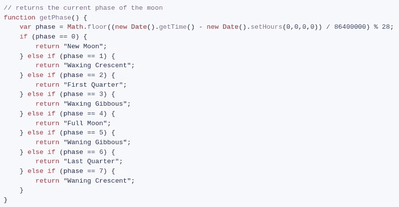
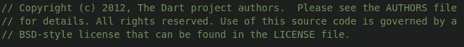

# GitHub Copilot 真的有那么好吗？

> 原文：<https://betterprogramming.pub/is-github-copilot-actually-kind-of-good-6b327cbdb59d>

## 回答:很复杂。

来源: [github.blog](https://github.blog/2022-06-21-github-copilot-is-generally-available-to-all-developers/)

在过去的 7 年里，我断断续续地写代码，5.5 年是业余爱好，1.5 年是专业工作。作为一名学生，我可以免费测试 Copilot，它也被集成到 [VSCode](https://code.visualstudio.com/) 中，所以我看不出有什么理由不测试它，看看会发生什么。

# 坏事

来源:[lukpedclub W](https://www.vecteezy.com/members/amy1313)via[Vecteezy](http://vecteezy.com)

## **1。有点烦**

基本上，把副驾驶想象成在你还没想明白之前就回答问题的孩子。有时他们弄错了，有时他们做对了，但不管怎样都有点烦人。要么他们弄错了，打断了你的思考过程，要么他们弄错了，阻止你完成自己的思考。

有时候，我一直试图通过一段代码工作，而 Copilot 一直推荐巨大的、错误的代码段，使我偏离了轨道，我最终只会愤怒地禁用 Copilot。

来源: [JP Laqueur](http://www.brandfoundations.us/blog-overview?author=54f6028be4b04d7cac4d682d) 通过 [BrandFoundations](http://www.brandfoundations.us/blog-overview/2017/1/19/webinar-building-a-brand-on-purpose)

## **2。这是错误的…但不是超级错误。**

这可以追溯到 **2** ，但从本质上来说，Copilot 会预测看起来几乎可能是正确的代码，但如果你仔细看看，你会发现它实际上根本没有做正确的事情:

来源于 [0xbad1dea](https://gist.github.com/0xabad1dea) 通过 [GitHub](https://gist.github.com/0xabad1dea/be18e11beb2e12433d93475d72016902)

比如这段代码。恼人的是，这看起来似乎是正确的，但它是错误的。

2021 年 6 月 2 日是渐亏的凸月；这上面说这将是一个新月。纽约大学的一项安全分析称，Copilot 产生的 40%的代码容易受到安全威胁，从与它的合作中，我同意它在产生大量代码时经常出错。

真正令人沮丧的是，检查所花费的时间不仅仅是自己编写代码。

## **3。安全吗？**

如果你听说过任何关于副驾驶的事情，你可能听说过围绕[安全](https://github.com/community/community/discussions/7163)的担忧。我们知道，当我们公开存储库时，我们在一定程度上失去了对代码的控制，从技术上来说，Copilot 陷入了[的灰色地带](https://www.zdnet.com/article/is-github-copilots-code-legal-ethically-right/)，但有趣的是，在某些情况下，它如何[复制已经存在的逐字代码](https://twitter.com/mitsuhiko/status/1410886329924194309)。《出埃及记》逐字撰写 Dart 回购许可协议的部分内容:

作者来源

我们应该将它用于私有的、潜在机密的存储库吗？[大概不会。条款和条件的措辞似乎故意含糊不清，尽管你显然可以使用自己的代码禁用 GitHub 来训练它的模型，但我注意到它在全新的项目中重复了我在其他项目中提到的某些单词、短语和组织，尽管这似乎不是一个常见的问题。](https://github.com/community/community/discussions/7163)

虽然我并不声称知道微软的意图，但在我看来，他们提供这么长时间的免费试用(60 天)有点危险；这似乎表明，在 Copilot 的早期阶段，拥有大量用户来收集数据比拥有付费客户更重要。

如果这是你感兴趣的事情，从 2022 年 10 月 11 日到 13 日，开源倡议(OSI)将举办一个关于此类项目的伦理影响的虚拟会议。

## **4。不必要的东西**

因为它是在依赖大型框架的大型现有项目上训练的，所以有时它会[推荐使用解决问题不必要的大型框架](https://blog.logrocket.com/building-github-copilot-app/)。

# 好人

来源于[故事集](https://www.freepik.com/author/stories)通过 [Freepik](https://www.freepik.com/free-vector/learning-concept-illustration_14230944.htm#query=learning&position=3&from_view=keyword)

## **1。这对学习语言很有帮助。**

我是一个全栈类型的编码器(NodeJS，HTML/CSS/JS 等)。我在 C++和 Java 方面做过一些尝试，但除此之外，我还没有真正尝试过其他语言。然后 [Tauri](https://tauri.app/) 出现了，给了我一个开始学习 Rust 的理由。Rust 是一门很棒的语言，但是 Copilot 用 Rust 写东西的能力让它变得简单多了。

不知道 Rust 里面的向量怎么写？没问题，副驾驶有你。不知道怎么做 TCP 套接字？副驾驶知道该怎么做。

不要误解我的意思，通过阅读文档可以很好地学习如何正确地做事，但是当你完全是一个语言新手时，有时甚至很难弄清楚要查找什么，并且必须为每一行代码查找什么是不理想的。虽然 Copilot 会犯错误，但它的基本功能(创建变量、推送到列表等)都很好，这使它成为一个很好的学习助手。

来源于 [Dooder](https://www.vecteezy.com/members/doodervector) 通过 [Vecteezy](https://www.vecteezy.com/vector-art/628388-vision-vector-illustration-concept-of-people-lifestyle)

## **2。真的很好。**

不要误解我。看过《恶灵》后，Copilot 似乎是一个可怕的侵犯版权的垃圾，它把公共代码片段拼凑在一起。在对 Copilot 进行了 3 个月的定期测试后，我认为它是有帮助的……适度的。它擅长解决小的、一般的事情，比如发送 HTTP 请求或创建 UDP 客户端。还真的很擅长[评论代码](https://dagshub.com/blog/github-copilot-not-code/)。当你开始尝试让它做真正需要手工完成的大事情时，问题几乎总是会出现。[0x bad 1 DEA 的这篇](https://gist.github.com/0xabad1dea/be18e11beb2e12433d93475d72016902)文章展示了 Copilot 的一些关键缺点。

# 结束语

从我自己的经历和看过的其他文章来看，我觉得 Copilot 不错，但不算伟大。

当你第一次开始使用它时，肯定会有一声“哇！”你想知道的时刻，*这到底是怎么做到的？*然后你仔细一看，发现它推荐的代码有很多错误在里面。

我还发现，如果我停下来思考一会儿，我会得到一个建议，这真的会让人分心。

同样有趣的是，随着 Copilot 的使用越来越频繁，它将在自己生成的代码上接受训练，这可能会导致一些有趣的问题。

最终，对于那些强烈反对副驾驶的人和那些想一直使用它的人，我会说我处于中间位置；我可能会继续把它作为一种学习工具和一种编写我自己也能理解的小代码的方法。除此之外，我发现调试 Copilot 产生的问题比自己编写代码要花更多的时间。