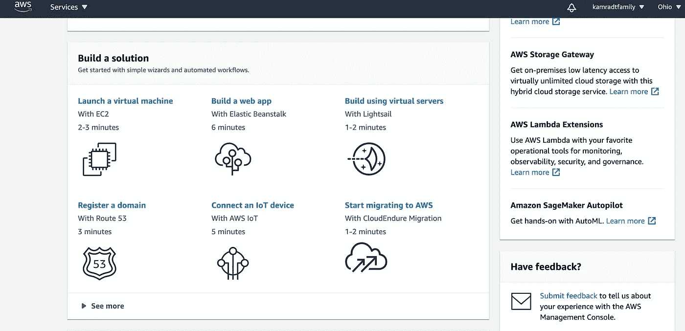
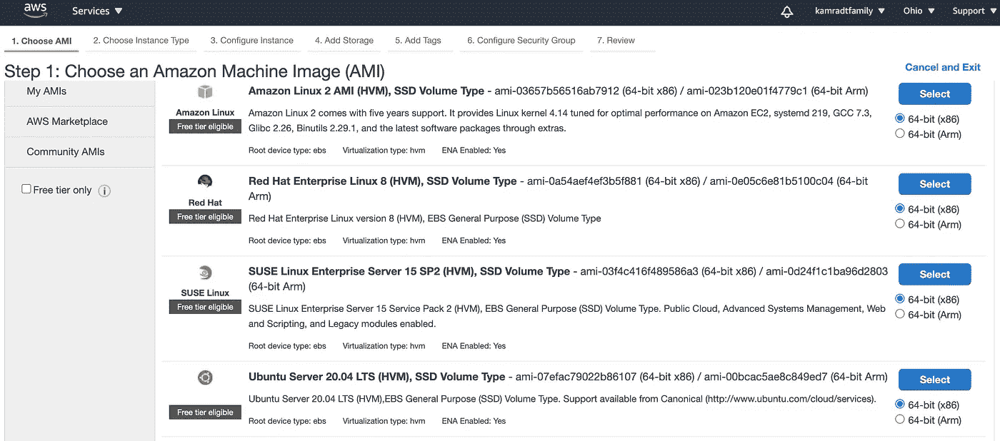
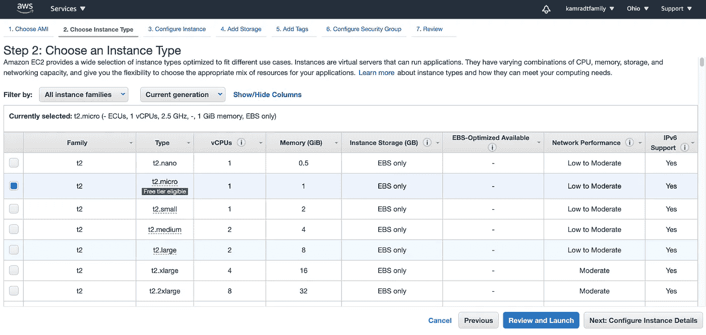
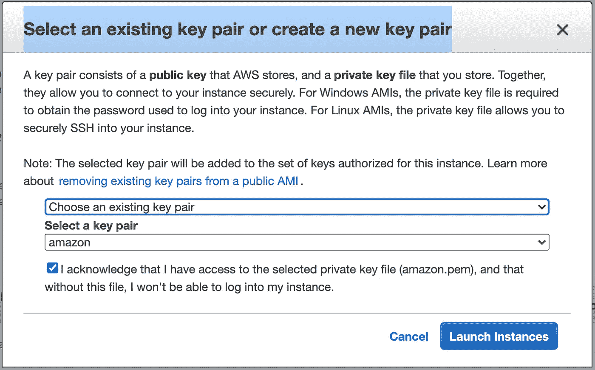
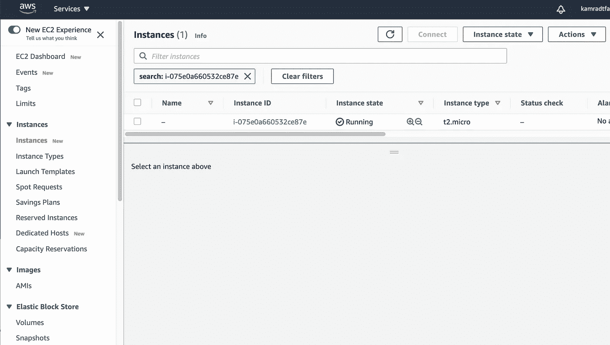
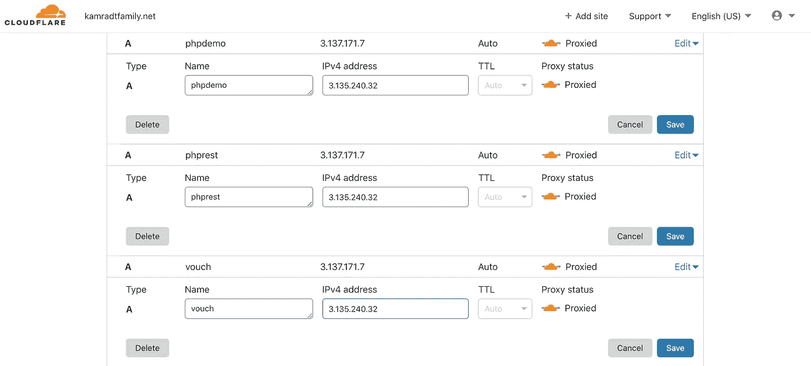
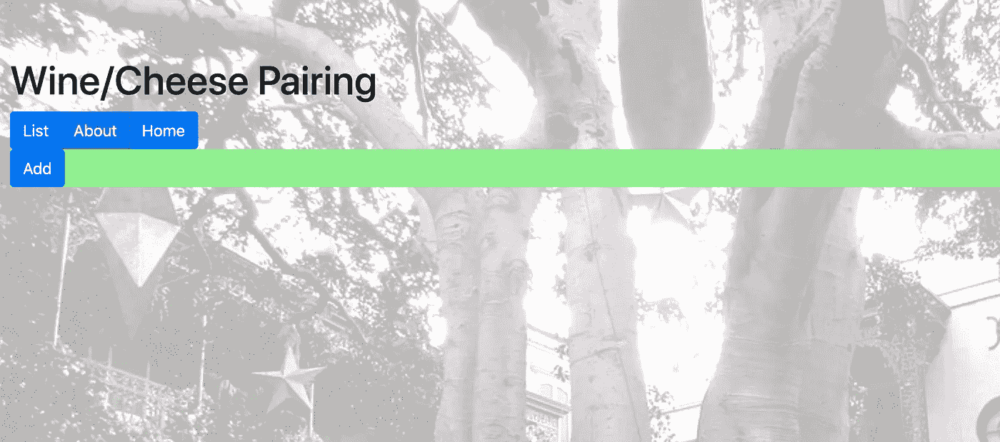

# 从 GCP 转到 AWS 容易吗？

> 原文：<https://betterprogramming.pub/is-it-easy-to-move-from-gcp-to-aws-645b319b226f>

## 如何开发易于从一个云提供商转移到另一个云提供商的系统


图片由[图米苏](https://pixabay.com/users/tumisu-148124/?utm_source=link-attribution&utm_medium=referral&utm_campaign=image&utm_content=4373407)从[皮克斯拜](https://pixabay.com/?utm_source=link-attribution&utm_medium=referral&utm_campaign=image&utm_content=4373407)获得。

我用谷歌云平台(GCP)做了很多云教程。我知道有很多人在使用亚马逊网络服务(AWS)等其他云平台，我想展示一下从一个平台转移到另一个平台是多么简单——但前提是你做得对。

我采用的方法是使用任何云平台的最基本组件。这样，很有可能任何云平台都将具有相同的功能集，只有微小的差异。在我的例子中，我只假设您可以启动一个 VM(为了避免意外，我现在使用 Ubuntu 20.04)，使用 SSH 在 VM 上打开一个 shell，并且 VM 已经安装了`vi`、Git 和 Docker/Docker Compose(或可安装)。

如果你使用香草 Kubernetes，同样的事情可以完成，但是 GCP 的 Kubernetes 很贵，可能在其他供应商那里也一样贵。Kubernetes 还有许多方面是由提供者决定的，比如入口和存储管理，这可能意味着对描述文件的修改。

尽管如此，你可以将整个服务集群从一个云平台转移到另一个云平台，只需做微小的改变，这是一个非常有吸引力的想法。

对于一个简单的项目，使用普通的虚拟机就可以了。我将采用我在文章[现代 PHP(第 2 部分)](https://levelup.gitconnected.com/modern-php-part-2-4973f48a90c0)中部署的服务，使用完全相同的代码、配置文件和部署脚本。所有这些脚本都可以在我的 GitHub 库[PHP approd](https://github.com/rkamradt/phpappprod)中找到，代码将取自预构建的映像。配置文件包含秘密，我把它们放在 GitHub 或映像之外，所以我必须手动把它们复制到我部署的任何新服务器上。

为了能够理解，你应该阅读我的系列文章，从[现代 PHP](https://levelup.gitconnected.com/modern-php-df3d3bf343f8) 开始。这个系列有三个部分。第一个创建了一个可以从 Docker 映像运行的 PHP 应用程序，第二个将它部署到 GCP，第三个引入了来自第三方认证系统的登录。做这些教程会帮助你理解我们是如何走到这一步的。

您需要一个 Cloudflare 帐户和一个域名，该域名的 DNS 服务器指向 Cloudflare。你还需要一个 AWS 帐户，它可以在免费层，因为我们不会使用任何花哨的服务。AWS 允许您使用免费层长达一年，这应该有足够的时间来完成这个练习。

# 创建虚拟机

EC2 是 Amazon 用来指代照单购买的虚拟机的术语。登录 AWS 仪表板，选择“启动虚拟机”



从那里，选择一个亚马逊机器映像。我用 Ubuntu Server 20.04 是因为我习惯了。您可以使用任何您喜欢的映像，但是不要偏离典型的 Linux 映像太远。



接下来，您可以选择虚拟机类型。



t2.micro 符合自由层条件，因此您可以选择。虽然“查看并启动”按钮是默认按钮，但选择“下一步:配置实例详细信息”按钮。在下一个屏幕上，保持一切不变，并选择“下一步:添加存储”按钮。对“添加存储”屏幕和“添加标签”屏幕进行同样的操作，直到进入“配置安全设置”屏幕。这里，除了 SSH 规则之外，您还需要选择一个 HTTPS 规则。这些规则将允许您通过端口 22 和 443 连接到新的虚拟机。


将会出现一个关于将 0.0.0.0/0 作为源的警告。如果你有妄想症，你可以把它们设置为特定的 IP 地址。例如，您只能从一个特定的跳转框 SSH 进入。我让我的门户大开，因为访问公开的服务所需的安全性相当严格。单击“查看并启动”启动您的新虚拟机。查看详细信息，然后单击“启动”

您将看到一个弹出对话框，要求您为新虚拟机分配一个密钥。除非您已经有一个密钥，否则您应该在第一个下拉列表中选择“创建新的一对”。



我已经有了一个密钥对，但是如果你没有，它会创建一个密钥对，并允许你下载私有密钥文件作为一个`pem`文件。将该密钥文件复制到您的`~/.ssh directory`中，并为其命名，如`amazon.pem`，以备后用。您还需要给它一个安全模式，这样 SSH 就不会抱怨了:

```
chmod 0700 ~/.ssh/amazon.pem
```



创建完成后，您可以查看仪表板并看到您的新实例。

有两种连接方式:您可以在浏览器中使用 SSH 窗口，也可以使用自己的 SSH 终端。我将使用您自己的 SSH 终端。首先，你必须找出你的公共 IP 地址。单击实例行旁边的复选框进行查找。


在我的例子中，公共 IPv4 地址是 3.135.240.32。我将在几个地方使用它。首先，我想更新 Cloudflare DNS，因为新的 DNS 需要一段时间才能通过互联网及其所有缓存。

转到您的 Cloudflare 页面(或运行 DNS 的任何地方),并将您将托管的服务的 A 记录设置为新的公共 IP 地址:



对于我正在导入的服务，它们有主机名`phpdemo`、`phprest`和`vouch`。这三个服务是反向代理的，虚拟主机重定向到每个服务，所以它们都被转发到同一个 IP，Nginx 实现了这一奇迹。一定要保存好一切。

# 设置新的虚拟机

现在，我们需要打开一个终端窗口并连接到新虚拟机:

```
ssh -i ~/.ssh/amazon.pem ubuntu@3.135.240.32
```

用户名`ubuntu`是带有 Ubuntu 映像的虚拟机的默认用户名。你的可能不一样。当它提示您这是否真的是您尝试连接的服务器时，请说“是”您应该在新调配的虚拟机中。它应该已经安装了 Git。你可以通过运行`git`来检查，看看你是否得到了帮助打印输出。我的虚拟机上没有安装 Docker，但是运行`docker`给了我一个如何安装它的提示:

```
sudo snap install docker
```

这些是您必须在新虚拟机上安装的唯一内容！

其中最耗费人力的部分之一是复制配置文件。因为配置文件包含秘密，所以它们不能在 GitHub 或 DockerHub 上，所以它们应该在单独的地方。在我的例子中，我把配置文件放在下面的目录中，我把所有的 GitHub 库都放在这个目录中。我将把这些文件复制到新虚拟机的主目录中。你可能会想，既然它们包含敏感信息，你应该把它们放在一个聪明的地方，但是如果有人入侵了你的虚拟机，他们可能会聪明到找到你把它们藏在哪里。

有两种方法可以将它们复制到虚拟机:要么你可以使用`scp`来复制，要么你可以在你的笔记本电脑上使用`cat`来复制，使用`vi`在你的虚拟机上的主目录中创建文件，然后剪切和粘贴。我使用后一种方法，因为我总是很难记住`scp`命令的确切语法。有五个文件需要复制:`config.yml`、`kamradtfamily.net.key`、`kamradtfamily.net.pem`、`phpapp.env`和`phprest.env`。这些都是在我以前的文章中创建的，所以你必须通读它们来找出内容，因为我不能在这里展示它们而不编辑它们中的大部分。

接下来，我们将获得 GitHub 中的部署脚本和公共配置脚本。这是一个简单的克隆操作，也是在虚拟机的主目录中:

```
git clone [https://github.com/rkamradt/phpappprod.git](https://github.com/rkamradt/phpappprod.git)
```

我使用了`https`协议而不是`ssh`协议，因为我们不会从部署主机更新存储库，也不想被 SSH 密钥所困扰。

这将创建一个名为`phpappprod`的目录。`cd`到它然后启动系统:

```
sudo docker-compose up -d
```

如果一切正确，你应该可以在[https://phpdemo.kamradtfamily.net/](https://phpdemo.kamradtfamily.net/)浏览新网站。

如果一切顺利，并且您已经使用了我的代码，您将会看到一个登录屏幕。你对此无能为力。如果你已经按照我以前的文章做了，并且设置了你的 Okta 服务，你就可以登录了。当我登录时，我得到了我的葡萄酒和奶酪配对应用程序，我可以看出这是一个新实例，因为列表是空白的。



我可以添加一个配对，并在[https://phprest.kamradtfamily.net/api](https://phprest.kamradtfamily.net/api)上测试其余的读取微服务，这应该会给我 JSON 中的新数据库记录。

我在这里的观点是，通过接近普通虚拟机，您可以将您的知识从一个云提供商转移到另一个云提供商。在此之前，我没有使用 AWS 的经验，但是我能够在一个小时内部署一个应用程序。

如果你是一个正在寻找可以部署到 AWS 的新开发人员的雇主，你只需要寻找 Docker Compose 经验，而不是特定的 AWS 经验。如果你是一名开发人员，你可以走进一家商店，如果他们运行 AWS、GCP、Azure 或其他一些云提供商，你就可以直接进去。这是一个很好的理由来避免利用你选择的云提供商的所有小工具和小发明的诱惑。

# 资源

本文中使用的 GitHub 存储库:

[](https://github.com/rkamradt/phpappprod/tree/v0.3) [## rkamradt/PHP pprod

### 此时您不能执行该操作。您已使用另一个标签页或窗口登录。您已在另一个选项卡中注销，或者…

github.com](https://github.com/rkamradt/phpappprod/tree/v0.3) 

参考的其他文章:

[](https://levelup.gitconnected.com/modern-php-df3d3bf343f8) [## 现代 PHP

### 使用 Upstart 上最需要的项目语言之一开始你的自由职业生涯。

levelup.gitconnected.com](https://levelup.gitconnected.com/modern-php-df3d3bf343f8) [](https://levelup.gitconnected.com/modern-php-part-2-4973f48a90c0) [## 现代 PHP(第 2 部分)

### 部署到 web

levelup.gitconnected.com](https://levelup.gitconnected.com/modern-php-part-2-4973f48a90c0) [](https://levelup.gitconnected.com/modern-php-part-3-1f5b78b3371d) [## 现代 PHP(第 3 部分)

### 所有 web 应用程序的单点登录。

levelup.gitconnected.com](https://levelup.gitconnected.com/modern-php-part-3-1f5b78b3371d) [](https://levelup.gitconnected.com/microservices-with-php-and-lumen-d9af0b915a71) [## 使用 PHP 和 Lumen 的微服务

### 与 PHP 的过去决裂，而不破坏现有的应用程序

levelup.gitconnected.com](https://levelup.gitconnected.com/microservices-with-php-and-lumen-d9af0b915a71)