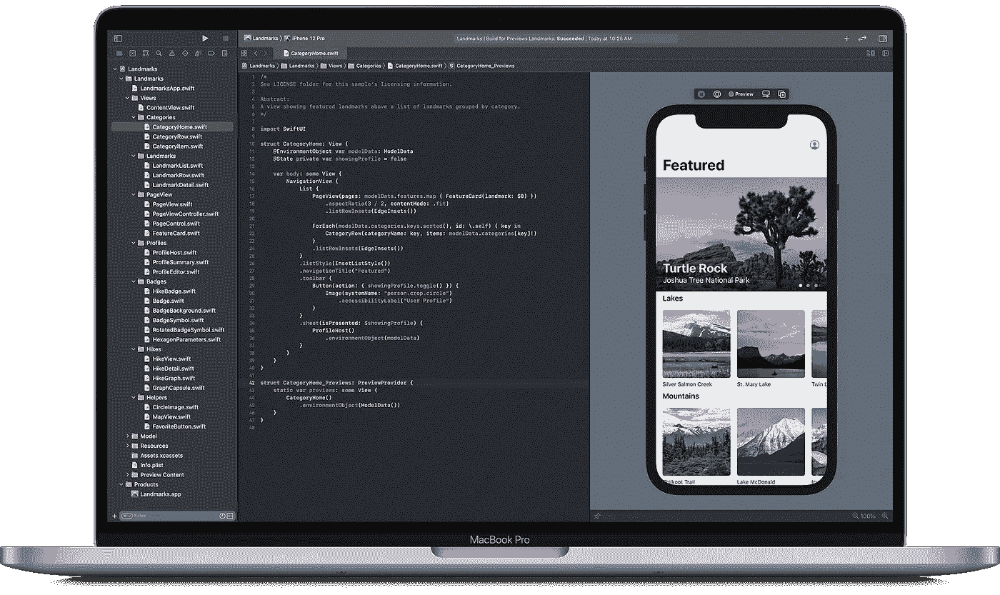
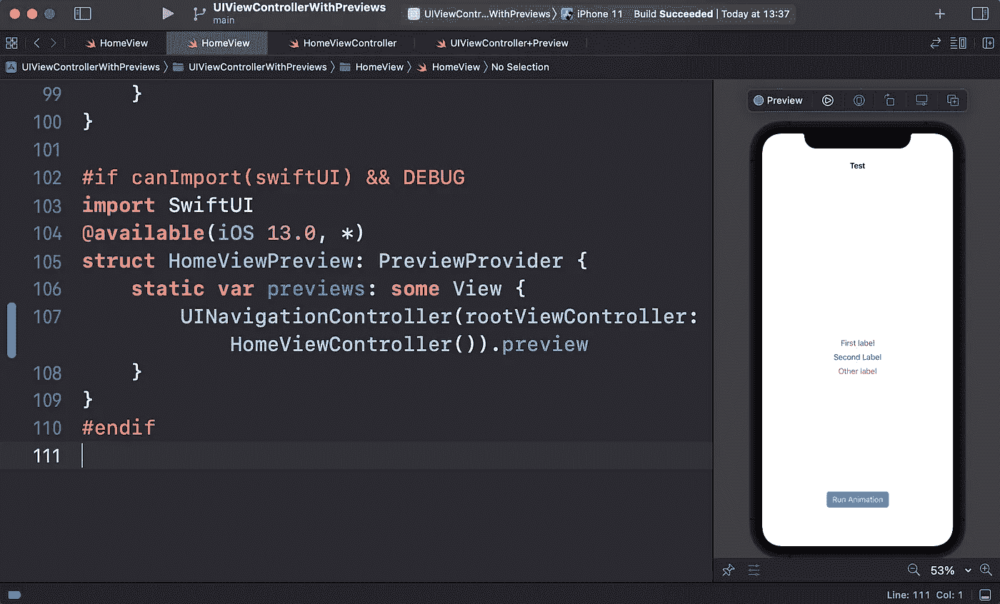
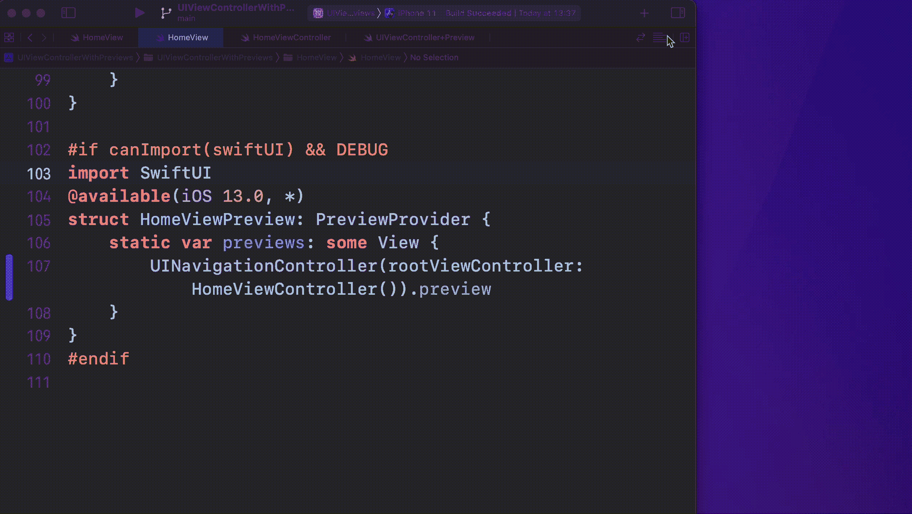
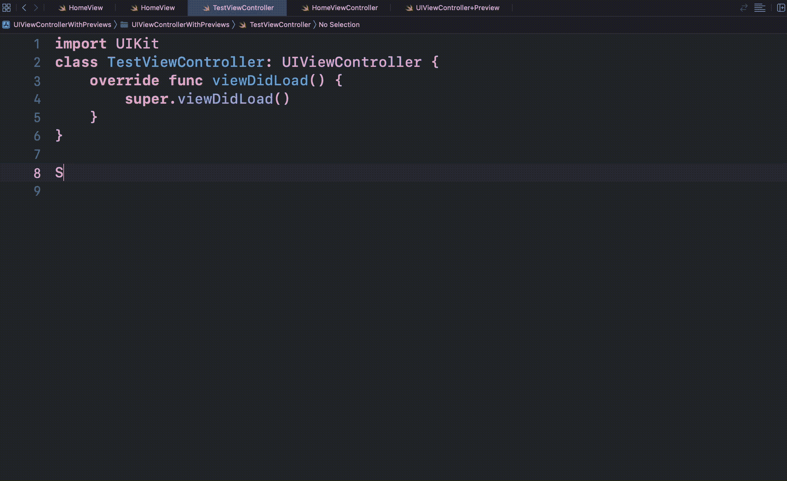

# 可以在 UIViewController 上使用 SwiftUI 预览吗？

> 原文：<https://betterprogramming.pub/is-it-possible-to-use-swiftui-preview-on-uiviewcontroller-b86425167765>

## 让我们来了解一下！

来源:苹果

在 2019 年 WWDC 大会上，苹果宣布了一个名为 SwiftUI 的全新框架，让每个开发者都感到惊讶。它不仅仅改变了你开发 iOS 应用的方式。这是自 Swift 首次亮相以来，苹果开发者生态系统(包括 iPadOS、macOS、tvOS 和 watchOS)的最大转变。

除了以声明的方式创建视图之外，您现在还可以预览屏幕，更新视图中包含的每个图形修改。这提高了您的工作效率，因为您不再需要每次更改都运行您的应用程序来查看是否一切都按预期运行。

如果你仍然在使用 UIKit 框架，但是你想使用 SwiftUI 的`PreviewProvider`来提高你的工作效率，我会给你一些提示，告诉你如何做到这一点。

让我们创建一个`UIViewController`的扩展:

1.  只有在可以导入 SwiftUI 并且处于调试模式时，Xcode 才会构建这段代码。(可选)
2.  向 iOS 13 及更高版本的消费者提供该扩展。
3.  私有的`Preview`结构符合`UIViewControllerRepresentable`协议。我们将使用它为我们的视图控制器创建一个预览。
4.  结构依赖于`UIViewController`。例如，如果我们想要一个`SettingsViewController`的预览，我们将把它提供给`Preview`结构。
5.  `makeUIViewController(context:)`和`updateUIViewController(_ uiviewController:context:)`方法是`UIViewControllerRepresentable`协议所要求的。在`makeUIViewController`方法中，我们返回想要获得预览的视图控制器。后一种方法保持为空。
6.  创建一个方便的`preview`属性，为视图控制器返回一个`Preview`。

这就是我们需要添加的所有内容，以便在我们的应用中支持任何`UIViewController`的预览。让我们测试一下我们创造了什么。

## **用法举例**

让我们创建一个简单的 ViewController `HomeViewController.swift`:

在这个`HomeViewController.swift`上，我们有一个可选的`HomeView`，让我们使用视图代码创建一个简单的`UIView`，它有 3 个标签和 1 个按钮，例如:

在我们的例子中，我们在文件`HomeView.swift`中隔离了与屏幕视图相关的内容。

好吧，但是我们的`PreviewProvider`呢？

作为 SwiftUI 的默认设置，我们可以将其添加到视图文件的末尾。让我们在`HomeView.swift`的末尾加上:

1.  只有当可以导入 SwiftUI 并且处于调试模式时，Xcode 才会构建这个代码块，这与我们在`UIViewController`扩展中包含的原因相同。(可选)
2.  我们提供了从一个`UINavigationController`经过我们的`ViewController`成为一个`rootViewController`的扩展的预览。

然后*瞧！*

## 一些重要的事情/提示…

*   结构预览的名称应该有一个“Preview”后缀，例如:`ViewControllerPreview`、`HomeViewControllerPreview`、`SomeViewPreview`。否则，您将会遇到一个构建错误=/。
*   如果预览画布不存在，您可以使用快捷键`⌘+Option + Return`或手动操作。

*   要继续预览，您也可以使用快捷键`⌘+Option+P`。

好了，我们学习了如何为我们的`ViewControllers`实现预览，但是我超级懒，我不想在我将要创建的每一个`ViewController`上手工添加所有的代码，所以让我们创建一个*代码片段*！

要创建一个新的代码片段，您可以在文件内的任何地方右击，然后点击“创建代码片段”*。*然后你要给你的代码片段起一个名字，添加将在自动完成时填充的代码块，然后添加这个代码块，并添加你的标记用于自动完成，我在这个例子中使用了`SwiftUIPreview`。

它是这样工作的:

要了解更多关于代码片段以及如何实现它们，你可以阅读这篇文章。

# 资源

示例项目的源代码可以在 [GitHub](https://github.com/kleytonandroid/SwiftUIPreviewOnUiKit) 上找到。