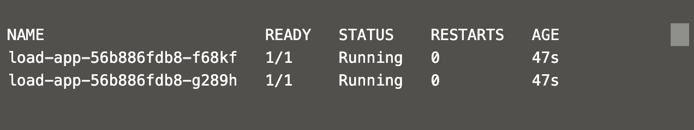
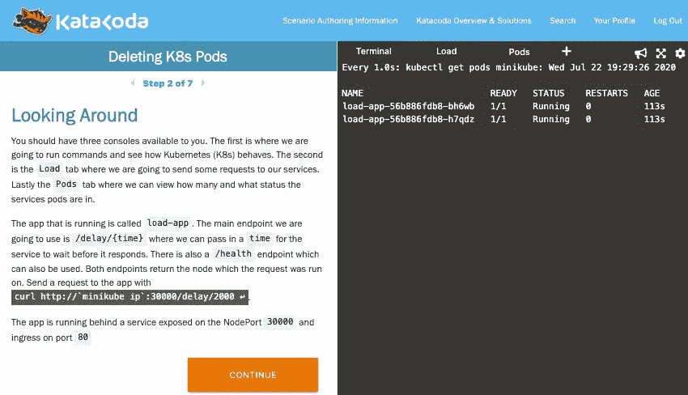

# 在负载下删除 Kubernetes Pods 安全吗？

> 原文：<https://betterprogramming.pub/is-it-safe-to-delete-kubernetes-pods-under-load-83c85d268024>

## *TL；大卫:是的，如果一切都设置正确的话。继续阅读，看看你是否有*

图片来源:作者

我们都在努力构建弹性和自我修复的应用程序，但偶尔我们会犯一个错误，不得不重新开始。希望我们有时间解决这个问题，但在此之前，我们可能需要手动干预。在本文中，我们了解当我们删除一个正在提供实时流量服务的 [Kubernetes](https://kubernetes.io/) (K8s) pod 时会发生什么。然后，我们可以将这些知识应用到我们的运营中，这样我们就不会影响客户的体验。

# Pod 生命周期

首先，让我们了解当一个 pod 被删除时实际上会发生什么。

当容器被删除时，Kubernetes 向容器中的流程发送两个信号。第一个是`SIGTERM`，后面是`SIGKILL`。`SIGTERM`有点像委婉地要求进程关闭，而`SIGKILL`立即停止了进程。我们可以监听`SIGTERM`，整理我们正在使用的任何资源，比如数据库和其他连接。应用程序不应在收到`SIGTERM`时立即关闭。相反，它们应该停止接受新的请求，等待现有请求完成。如果有任何后台任务正在运行，该进程也应该等待它们完成后再退出。

到目前为止我们只提到了`SIGTERM`。如果应用程序在收到该信号后退出时间过长，K8s 会发送一个`SIGKILL`信号。在完美的设置中，这不会被发送到应用程序，因为它会优雅地退出。如果真的发生这种情况，很可能请求会被中断，客户会不高兴。您可以使用容器的`terminationGracePeriodSeconds`设置来配置 K8s 在发送`SIGKILL`之前等待的时间。

如果应用程序是 K8s 服务的一部分或启用了入口，当 pod 被删除时，它首先从流量中移除。这允许应用程序处理`SIGTERM`信号，并且在该过程中不接收新的请求。通过这样做，K8s 允许我们向客户提供无缝体验，同时仍然允许底层基础架构发生变化。

不仅仅是删除 pod 会导致 pod 被移除。当发布应用程序的新版本或缩小规模时，pods 将经历这个生命周期。正确配置您的服务非常重要。否则，客户可能会请求失败。要更深入地了解 pod 生命周期，请查看关于 pod 生命周期的[文档。](https://kubernetes.io/docs/concepts/workloads/pods/pod-lifecycle/)

# 复制品

本文的大部分内容假设有多个服务实例在运行。在 K8s 中，这是通过使用一个副本集来完成的，或者更好的是，部署将为您创建一个副本集。如果您手动部署单个 pod，然后将其删除，您的服务将会关闭，并且不会恢复。如果服务通过副本集运行，但只有一个 pod，则在删除 pod 后，该服务将不可用。然后，副本集将自动调出一个新的 pod 来替换被删除的 pod，您的服务将再次可用。

通过为每个服务运行至少两个 pod，我们可以解决这个问题。当我们删除其中一个 pod 时，K8s 会将流量无缝发送到其他 pod。作为标准运行两个 pod 是个好主意，因为应用程序可能会崩溃。至少有一个备份 pod 将为您提供在这种情况下保持服务可用所需的冗余。如果您决定只为一个服务运行一个 pod，并且需要删除一个 pod，您可能需要考虑向上扩展到两个 pod，删除 pod，然后再向下扩展。

当在 K8s 中移动 pod 时，考虑服务必须处理的容量是很重要的。如果我们删除一个 pod，同时等待一个新的 pod 启动，是否仍有足够的 pod 来处理所有请求？配置单元数量或自动缩放时，应考虑这一点。您可能想要 n+1 个 pod，这样您就有足够的数量来避免其中一个不可用。您可能希望检查您的部署更新策略，因为默认情况下，它可能会使服务处于容量不足的状态。有关这方面的更多信息，请查看我的另一篇文章，[如何在部署期间阻止 Kubernetes 向您的应用程序添加剂量](https://medium.com/better-programming/how-to-stop-kubenetes-from-dosing-your-application-during-deployment-42672b4dfa42)。

我们可以对部署进行更改，而不是删除特定的单元。我们可以使用 K8s 标签，而不是更改应用程序的源代码来导致更新。下面的命令更新名为`load-app`的部署，并添加或更新标签`restarted-at`。这将导致我们的 pod 滚动更新，使用更新的标签创建新的 pod。该命令将标签的值设置为运行该命令的时间戳，用于审计目的。这种滚动更新将遵循部署策略，为工作负载保留足够的 pod。

# 健康检查

健康检查在应用程序崩溃的情况下非常有用，因为 K8s 会重新安排服务。这些检查在其他场景中也很有用，如下所述。

先来了解一下 K8s 中不同类型的健康检查。有两种类型的健康检查，*就绪*和*有效*。Alive 检查进程是否启动并运行。如果这个失败了，K8s 会重启它(保持同一个 pod)。如果 pod 正在使用或启用了入口，则如果运行状况检查失败，就绪检查会将该服务从流量中移除。

准备就绪检查是我们讨论删除 pod 时的重要检查——有趣的是，不是针对被删除的 pod，而是针对将取代它的新 pod。如果没有准备好检查，新的 pod 将立即投入使用。即使是简单的应用程序也需要一些时间来启动，在这个窗口中，可以向它发送请求。由于应用程序仍在启动，请求将失败。这很容易通过添加一个 ready check 来修复，该 check 卷曲一个总是返回状态码`200`的端点。

# Node.js 中的实现

如果您的应用程序使用 Node.js 服务器，您可以使用下面的代码来确保所有请求在退出应用程序之前完成。这是通过用回调调用`server.close()`为`SIGTERM`注册一个监听器来实现的。close 函数将关闭服务器，但允许现有请求在进程退出前完成。如果您没有这个代码或类似的代码，流程将在收到`SIGTERM`时立即退出。

# 演示

为了将你所学的一切付诸行动，并尝试不同的场景，你可以尝试[这个 Katacoda 场景](https://www.katacoda.com/harryemartland/scenarios/deleting-k8s-pods)。在这里，您可以使用一个部署了示例服务的 K8s 集群。该场景引导您以不同的方式删除 pod，并观察客户请求是如何受到影响的。

这是 Kubernetes 的一些特性的短暂停留，这些特性可以帮助您构建有弹性的服务。我希望你现在有信心和知识删除 Kubernetes 豆荚不影响你的客户。