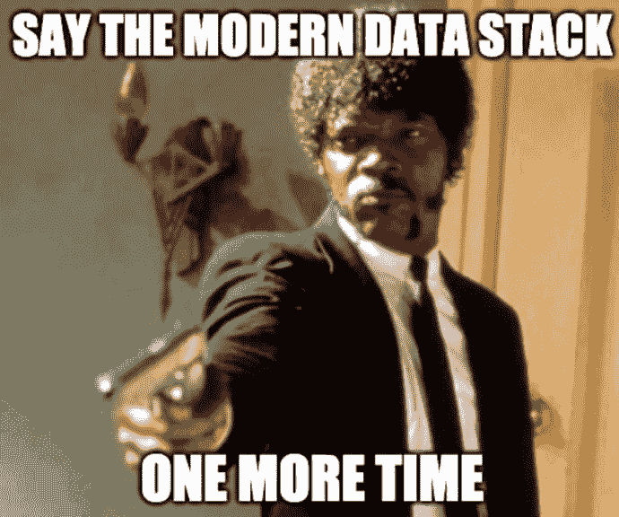

# 是时候重塑(或重新思考)现代数据堆栈了吗？

> 原文：<https://betterprogramming.pub/is-it-time-to-rebrand-or-rethink-the-modern-data-stack-5d76366e3c95>

谷歌趋势搜索“现代数据栈”的数据

再过几周，AWS 红移通过有限预览首次公之于众[就整整十年了。红移被认为是 O.G .云数据仓库，其次是 BigQuery 和雪花。许多人认为，这项技术为“现代数据堆栈”铺平了道路](https://aws.amazon.com/about-aws/whats-new/2012/11/28/announcing-amazon-redshift/)

当查看 Google Trends 数据时，现代数据堆栈宣传在 2020 年真正起飞，例如，dbt Labs 开始筹集相应的融资轮次，在 2022 年 2 月达到 42 亿美元的[估值——在 2020 年](https://www.forbes.com/sites/kenrickcai/2022/02/24/dbt-labs-series-d-4-billion-less-than-planned/?sh=4a9284cf67c3)[1290 万美元的 A 轮](https://techcrunch.com/2020/04/22/fishtown-analytics-raises-12-9m-series-a-for-its-open-source-analytics-engineering-tool/)之后不到 24 个月。

如今，大多数数据、初创企业和 VC 社区成员(当然还有供应商)对现代数据堆栈的描述都是以云数据仓库为中心，简单地说，就是围绕云数据仓库的一套工具。这是由于位于云平台之上的强大数据仓库的迅速崛起([雪花在 2020 年的轰动性 IPO](https://www.linkedin.com/in/chad-sanderson/)确保了任何在技术领域工作的人突然对这项技术产生了兴趣)。

在描绘现代数据堆栈时，[实时流范例](https://rockset.com/blog/the-rise-of-streaming-data-and-the-modern-real-time-data-stack/?utm_source=pocket_saves)往往被完全搁置一旁。但这是另一篇文章了。

为了突出数据仓库的主要影响(以及随后的关注点)， [Matt Turck](https://www.linkedin.com/in/turck/) 在他著名的[机器学习、人工智能和数据前景](https://mattturck.com/data2021/)分析中很好地描述了 2021 年的情况:

> “今天，云数据仓库(Snowflake、Amazon Redshift 和 Google BigQuery)和 lakehouses (Databricks)提供了以一种有用的方式存储大量数据的能力，而不是完全成本高昂，也不需要大量技术人员来维护。换句话说，经过这么多年，现在终于可以存储和处理大数据了。”

因此，至少可以说，自 2020 年以来，围绕现代数据堆栈的宣传已经显而易见。根据议程和背景的不同，定义也有所不同。

正如 [Benn Stancil](https://www.linkedin.com/in/ACoAAAfNfxMBQBxitlMw5qJvkTRvVArnwuwuGNw) 在他的[“现代数据体验”博客文章](https://benn.substack.com/p/the-modern-data-experience)中提到的，从 2021 年开始，关于现代数据堆栈:

> “对于分析工程师来说，这是技术和公司组织的转型。对于初创公司的创始人来说，这是公司运作方式的一场革命。对风投来说，这是一个 1000 亿美元的机会。对工程师来说，这是一个动态的架构路线图。对 Gartner 来说，这是新数据和分析战略的基础。对思想领袖来说，这是一个数据网。对于一个在互联网上开着博客的分析师来说，这是一个新的方向，一个新的术语，以及一大堆只有生活在自己内心深处的人才会关心的深奥类比。

# 云改变了这一切

毫无疑问，云改变了思维模式，从只存储有用的数据转变为存储所有潜在有用的数据。Kafka 和 Kinesis 等流技术，Snowflake、Redshift 和 BigQuery 等云数据仓库，S3 和 GCS 等数据湖，以及 Databricks 等云数据湖库降低了存储更多数据的摩擦，这些数据以更高的速度、更高的基数和更大的容量来自各种数据源。

随着这种转变和来自各种来源的数据量的激增，我们正在经历一个新的、固有的人类挑战:数据生产者和数据消费者之间的协作，以及建立适当的制衡。最重要的是，不要把数据仅仅当作副产品，而是像对待任何其他产品或功能一样对待它。

在过去六个月左右的时间里，通过[将数据视为产品](https://www.mckinsey.com/capabilities/quantumblack/our-insights/how-to-unlock-the-full-value-of-data-manage-it-like-a-product)运动以及数据社区对数据建模尤其是数据契约的日益关注，这种思维模式的转变显而易见。

[查德·桑德森](https://www.linkedin.com/in/chad-sanderson/)在他的的 [LinkedIn 帖子中说得好:](https://www.linkedin.com/posts/chad-sanderson_data-has-a-massive-collaboration-problem-activity-6980206647394648064-xVy3/?trk=public_profile_like_view)

> “数据存在大规模协作问题。数据方面的许多技术问题都得到了解决:存储/计算分离、ELT、编排等等。还没有解决的是生产者和消费者如何合作来提供切实的商业价值。”

我经常听说我们如何解决了将数据从 A 地移动到 B 地的难题，并且我们现在可以管理这些爆炸式增长的数据量。但另一方面，我一次又一次地听到我们如何在实际使数据可用和大规模管理数据质量方面后退了一大步。

进入 Chad 倡导的数据契约，它已经在数据社区中以多种方式成为先锋。用过于简化的术语来说，数据契约应该被理解为数据生产者和数据消费者之间的协议，它应该包含所生产的数据应该是什么样子，数据应该符合什么样的 SLA，以及数据的语义。

数据契约本身不会解决大规模的数据可用性和数据质量挑战，但应该被视为构建的基础。

# 永无止境的讨论:分拆还是捆绑？

二月早些时候，一篇关于气流分解的博客文章在数据社区引起了热烈的讨论，不仅仅是在 T2 黑客新闻上。

在任何达到一定成熟度的技术基础设施领域，拆分或捆绑(以及同类最佳或整体)的争论都是经常性的讨论。我在 2015/16 年的营销技术领域看到了[同样的讨论](https://venturebeat.com/marketing/the-great-unbundling-of-marketing-is-here/)，当时这个领域已经达到了炒作的顶峰——受到 Scott Brinker 著名的 [MarTech 景观](https://chiefmartec.com/wp-content/uploads/2019/03/martech-landscape-2011-2019.jpg)的刺激。

我认为 [Marc Lamberti 在现代数据堆栈的背景下很好地总结了](https://www.linkedin.com/posts/marclamberti_data-dataengineering-moderndatastack-activity-6933025592858525696-ny4w/?utm_source=linkedin_share&utm_medium=member_desktop_web)拆分与捆绑的讨论:

> 这不是关于你是支持捆绑销售还是支持非捆绑销售。
> 
> 它是关于能够基于数据做出准确、完整和可靠的决策。
> 
> 您添加到堆栈中的工具越多，您丢失的数据的全局上下文和对最终用户的影响就越大。
> 
> 就像组装宜家橱柜一样。它看起来很漂亮，但是你要花几个小时来组装一件家具，而你本可以买已经组装好的。
> 
> 少即是多。

# 大肆宣传(和强烈反对)

现代数据堆栈被大肆宣传。但是工程师们对这个术语也有很多反对意见。栈到底是由什么组成的？数据湖？数据仓库？dbt？五川？火花？卡夫卡？数据砖？气流？旁观者？

对于堆栈到底是什么，有无数的选择，也没有明确的共识——尽管大多数人通常将它描述为一组与云数据仓库相连的工具和技术(尤其是非数据工程师)。

数据社区中有越来越多的声音(尤其是工程师)在谈论现代数据堆栈宣传已经走得太远了。正如[罗伯特·萨赫林](https://www.linkedin.com/in/robertsahlin/)(MatHem 的数据工程主管)[去年在 Twitter](https://twitter.com/robertsahlin/status/1419157118091993088) 上所说:

> “我们能不能不要再把它叫做‘现代’数据堆栈了。这个堆栈里有很多不太现代的东西。不知道该如何命名，但这种设置最适合需要快速设置报告/仪表板的单人/小型数据团队。”

我认为[查德·桑德森](https://www.linkedin.com/in/ACoAAAK_ghcByqPiViLqfL7yTFssM8OWy9teGRg)在他的另一篇 [LinkedIn 帖子中说得很好:](https://www.linkedin.com/posts/chad-sanderson_i-dont-think-the-modern-data-stack-is-dead-activity-6954557350221398016-ujAP/?trk=public_profile_like_view&originalSubdomain=cy)

> “我不认为现代数据堆栈已经死亡。我相信技术能够解决商业问题。我认为云是一项革命性的技术，我喜欢我们大多数的现代工具。但是，以牺牲一致的策略为代价来采用工具，会导致完全不可扩展的数据环境。”

让我们面对它，“现代”一直是一个有问题的描述:它就像“新的。”就像你会发现像 new _ really _ new _ newest _ the newest _ new 这样的程序名称一样，modern 的意思是在某个特定的时间点是当前的。

这一点我们自然都明白。

# 回到最初的问题

因此，鉴于我们很快将庆祝为现代数据堆栈炒作铺平道路的技术的十周年纪念日:是时候我们重塑或重新思考它了吗？

我最近与一位数据工程师(他希望保持匿名)交谈，他说，每当数据工程中有新的东西时，市场每个月都会提到现代数据堆栈。它总是最后的“银弹”

架构应该支持过程和人，而不是反映当前的广告和下一个预期的银弹。

你怎么想呢?