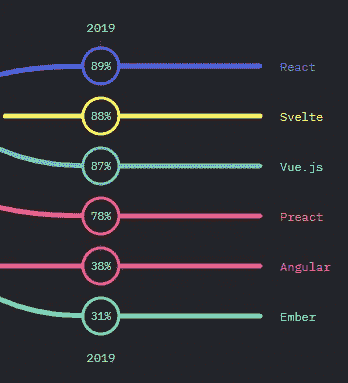
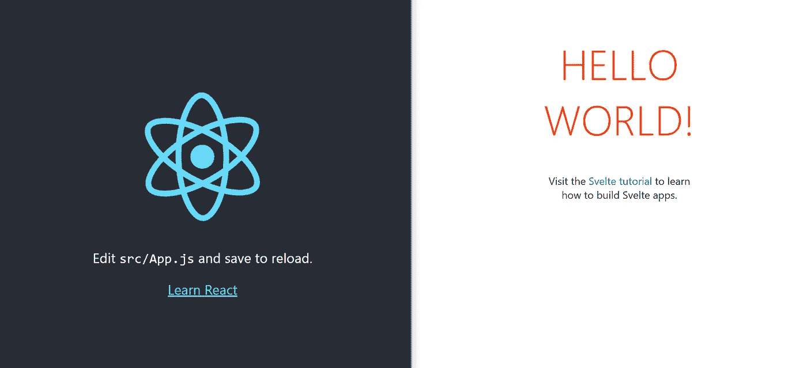
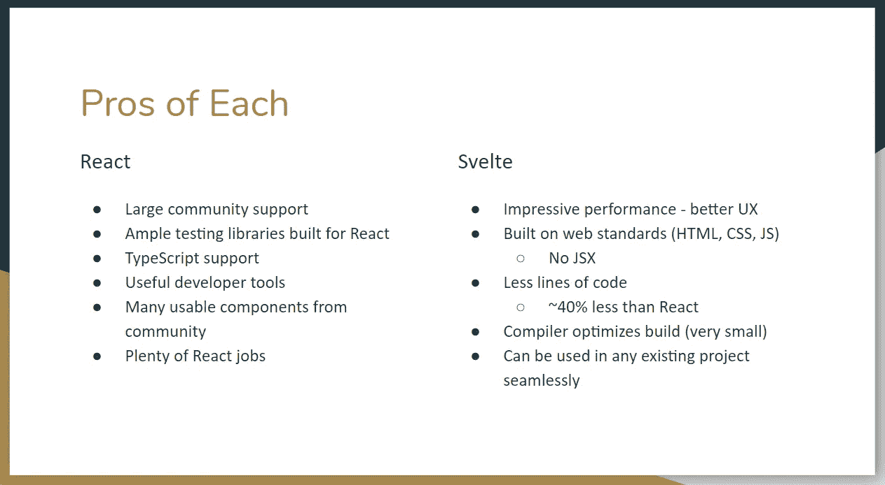
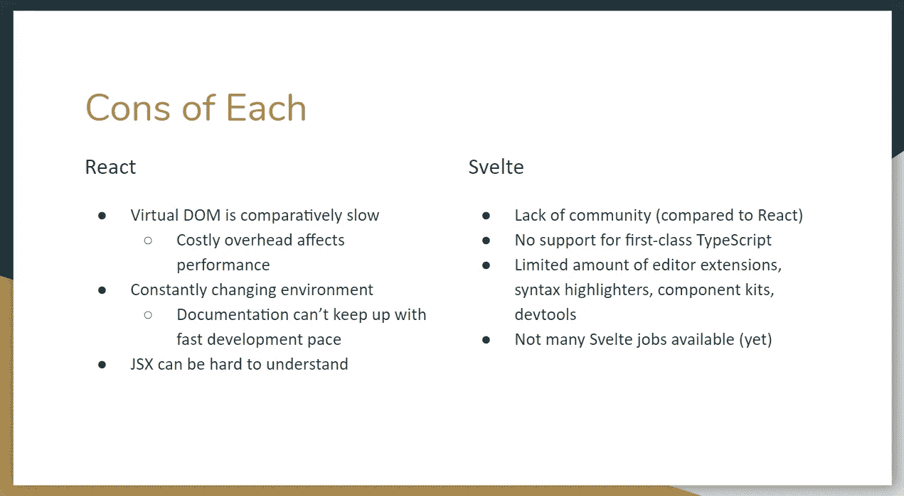

# 是时候忘记反应，加入苗条的潮流了吗？

> 原文：<https://betterprogramming.pub/is-it-time-we-forget-react-and-jump-on-the-svelte-bandwagon-4848bb5d0839>

## 一场真正的泰坦之战(苗条还能算泰坦吗？)

Jaime Spaniol 在 [Unsplash](https://unsplash.com/s/photos/battle?utm_source=unsplash&utm_medium=referral&utm_content=creditCopyText) 上拍摄的照片

每年，[都会发布一份关于 Javascript 现状的调查结果。它们涵盖了从前端框架到后端、移动和桌面、测试甚至顶级资源的所有内容。](https://2019.stateofjs.com/)

当然，都与 JavaScript 相关。如果你喜欢使用 JavaScript 进行 web 开发，我强烈推荐你通读一下。

但是对我来说最有趣的一点是出现了一个前端框架，叫做*。*

*在顶级前端框架的总体排名中(基于认知度、兴趣和满意度)，Svelte 名列第二。就在 [React](https://reactjs.org/) 后面，在 [Vue.js](https://vuejs.org/) 、 [Preact](https://preactjs.com/) 、 [Angular](https://angular.io/) 和 [Ember](https://emberjs.com/) 等成熟的框架前面。*

*这些结果对我来说有点令人震惊，因为苗条是相对较新的，无论是在年龄上还是在模式上。*

**

*JavaScript 前端框架排名状况*

*我知道你们很多人会说 React 和 Svelte 都是库。我没有创建调查，所以不要射杀信使！*

*我从 Svelte 下载了样本模板，并构建了一个小小的“Hello World”项目。*

**

*启动时 React(左)和 Svelte(右)并排*

*虽然它很容易启动和运行，但从 React 背景来看，将有一个学习曲线。*

*这是我应该花宝贵时间去做的事情吗？或者这更像是 JavaScript-burnout-bait？让我们深入了解一下吧！*

# *目标*

*回答这个问题:“我应该停止花时间学习反应，开始学习苗条吗？”*

*我们将通过查看两者之间的基本差异来回答这个问题，我们将了解是什么使每一个都是独一无二的，并最终值得我们投入时间向前发展。*

*我们将从对每一个的概述开始，接着是利弊，然后做出我们的决定。*

# *反应*

*React 在过去几年里一直是热门话题。React 由脸书创建，迅速席卷了 web 开发世界，现在是头号前端框架(取决于你问的是谁)。*

*很大程度上得益于它的社区，React 的发展速度比以往任何时候都快，而且没有任何放缓的迹象。*

*React 的特别之处在于三点:*

1.  *它的声明性质。*
2.  *其基于组件的结构。*
3.  *可用性——就集成到您当前的技术堆栈而言。*

*React 的声明性本质使我们的 UI 具有交互性。为应用程序中的每个状态设计视图，React 会处理剩下的事情。这使得您的代码易于理解和调试。*

*React 如何“处理好剩下的事情”？通过虚拟 DOM 技术。确定 DOM 应该如何更新的工作是在代码和实际 DOM 之间的中间层完成的。虚拟 DOM 可以保证如此快的渲染速度。*

*React 代码由组件组成。每个组件都是独立的，并管理自己的状态。这使得重用它们非常容易。*

*React 的设计使得你的技术堆栈无关紧要，它可以被置于任何东西之上( [Node.js](https://nodejs.org/en/about/) ， [Ruby on Rails](https://rubyonrails.org/) ， [Spring Boot](https://spring.io/projects/spring-boot) ， [PHP](https://www.php.net/) 等等)。).绝对没有任何假设。*

*为什么有人称之为框架，有人称之为库？React 需要额外的库来进行状态管理、路由和与 API 的交互。仅仅运行`create-react-app`并不能提供你期望从框架中得到的全套工具。*

# *苗条的*

*斯维尔特提议改变游戏。如果你还没有看过《苗条 3 的[介绍，我强烈推荐。里奇·哈里斯以一种大胆、清晰甚至滑稽的方式展示了苗条的身材。](https://youtu.be/AdNJ3fydeao)*

*他讲述了反应式编程的伟大历史，指出了传统编程方式的缺陷，并提出了他对相关问题的解决方案。*

*很多让 React 特别的物品是苗条的基础。Rich Harris，Svelte 的创造者，很清楚 React 的相互作用，好的和坏的。*

*React 的大部分更新都是在浏览器中完成的，而 Svelte 是在编译器中完成的。这里的区别，正如苗条的文件所说:*

> *“Svelte 在构建时将你的应用程序转换成理想的 JavaScript，而不是在运行时解释你的应用程序代码。”*

*Svelte 不使用虚拟 DOM diffing 之类的技术。苗条的*编译器* 将你的声明性组件转换成高效的、命令式的、低级代码，直接操纵 DOM。*

*因为它使用编译器而不是虚拟 DOM，所以在帧计时和垃圾收集方面减少了很多开销。浏览器在运行时不再需要做这些工作，并产生更好的性能。*

*然而，与 React 类似，Svelte 使用组件，并以声明的方式编写。运行`build`命令后发生的事情就是它们的主要区别所在。*

# *利弊*

## *赞成的意见*

**

## *骗局*

**

# *结论*

*我们回到我们的问题:“我应该停止花时间学习反应，开始学习苗条吗？”*

*老实说，我写这篇文章是想告诉你，Svelte 还太年轻，现在还不要投入太多。但是在做了大量的研究和实践基础知识之后，我对这个方向非常感兴趣，并且印象深刻。*

*性能指标是不可否认的，其背后的思想过程是有远见的，社区正在崛起。我相信这些框架的成功(就主流集成而言)主要取决于社区以及它是否被接受。*

*所以，如果 Svelte 能保持这种势头，我非常期待它无处不在。*

*当然，对于 Svelte 来说还处于游戏的早期，我们还不知道新库不可避免会带来的许多问题，所以这个建议带有一个警告。*

*当 React 第一次出现时，它是令人难以置信的前沿和无问题的。随着它的发展，我们发现自己面临着新的挑战、缓解措施、解决方法和升级途径。*

*我相信同样的事情也会发生在 Svelte 身上，因为 web 开发的前景正以前所未有的速度不断变化。*

*如果你犹豫不决，不准备离开 React，我建议你至少密切关注苗条。它很可能比你想象的更快成为一个合法的竞争者。*

*如果你对这个话题有什么想法，请在评论区留下任何问题/评论/担忧。感谢您的阅读！*