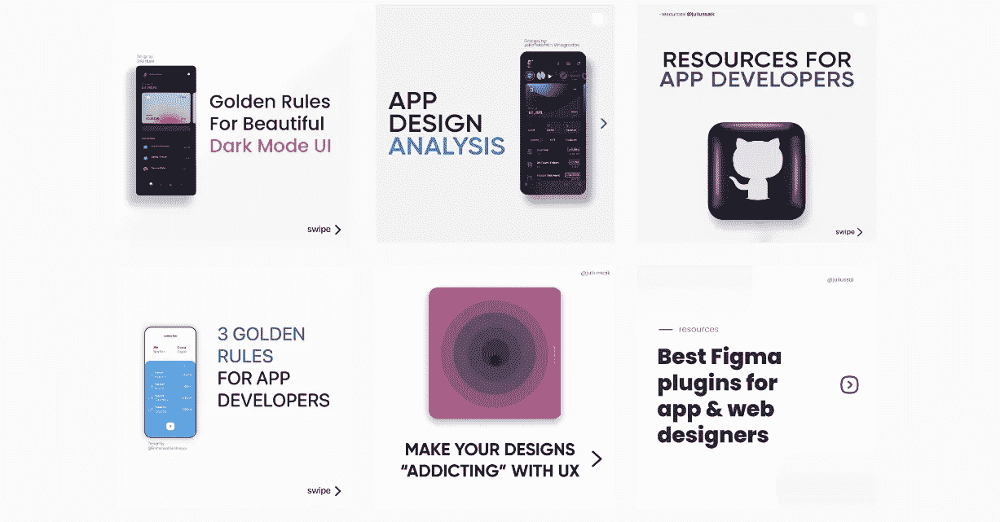
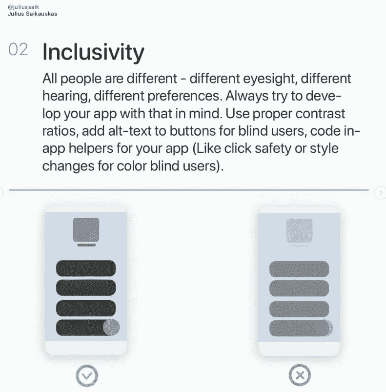

# 作为开发者在 Instagram 上发帖值得吗？

> 原文：<https://betterprogramming.pub/is-it-worth-it-to-post-on-instagram-as-a-developer-8f5d5e682fe2>

## 调查该平台的利弊



我的 Instagram 页面及其指南

Instagram 可以是一个发布内容并找到许多志同道合的人的好地方，但它也可能是一个非常令人讨厌和耗费精力的平台。

这正是为什么我想分享我对 Instagram 作为开发/设计内容海报的想法和个人经验，讨论它的利弊，并帮助你决定是否值得投入时间和精力，并作为一点奖励，在这里或那里给你一些提示来帮助你！

首先，让我们从优点开始:

# Instagram 参与可以创造长期用户


马库斯·温克勒在 [Unsplash](https://unsplash.com?utm_source=medium&utm_medium=referral) 上的照片

通常，我会收到追随者的 DM，请求帮助解决他们面临的某些问题，因为当我发布指南时，他们会看到我擅长什么，并认为我对编程了解很多。

这种与我的互动解决了他们的问题，通常会让关注者记住我，并经常关注我的内容。此外，90%的时候，他们会试用我的产品，这种流量的小幅提升在应用程序或网站的早期阶段可能会有巨大的帮助，因为早期下载会有所帮助。

# 你可以展示你的技能并被录用


照片由 [Cytonn 摄影](https://unsplash.com/@cytonn_photography?utm_source=medium&utm_medium=referral)在 [Unsplash](https://unsplash.com?utm_source=medium&utm_medium=referral) 上拍摄

就像 Instagram 上的许多事情一样，不是帖子让你得到了很多。这些帖子的意义就在于此。至少在编码/开发领域是这样。

已经有很多人联系我，请我和他们一起创业或建立更多的业务。这很酷，如果你是找工作的新手，这将是一个巨大的帮助。

> 一个可以用来展示你的知识、技能和经验的平台是在你的职业生涯中寻找人脉和机会的好方法。

# 你可以在你的作品集里炫耀


照片由[莎拉·基利安](https://unsplash.com/@rojekilian?utm_source=medium&utm_medium=referral)在 [Unsplash](https://unsplash.com?utm_source=medium&utm_medium=referral) 上拍摄

这有点傻，但事实就是如此。

> 如果你建立了大量的追随者，并且在你的帖子上获得了许多赞，你可以在你的作品集上展示你的 Instagram，或者在你的 Upwork 或 Fiverr 的简历中链接到它。这就是我在一份设计咨询工作提案中所做的，我确信这也是我得到这份工作的原因！

大量的追随者可以给很多人留下深刻印象，并帮助你，但要确保这些追随者不是假的。当这个人向下滚动时，他们不会看到 1000 个关注者和 12 个赞。

# 坏处

Instagram 页面的缺点是。

## 这非常耗时

创建 Instagram 内容的最大缺点是需要大量的时间。你可以用来提高编程技能的时间。

平均来说，我每天要花 1 到 2.5 个小时来制作一篇信息图。

例如:



这是六张幻灯片中的一张，可能看起来不多，但花了整整 15-20 分钟。首先，帖子本身的整个设计和布局，然后是所需的信息，然后是每个电话图片的正确和错误的例子。

这 15-20 分钟乘以 6，我就有了一篇花了将近两个小时的文章。

> 使创建过程更容易的一个技巧是保存每个帖子设计的每个模板和你制作的每个图标或图形。将来可能会很方便。

# 你不得不频繁地上传，并且有一个时间表


在 [Unsplash](https://unsplash.com?utm_source=medium&utm_medium=referral) 上由[Towfiqu barb huya](https://unsplash.com/@towfiqu999999?utm_source=medium&utm_medium=referral)拍摄的照片

Instagram 有人们最活跃的时候，如果你不一致，它会有一个惩罚你的算法。

> 当你试图管理自己的时间，平衡在 Instagram 上的发布和一周内的其他任务时，这可能真的很有压力。
> 
> 你可能真的很忙，但你仍然必须在明天之前创建和发布。如果你不这样做，算法会把你的排名越来越低，你的参与度也会急剧下降。

这种不断上传的需求对于一个更喜欢数量而不是质量的平台来说是可行的，但是在开发者这个领域，质量是你不能跳过的。这意味着倦怠会成为一个大问题。

# 获得追随者需要用愚蠢的方法


照片由[马库斯·斯皮斯克](https://unsplash.com/@markusspiske?utm_source=medium&utm_medium=referral)在 [Unsplash](https://unsplash.com?utm_source=medium&utm_medium=referral) 拍摄

仅仅发布到 Instagram 是不够的。你需要广泛的标签研究，并不断与其他创作者接触，这样他们才会注意到你。这也会变得非常耗费精力和时间。

> 此外，如果这还不够，即使伟大的标签也救不了你。很多人和我一样，不得不求助于大众追随之类的愚蠢方法。
> 
> 这是一种方法，你去找一个在你的圈子里被高度关注的人，并关注他们的追随者，然后当他们注意到你时，他们可能会查看你的个人资料，并跟踪你回来。

这是获得关注者并让你的内容暴露给真实观众的最有效的方法，但这是相当冒险的。你会被禁影。所以如果你选择走这条路，一定要小心。

但是，令人烦恼的是，高质量的内容是不够的，你需要借助许多其他东西来建立观众，这也增加了你的时间。

# (直接)拿不到工资


亚历山大·密尔斯在 [Unsplash](https://unsplash.com?utm_source=medium&utm_medium=referral) 上拍摄的照片

在开发/设计领域，你可以做的品牌交易不多，而联盟营销在 Instagram 上也不太管用。最重要的是，如果你想开店，你不能卖任何数码产品。

Instagram 的所有这些条件使得它很难从中获得任何直接收入。尽管如此，许多人可能会发现有一个平台来营销他们的产品是有益的，这将带来一些间接收入。

# 摘要

你是否想要建立一个观众群，一个有趣的投资组合，并以你的时间和精力为代价获得联系，这些都取决于你。

Instagram 的持续压力并不适合每个人，但如果你真的喜欢它并且有时间，它可能是值得的。

就我个人而言，这有点太费力了，所以我已经放弃了。相反，我在 Medium 上写文章，并在这里与他人分享我的知识。我发现它更有趣，所以我希望这篇文章对你有帮助！

```
**Want to Connect?**Here's [my Instagram](https://www.instagram.com/juliussaik/) if you’re curious.
```