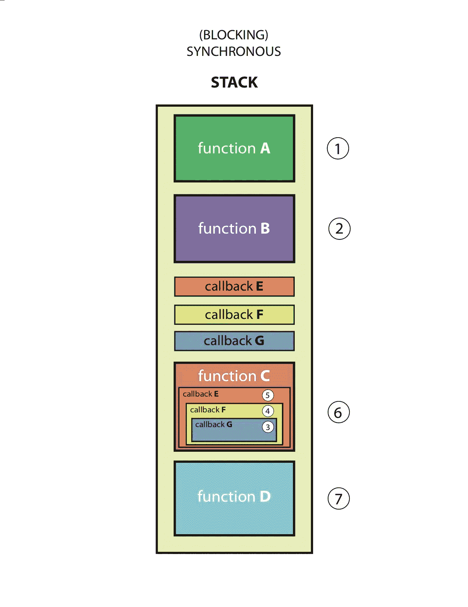
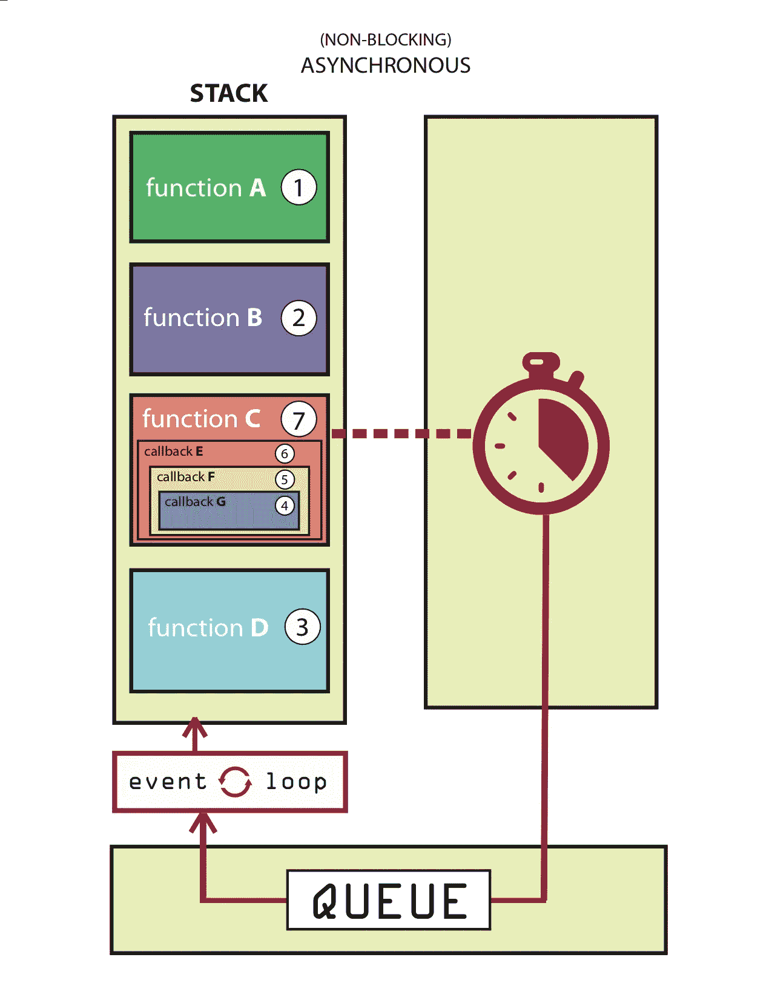
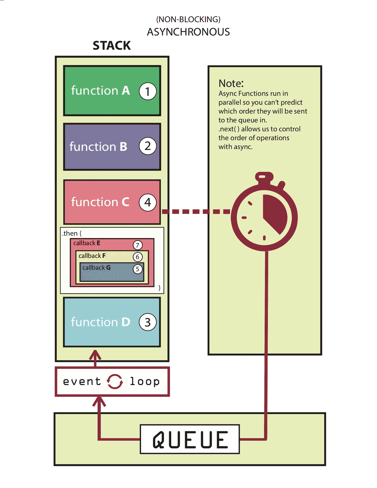

# JavaScript 是同步的还是异步的？承诺到底是什么？

> 原文：<https://betterprogramming.pub/is-javascript-synchronous-or-asynchronous-what-the-hell-is-a-promise-7aa9dd8f3bfb>

## 学习在单线程环境中工作

作为人，我们喜欢结构。我们喜欢分类、描述，并把我们知道的一切放进整洁的小盒子里。这也是我一开始觉得 JavaScript 如此令人困惑的原因。是脚本语言还是编程语言？是用在前端还是后端？

JavaScript 的奇妙之处在于，大多数时候，两者都有一点。多年来，JavaScript 发展如此之快，以至于很难归类。今天，我将深入探讨 JavaScript 是同步的还是异步的，以及幕后的工作流是什么样子的。

# JavaScript 是同步的

剧透:从根本上说，JavaScript 是一种同步、阻塞、单线程语言。这仅仅意味着一次只能进行一个操作。然而，这还不是故事的全部！

图片由 Aleks Shineleva 提供

如果您必须发出一个昂贵的数据库请求，该怎么办？当 PG 和 Postgres 为你的音乐库抓取 800 首你需要的歌曲时，你不会想无所事事。同步代码让程序员的生活变得非常困难，因此 JavaScript 社区开发了一些很好的解决方法。

当你听到人们说 JavaScript 是一种异步语言时，他们的意思是你可以操纵 JavaScript 以异步的方式让*表现*。不是烤进去的，但是有可能！以下是实现这一点的几种方法:

# 异步回调

陷入同步世界的最早和最直接的解决方案是使用异步回调(想想`setTimeout()`)。

让我们以数据库请求为例:异步回调允许您调用回调函数，该函数将数据库请求(以及任何其他嵌套的回调)发送到您的应用程序，在应用程序中等待来自数据库的响应，从而释放您的代码的其余部分以继续运行。

图片由 Aleks Shineleva 提供

一旦数据库请求完成，结果(和任何其他嵌套代码)将被发送到队列，然后通过事件循环进行处理。

在这里的图表中，您可以看到它与同步代码的不同之处。函数 C 与 E、F 和 G 一起被发送到浏览器、队列和事件循环。

> 如果你想对这一过程有一个精彩、清晰的解释，可以看看菲利普·罗伯茨的演示。

虽然这是一个很好的解决方案，但它仍有不足之处。由于您无法准确预测函数 C 何时解析，因此您必须在其中嵌套所有依赖函数。这很快变得一团糟，并导致无人愿意处理的臭名昭著的回调地狱。正是这种环境激发了这种希望。

# 承诺

为了处理回调地狱，像 Bluebird 或 Q 这样的库允许程序员清理他们的语法并编写异步操作但看起来同步的代码。这使得代码更容易阅读，运行速度更快。

图片由 Aleks Shineleva 提供

有了承诺，我们就能够将它们分离出来，而不是将所有依赖项捆绑到一个代码块中，然后将整个代码块发送给浏览器。

我们可以将异步回调(函数 C)发送到浏览器，并使用`.then()`将所有其他依赖项(E、F 和 G)放在一边，只在函数 C 返回并运行时运行它们。

这允许我们以更模块化、可读性更强的方式编码，同时仍然获得异步编程的好处。

# **异步/等待**

承诺是奇妙的——事实上如此奇妙，以至于 ES6 将它们作为一种标准引入到语言中。但是使用 promises 仍然会让异步代码感觉有点不可靠，所以我们现在有了漂亮的 Async/Await 来帮助我们！

有很多关于 Async/Await 的博客文章和书籍(我确定),所以我不会深入探讨，但可以说 Async/Await 允许您:

*   继续使用承诺
*   编写看上去和感觉上同步的异步代码
*   清理您的语法，使您的代码更易于阅读

如果你想看更多的东西，下面是我在 Async/Await 上最喜欢的一些博客文章和视频:

 [## JavaScript 的 Async/Await 违背承诺的 6 个原因(教程)

### 如果你错过了，从 7.6 版本开始，Node 现在支持异步/等待。如果你还没有尝试过…

hackernoon.com](https://hackernoon.com/6-reasons-why-javascripts-async-await-blows-promises-away-tutorial-c7ec10518dd9)  [## 用图表和例子解释 Await 和 Async

### JavaScript ES7 中的 async/await 语法使得协调异步承诺变得更加容易。如果你需要…

nikgrozev.com](http://nikgrozev.com/2017/10/01/async-await/) 

感谢阅读！卡特彼勒税:

Anouk 在读完所有这些后也筋疲力尽了。