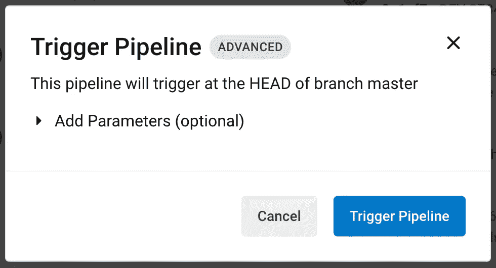
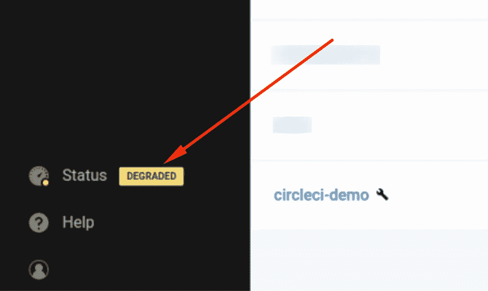
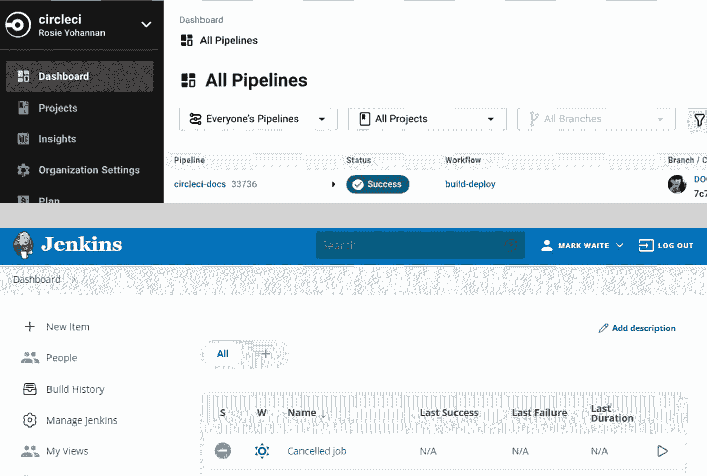
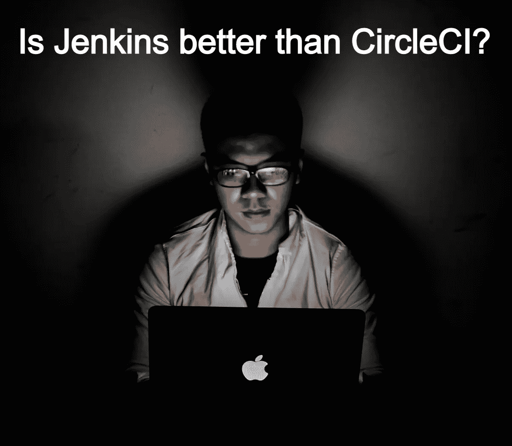

# 詹金斯比切尔莱西强吗？以下是我的对比分析

> 原文：<https://betterprogramming.pub/is-jenkins-better-than-circleci-heres-my-comparative-analysis-97abdb513344>

## 看看你和你的团队想要知道的区别

作者创造的形象

我打赌每个软件开发者都知道詹金斯是什么，或者至少听说过它。它是一个主要基于 Java 编写的开源工具，仅在几年前，它还是最流行的 CI/ CD 工具。

另一方面， [CircleCI](https://circleci.com/) 是一个相对较新的 [SaaS](https://en.wikipedia.org/wiki/Software_as_a_service) 工具，于 2017 年开始流行。2022 年，我认识的越来越多的开发人员都搬到了 CircleCI，我也是其中之一，尽管这并不完全是我的选择。

# CircleCI 正在大力发展

当我开始使用 CircleCI 时，没有可能从 UI 运行 Pipeline，我发现它与 Jenkins 相比是一个很大的缺点，但几个月后，我看到他们添加了这个功能:

circle ci—手动管道运行

但是，没有选项可以从预定义的下拉列表中选择参数。然而，这个例子表明 CircleCI 仍在积极开发中，并试图构建 Jenkins 已经拥有的许多东西。

 [## 云功能请求| CircleCI 创意

### 如果您不确定选择哪一个反馈类别，请参考我们在变更日志中的指南或使用…

ideas.circleci.com](https://ideas.circleci.com/cloud-feature-requests?sort=top) 

我计划写一些我在 Jenkins 中习惯的 CircleCI 中缺失的特性，以及我是如何克服它们的，所以你可能想继续关注。

# CircleCI SLA

尽管 CircleCI 可以是自托管的，但它最重要的优点是它是一个软件即服务(SaaS)工具，可以承担安装、管理和扩展的所有繁重工作。使用 Jenkins，您需要对您的服务正常运行时间负责，但是使用 CircleCI，您可以高枕无忧，依靠服务层协议( [SLA](https://en.wikipedia.org/wiki/Service-level_agreement) )。

即使在使用 CircleCI 一年后，我也没有经历过完全停机。我经常在他们 UI 的左下角看到这个小标记。

CirclCI 降级状态

有时，这意味着我的构建比平常慢，有时我看不出有什么不同。我必须承认，我喜欢 CircleCI 总是清楚地表明自己的地位，而不是像其他一些云提供商一样试图假装什么都没有发生。

# 用户界面

CircleCI vs Jenkin UI

Jenkins 的界面功能比 CircleCI 多得多。有时候甚至过分。您可以使用 [Groovy 的语法](http://groovy-lang.org/syntax.html)声明性脚本来设置整个管道，或者不需要任何代码，只需点击多个 UI 向导。我发现它有方便的功能，尤其是对初学者来说。

CircleCI 有一个更直接、更好看的界面(个人偏好)，在这里你能做的并不多。使用 [Yaml 语法](https://en.wikipedia.org/wiki/YAML)在`.circleci/config.yml`文件中进行声明性管道设置。起初，我对缺乏 UI 功能感到恼火，但意识到这是为了将[基础设施作为代码](https://en.wikipedia.org/wiki/Infrastructure_as_code)原则来实施。

# 并排比较

Jenkins 和 CircleCI 都可以用作 CI/CD 工具，但是:

## 詹金斯

*   是一个自动化服务器，可用于持续集成和持续交付
*   是一个自托管的解决方案，这意味着更多的麻烦，但也对安全相关的项目有更多的控制
*   拥有开源代码和麻省理工学院许可，这意味着它是免费的，但你仍然需要支付托管服务提供商
*   有许多插件，可以显著定制
*   支持管道脚本和 UI 工作流设置
*   在 [Windows](https://www.jenkins.io/doc/book/installing/windows/) 和 [macOS](https://www.jenkins.io/download/lts/macos/) 上都可以在本地免费使用

## **CircleCI**

*   是一个持续集成和持续交付的平台
*   可用作自托管解决方案，但作为 SasS 工具更受欢迎
*   有一个免费层和几个订阅计划，因此您可以随着时间的推移进行扩展
*   不支持插件，因此只有最少的定制可用。相反，有一些“orb ”,它们只不过是管道脚本扩展
*   仅支持管道脚本和对“基础设施即代码”原则的约束
*   可以在 Windows 和 macOS 的网络浏览器中轻松使用，并且有一个[免费层](https://circleci.com/pricing/?utm_source=google&utm_medium=sem&utm_campaign=sem-google-dg--emea-en-brandAuth-maxConv-auth-brand&utm_term=g_e-circle%20ci%20pricing_c__rsa1_20210604&utm_content=sem-google-dg--emea-en-brandAuth-maxConv-auth-brand_keyword-text_rsa-circleCIPricing_mixed-&gclid=CjwKCAjww8mWBhABEiwAl6-2RQO--JeeL9rh7Hd5uiW5cerODVtBTtMkot-hxejSsRtVBwVb4u-7RRoCQjUQAvD_BwE#:~:text=Up%20to%206%2C000,per%20month)
*   比 Jenkins 更直接，因此更容易开始工作

# **总结**

Photo by [卡晨](https://unsplash.com/@awmleer) on [Unsplash](https://unsplash.com/)

也许这不是一个令人满意的答案，但如果你问我詹金斯是否比切尔莱西更好，我会说这取决于情况，因为他们真的不同。

尽管与 Jenkins 相比，CircleCI 在功能上有一些不足，但做出改变并不难。我当前的团队没有专门的开发运维来管理所有的基础架构，我们可以尽可能地在云中保持扩展和快速移动。

综上所述，CircleCI 是我们的绝佳选择。以前，我参与了更多的企业级、长期项目，这些项目有严格的安全性和定制需求，Jenkins 几乎是我们唯一的选择。

我没有机会使用市场上其他流行的工具，所以我不能说 CircleCI 或 Jenkins 比 TravisCI、TeamCity 或 GitLab 更好或更差。如果有实践经验的人可以在评论中补充一些关于它的东西，我将不胜感激。