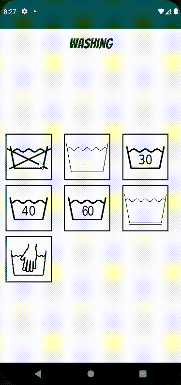

# Jetpack Compose 准备好了吗？

> 原文：<https://betterprogramming.pub/is-jetpack-compose-ready-for-you-eae6c93ad3f8>

## 探索发布一年后的更新


迈克·范·登博斯在 [Unsplash](https://unsplash.com?utm_source=medium&utm_medium=referral) 上的照片

Android 的 Jetpack Compose 版本 1.0 是在将近一年前的 7 月 28 日[发布的](https://android-developers.googleblog.com/2021/07/jetpack-compose-announcement.html)。它承诺了一种在我们的 Android 应用程序中构建 UI 的新方法，受到了极大的欢迎。此后一直定期更新维护，最近一次发布发生在 6 月底(29 日)。虽然它的发布仅仅过去了一年，但一年是一个足够好的时间框架来从更好的角度审视事物。

我敢肯定，你们中的许多人已经考虑过，现在是否是加入 Jetpack Compose 潮流的好时机。总有一种不可否认的渴望，那就是尝试和拥抱新技术，看看我们能用它做什么。但在我们的内心深处，我们都有一个小小的声音告诉我们，这可能太快了。有点像想咬一口刚出炉的披萨。

有时候，我们必须等到我们能吃第一口的时候。

# 引擎发热

Jetpack Compose 是 Android 用于原生构建 UI 的最新工具包。如果您过去开发过应用程序，那么在创建布局时，您可能会熟悉这两个选项:

*   创建 XML 文件
*   通过代码在类中构建用户界面

这些构建 UI 的方式已经伴随 Android 开发者很长时间了，所以它们是屡试不爽的。现在，我们已经习惯了它们，但这并不意味着它们没有缺点。

开发人员知道我们在通过 XML 创建布局时面临的麻烦。确保一切都正确对齐，需要添加 id 和各种其他属性，需要将 XML 中的 UI 与活动/片段中的逻辑连接起来，设计视图与文本编辑器。

这会变得很麻烦。

会变得很乱。

它会变得重复。

这可能会令人沮丧。

另一方面，在不需要构建和运行应用程序的情况下，查看您的 UI 是如何堆叠起来的总是很好的。属性本身是不言自明的，UI 元素的种类也很多。

*那么，为什么还要考虑迁移到 Jetpack Compose 呢？*

Jetpack Compose 的主要吸引力在于用 Kotlin 编写定义 UI 的代码的简单性。不再为选择相对布局而非线性布局而烦恼。约束布局中不再有定义约束。只是一个简单的系统来展示你的设计，并使它成为现实。

在花费大量时间使用 Jetpack Compose 并将我的一个应用程序转换为完全基于它的布局后，这是一场艰苦的战斗，但最终，我对结果感到满意。

这不是一个将尝试和解雇 Jetpack 组成的一块。它旨在展示撰写本文时 Jetpack Compose 的状态。因为最好睁大眼睛去做某事。

# 我的喷气背包在哪里？

Jetpack Compose 提供了一系列简单的组件来构建您的布局。但是，即使该产品看起来简单且易于操作，也有一些明显的缺陷。

我们都很熟悉`GridLayout`，Jetpack Compose 也有它的一些实现是有道理的。确实如此。它被命名为`LazyVerticalGrid`(或`LazyHorizontalGrid`)。但是，如果您有一个网格布局的应用程序，并希望切换到 Jetpack Compose，您需要知道这个组件目前仍处于试验阶段。

LazyGrid.kt

正如您在上面看到的，该类用[@ experimentalfoundationapi](https://developer.android.com/reference/kotlin/androidx/compose/foundation/ExperimentalFoundationApi)进行了注释，内容如下:

> 这个基础 API 是实验性的，将来可能会更改或删除。

类声明上面的注释声明:

> 惰性网格布局的 DSL 实现。它只包含网格中可见的行。此 API 不稳定，请考虑使用 LazyColumn 和 Row 等稳定组件来实现相同的结果。

这意味着您最好使用列和行来创建网格布局，而不是使用这个类。当你使用一个实验性的 API 时，你可能会遇到奇怪的错误或崩溃，你不知道如何修复，也可能没有解决方案([链接](https://issuetracker.google.com/issues/230514914)到一个相关的问题):

在 Jetpack Compose 中使用网格时的异常示例

`@ExperimentalFoundationApi`可以在其他相当常见的用例中找到:

*   允许项目被点击和长时间点击(`[combinedClickable](https://developer.android.com/reference/kotlin/androidx/compose/foundation/package-summary#(androidx.compose.ui.Modifier).combinedClickable(kotlin.Boolean,kotlin.String,androidx.compose.ui.semantics.Role,kotlin.String,kotlin.Function0,kotlin.Function0,kotlin.Function0))`)，
*   使一个元素[可滑动](https://developer.android.com/reference/kotlin/androidx/compose/material/package-summary#(androidx.compose.ui.Modifier).swipeable(androidx.compose.material.SwipeableState,kotlin.collections.Map,androidx.compose.foundation.gestures.Orientation,kotlin.Boolean,kotlin.Boolean,androidx.compose.foundation.interaction.MutableInteractionSource,kotlin.Function2,androidx.compose.material.ResistanceConfig,androidx.compose.ui.unit.Dp))
*   在惰性列表中创建项目 (Jetpack Compose 的 RecyclerView)

除了 Grid，一些 UI 元素在 Jetpack Compose 中还不可用。为了绕过这个问题，建议的解决方案是使用可组合的[Android view](https://developer.android.com/reference/kotlin/androidx/compose/ui/viewinterop/package-summary#AndroidView(kotlin.Function1,androidx.compose.ui.Modifier,kotlin.Function1))。可以把它想象成视图对象的包装器。你可能会认为这种解决方案适合处理复杂视图的边缘情况，但实际上，谷歌承认 Jetpack Composes 的缺点，称:

> `[AndroidView](https://developer.android.com/reference/kotlin/androidx/compose/ui/viewinterop/package-summary#AndroidView(kotlin.Function1,androidx.compose.ui.Modifier,kotlin.Function1))`通常用于使用在组合中不可重新实现的视图，并且没有相应的组合 API。目前常见的例子有`WebView`、`SurfaceView`、`AdView`等。

因此，了解这个组件以及您(很可能)需要使用它是很重要的。

# 飞行前检查清单

Jetpack Compose 提供了很多功能。毫无疑问。但是，一旦你开始使用它，你就会意识到，即使从整体上看，它可能看起来是一个完整的包，但还是缺少一些东西。那些东西不一定是特别的东西。比如工具提示。



工具提示的示例

截至 Jetpack Compose 的最新版本，没有对工具提示的内置支持。是的，有一个[变通办法](https://gist.github.com/amal/aad53791308e6edb055f3cf61f881451)有人起草了，你可以申请。但这不是 Jetpack Compose 的官方部分，因此您必须始终确保该解决方案有效。在我看来，如果 Jetpack Compose 支持网格，它肯定会支持工具提示。

你可能会认为我夸大了这一点，但实际上，有一个[问题](https://issuetracker.google.com/issues/187098109)需要添加工具提示，所以社区对此有需求。

# 测试… 3 2 1

Jetpack Compose 只允许您进行插装测试，这意味着您将需要一个设备或模拟器来运行它们。此外，作为创建测试的一部分，您需要创建一个测试规则。这允许您在测试中测试和控制组件和应用程序。有两种测试规则:

*   [作曲测试规则](https://developer.android.com/reference/kotlin/androidx/compose/ui/test/junit4/ComposeTestRule)
*   [AndroidComposeTestRule](https://developer.android.com/reference/kotlin/androidx/compose/ui/test/junit4/package-summary#createAndroidComposeRule())

两者的区别在于，后者用于访问系统相关的组件和逻辑(即活动、资源)。

虽然提供的 API 是不言自明的，但是当您不得不做一些看起来非常简单的事情时，您可能会感到困惑。

例如，如果您想要执行一个点击图像的测试，有一个使用[onNodeWithContentDescription](https://developer.android.com/reference/kotlin/androidx/compose/ui/test/package-summary#(androidx.compose.ui.test.SemanticsNodeInteractionsProvider).onNodeWithContentDescription(kotlin.String,kotlin.Boolean,kotlin.Boolean,kotlin.Boolean))的选项。但这并不像试图用 [onNodeWithText](https://developer.android.com/reference/kotlin/androidx/compose/ui/test/package-summary#(androidx.compose.ui.test.SemanticsNodeInteractionsProvider).onNodeWithText(kotlin.String,kotlin.Boolean,kotlin.Boolean,kotlin.Boolean)) 定位按钮那样容易理解。它还假设您向图像元素添加了内容描述。

有时，您会发现没有可用的 API 方法能够满足您的需求，并且您可能最终会使用`[testTag](https://developer.android.com/reference/kotlin/androidx/compose/ui/platform/package-summary#(androidx.compose.ui.Modifier).testTag(kotlin.String))` [向您的元素添加测试标记。](https://developer.android.com/reference/kotlin/androidx/compose/ui/platform/package-summary#(androidx.compose.ui.Modifier).testTag(kotlin.String))然后你可以使用`[onNodeWithTag](https://developer.android.com/reference/kotlin/androidx/compose/ui/test/package-summary#(androidx.compose.ui.test.SemanticsNodeInteractionsProvider).onNodeWithTag(kotlin.String,kotlin.Boolean))` [](https://developer.android.com/reference/kotlin/androidx/compose/ui/test/package-summary#(androidx.compose.ui.test.SemanticsNodeInteractionsProvider).onNodeWithTag(kotlin.String,kotlin.Boolean))这样你就可以正确定位你的 UI。这可能会让你的代码不那么不吸引人，因为在你的布局中会有`.tesTag`线条。

在混合应用程序(混合视图和`Compose` `composables`的应用程序)中，您需要使用带有 Jetpack Compose 测试模块的 Espresso。这是因为，虽然 Espresso 可以通过文本搜索来定位视图(例如)，但它无法访问 Composables 的语义。虽然这本身并不是一件坏事，但这只是您需要管理和处理的另一个依赖项和框架。

# 接地的

本文的目的不是劝阻您使用 Jetpack Compose，也不是将它描绘成您应该完全避免的东西。就其本身而言，Jetpack Compose 提供了许多新功能，并且仅处于起步阶段。

没有什么是完美的，随着时间的推移和谷歌的持续努力，我相信 Jetpack Compose 将成为我们构建 UI 的方式。

你甚至可以回顾自其发布以来的一年，看看这一年的进展如何。了解您将使用的技术的能力总是一个好主意。这样，您就可以评估它是否是适合您使用的工具。

正如本文开头提到的，我最近加入了 Jetpack Compose 潮流，并转换了我的一个应用程序来使用它。

```
You can see my application on [Google Play Store](https://play.google.com/store/apps/details?id=com.tomerpacific.laundry) with accompanying source code [here](https://github.com/TomerPacific/LaundrySymbols).
```