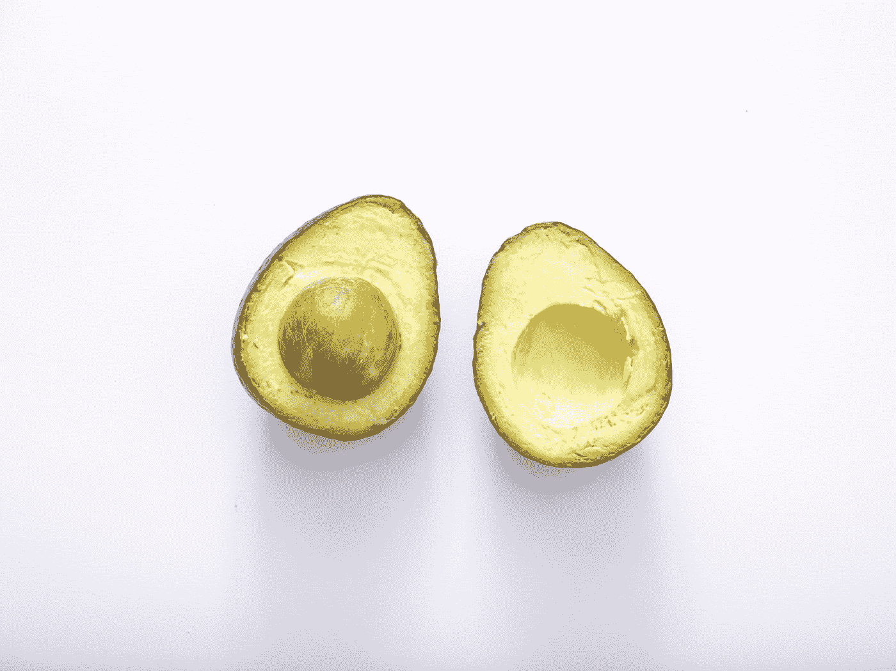
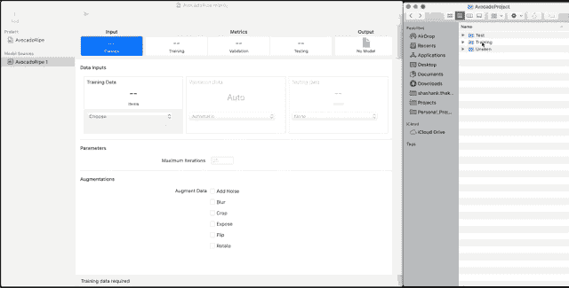
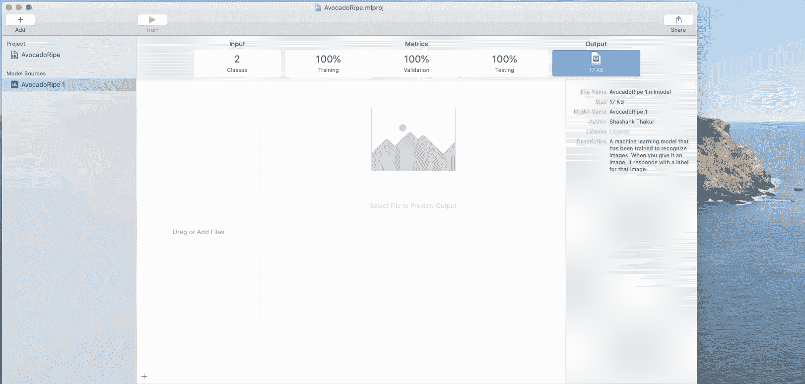
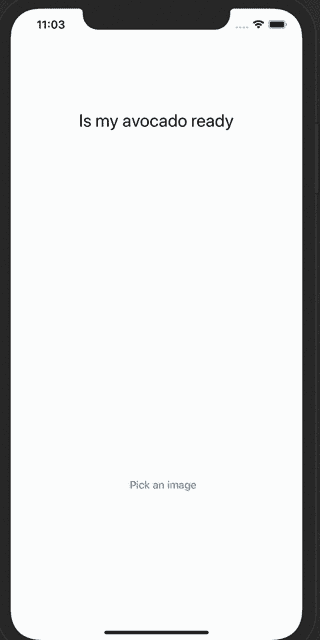

# 如何知道一个牛油果熟了没有？

> 原文：<https://betterprogramming.pub/is-my-avocado-ripe-lets-find-out-with-machine-learning-a47e7223db82>

## 使用机器学习来判断一个牛油果是否成熟？

## 使用机器学习采摘新鲜成熟的番荔枝

照片由[思想目录](https://unsplash.com/@thoughtcatalog?utm_source=medium&utm_medium=referral)在 [Unsplash](https://unsplash.com?utm_source=medium&utm_medium=referral) 上拍摄

所以今天我开始寻找一个大问题的解决方案:我的鳄梨熟了没有？我想，作为一名工程师，为什么不把机器学习派上用场呢？我决定从这个艰巨的任务开始，下面是我如何克服它的。

# **1。收集数据**

你们可能都知道，对于任何一种机器学习来说，你都需要数据——并且需要对数据进行适当的标记。对于我的 ML 模型，我正在为成熟和未成熟的鳄梨寻找正确标记的图像。我在 [Kaggle](https://www.kaggle.com/moltean/fruits) 上找到了一组图片。遵循训练模型的最佳实践，我将数据集分为两类:

*   **训练数据:**你用来训练模型的数据。在我们的例子中，这些是成熟和未成熟鳄梨的标签图像列表。
*   **测试数据:**测试训练模型准确性的数据。在我们的例子中，这只是所有图像的子集。

# **2** 。测试**雨水和测试数据**

现在我已经准备好了用于训练的数据，我该如何实际训练模型呢？作为一名 iOS 移动工程师，我使用了 Create ML 工具，它是 Xcode 开发者工具的一部分，正如在[这个 WWDC 2019 视频](https://developer.apple.com/videos/play/wwdc2019/430/)中提到的。这是如何工作的快速演练。

一旦你对你的模型满意了，我们就可以通过拖放来导出它，如下所示。

# **3。消耗训练好的模型**

现在我们已经导出了训练好的模型，我们需要做的就是在我们的应用程序中使用它。所以我创建了一个应用程序来查看整个过程。

想自己试试代码吗？点击这里查看要点:

# 结论

最后，我对弄清楚我的鳄梨是否成熟的探索结束了。我从中获得了很多乐趣，并且非常欣赏 iOS 移动开发者使用机器学习是多么容易。以后我会继续玩 CreateML。

编码快乐！

*原载于*[*https://www . shashankthakur . dev*](https://www.shashankthakur.dev/2020/09/how-to-make-your-ios-app-secure-from.html)*。*

# 参考

*   [“通过苹果开发者视频介绍 Create ML 应用”](https://developer.apple.com/videos/play/wwdc2019/430/)
*   [“使用视觉和核心 ML 对图像进行分类”](https://developer.apple.com/documentation/vision/classifying_images_with_vision_and_core_ml)通过苹果开发者文档
*   [《水果 360》上 Kaggle](https://www.kaggle.com/moltean/fruits)