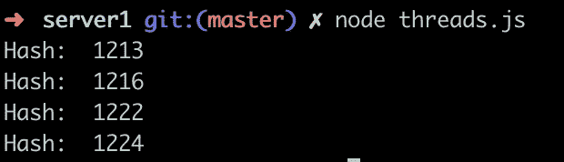
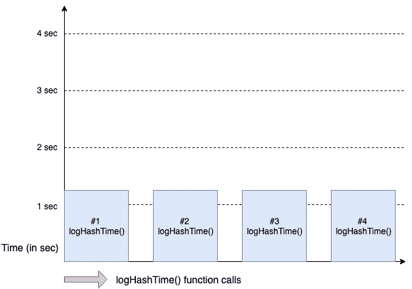
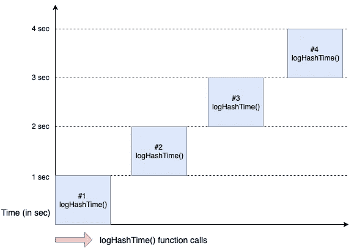
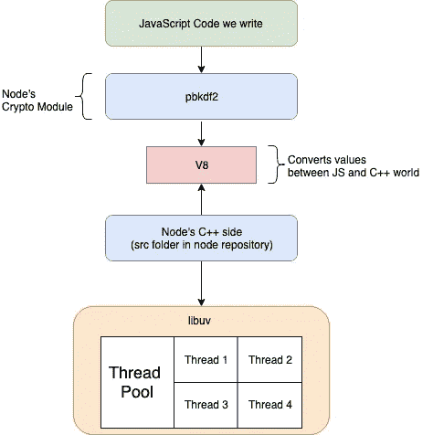
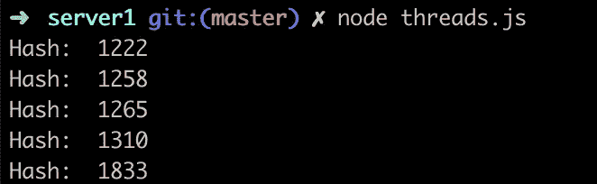
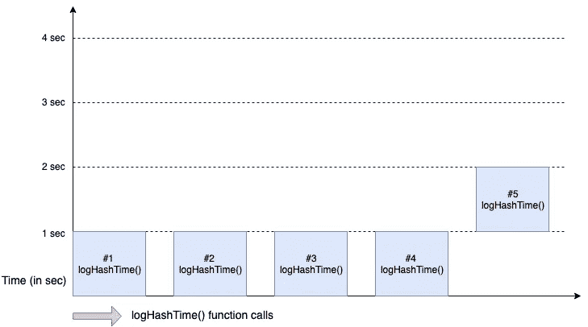
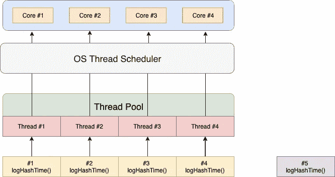
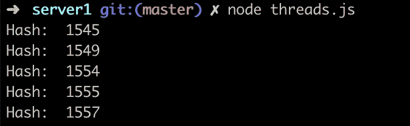
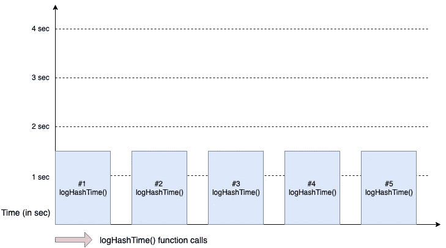

# Node.js 真的是单线程吗？

> 原文：<https://betterprogramming.pub/is-node-js-really-single-threaded-7ea59bcc8d64>

## 关于多线程、多处理、线程、进程、线程池等的教程


如果你是 Node.js 的新手，你想了解 Node.js 是如何工作的，那么请阅读这篇文章。

每篇 Node.js 文章都介绍 Node.js 是单线程的。以下是关于 Node.js 中多线程的一些误解。

1.  就像 JavaScript 一样，Node.js 也不支持多线程。
2.  和 Java 一样，Node.js 是一种真正的多线程语言。
3.  Node.js 中有两个线程，一个专门负责事件循环，另一个负责程序的执行。

好吧，放松，这些只是假设，实际上可以被称为误解。

我们大多数人，在生活中的某个时候，会对多线程和多处理、线程和进程、线程池以及操作系统如何做到这一点感到困惑。

先把基础的说清楚。

## **流程**

进程是正在执行的程序，即正在运行的程序，并且是在程序开始执行时创建的。一个进程可以有多个线程。

## **螺纹**

一个*线程*是可由一个[调度器](https://en.wikipedia.org/wiki/Scheduling_(computing))独立管理的最小程序指令序列，调度器通常是[操作系统](https://en.wikipedia.org/wiki/Operating_system)的一部分。

主要区别在于，同一个进程中的线程运行在共享的内存空间中，而进程运行在不同的内存空间中。

## **多重处理**

多重处理是在一个计算机系统中使用两个或多个 CPU(处理器)。现在，因为有多个处理器可用，所以可以同时执行多个进程。

## **多线程**

多线程是一种执行模型，允许单个进程在该进程的“上下文”中同时运行多个代码块(线程)。

## **线程池**

一个[线程池](https://en.wikipedia.org/wiki/Thread_pool) 是一组预实例化的空闲线程，它们准备好被分配工作。通过维护线程池，该模型提高了性能，并避免了由于短期任务频繁创建和销毁线程而导致的执行延迟。

需要写更详细的文章来深入解释上述概念，但我们不要偏离我们的议程。

Node.js 应用程序在单线程上运行，事件循环也在同一线程上运行。因此，我们可以说 Node.js 是单线程的，但问题是 Node.js 中有一些库不是单线程的。

让我们借助一个例子来理解这一点。

在这里，我导入了节点的加密模块，并调用了它的`pbkdf2`函数四次，显示了返回的回调所用的时间。

好奇看输出？让我们执行这个。



如果您看到输出，四个`logHashTime()`函数几乎用了相同的时间来执行。让我们来理解为什么它们都需要相似的时间来执行。

Node.js 内部使用 [libuv](https://github.com/libuv/libuv) 库，该库负责处理与操作系统相关的任务，如基于异步 I/O 的操作系统、网络、并发等。

如果你想详细了解 libuv 的工作原理，那么可以参考这篇文章。

Libuv 设置了一个由四个线程组成的[线程池](https://en.wikipedia.org/wiki/Thread_pool)，通过利用所有 CPU 内核的能力来执行与操作系统相关的操作。假设我们的机器有四个内核，池中的每个线程都被分配给每个内核。

这导致每个内核只有一个线程。在这种设置下，所有四个线程将在每个内核中并行执行`logHashTime()`，这使得所有四个函数花费的时间相似。

让我们想象一下`logHashTime()`的执行过程:



如果这不是 Node.js，它应该是这样执行的。



让我们从更高的层面来看看所有这些是如何协同工作的:



有了上面的概念，肯定会出现很多假设。

# 如果我有两个内核和多个操作要执行，该怎么办？

目前，我的机器有四个内核，让我们修改前面的例子，调用`logHashTime()`五次。

让我们检查输出。



请注意，前四次通话(平均 1.2 秒)与第五次通话(1.8 秒)有所不同。



Libuv 创建了一个由四个线程组成的线程池，每个线程在一秒钟的时间内在四个内核上执行`logHashTime()`功能。

当任何一个线程完成执行时，它将选择第五个`logHashTime()`函数来执行。所以，这就是为什么我们可以看到前四次呼叫和第五次呼叫之间有明显的时间差。

让我们想象一下。



在我们的例子中，第四个线程完成了执行，并准备好选择第五个`logHashTime()`函数。


# 如果我想调整 Libuv 线程池中的线程数量，该怎么办？

我们可以通过编写一行代码来调整 libuv 线程池中的线程数量。

```
process.env.UV_THREADPOOL_SIZE =noOfThreads;
```

让我们举同一个例子，将线程的数量从默认的四个增加到五个。

让我们检查输出。



通过调整线程数量，我们可以清楚地看到所有五个`logHashTime()`函数都花费了 1.5 秒的等效时间。



为什么会这样？

所有五个线程都试图在四个 CPU 内核上执行`logHashTime()`函数。因此，操作系统线程调度器在[上下文切换](https://www.math.uni-hamburg.de/doc/java/tutorial/essential/threads/priority.html)的帮助下，平衡并给予每个线程相等的时间来完成执行。

第三个假设将在下一篇文章中讨论。

# 结论

这就是我们如何得出 Node.js 是单线程的结论，但在后台，它使用*多线程*在 libuv 库的帮助下执行异步代码。

# 下一步是什么？

我们需要详细讨论更多的话题。在接下来的几篇文章中，我将详细讨论以下主题:

*   节点事件循环如何在内部工作。
*   通过集群增强 Node.js 性能。
*   [哈比神](https://github.com/hapijs/hapi)或[快递](https://expressjs.com/)给你的创业。

感谢阅读。