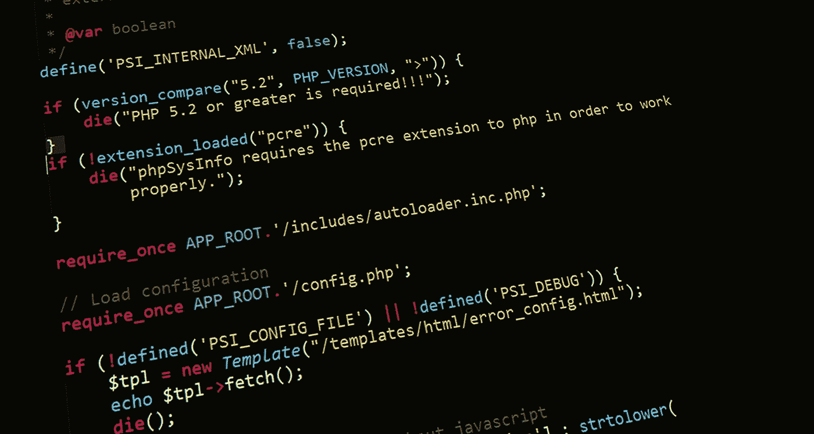

# PHP 是在维生吗？

> 原文：<https://betterprogramming.pub/is-php-on-life-support-30d7d867949b>

## PHP 有前途吗？

由[像素](https://www.pexels.com/)上的 [Pixabay](https://www.pexels.com/photo/abstract-business-code-coding-276452/) 拍摄的照片。

薛定谔的猫。这是我得到这个问题时想到的第一件事。如果你熟悉思想实验，你会同意我的观点，这个问题的答案是相对的。如今，在一群开发人员中喃喃说出“PHP”这个词可能会让你得到最难看的眼神或最可爱的微笑。对一些人来说，这就像一个诅咒语。对另一些人来说，是他们存在的理由。

事实上，PHP 是一种简单的后端语言，学习和使用应该足以让它留在地图上，但不知何故，它仍然得到了一个坏名声。

*   大多数编码训练营(至少是那些有声望的)已经不再教授它了。
*   与其他语言相比，这种语言的文档非常糟糕。
*   获得 PHP 实习和工作的机会一天比一天渺茫。如果你运气够好，找到一份工作，报酬不会很高。
*   没有学习这种语言的现代资源，YouTube、Udacity、Udemy、Skillshare 等平台上的知名教育者也不支持这种语言。

事实上，PHP 不再是一等公民。看起来，市场似乎正在竭尽全力逐步淘汰它。那么是什么让它保持相关性呢？

[据统计](https://w3techs.com/technologies/details/pl-php)，互联网上 78%的页面由 PHP 驱动。看起来很不死，对吧？但事实是:这很大一部分要归功于基于 PHP 的内容管理系统，如 WordPress、CodeIgniter、Drupal 等。其余的(在我看来)由处于生命的最后阶段或轮回的遗留项目组成。我的意思是，大多数成功存活下来的基于 PHP 的项目正在迁移到不同的现代技术，如 Node.js 和 Django。

我很清楚 PHP 上还有一些开发和维护，但已经不是开发者的首选了。我在像 Upwork、Fiverr 和 PeoplePerHour 这样的平台上看到过许多从 PHP 迁移到新技术的职位。许多开发人员不喜欢 PHP，因为它的缺点多于优点。

# 优势

*   考虑到一大群开发人员仍然在开发和维护这种语言，我们得到了一个巨大的支持社区和大型扩展库。
*   作为初学者学习 PHP 很容易。
*   大量的 web 开发人员利用 PHP 高效地执行单元测试。
*   它可以与大多数正在使用的数据库无缝协作。您可以使用 PHP 轻松连接到数据库，这减少了 web 应用程序的开发时间。
*   使用 PHP 框架有助于您更快地创建中小型应用程序，而不是从头开始编写代码。
*   它很容易嵌入到 HTML 页面中。
*   它在大多数服务器中都是预配置的。
*   当组织代码以便于维护时，PHP 框架的模型-视图-控制器架构模式非常方便。
*   使用 PHP 最大的好处之一就是你不需要担心用户将使用哪个操作系统，因为 PHP 代码可以在任何操作系统上快速运行。
*   Laravel 等内置功能和工具可以轻松保护应用程序免受数据操纵、SQL 注入和伪造等活动的影响。

# **缺点**

*   没有框架的安全性不是很好。由于它是开源的，每个人都可以看到源代码，因此原始源代码中的错误可以被利用。
*   这种语言的可扩展性是可笑的。PHP 不适合大型项目，因为它不是高度模块化的，这意味着使用该语言创建的大型应用程序将很难维护。
*   它是一种弱类型语言。作为一个优点，这使得它更容易学习和使用，但它也超级容易编写丑陋的代码和获得意想不到的 bug，这也可以归因于它糟糕的设计。如果你仔细想想，PHP 有点没有身份，因为它从 C、C++、Java 和 C#等语言中借鉴了很多东西。它既有完成相同任务的新方法，也有旧方法，这最终给初学者造成了很多困惑。

# 结论

是的，我知道在这种情况下利大于弊。事实是，其他语言也提供了同样的优点，但更好的是，它们解决了 PHP 的缺点。这就是为什么大多数开发人员认为学习 PHP 是浪费时间。当我开始我的 web 开发之旅时，我使用了大量的 PHP，当时它还是王者。这些天来，我很少接触它，除非我在使用定制的 WordPress 主题和插件。

我的想法很简单。所有的语言，不管年龄和受欢迎程度，都有自己的优点和缺点。老实说，我永远不会建议初学者用 PHP 开始他们的 web 开发生涯。

回到薛定谔的猫的类比，如果你从动量和牵引力的角度来看，那么 PHP 就是在维持生命。但如果你选择从相关性的角度来看，那么我认为它仍然活着。不过，要多久？记住，曾经有一段时间 PHP 负责了超过 85%的 web。科技发展很快。新技术接管只是时间问题，我担心它的相关性不足以带回它的光辉岁月。