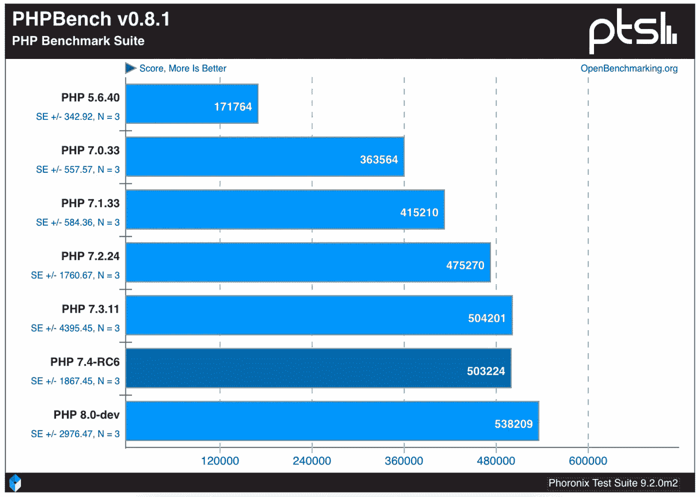
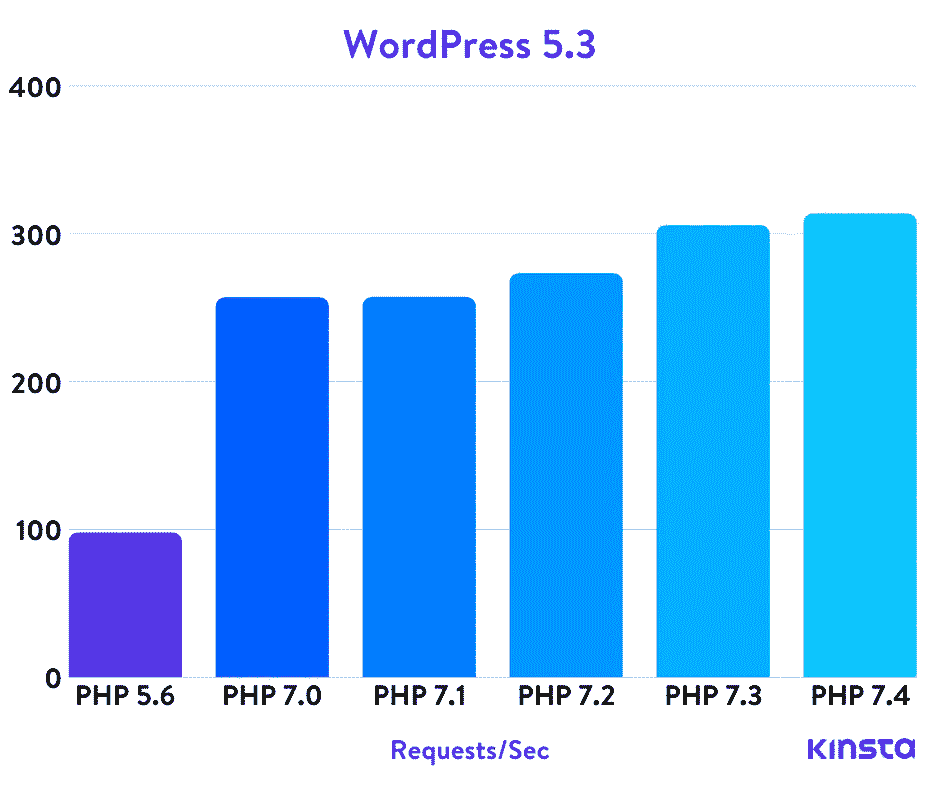

# PHP 在 2021 年还相关吗？

> 原文：<https://betterprogramming.pub/is-php-still-relevant-in-2021-19580c75855>

## 话题已经从 PHP 转移到了 JavaScript 和 Python。PHP 还重要吗？


照片由[米隆·奥利拉](https://unsplash.com/@ollila?utm_source=unsplash&utm_medium=referral&utm_content=creditCopyText)在 [Unsplash](https://unsplash.com/s/photos/elephant?utm_source=unsplash&utm_medium=referral&utm_content=creditCopyText) 拍摄。

# **PHP 简史**

PHP 是由拉斯马斯·勒德尔夫在 1994 年开发的。勒多夫开发了一系列脚本来跟踪对他的在线简历的访问，并将其命名为“个人主页工具”，后来演变为“PHP 工具”他不断向这个套件添加更多的工具，并在某个时候完成了工具的重写，包括添加数据库交互等功能——从而将它变成了一个更完整的框架。

从那时起，这些工具演变成了更复杂的原语，并在 1995 年开源后不断赢得更多用户。更详细的语言历史可以在 PHP 官方网站上找到。

截至目前，PHP 语言的最新版本是 8.0。

# **PHP 有什么问题？**

这种语言多年来一直是众矢之的，人们理所当然地提出了他们对这种语言的问题——尤其是旧版本。这种语言的开发意图是成为一种模板语言，而不是一种成熟的编程语言。因此，它有一些缺点，使得维护较大的应用程序特别困难。

## **弱打字**

我个人不喜欢这种语言的一个部分是弱类型，它允许组合不同的类型并隐式地转换它们。考虑下面的例子:

```
echo "1" + 3;
echo 1 + "3";
echo "1" + "3";
```

所有这些操作的结果是`4`，这意味着该语言在加法运算符的上下文中将字符串中的数字转换为整数。这在某些情况下可能是可取的，或者可能会节省一些代码，但是项目越大，维护起来就越困难。

该语言的最新版本已经开始引入对这类奇怪和无效操作的警告，这意味着它们要么已经被否决，要么正在被否决的路上。

## **缺少名称空间**

PHP 5.3 版引入了对名称空间的支持，这意味着所有早期的项目都必须构建自己的名称空间，这通常依赖于向类名和方法名添加名称空间。这要求到处都有长得荒谬的名字。对于使用以前版本开发的项目，经常会看到名为`Payments_Provider_ProcessorProvider_SomeExternalServiceProvider`的类，而它本来可以简单地命名为`SomeExternalServiceProvider`。在大多数情况下，这会导致非常冗长的代码，使得阅读和浏览代码变得更加困难。

不过，这种语言的最新版本没有这个问题。

## **标准库函数不一致**

我并不是说这种语言的标准库不好，但是有人会说它可以变得更好。公平地说，这种语言已经改进了很多，但是标准库的早期版本——由于向后兼容的结果，它已经被使用、引用和支持——缺乏一致性。虽然这是一个小小的干扰，但这意味着许多标准库函数有不同的命名约定、参数名和顺序，这使得假设默认值和行为变得更加困难。

从文档中可以看出，字符串方法的命名存在一些不一致:

*   `[strpos(string $haystack, string $needle, int $offset = 0): int|false](https://www.php.net/manual/en/function.strpos.php)`:查找子串在字符串中第一次出现的位置。
*   `[str_split(string $string, int $length = 1): array](https://www.php.net/manual/en/function.str-split.php)`:将字符串转换成数组。
*   `[explode(string $separator, string $string, int $limit = PHP_INT_MAX): array](https://www.php.net/manual/en/function.explode.php)`:一串一串的拆。

三种不同的功能:一种带有`str`前缀，另一种带有`str_`前缀，第三种没有前缀。`$string`参数是`str_split`的第一个参数，但第二个参数是`explode`的参数。你可以在文档中查看所有的字符串方法[，每个模式都有许多遵循相似模式的函数，这意味着这些函数没有太多的一致性。](https://www.php.net/manual/en/ref.strings.php)

## **超级全局变量**

这更多的是个人选择，但是我讨厌使用全局变量，因此也讨厌使用[超全局变量](https://www.php.net/manual/en/language.variables.superglobals.php)。尤其是如果你遇到一些自制的老项目，很可能会遇到像`$_SERVER`或`$_REQUEST`这样臭名昭著的变量。不要误解我的意思:这些有时非常有用，最终会被用到。然而，为了能够安全地使用这些值，将它们封装到可重用的类中应该是第一步。如果没有，接触这些值或者在稍微大一点的项目中做任何改变都会产生非常复杂的体验，其中有许多对这些值的隐藏依赖。

# **PHP 有什么好的？**

尽管它在许多人的嘴里留下了不好的印象，但在过去的几年里，这门语言本身已经有了很大的进步。随着 PHP 7 的发布，这种语言经历了一个现代化的过程，在这个过程中，许多好的特性被引入到语言的基础中，速度得到了提高，可用性也增加了很多。

## **类型提示**

这是我最喜欢的使遗留 PHP 代码现代化的方法之一:使用非强制类型提示来处理类型转换并为代码提供文档。看看下面这个简单的函数:

```
function isValueSomething($value) {}
```

如果您包括类型提示，它将变成如下形式:

```
function isValueSomething(string $value): bool {}
```

仅仅通过查看签名，我们就能够知道它需要一个字符串值，并将返回一个布尔结果。有人可能会说，命名约定在这里也很有用，但是这些类型提示确保了值是这些类型的，并为 IDE 提供了很多自动完成和带有警告等的静态分析的能力。

从 PHP 7.4 开始，PHP 也允许为类定义类型属性:

这意味着您的`Person`对象将有一个字符串名和姓，一个整数年龄，以及一个可为空的作业字符串值。当你拥有越多的类时，能够定义这一点变得非常有用。

## **语法改进**

PHP 现在有很多语法上的改进:

*   [箭头功能](https://www.php.net/manual/en/functions.arrow.php) : `fn ($x, $y) => $x + $y;`
*   零合并运算符:`$value = $array['key'] ?? 'default value';`
*   零合并分配:`return $cache['key'] ??= computeSomeValue('key');`
*   阵列展开:`$first = ['a', 'b']; $second = ['c', 'd']; $final= [...$first, ...$second];`
*   [命名论据](https://www.php.net/manual/en/functions.arguments.php#functions.named-arguments) : `array_fill(start_index: 0, num: 100, value: 50);`
*   数字文字分隔符:`299_792_458`

除了这些语法上的改进，它还包括更复杂的改进。

## **建造师晋升**

看看下面的`Person`类:

没有这些不必要的冗长代码， [PHP 8 支持](https://www.php.net/manual/en/language.oop5.decon.php#language.oop5.decon.constructor.promotion)编写以下代码:

很整洁，不是吗？

## **空安全操作符**

这是 JavaScript 等其他语言中已经存在的东西，但 PHP 不支持这一点。看看我从 [PHP 文档](https://www.php.net/manual/en/language.oop5.basic.php#language.oop5.basic.nullsafe)中抓取的以下代码:

这就是用旧版本 PHP 编写的关于空检查的逻辑。新的 nullsafe 操作符允许您将它简单地转换为:

是不是很华丽？

## **联合类型**

尽管这不是我最喜欢的特性，但对于已经有多种可能类型并且我们没有任何类型提示的情况，它仍然是有价值的。[联合类型](https://www.php.net/manual/en/language.types.declarations.php#language.types.declarations.union)简单地允许你定义多种类型的值作为选项。由于联合类型，下面的代码变得有效:

```
function doSomething(int|string $value): bool|array {}
```

通常，拥有多种返回类型表明有改进的机会，但是以前的 PHP 版本根本不允许我们为这样的情况定义类型，所以拥有这种类型仍然是一种改进。

## **性能**

与其他语言相比，我没有任何硬性的数字，但与以前的版本相比，PHP 随着时间的推移已经有了显著的改进。除了 PHP 7 超越 PHP 5.6 之外，所有后续版本都带来了一些改进，而且这一趋势还在继续。Phoronix 做的一些基准测试[显示，最新的 PHP 8 比 PHP 5.6 快三倍多。原帖里有更详细的测试，一定要看一下。](https://www.phoronix.com/scan.php?page=article&item=php-74-benchmarks&num=2)



除了这些基准测试， [Kinsta 还使用 WordPress 等工具进行了一些真实世界的基准测试。以下是 WordPress 5.3 的结果:](https://kinsta.com/blog/php-benchmarks/)



他们分享的数字结果如下:

*   WordPress 5.3 PHP 5.6 基准测试:`97.71 req/sec`
*   WordPress 5.3 PHP 7.0 基准测试结果:`256.81 req/sec`
*   WordPress 5.3 PHP 7.1 基准测试结果:`256.99 req/sec`
*   WordPress 5.3 PHP 7.2 基准测试结果:`273.07 req/sec`
*   WordPress 5.3 PHP 7.3 基准测试结果:`305.59 req/sec`
*   WordPress 5.3 PHP 7.4 基准测试结果:`313.42 req/sec`

这些基准还不包括 PHP 8，但是 7.4 能够处理的请求是 5.6 的三倍，这是一个非常显著的改进。

# **结论**

总的来说，PHP 在过去的几年里有了很大的改进，并且已经成为一种乐趣。我专业地使用 Golang、PHP 和 Python，并且我对 PHP 有最多的经验，所以我在这里有很大的偏见。然而，我认为 PHP 是介于灵活性和可维护性之间的最佳选择。它拥有做疯狂事情的所有灵活性，它有一个灵活的类型系统，允许逐步改进遗留代码，它对许多用例来说足够快，并且仍在改进，它背后有一个令人难以置信的开源社区。

对于那些对旧版本的 PHP 有不好的体验的人，我建议再试一次。有可能你仍然不喜欢它，但是我相信随着最新版本的出现，许多老版本的语言会有所改变。

感谢阅读！

# 资源

*   [PHP 文档](https://www.php.net/docs.php)
*   [PHP 8 发布公告](https://www.php.net/releases/8.0/en.php)
*   [Phoronix PHP 基准测试](https://www.phoronix.com/scan.php?page=article&item=php-74-benchmarks&num=2)
*   [Kinsta PHP 基准测试](https://kinsta.com/blog/php-benchmarks/)