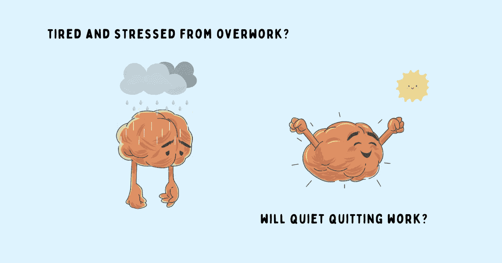

# 悄悄辞职:为什么员工退后一步，这样他们的雇主就可以向前一步

> 原文：<https://betterprogramming.pub/is-quiet-quitting-a-good-idea-1ad5547388e7>

## 当员工精神检查完毕，改变是必要的



鸣谢:作者

在周末加班、在非正常时间回复邮件以及在假期接听电话是 hustle 文化的一部分——这种文化将人们的身份与他们的工作、他们银行账户中的资金价值以及他们工作时间或忙碌程度的重要性联系起来。

当大多数人盲目地加入这场激烈的竞争时，少数人敢于质疑。他们意识到美好的生活并不是基于他人对成功的定义；这是基于他们自己的希望和梦想，他们自己的价值观和原则。

这种安静的觉醒是一种心态，可以保护员工不过度关注自己的工作，因为职业生涯排在第一位而忽视个人时间，或者过于专注于自己的工作，以至于朋友、家人和自己的健康都成了事后的想法。

> “对倦怠的清算往往是对这样一个事实的清算，即你每天所做的事情——你生活中所做的事情——与你想要的生活方式和你想要的生活意义大相径庭。
> 
> 这就是为什么倦怠状况不仅仅是对工作上瘾。这是对自我和欲望的疏离。如果减去你的工作能力，你是谁？还有剩下的自我可以挖掘吗？当没有人观看，没有疲惫迫使你选择阻力最小的道路时，你知道你喜欢什么和不喜欢什么吗？
> 
> 你知道如何在不总是前进的情况下前进吗？—安妮·海伦·彼得森

# 悄悄退出变成了全球性的

安静的觉醒有时会演变成安静的放弃，这是一种源自中国一场名为“唐平”(平躺)的生活方式和社会抗议运动的哲学，这场运动始于 2021 年 4 月。这是对以个人心理健康和个人幸福为代价的过度工作的社会压力的拒绝。别搞错了。平躺并不会促进社交孤立。它只是意味着降低自己的雄心壮志，简化目标，将心理健康置于物质主义之上。

2022 年年中流行的悄悄辞职也不同于 2021 年初出现的*“伟大的辞职”，当时许多员工自愿辞职寻找更好的机会。加入悄悄辞职革命的员工不会辞职。他们只是做工作中需要做的事情，而不是越俎代庖。*

> “你放弃了超越自我的想法。你不再认同那种认为工作就是你生活的喧嚣文化心态。[我和我的许多同行]拒绝生产力高于一切的观点；(我们)看不到回报。”——扎伊德·汗，他在抖音制作的关于安静戒烟的视频在短短两周内就获得了 300 万次点击量

# 安静的退出是个好主意吗？

当人们开始把工作看得比什么都重要，个人生活和事业之间的界限变得模糊时，安静地辞职可以给他们一个暂时的喘息机会，让他们的生活恢复一些平衡。可以帮助他们看到工作不是生活；这只是一小部分。这就是安静地戒烟能带来的好处:

*   不再认同喧嚣的文化心态。
*   没有实现不成文的期望的负担。
*   即使生病也不觉得有工作压力。
*   设定界限，不承担额外的工作。
*   享受家庭时光、假期和假日。
*   能够兼顾个人生活，而不仅仅是工作。

当悄悄辞职被用来控制你的工作和个人生活时，它会非常有力量。

然而，通过主动脱离工作，只做需要做的事情来安静地辞职是一种预防措施，以避免精疲力竭的致命影响——这不是一个长期的解决方案。安静的退出并不能解决一个人的现实情况；只会拖延时间。

我不认为安静的辞职是消除倦怠或不满的良方。无论是什么让你在工作中感到沮丧，无论是什么没有满足你的需求，或者无论是什么原因让你做出这样的选择，逃避和做最起码的事情来满足角色的要求是不会解决问题的。相反，没有在精神和情感上投入工作是有代价的:

*   没有充分利用你的潜力会导致不满，这很快就会变成一种绝望的感觉。
*   缺乏动力会导致工作满意度、士气、热情和参与度的下降。
*   研究表明，没有归属感也会导致倦怠。
*   你不太可能被考虑升职、加薪和其他机会。
*   别人可以感觉到你的精神状态，这可能会引起同事的强烈反对。

> “努力是赋予生活意义的事情之一。努力意味着你关心某件事，某件事对你很重要，你愿意为之努力。如果你不愿意珍惜事物并致力于实现它们，那将是一种贫困的生活。”—丹尼尔·平克

你不必做出选择——通过保持健康的界限和在工作中保持情感投入，你可以两全其美。

# 除了悄悄退出，你还能做什么？

如果你正处于一个阶段，有太多的工作向你袭来，或者工作的要求让你重新考虑你的选择，不要轻易辞职，成为潮流的一部分。相反，问自己几个相关的问题:

*   你的工作让你考虑悄悄地辞职了吗？
*   除了悄悄辞职，你还考虑过什么选择？
*   你有没有尝试过与他人界定界限、设定期望？
*   你和你的经理谈过你的担忧了吗？他们对于做出改变让你在工作和生活中获得健康的平衡有什么看法，或者不管是什么让你在工作中烦恼？
*   你真的想在这个工作或公司吗？为什么要悄悄地辞职，而不是简单地辞职？

积极推动你渴望的改变，而不是简单地脱离你的角色。如果情况继续糟糕，也许是时候找份新工作了——不要偷懒，去找吧。一旦你决定真的辞职并开始寻找另一份工作，悄悄辞职可能是个不错的选择。它可以给你找到下一个完美角色所需的空间，同时继续履行你目前的职责。

> “放弃和战略脱离是有区别的。知道区别。”—布莱恩特·麦吉尔

# 你能做些什么来避免员工悄悄离开你？

如果你是一名经理或领导，员工悄悄离开你可能会导致员工离职，严重影响组织的绩效和发展。

要让你的员工保持工作热情，降低员工悄悄离开你的风险，请这样做:

*   就成功的共同定义达成一致，并为他们提供确定优先级、做出决策和实现目标所需的背景和清晰度。
*   鼓励他们在合理的时间下班。
*   不要指望他们会在非正常时间回复邮件和聊天。
*   尊重他们的休息时间。
*   让他们觉得自己的工作受到重视和欣赏。他们希望被认可和看到。
*   授权他们对不符合他们目标的项目说不。
*   给他们[持续的反馈](https://www.techtello.com/how-to-give-constructive-feedback/)让他们有进步感。经理的沉默会带来不安、焦虑和压力。
*   与合理的时间表保持一致，而不是用不切实际的期限制造压力和紧张。
*   限制花在会议上的时间，这样他们就有充足的时间来完成其他的职责，而不必过度工作。
*   要求坦诚的反馈，并通过采取必要的措施改善工作文化来证明你重视他们的意见。
*   不要采用一刀切的解决方案。针对个人偏好和目标进行优化。

最后，如果你不为别人树立一个好榜样，这一切都行不通。当你的员工看到你关注自己的健康时，他们会受到鼓舞，为自己创造健康的界限，并在生活中采用这些做法。

当员工感觉自己被倾听、被欣赏、被关注而不牺牲精神健康和个人幸福时，他们不会找到脱离的理由。

# 摘要

1.  悄悄辞职是一种阻止员工尽最大努力的心态。他们只是履行工作职责，仅此而已。
2.  脱离工作可以在工作和生活之间创造一个健康的平衡，但是精神上以这种方式检查并不是没有负面的副作用。
3.  悄悄辞职会降低工作满意度，从而降低你完成工作的动力。它会影响你的生产力和表现。
4.  你的经理和你周围的其他人可以感觉到这种转变。你不太可能获得成长和学习的机会。
5.  与其悄悄地辞职，不如提出你的担忧，设定健康的界限，努力解决工作中困扰你的任何事情。最后，如果什么都不管用，辞职(不是安静地辞职)可能是一个更好的选择。
6.  如果你是领导者或管理者，不要忽视趋势。与你的员工密切合作，做出必要的改变，防止他们悄悄地离开你。

```
**Want to Connect?**Follow me on [Twitter](https://twitter.com/techtello) for more stories. This story was originally published at [https://www.techtello.com](https://www.techtello.com/quiet-quitting/).
```