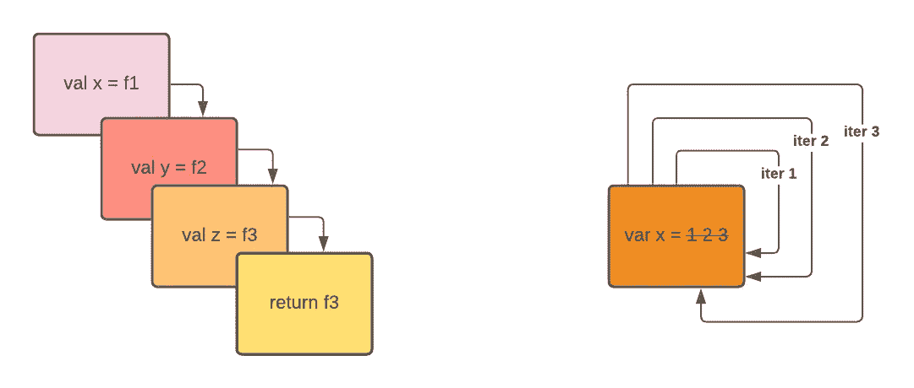
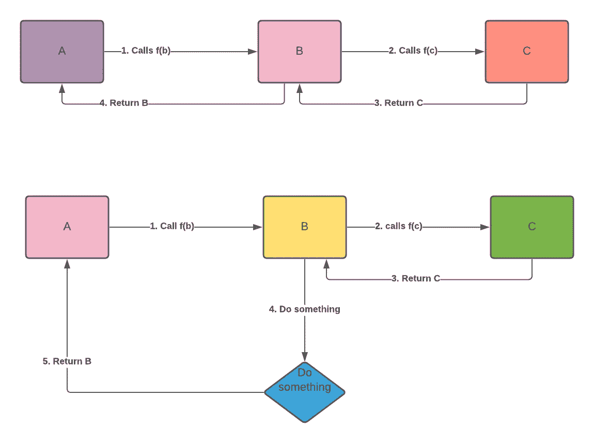

# 递归真的比迭代慢吗？

> 原文：<https://betterprogramming.pub/is-recursion-really-slower-than-iteration-dcd0df3f30d6>

## 一如既往，答案取决于你如何使用它

作者照片。

我们一直在处理这两种编写复杂程序的方法。例如，如果你想反转一个链表，有两种方法。如果你要计算你的博客文章中的赞数，有迭代和递归的算法。

然而，就速度而言，迭代解法通常比递归解法更快。

就是这样——如果你愿意，你可以从这里停止阅读……或者你可以阅读长答案，看看为什么要看情况。

在编译器没有尾部递归优化的标准编程语言中，递归调用通常比迭代慢。例如，在 Java 中，递归调用的代价很高，因为它们不能进行去尾优化。

在一些函数式编程语言实现中，迭代可能是昂贵的，因为所有的值都是不可变的，并且您需要复制所有的折扣并改变数据。在多线程环境中，迭代的代价可能很高，因为您必须同时处理赋值函数和垃圾收集器。许多函数式语言将递归调用视为跳转，而不是放入堆栈。

关键是你写的那些值是如何在汇编语言中生成的。

如果您从零开始构建一个计算值，迭代通常首先作为一个构建块出现，它用在比递归更少资源密集的计算中。

由于编写计算值的最初方式是过程化的，所以我们首先想到的是创建状态和内存。例如，为了在程序上做一些有用的事情，我们需要存储一些中间或最终的内存。它可以是内存值的数组。

第二，如果我们没有任何指令，计算出的值将是无用的。在我的汇编语言课上，ARM 汇编语言有 MOV、ADD 和其他指令来改变你的计算值的状态。然后，我们添加顺序指令(例如跳转和条件语句)来跳转到特定的执行。一个循环中的多个跳转值称为迭代。

如果我们想写更复杂的计算指令，我们需要有一个子程序来跳转并执行这些步骤。更好的实现是使用堆栈来使用多个嵌套调用。你可以用一个子程序调用另一个子程序，我们称之为函数。

那么，当子程序调用自己时会发生什么？

维拉，你得到递归。

正如你所看到的，在设计的概念中迭代是第一位的，在过程化的环境中更容易推理。在迭代中，我们不需要在堆栈中存储即时结果。它意味着更少的指导。因此，它的 CPU 周期更少。

然而，这是在装配线级别。在高级代码中，情况可能不是这样。

# 当递归调用可以像迭代一样高效时

你可以把你的程序构造成尾递归的，让编译器优化，并把它当作一个迭代调用。

尾递归调用是指子例程调用作为过程的最终动作执行。

想象一下。我们有三个函数:A，B，C，函数 A 调用函数 B，函数 B 调用函数 C，如果函数 A 返回函数 B 的值，函数 B 返回函数 C 的值，那么这个指令就可以归类为尾递归调用。请记住，在每个函数调用中，我们都是将之前的进程存储到一个堆栈中。如果我们在调用函数 C 后不做任何额外的操作，保持那个值就是浪费空间。

作者照片。

如果不需要任何变量来存储函数 A 和函数 B，函数 C 也不需要返回函数 B，可以直接跳过函数 B 和函数 A，重用 A 和 B 都有的变量。当编译器知道这一点时，它们可以重用堆栈帧，而不是在每次递归调用时都占用一个新的堆栈，这就像一次迭代调用。

在一些语言中，我们告诉编译器这样做。该语言中的一些编译器可以自动检测我们的代码是递归的，并代表我们帮助优化它。Scala 编程中有`@tailRec`注释，指定编译器将当前函数优化为尾递归调用。如果过程不是尾递归的，它将在编译时给出一个错误。

一旦我们能够以尾递归的方式执行函数，编写递归解决方案与迭代解决方案只是算法风格的问题。

# 结束语

当谈到递归和迭代代码库性能时，它归结于语言和代码所有者如何编写程序。你可以写一个比迭代方式更快的递归解。就汇编代码而言，迭代解决方案代表更少的指令，因此它们比递归解决方案更有性能。

另一方面，现代编译器利用递归优化来优化递归计算，以便与迭代解决方案一样高效。

我希望您了解了一些递归和迭代函数之间的关系，以及如何在下一个编码项目中利用尾部递归。

以下是一些关于递归的有用参考:

*   [什么是尾递归？— LispCast](https://lispcast.com/what-is-tail-recursion/)
*   [ECMAScript 6 中的尾部调用优化](https://2ality.com/2015/06/tail-call-optimization.html)

*原载于***。**