# AWS Lambda 教程:无服务器值得大肆宣传吗？

> 原文：<https://betterprogramming.pub/is-serverless-worth-the-hype-9bcb1842678b>

## 让我们用一个 AWS Lambda 例子来看看无服务器是否真的更好


打倒服务器(除了不是真的)！—图片来自维基共享。

# 无服务器有一个坏名声

“无服务器”是一个热门词汇，但我认识的开发人员经常对此不屑一顾——尤其是在提到微服务时。

无服务器的支持者说，它可以无缝扩展以满足需求，同时如果不使用也不会浪费资源…如果你设置正确的话。

另一方面，许多开发人员认为无服务器架构过于复杂——尤其是在重新构建现有应用程序和设置部署策略时。

那么，谁是对的呢？作为一名开发人员，你会听到很多意见，但我最好的建议是:如果你对一项新技术感兴趣，那就尝试一下。

# 给无服务器一个机会

幸运的是，最受欢迎的无服务器提供商(AWS)让你免费试用他们的无服务器产品(Lambda)。

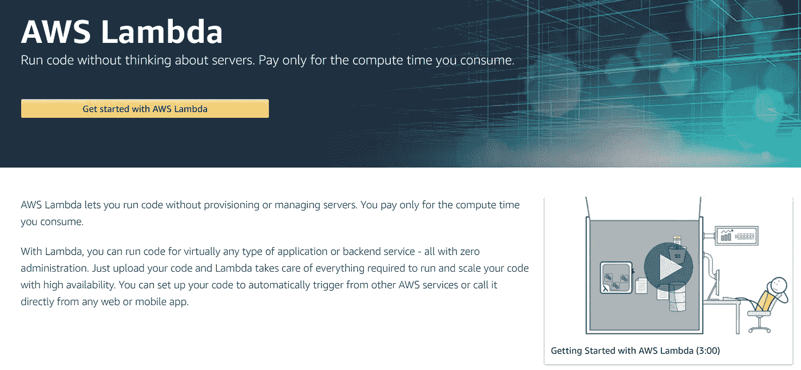

销售页面有什么内容？

看一看销售文案，我们就能从较高的层次上了解到无服务器的最大承诺优势。如果我们构建了正确的应用程序，我们应该得到:

1.  随需求扩展的应用程序。
2.  需求低时运行成本低的应用程序。
3.  一个我们不必考虑的基础设施。

请记住这三点，因为这些是我们最终用来判断无服务器的标准。

# 房间里的大象:不，无服务器不是无服务器

这真的不是一个好名字——或者至少是一个容易让人误解的名字。

当然，您的应用程序仍然运行在处理器、RAM 和硬盘的某种组合上。

无服务器架构只是抽象出许多更好的细节。

这种抽象只是计算机科学中一个基本趋势的延续。这个领域的历史包括各种各样的例子，说明[抽象如何使计算机工作变得更容易](https://levelup.gitconnected.com/want-to-understand-computer-science-study-abstraction-cb785a19bbc5)。

# 那么什么是λ？

这里有一个最简单的方法来考虑它:λ是一个函数。

该功能旋转起来，处理信息，通常返回一个响应，然后离开。

这里真正的创新是，您可以启动成千上万个相同功能的实例，为您的应用程序处理高水平的流量或吞吐量。

事情变得棘手的地方是管理函数被触发的方式(例如，API、指标触发器、通知系统、消息队列等。).

此外，确保 lambda 对其他服务(如数据库、缓存、电子邮件队列、文件存储等)具有访问权限。)跨 AWS 可能是一个挑战。为了做有用的工作，lambda 需要能够访问这些服务，但这通常意味着为您编写的每一段代码管理规则集和访问策略。

# 喜欢你在这里读到的吗？

我免费与我的电子邮件列表分享我最好的内容。

[加入我的电子邮件系列中的 500 名其他开发人员。](https://sunny-architect-5371.ck.page/0a60026a5d)

# 试试吧！

好，我们想测试λ。最终，我们想看看无服务器是如何工作的，以及它是否容易上手。

以下是我们需要采取的高级步骤:

1.  创建一个λ。
2.  为该 lambda 定义触发器。
3.  编写一些代码来调用和使用 lambda 的响应。

如果它看起来简单，那是因为它实际上很容易开始。让我们来看看。

# 1.创建一个λ

进入 AWS(如果你没有帐户，创建一个)并导航到 AWS Lambda 页面。

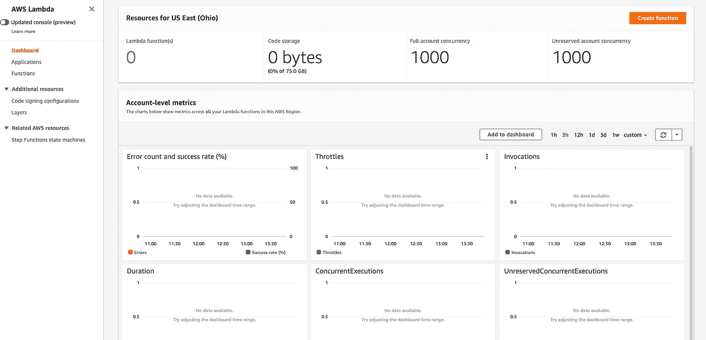

我的 Lambda 页面。您可能会看到销售页面。如果是，请点击按钮继续。

一旦我们完成了 lambda 的创建并开始使用它，这里会显示出它被调用的次数。

我们还没有任何 lambdas，所以单击“创建函数”按钮。

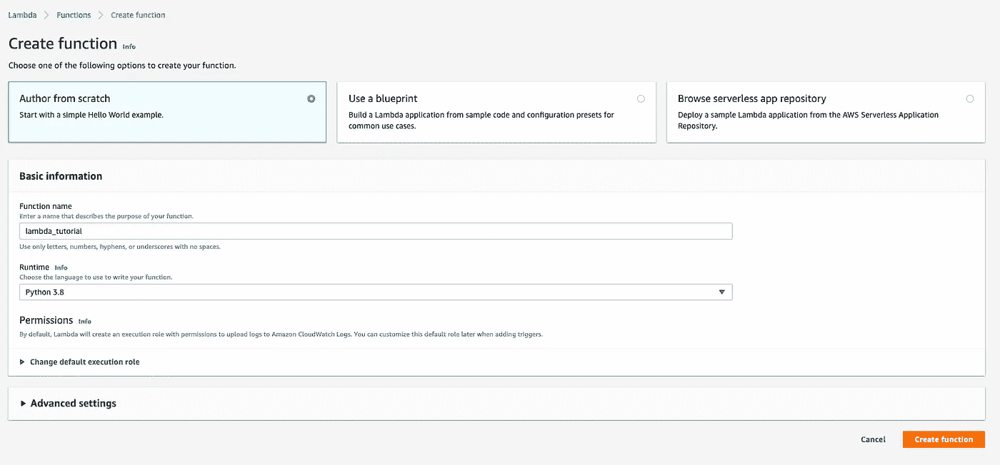

如果你愿意，可以浏览“使用蓝图”一节中的蓝图。它们会帮助你了解你可以用 lambdas 完成什么样的任务。

现在，选择“作者从零开始。”

我将用 Python 编写我的 lambda，因为这是我最喜欢和最常用的语言，但是 lambda 的一个好处是你可以用各种语言编写你的代码。

点击“创建函数”

## 编写 lambda

欢迎来到 lambda 创建页面！我们已经非常接近完成 lambda 了。

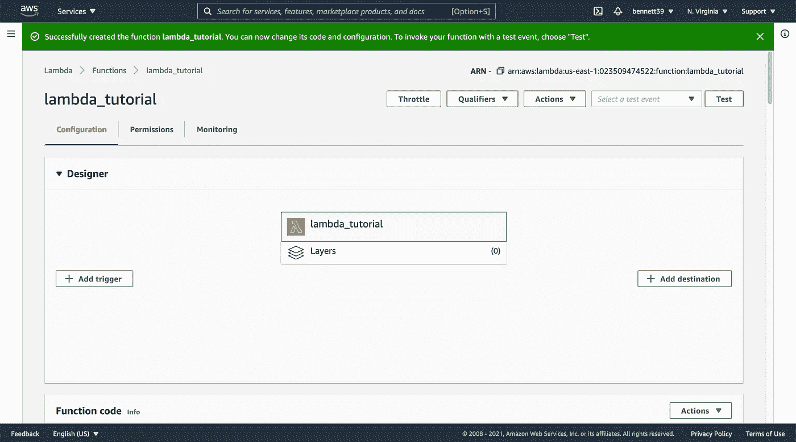

当我们想要为事件添加触发器时，我们将返回到“设计器”部分。现在，您可以最小化该部分，查看“功能代码”部分。

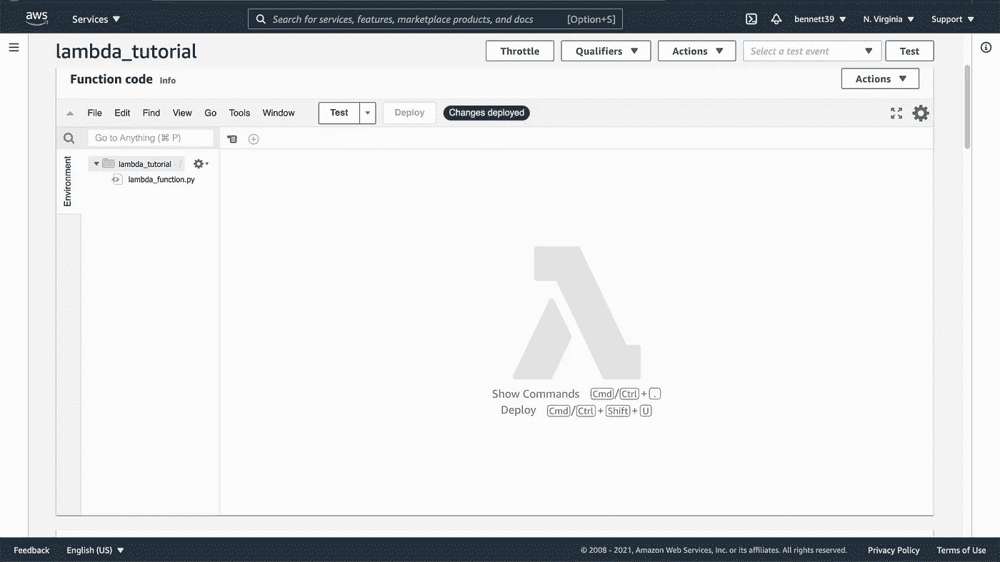

正如我提到的，lambdas 只是通过特定触发器调用的基本函数(对于我们今天的目的来说)。点击`lambda_function.py`，你会看到 AWS 已经为我们预装的默认功能。


这里需要注意一些事情:

*   `lambda_handler`函数有两个参数——触发它的`event`和伴随这个 lambda 实例的任何`context`。
*   我们需要添加一些逻辑来告诉处理程序需要做什么工作。
*   然后我们`return`一个字典，它看起来像你可能期望通过 API 看到的响应。

有了这些基本规则，我们就可以写出相当复杂的逻辑。

## 测试我们的λ

现在，让我们运行来自亚马逊的示例代码。点击“测试”,您将看到创建测试事件的屏幕:

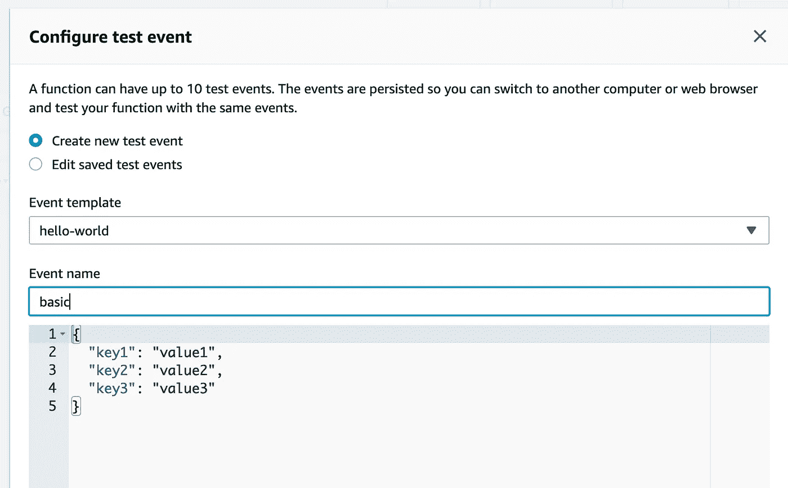

我们现在只保留默认值，但是您可以为您的函数创建自己的测试事件，以确保它能够处理您所期望的所有情况。

事件可能来自许多地方，并采用不同的格式，因此测试您的 lambdas 非常重要。

点击“创建”，然后点击“测试”，看看我们的 lambda 的结果！

```
{
  "statusCode": 200,
  "body": "\"Hello from Lambda!\""
}Function Logs
START RequestId: aa45ea9e-8726-49a9-b12b-556e44bd2646 Version: $LATEST
END RequestId: aa45ea9e-8726-49a9-b12b-556e44bd2646
REPORT RequestId: aa45ea9e-8726-49a9-b12b-556e44bd2646 Duration: 0.91 ms Billed Duration: 1 ms Memory Size: 128 MB Max Memory Used: 50 MBRequest ID
aa45ea9e-8726-49a9-b12b-556e44bd2646
```

请注意，我们得到了一个响应，返回了成功执行任务的结果。

我们还会收到一份关于 lambda 的简短报告，其中包含计费信息。

## λ计费

AWS 根据请求数量和完成任务所需的秒数对无服务器计算收费。

[来自 AWS](https://aws.amazon.com/lambda/pricing/) :

> “使用 AWS Lambda，您只需为您使用的内容付费。根据对您的函数的请求数量和持续时间(代码执行所需的时间)向您收费。
> 
> Lambda 在每次开始执行请求以响应事件通知或 invoke 调用(包括来自控制台的测试调用)时都对请求进行计数。
> 
> AWS Lambda 免费使用层包括每月 100 万个免费请求和每月 400，000 GB 秒的计算时间。"

因此，只要我们不发出 100 万个请求，或者这些请求不需要太长时间，我们就会处于免费使用层。

这里无服务器的好处是我们不用为空闲时间付费。我们只在需要时为计算资源付费，精确到毫秒级。

也就是说，如果你写了低效的 lambda 代码，需要一段时间来执行，你会更快地耗尽你的自由层。事实上，lambdas 仅限于执行时间少于 15 分钟的小任务。

## 让我们的代码更有趣:三明治构建者！

“你好世界”很无聊。让我们做点真正创新有用的东西吧(/讽刺)。

一个建议随机冷切三明治，甚至允许你指定三明治部分的 API 怎么样？

我的想法是这样的:

每当您对 lambda 进行更改时，您都必须单击“部署”因此，请确保在测试之前单击该按钮！

如果我们测试它…我们会得到一个随机的三明治！

```
Response
{
  "statusCode": 200,
  "body": "\"tempeh & gruyere with tomato\""
}Function Logs
START RequestId: 5694048c-0edc-4bc8-893a-a4e19dd4e1ee Version: $LATEST
END RequestId: 5694048c-0edc-4bc8-893a-a4e19dd4e1ee
REPORT RequestId: 5694048c-0edc-4bc8-893a-a4e19dd4e1ee Duration: 1.00 ms Billed Duration: 2 ms Memory Size: 128 MB Max Memory Used: 51 MB Init Duration: 109.90 msRequest ID
5694048c-0edc-4bc8-893a-a4e19dd4e1ee
```

现在让我们编辑我们的测试用例，并尝试为三明治指定我们自己的肉:

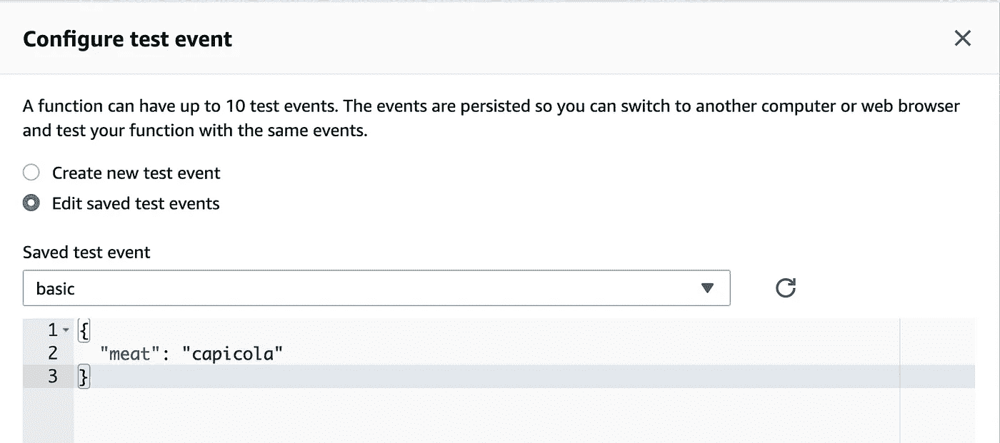

运行测试:

```
Response
{
  "statusCode": 200,
  "body": "\"capicola & provolone with onions\""
}Function Logs
START RequestId: 77a2eeeb-26c8-4e70-af53-5d3d6f8956ea Version: $LATEST
END RequestId: 77a2eeeb-26c8-4e70-af53-5d3d6f8956ea
REPORT RequestId: 77a2eeeb-26c8-4e70-af53-5d3d6f8956ea Duration: 0.95 ms Billed Duration: 1 ms Memory Size: 128 MB Max Memory Used: 51 MBRequest ID
77a2eeeb-26c8-4e70-af53-5d3d6f8956ea
```

好吃！那听起来像一个不错的三明治！

# 2.为我们的 Lambda 公开一个 API

因此，我们有了*超级有用的*三明治建筑 lambda，现在我们想与世界分享这一美丽的创新。

为此，让我们为 lambda 公开一个 API。我们需要为 API 指定一种方式来触发 lambda，然后接收它的响应。

再次打开“设计器”:


单击“添加触发器”我们将使用 AWS 的内部工具 API Gateway:

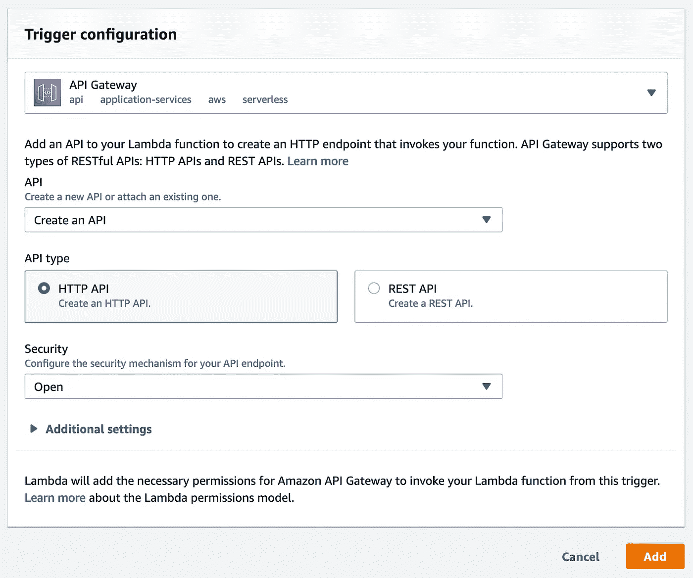

出于本教程的目的，我正在创建一个开放的 API，这意味着任何人都可以访问它。

当你实际使用 lambdas 时，你会想给你的 API 增加一些安全性和认证，但是这会让这个教程太长。

一旦你添加了 API，你会看到它作为你的 lambda:


如果您单击 API 网关触发器，您将在下面看到一些相关信息:

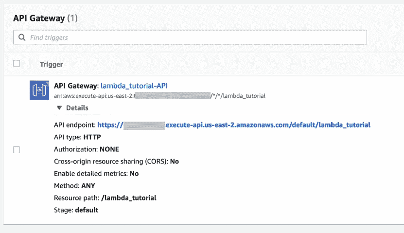

如果我们访问 API 端点，我们会看到原始响应！

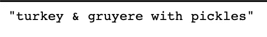

## 使响应更像实际的 API

通常，如果您访问了一个 API 端点，您会期望得到一个 JSON 对象——而不仅仅是一个字符串。

所以，让我们更新我们的 lambda 的返回值:

```
return {
        'statusCode': 200,
        'body': json.dumps(dict(sandwich=sandwich))
    }
```

我刚刚将响应包装在一个字典中，这样当我们 ping API 时，我们将获得一个 JSON 对象。

每当您对 lambda 进行更改时，您都必须单击“部署”因此，请确保在测试之前单击该按钮！

在 Postman 中尝试一下，我们会得到有效的 JSON！

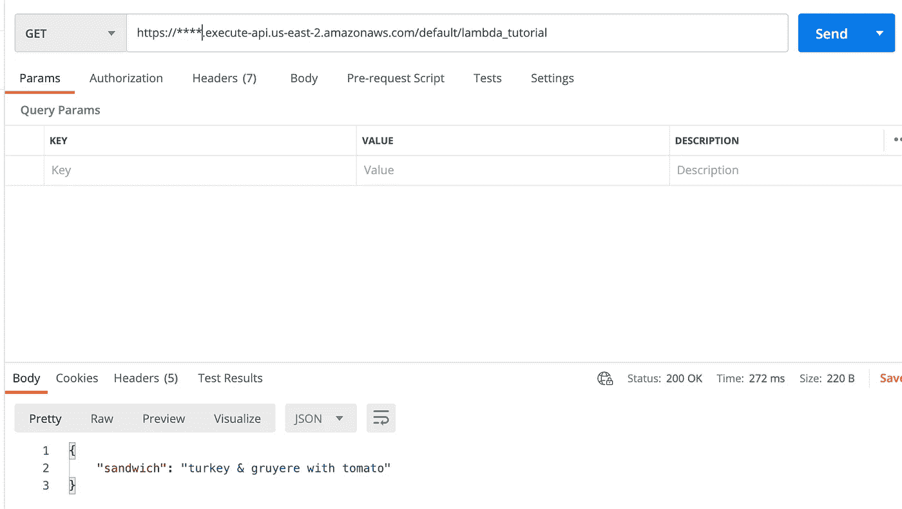

# 3.使用我们的 API

哇哦，我们造了些东西！让我们试着让它在一个真实的网站环境中工作！

让我们创建一个带有按钮的页面，允许您 ping API:

将其另存为`index.html`，然后用浏览器打开该文件。确保用您的值更新`apiUrl`。

这是我们的三明治发电机网站！

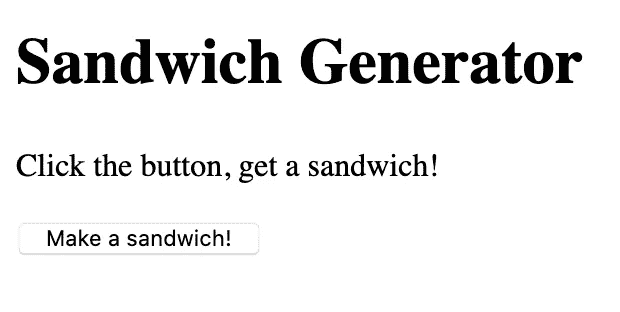

但是如果你点击按钮，什么都不会发生！

如果我们检查控制台，我们会看到我们有一个可怕的 CORS 错误。哦不！

```
Cross-Origin Request Blocked: The Same Origin Policy disallows reading the remote resource at [https://***.execute-api.us-east-2.amazonaws.com/default/lambda_tutorial](https://npbhu6zm3f.execute-api.us-east-2.amazonaws.com/default/lambda_tutorial). (Reason: CORS header ‘Access-Control-Allow-Origin’ missing).
```

## 修复 CORS 错误

不幸的是，因为我们在本地开发了`index.html`，所以`file://`前缀与亚马逊的 CORS 政策不太协调。

为了修复 CORS 错误，我们需要在某个地方部署站点或者在服务器上运行它。

我能想到的让它工作的最简单的方法是将`index.html`上传到 Git 仓库。

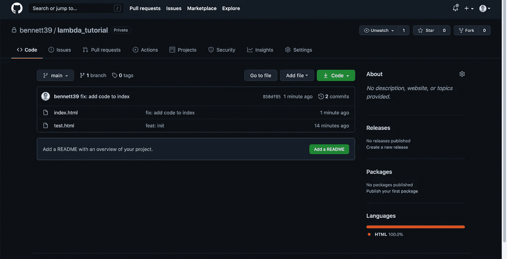

然后使用空构建命令和空发布目录，从该 repo 创建一个新的 Netlify 或 GitHub Pages 应用程序:

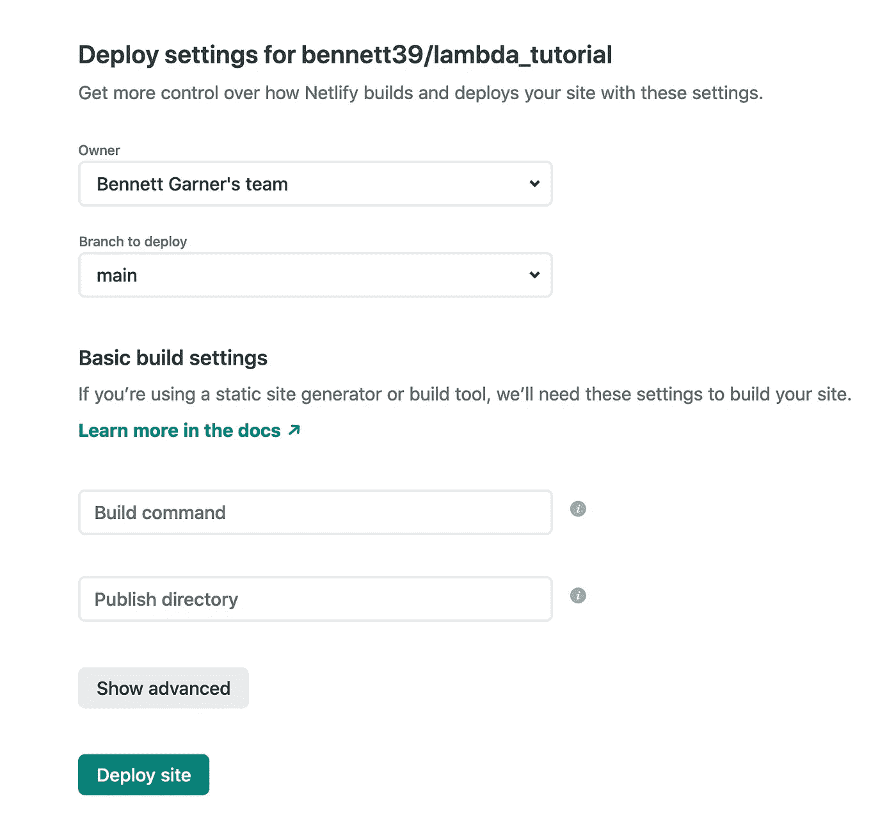

然后，我们将在网络设置中抓取一个甜蜜的域，我们将在[https://sandwich-generator.netlify.app/](https://sandwich-generator.netlify.app/)现场直播。

耶！去做个三明治吧——说真的。

# 致所有 Haxors 的一封信

我知道 API 目前是开放的，聪明的人可以找出它的 URL 和如何访问它。

你可以随意使用它，但是如果你提出了大量的请求，并且这篇文章对我来说开始变得昂贵，那么我将不得不把它拿下来或者增加授权。

请不要为我创造更多的工作，只是因为你很可爱，并 being 我的 API 一百万次。我在这里呼吁人类的尊严。

我还在 API 中添加了速率限制，所以如果你想做一些卑鄙的事情，就省省你自己和我们其他人的麻烦吧。

# 关于无服务器，我们学到了什么？

请记住，我们有三个标准来判断无服务器。让我们来看看我们对他们每个人都了解了些什么。

## 1.随需求扩展的应用程序

我们并没有对我们的三明治生成器进行压力测试，但是很容易看出它应该可以在 AWS 的基础设施上很好地扩展。

API Gateway 可以低延迟地处理和平衡数百万个请求。反过来，lambda 的每个实例都可以对这些请求做出自己的响应。

当然，您可以在浏览器中用纯 JavaScript 构建一个三明治生成器。我们不需要 lambda 来构建这个特定的应用程序。

lambdas 开始变得强大的地方是当你将它们与数据存储(RDS，Dynamo，S3)和不同的工作流(触发器和目的地)联系起来的时候。

根据您对其他基础架构的选择，它可能不会随需求轻松扩展和缩减。lambda 只是一个更大链条中的一环，最终你的应用的可伸缩性依赖于整个链条。

*得分:如果配置正确，无服务器可伸缩性对某些类型的应用程序是有益的。*

## 2.需求低时运营成本低

扩大规模以满足流量激增很重要，但在不需要时高效运营也很重要。最终，这是 lambda 的最大好处。

根据 AWS 目前的免费层定价，lambda 在 100 万个请求或特定计算时间阈值以下是免费的。

同样，API 网关免费层包括每月 100 万次 HTTP API 调用和 750，000 分钟的连接时间，最长可达 12 个月。

和以前一样，应用程序中的其他基础设施可能会也可能不会这么便宜。

*评分:Lambda 本身就很便宜。亚马逊要你用！但是您的整个应用程序的成本还是取决于您所构建的内容。无服务器可能更便宜，但在某些情况下，购买专用资源可能更好。*

## 3.我们不必考虑的基础设施

对我来说，这就是无服务器开始崩溃的地方。配置是一个很大的痛苦，我们甚至没有构建任何太复杂的东西。

一旦您开始使用具有无服务器功能的其他产品，您将不得不管理连接、规则集和事件触发器。您的基础架构的每个部分都必须进行配置，以根据需求进行扩展，同时拒绝来自不良行为者的大规模攻击。

在这种情况下，我还会考虑供应商锁定问题。为了用无服务器做任何有趣的事情，我们必须使用 AWS 的其他服务。即使对于我们这个简单的例子，我们也需要注册 API Gateway。

的确，一旦配置了无服务器，扩展的挑战就会迎刃而解，因为 AWS 可以处理大量的吞吐量。一旦你有了无服务器设置，它会很好。

但是要进行设置，您需要了解 AWS 以及所有部分是如何组合在一起的。入门不是小事。添加到您的应用程序中通常意味着要改变很多配置。

*得分:无服务器远远不是我们不需要考虑的基础设施，它为开发人员引入了新的开销和 DevOps 任务，以使他们的代码在生产中工作。如果您不需要经常更改代码，那么 DevOps 投资可能是值得的。*

# 无服务器入门

我们今天构建的应用程序是超级基本的，但是有些公司使用无服务器的 lambdas 来运行他们的整个应用程序。

事实上，无服务器微服务的承诺可能是互联网的未来，它允许快速、分布式地处理全球数十亿个请求。

也许我对 lambdas 有偏见，或者被 DevOps 的要求吓倒了。您发现无服务器是否适合您的唯一方法是构建一些东西！希望这篇文章已经给了你一个好的开始。

# 关于班尼特

我是一名用 Python 和 JavaScript 构建东西的 web 开发人员。

想要我关于 web 开发和成为更好的程序员的最佳内容吗？

*我在邮件列表中分享我最喜欢的建议——没有垃圾邮件，没有推销内容，只有有用的内容。*

[加入我的电子邮件系列中的其他 500 名开发人员。](https://sunny-architect-5371.ck.page/0a60026a5d)