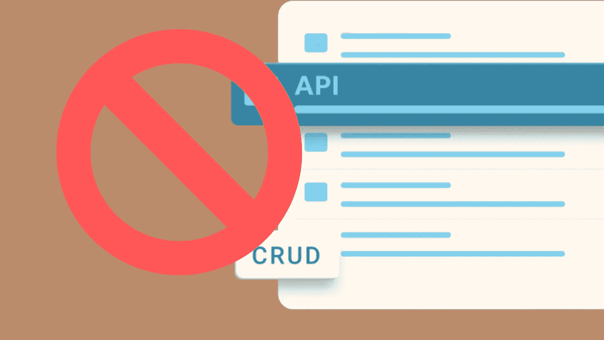

# 基于任务的 API 比 CRUD APIs 更好吗？

> 原文：<https://betterprogramming.pub/is-task-based-ui-a-better-solution-than-crud-apis-768648fc5161>

## 过去的技术应该被抛弃



图片由[作者](http://www.arnoldcode.com)经由 Canva.com 制作

CRUD 很简单。垃圾就是生活。这是许多 web 开发人员祈祷时脑子里的想法。这个模式太重要了，不容忽视。每个应用程序都需要一些简单的端点，不是吗？

创建、读取、更新和删除——如此简单又如此错误。

以这种简单的方式设计完应用程序的端点后，问题就出现了。

# 告诉我！有什么不好的？

好的，当然！让我们用一个代表`RedditUser`的简单模型来面对它。

显然，您需要设计一些 API 来与该模型进行交互。说真的，您需要在某个地方存储和更新这个用户。

突然之间，你想起帖子讨人喜欢，增加`Karma`。你到底是怎么实现这个特性的？

记得吗，很快就洗完了。u 代表“更新”你的 API 被设计成这样:`PATCH api/reddituser/{id}`取整个用户。

等等，什么？只更新`Karma`并提交整个`RedditUser`对象？

你有什么问题？把该死的用户交出来。

看到这种情况很难受，因为必须有人来处理，而这个人可能就是你。您没有机会看到调用这个端点会更新哪些属性。

代码应该总是最好地表达自己。这也适用于 API。因此，所使用的 CRUD 方法变得冗长。

## 你需要交付和更新每一处房产。

您甚至没有提出任何错误处理。向前想几个功能，用户就可以有奖励，屏蔽其他用户，神奇地飞起来。

结合提到的缺陷和缺乏可伸缩性出现。

# 好吧，但一个单独的道具更新层就能做到

您想要更改单个属性。

你使代码更加复杂，而不是简化它。

祝你好运！您仍然需要整个对象加上另一个属性来告诉您应该更新什么。那么您的端点可能如下所示:

起初听起来不错的东西变成了维护的噩梦，可读性在 1999 年的新年前夕被保留了下来。

# 基于任务的界面是解决方案

基于任务的界面是一个很好的选择。

我已经听到你说:

*   方法多！
*   更多的课！
*   更多的代码行！
*   更多问题！

那么，这怎么更好呢？—它是实心的。

每种方法都有一个单独的职责。

每种方法都是一项任务的主人。

除了有一个可以阅读和维护的代码片段之外，它们都很和谐。

# 揭穿进一步的怀疑

## 1.我应该总是反对垃圾吗？

不，如果明智地使用，CRUD 是好的。

和生活中的一切一样，不要过度使用，适度享受，即使是魔兽世界。CRUD APIs 易于快速开发。你也知道还有什么必须尽快完成。概念证明(PoC)，最低可行产品(MVP)。

用它来快速获得结果，当你把它们变成一个可扩展的应用程序时，扔掉那些垃圾。

## 2.这么多 API 调用。我是什么？呼叫中心？

没错，现在您已经确切地知道了每个端点将会做什么。

## 3.我可以从数据库中获取数据并处理变更集

嗯，聪明的方法，但是它不能处理在更新一些属性时调用过于模糊的端点的主要问题。

## 4.然后，我将为每个属性设置一个端点。

当然，如果这是你想要达到的。实际上，这是另一个故事。

尝试获取应用程序的用户视点。某人必须使用的主要选项是什么？将它们反射到端点。如果不允许`RedditUser`改变他的昵称，为什么要提供端点？

# 我的外卖是什么？

作为一个新手，你经常学习如何创建一个基于 CRUD 的应用程序接口。主要是结合创建 web APIs。实际上，你可能甚至没有质疑过这种模式并接受它。

从长远来看，简单方法带来的一些困难可能会更严重。因此，基于任务的系统优于 CRUD。

您在调用它们、读取源代码以及可维护和可伸缩的代码时获得了许可。允许每个端点单独增长，而不会在出现变化时遇到麻烦。

```
**Want to Connect?**[Get 8 long-lasting golden rules for successful developers that are your guidance through learning to code and climb the cooperate ladder.](https://arnoldcodeacademy.ck.page/8rulesforsuccessfuldevelopers)
```