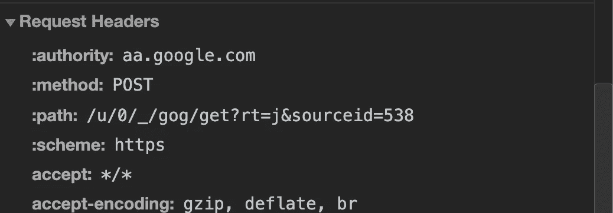
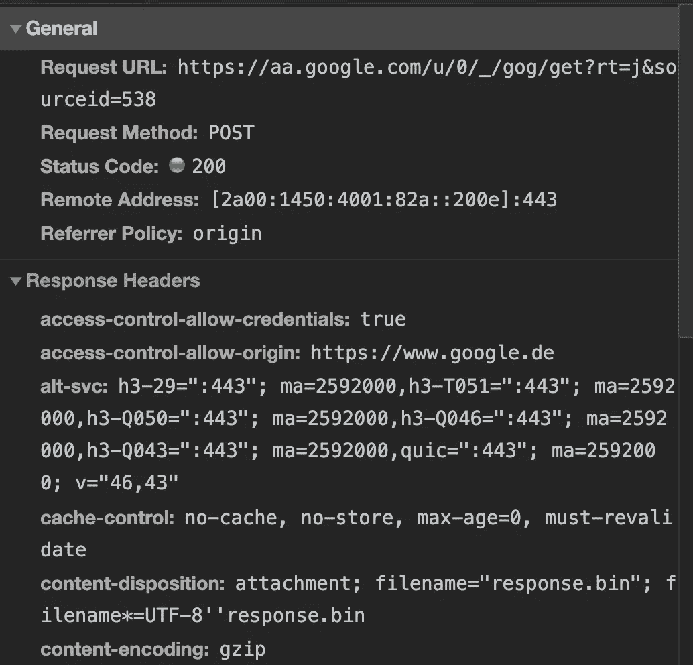
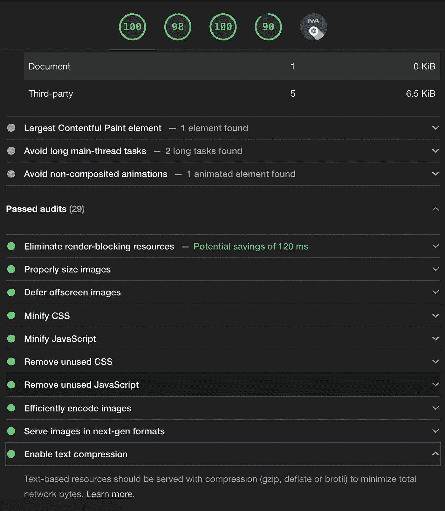

# JSON 反响太大了吗？你可能错过了压缩

> 原文：<https://betterprogramming.pub/is-the-json-response-too-big-youre-probably-missing-compression-4b45a542cfa8>

## 压缩大大降低了带宽，提高了 UX

[疾控中心](https://unsplash.com/@cdc?utm_source=medium&utm_medium=referral)在 [Unsplash](https://unsplash.com?utm_source=medium&utm_medium=referral) 上拍照。

我们有一个新的微服务，它有一个为报告用例而定制的特殊端点。因为我们不想一次加载成千上万的条目，所以我们为这个端点实现了分页。尽管如此，即使返回 10，000 个条目，JSON 的响应也只有 9MB 左右。这是一个很大的数据量，尤其是在较慢的连接上。

事实证明，我们不知何故忘记了在新的微服务中启用压缩。最流行的压缩算法是 [GZIP](https://developer.mozilla.org/en-US/docs/Web/HTTP/Headers/Content-Encoding#compressing_with_gzip) ，但也有像 [Brotli](https://caniuse.com/brotli) 这样更新的算法。尽管如此，这两种方法都能达到预期的效果，即大大减少客户机向服务器请求的数据量。

为了进行压缩，客户端和服务器都需要发送特定的 [HTTP 头](https://developer.mozilla.org/en-US/docs/Web/HTTP/Headers):

*   客户端(例如网页或移动应用)需要发送`[accept-encoding](https://developer.mozilla.org/en-US/docs/Web/HTTP/Headers/Accept-Encoding)`请求头。通常，这是自动处理的，但是您应该验证这一点。
*   服务器需要发送`[content-encoding](https://developer.mozilla.org/en-US/docs/Web/HTTP/Headers/Content-Encoding)`响应头。这是经常需要用代码来完成的事情。

这是我从谷歌上拿的一个例子。看看`content-encoding`响应头和`accept-encoding`请求头。在这种情况下，使用 GZIP。您可以验证压缩在浏览器开发工具中实现的差异。

请求标题

响应标题

像 Lighthouse 这样的工具(嵌入到 Google Chrome 的开发者工具中)会在脚本等资产没有提供必要的 HTTP 响应头时向您发出警告。

灯塔审计

# 如何在服务器端启用压缩的代码示例

我收集了几个示例，向您展示如何在服务器上启用压缩:

*   第一个例子是使用中间件在 Express.js 应用程序中实现压缩。
*   在第二个示例中，压缩是在 Dropwizard 应用程序的配置中指定的。
*   第三个例子展示了一个路由过滤器，它在 Spark 应用程序中向每个响应自动附加必要的头。

为了确保压缩不会被意外删除，您可以编写一个测试来检查 HTTP 响应是否包含适当的头。

# 结论

感谢您阅读这篇短文。最后，GZIP 压缩允许我们将响应大小减少到 1.3MB 左右。对于几乎不太容易实现的东西来说，这是一个很大的改进。

我的经验是:如果您请求的任何资源(脚本、样式、来自 API 的数据)超过 2MB，那么您要么缺乏压缩，要么在一次响应中发送了太多的数据。

你对压缩有什么体验？请在评论中告诉我。