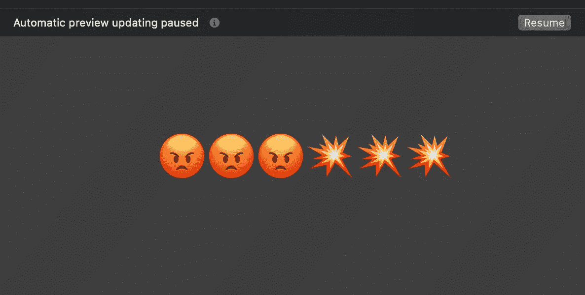
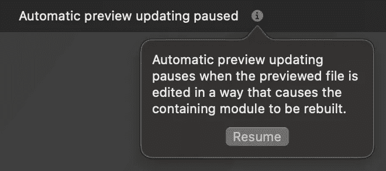
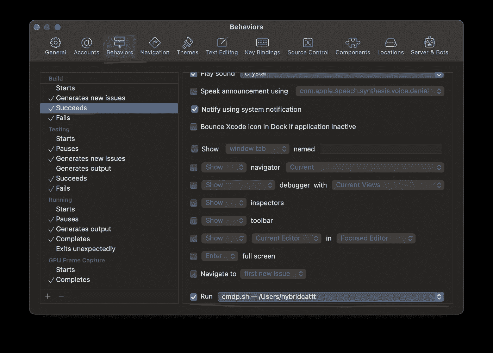

# 修复 SwiftUI 的自动预览更新暂停

> 原文：<https://betterprogramming.pub/is-the-swiftui-preview-automatically-getting-paused-heres-how-to-fix-it-bc1b064d75f0>

## 了解 SwiftUI 预览不断暂停的原因以及如何改善这种情况



如果你使用 SwiftUI 或者刚刚尝试过 SwiftUI 预览，那么你会看到这个恼人的消息:自动预览更新暂停。对于一些开发人员来说，这种事情经常发生，而且非常令人沮丧。

在本文中，我将解释为什么会发生这种情况，以及如何解决它。让我们开始吧！

# 为什么预览会暂停？

让我们跟随面包屑去了解发生了什么。

当我们得到消息时,( I)符号提供了更多的上下文:

`Automatic preview updating pauses when the preview file is edited in a way that causes the containing module to be rebuilt.`



有点道理。更改模块中的任何代码(例如您的应用程序模块)通常需要重新构建，以便将新的更改应用到产品中。但是为什么突然就成问题了呢？事情不就是这样吗？原来，不是，我们来看看如何现场剪辑作品。

# 了解实时重装

事实证明，当我们实时编辑预览时(当它正常工作时)，Xcode 不会在每次更改时都重建模块。

当预览被激活时，Xcode 为测试构建当前方案*。当您进行后续更改时，不会发生重建来反映画布上的更改。*

Swift 有一个支持 SwiftUI 预览实时更改的特殊功能，称为`dynamic function replacement`。它的属性是`@_dynamicReplacement(for:)`。这项功能没有经过正式的演进过程——它是在 SwiftUI 最初发布之前的 2018 年[推出的](https://forums.swift.org/t/dynamic-method-replacement/16619)和[实现的](https://github.com/apple/swift/pull/20333)。

```
struct MyStruct {
    dynamic func x() {
      print("x")
    }
}

extension SettingsRoute {
    @_dynamicReplacement(for: x())
    func y() {
        print("y - replaced dynamically")
    }
}
```

每当调用`x()`时，将使用`y()`的实现。这是斯威夫特对 swizzling 的回复。

因为“热重装”是使用动态替换实现的，所以它有局限性:

*   只有当我们改变一个函数的*实现*，计算变量，初始化器或者下标的时候才适用。
*   对于 SwiftUI 预览，动态应用于当前文件中的所有声明。

因此，当预览*可以实时更新*时，实际上更容易列出。

动态替换不支持任何其他更改。例如:

*   以任何方式更改功能签名(甚至只是从`internal`更改为`private`)
*   添加或删除函数或变量
*   更改非计算属性的初始值
*   在其他文件中进行编辑

由于这些变化不属于动态替换，预览必须暂停，直到下一个适当的重建。

> *如果你想了解更多 SwiftUI 预览的幕后工作，我喜欢 Damian Malarczyk 的 SwiftUI 预览* *背后的* [。](https://www.guardsquare.com/blog/behind-swiftui-previews)

对我来说，理解事情发生的原因已经有助于减轻挫败感。但是让我们看看如何修复它

# 修复它

那么我们能做些什么来改善这种情况呢？

首先，我们可以以一种允许更多动态替换的方式编写代码。

但是仍然会有很多预览不得不暂停的情况。想一想，我们最恼火的是什么？不得不恢复它们！所以让我们自动化吧。

# 改进代码以减少暂停

我见过的预览暂停的最常见原因是变量声明:

如果您有一个带初始值的变量声明，编辑它将暂停预览:

```
var color = Color.red // change to Color.green, previews are paused
```

这适用于当前文件中的任何变量—全局变量或实例变量。

要修复它，请更改要计算的变量。这样，它可以在编辑时被动态替换:

```
var color: Color { Color.red }
```

另一个可能的原因是构建阶段的构建脚本导致了项目的变更。它可能是内部版本号递增或代码生成。我自己没有遇到过，但是如果你有无法解释的停顿——这是一个值得研究的方向。

# 自动恢复预览

想象一下——您正在对代码进行更改，预览被暂停。您尝试恢复预览，但失败了。可能是由于构建错误，但错误并不总是正确地出现。也许您忘记了更改测试代码——那里的错误也会导致预览失败(因为预览是为测试而构建的)。

为了找到解决这个问题的最佳方法，我后退了一步。我们如何验证我们的代码更改正常？我们建造或运行。然后，我们要么得到更多的编译错误并继续修复它们，要么全部成功，我们很高兴。

我认为，预览应该在成功构建后自动恢复。到目前为止对我来说效果很好。

我找不到任何编程方式来恢复 Xcode 中的预览，但我们可以触发键盘快捷键。

这里有两个简单的步骤来设置它:

首先，将脚本放在系统中的某个地方，例如在`~/scripts`中:

```
touch ~/scripts/cmd_opt_p.sh
chmod +x ~/scripts/cmd_opt_p.sh
open ~/scripts/cmd_opt_p.sh *#edit with your favorite editor*
```

然后粘贴这个:

```
*#!/bin/sh*
osascript -e 'tell application "System Events" to keystroke "p" using {command down, option down}'
```

其次，配置 Xcode 在构建成功时触发该脚本:

在`Preferences -> Behaviours -> Build Succeeds -> Run`中，选择新创建的脚本:



瞧啊。脚本第一次触发时，它会要求允许 Xcode 使用辅助功能来控制电脑。

这里有几件事要记住:

*   如果在构建操作成功时 Xcode 不是活跃的应用程序，快捷方式将在当前聚焦的应用程序中触发。Cmd+Option+P 不是常用的快捷键，所以很有可能不会有什么作用。如果你想让它强制切换到 Xcode，把这个添加到脚本:`osascript -e 'activate application "Xcode"'`。
*   在正常构件成功并触发快捷方式后，会生成第二个构件，即用于预览的特殊构件。我认为这很好——因为第一次构建成功了，所以第二次构建会非常快。还是比手动按 Cmd+Option+P 快。
*   没有简单的方法从 Xcode 行为中区分运行构建和测试构建。如果测试构建失败，预览将无法恢复，即使构建运行成功并触发了自动化。当这种情况发生时，使用`Cmd+Shift+B`而不是`Cmd+B`来触发测试构建。一旦成功，自动化将再次被触发。

尽管这种方法并不完美，但它对我来说效果很好，无论是在 SwiftUI 还是 UIKit 项目中。

让我知道这是如何为你工作的，特别是如果你用这种方法遇到任何问题！

感谢阅读。

```
**Want to Connect?**I hope you enjoyed the post. To get notified about new posts, [follow me on Twitter](https://twitter.com/hybridcattt) or [subscribe to the feed](https://hybridcattt.com/feed.xml).This post is licensed under [CC BY NC SA 4.0](http://creativecommons.org/licenses/by-nc-sa/4.0/) by the author.Originally published at [https://hybridcattt.com](https://hybridcattt.com/blog/fixing-swiftui-previews/)
```