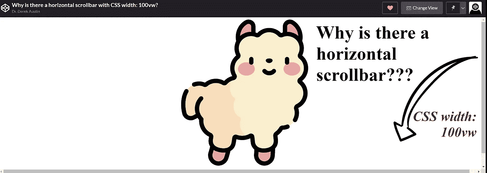
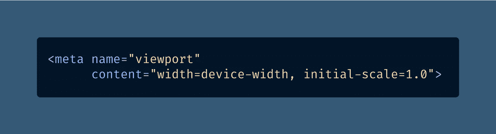
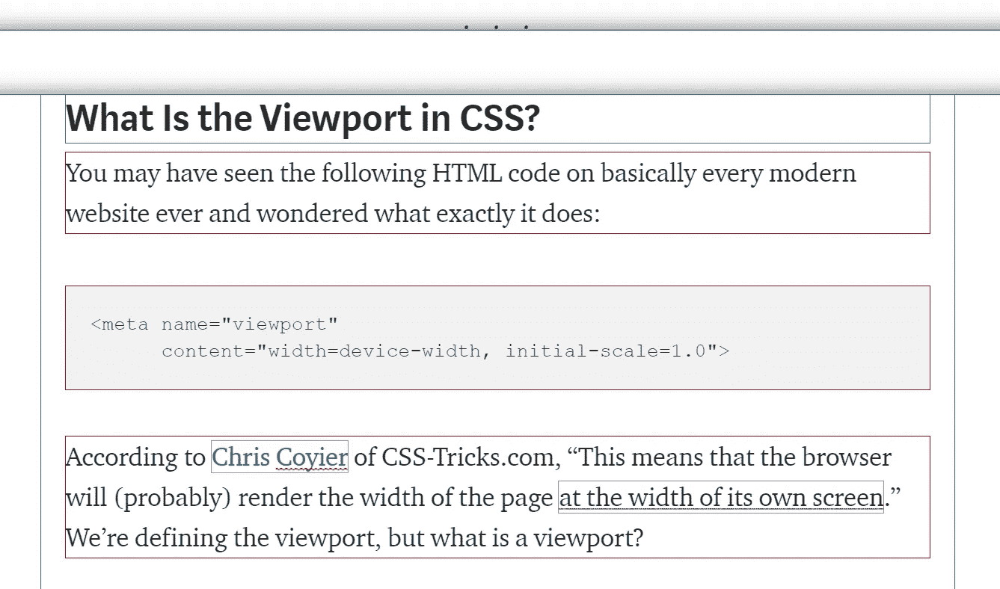
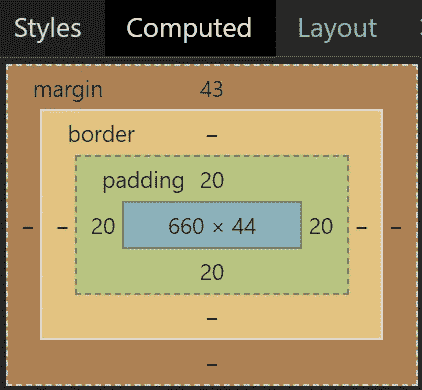
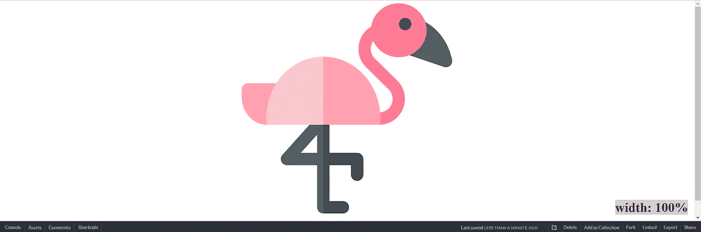
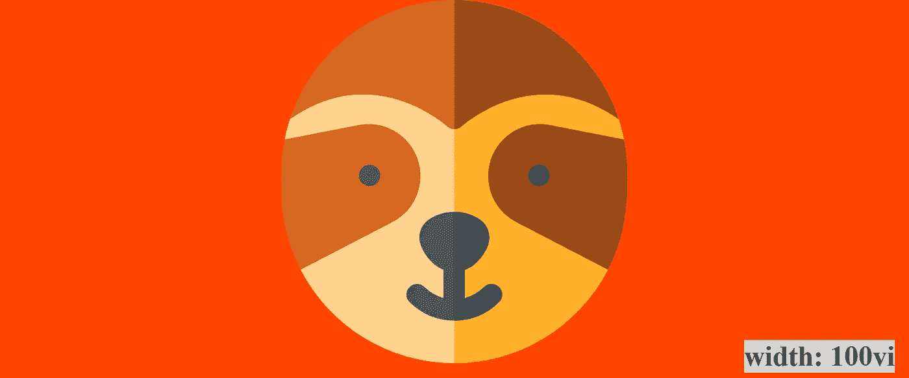
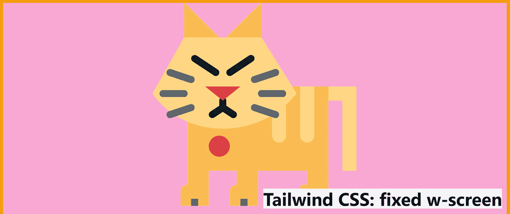
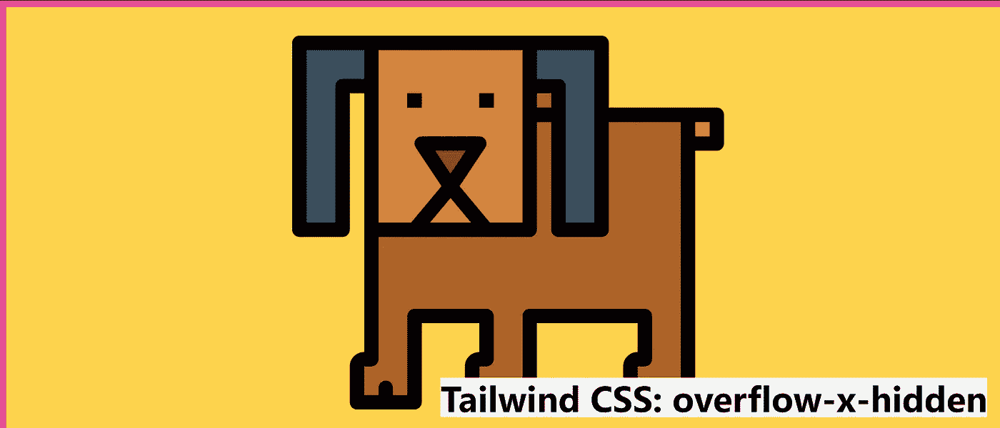

# 你的网站上有水平滚动条溢出吗？10 种预防方法

> 原文：<https://betterprogramming.pub/is-there-a-horizontal-scrollbar-on-your-website-10-ways-to-prevent-it-39b3a5e81cf>

## 开始使用 CSS `width: 100%`而不是`width: 100vw`，看看“视口单位”如何引起滚动条



[VW](https://medium.com/u/e5294c417caf#viewport-percentage_lengths)”单位宽，`100vw`的宽度是多少？

放在 CSS 里，`width: 100vw`应该是全屏的，相当于`width: 100%`吧？

不对。

CSS 的“[盒子大小模型](https://developer.mozilla.org/en-US/docs/Web/CSS/CSS_Box_Model/Introduction_to_the_CSS_box_model)”有一个奇怪的错误，实际上这根本不是一个错误，但这是一件需要注意的重要事情。

视口单位包括滚动条(如果存在的话)所占据的空间。这意味着它们不像基于百分比的单位那样正常工作，导致不稳定的显示问题。

换句话说，如果你想要一个全幅的 HTML 元素在网站上，CSS `width: 100vw` *应该*可以工作。但这并不是因为一些相当不幸的数学问题，我称之为“视口诡计”

水平滚动条“bug”(特性？)通常出现在当某人在构建[单页应用](https://en.wikipedia.org/wiki/Single-page_application)时习惯使用`100vw`的时候，就像在使用 [React](https://javascript.plainenglish.io/3-exciting-new-features-in-react-18-batching-transitions-and-suspense-d14a98e530bd) 、 [Next.js](https://javascript.plainenglish.io/the-10-next-11-0-0-features-you-need-to-know-about-from-next-js-conf-ac31d795accd) 或者你喜欢的框架时一样。

我们先来谈谈为什么 100vw 不工作，然后我会向你展示十个解决方案，来修复那些在你试图构建一个[简单](/why-you-should-make-your-code-as-simple-as-possible-3b35e89f137)、全屏网站时无缘无故出现的水平滚动条。

# 目录

```
[1) Add Width: 100% to All Parent Containers](#5a93)[2) Use Position: Fixed To Anchor the Content](#2383)[3) Hide the Scrollbars Using Overflow-X: Hidden](#43e5)[4) Use Width: 100vi Instead of Width: 100vw](#a0de)[5) No Vertical Scrollbars, No Problem (Height: 100vw)](#f94c)[6) Set a Maximum Width With Max-Width: 100%](#3cb5)[7) Use a Fixed Width With Max-Width: 100%](#1585)[8) Tailwind CSS: Use W-Full Instead of W-Screen](#f13a)[9) Tailwind CSS: Use Fixed To Anchor the Content](#bcb7)[10) Tailwind CSS: Hide Scrollbars Overflow-X-Hidden](#1559)
```

# CSS 中的视口是什么？

您可能在几乎所有现代网站上都见过下面的 HTML 代码，并想知道它到底是做什么的:



[查看原始代码](https://gist.github.com/DoctorDerek/5e569afbfa3ecd3effe744f3fd78648c)作为 GitHub 要点

根据 CSS-Tricks.com 的克里斯·科伊尔的说法，“这意味着浏览器将(很可能)以自己屏幕的宽度呈现页面的宽度。”我们正在定义视窗，但是[什么是视窗？](https://developer.mozilla.org/en-US/docs/Web/CSS/Viewport_concepts)

> 视窗百分比长度定义了相对于[视窗](https://developer.mozilla.org/en-US/docs/Glossary/Viewport)大小的`<length>`值，即文档的可见部分。在`[@page](https://developer.mozilla.org/en-US/docs/Web/CSS/@page)`声明块中，视窗长度无效。
> 
> `vh`等于包含块的视口初始[高度的 1%。](https://developer.mozilla.org/en-US/docs/Web/CSS/Containing_block)
> 
> `vw`等于包含块的视口初始[宽度的 1%。
> —](https://developer.mozilla.org/en-US/docs/Web/CSS/Containing_block) [MDN 文档](https://developer.mozilla.org/en-US/docs/Web/CSS/length)

对于我们的讨论，知道视窗是网站上文档的可见部分就足够了。这是一个我们通常与移动设备联系在一起的概念，但是所有的浏览器都有一个视窗。

使用`100vh`和`100vw`来指定一个“全屏”文档应该很简单，这是单页应用程序的常用方法。

在普通网站上，我们习惯于垂直滚动，但水平滚动并不是一种常见的用户体验。这意味着`100vw`应该是视窗的整个宽度，事实也的确如此，但是我们需要了解视窗实际上有多宽。

# 了解 CSS 盒子大小模型

CSS 的一个基本方面是它的“盒子大小模型”，但这也是 CSS 中最令人困惑的事情之一。

> 默认情况下，在 [CSS 框模型](https://developer.mozilla.org/en-US/docs/Web/CSS/CSS_Box_Model/Introduction_to_the_CSS_box_model)中，分配给元素的`width`和`height`仅应用于元素的内容框。如果该元素有任何边框或填充，则将其添加到`width`和`height`中，以获得屏幕上呈现的框的大小。— [MDN 文档](https://developer.mozilla.org/en-US/docs/Web/CSS/box-sizing)

这类事情最好用视觉来演示，你可以在浏览器的 DevTools 中轻松完成。这是 Chrome 打开[调试 CSS](https://chrome.google.com/webstore/detail/debug-css/igiofjnckcagmjgdoaakafngegecjnkj?hl=en-US) 的一个镜头，它会自动绘制 CSS 框模型:



如果您曾经打开 CSS border 属性只是为了查看浏览器是如何布局您的内容的，那么您应该对 box 模型很熟悉。调试 CSS 工具只是让所有的框同时可见。

我们可以在 Chrome DevTools 中通过找到“ [Computed](https://developers.google.com/web/tools/chrome-devtools/css/reference#computed) ”部分获得 CSS 盒子模型计算的详细信息:



德里克·奥斯丁·🥳博士截图[内容区域](https://medium.com/u/e5294c417caf#content-area)的宽度，但如果`[box-sizing](https://developer.mozilla.org/en-US/docs/Web/CSS/box-sizing)`设置为`border-box`，则设置[边框区域](https://developer.mozilla.org/en-US/docs/Web/CSS/CSS_Box_Model/Introduction_to_the_CSS_box_model#border-area)的宽度。— [MDN 文档](https://developer.mozilla.org/en-US/docs/Web/CSS/width)

所有元素的[默认](https://www.w3schools.com/cssref/pr_dim_width.asp) `[width](https://www.w3schools.com/cssref/pr_dim_width.asp)`为`[auto](https://stackoverflow.com/questions/17468733/difference-between-width-auto-and-width-100-percent/22666723)`，这意味着浏览器会自动计算并选择指定元素的宽度。这意味着这里有点蹊跷。

问题是我们使用的`width: 100%`值是基于[父容器](https://developer.mozilla.org/en-US/docs/Web/HTML/Element/div)的大小。这意味着如果你试图制作一个全宽元素，但是它的父元素有一个较小的尺寸，你将不会最终使用视窗的 100%的`width`。

要解决这个问题，您必须调查每个父容器的宽度，以确保所有内容的宽度都是 100%，而不是更小。

不过，总的来说，用`100vw`替换`100%`是一个很好的解决方案。然而，这并不是唯一的解决方案，所以让我们继续吧。



[纵轴](https://medium.com/u/e5294c417caf#inline-dimension)方向。

`vb`等于包含块的初始[尺寸的 1%，在根元素的](https://developer.mozilla.org/en-US/docs/Web/CSS/Containing_block)[块轴](https://developer.mozilla.org/en-US/docs/Web/CSS/CSS_Logical_Properties#block-dimension)方向。”— [MDN 文档](https://developer.mozilla.org/en-US/docs/Web/CSS/length)

这到底是什么意思？天啊，CSS 已经够混乱的了，对吧？我理解你。这些新奇的长度取决于一种语言是横写还是竖写。

> "**块尺寸:**垂直于一行内文本流向的尺寸，即水平书写模式下的垂直尺寸，垂直书写模式下的水平尺寸。对于标准英语文本，它是垂直维度。
> 
> **行内尺寸:**平行于一行内文本流向的尺寸，即水平书写模式下的水平尺寸，垂直书写模式下的垂直尺寸。对于标准英语文本，它是水平维度。”— [MDN 文档](https://developer.mozilla.org/en-US/docs/Web/CSS/CSS_Logical_Properties#block-dimension)

你指出基本上所有现代语言都允许水平脚本是对的。然而，有些语言可以垂直书写，包括中文、日文和韩文。

如果我们在水平书写的页面上用`vw`替换它的对等物`vi`(比如英语)，我们将移除水平滚动条。内容将是全角的，没有任何溢出。

这有点像诱饵，因为`vi`是基于它的父容器，而不是视口。换句话说，`width: 100vi`和`width: 100%`是一样的，不是`width: 100vw`。



。[参考消息](https://www.urbandictionary.com/define.php?term=FYI)。

# 9) Tailwind CSS:使用 Fixed 来锚定内容

正如我们之前非常详细地回顾的，CSS 的盒子模型意味着添加`position: fixed`将让您使用`100vw`而不会溢出。

在顺风术语中，这意味着我们将`[fixed](https://tailwindcss.com/docs/position)`(用于`[position](https://developer.mozilla.org/en-US/docs/Web/CSS/position)`)与`[w-screen](https://tailwindcss.com/docs/width)`结合起来用于`100vw`宽度。



由[德里克·奥斯丁·🥳](https://medium.com/u/e5294c417caf?source=post_page-----39b3a5e81cf--------------------------------)博士创作的[代码笔](https://codepen.io/doctorderek/pen/YzQzYmp)的截图(SVG 图标由 [smalllikeart](https://www.flaticon.com/authors/smalllikeart) 通过[FlatIcon.com](https://www.flaticon.com/))

像这样使用`fixed`可以派上用场，因为`100vw`的一个常见用途是在页面的顶部或底部制作一个 [cookie 横幅](https://medium.com/@dooley.dooley/got-a-cookie-banner-on-your-website-its-probably-illegal-10089c00c7bb)。

当我们谈论顺风时，我从两个 [VS 代码扩展](https://medium.com/m/global-identity?redirectUrl=https%3A%2F%2Fbetterprogramming.pub%2Fhow-to-set-up-vs-code-like-a-pro-in-just-5-minutes-65aaa5788c0d)中获得了大量的使用:逆风[:](https://marketplace.visualstudio.com/items?itemName=heybourn.headwind)([用于排序](https://javascript.plainenglish.io/how-to-sort-imports-in-typescript-automatically-in-vs-code-f4fe4e499bb1?source=topic_page---------0------------------21----------))和[顺风 CSS 智能感知](https://marketplace.visualstudio.com/items?itemName=bradlc.vscode-tailwindcss)。

# 隐藏滚动条溢出-x-隐藏

当你在制作一个*真实*的单页应用，有[反应](https://javascript.plainenglish.io/the-biggest-change-in-react-17-that-no-one-is-talking-about-b62905beb2d2)和大量[尖叫 _ 蛇 _ 案件](https://medium.com/derek-develops/screaming-snake-case-in-react-web-development-2fbd46cabd42)的时候，你总是可以隐藏滚动条。

我们将使用顺风 CSS 中的`[overflow-x-hidden](https://tailwindcss.com/docs/overflow)`工具隐藏水平滚动条。



由[德里克·奥斯丁·🥳](https://medium.com/u/e5294c417caf?source=post_page-----39b3a5e81cf--------------------------------)博士创作的[代码笔](https://codepen.io/doctorderek/pen/WNONMQg)的截图(SVG 图标由 [smalllikeart](https://www.flaticon.com/authors/smalllikeart) 通过[FlatIcon.com](https://www.flaticon.com/))

当然，你可能会遇到可访问性和视觉一致性的问题——注意上面的边框是如何从屏幕上消失的。

如果你隐藏了溢出，你真的需要确保你的单页应用程序不可访问。

如果你坚持将`100vw`和`100vh`配对，我建议你测试不同的缩放级别和字体大小。安全总比后悔好。

# 结论:在你的网站和应用中使用 100%的宽度

我应该注意到，当你在 CodePen 上做实验时，有些结果可能会很奇怪。有时通过`[<iframe>](https://developer.mozilla.org/en-US/docs/Web/HTML/Element/iframe)`应用的 CSS 看起来不太像我期望的那样。

但是真的，那是给你的 CSS，不是吗？

总的来说，这篇文章应该提醒你应该在移动设备上测试你的 web 开发，并且使用不同的缩放级别。

我也喜欢在我的桌面上用“大”字体运行我的浏览器，以捕捉可能导致的数百万视觉不一致。

希望，如果你正在寻找修复那些讨厌的水平滚动条的最好方法，你找到了你正在寻找的。

编码快乐！

# 进一步阅读

[](https://developer.mozilla.org/en-US/docs/Web/CSS/Viewport_concepts) [## 视区概念- CSS:级联样式表| MDN

### 本文解释了视口的概念——它是什么，它对 CSS、SVG 和移动设备的影响…

developer.mozilla.org](https://developer.mozilla.org/en-US/docs/Web/CSS/Viewport_concepts) 

德里克·奥斯汀博士是《职业规划:如何在 6 个月内成为成功的 6 位数程序员 一书的作者，该书现已在亚马逊上架。