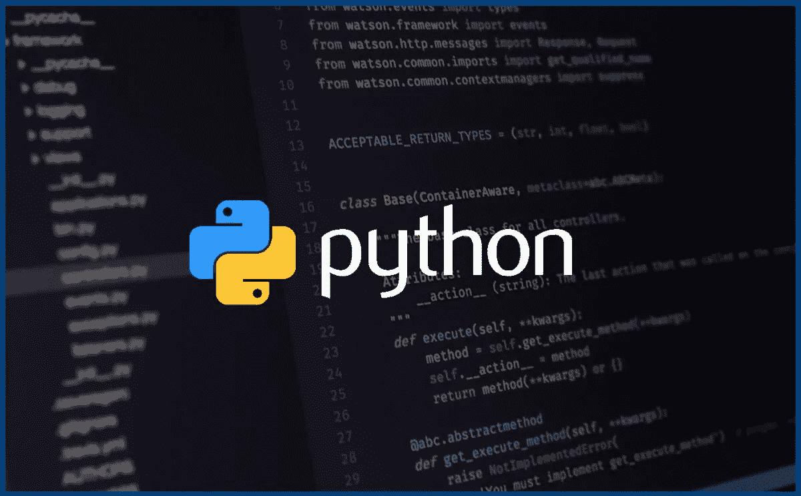

# 这是我的 Python for 循环的最后一个元素吗？

> 原文：<https://betterprogramming.pub/is-this-the-last-element-of-my-python-for-loop-784f5ff90bb5>

## 我们如何容易地找到我们是否在循环中的最后一个元素



摘自[https://www.liberiangeek.net/2019/04/check-python-version/](https://www.liberiangeek.net/2019/04/check-python-version/)

# **问题**

有时，我想对 Python `for`循环中的 *last* 元素做一些特殊的处理，这与我对其他元素所做的不同。在伪代码中，这个问题看起来像这样:

```
**for** var **in** my_iterable:
    **if** is_last_element:
        special_function(var)
    **else**:
        not_so_special_function(var)
```

但是我怎么知道我是否在循环的最后一个元素呢？

# 不太好的解决方案

有人可能会想，当然不是你:“啊，只要枚举你的 iterable，检查枚举加 1 是否等于你的 iterable 的长度！”

由于描述代码可能不是我的强项，我宁愿向您展示我在代码中的意思:

```
**for** i, var **in** enumerate(my_iterable):
    **if** i + 1 == len(my_iterable):
        special_function(var)
    **else**:
        not_so_special_function(var)
```

这当然有时有效，但首先，对我来说，它读起来并不像它应该的那样好，其次，它并不总是有效！

为什么？我说的是迭代 *iterables* ，并不是每一个 iterable 都提供了一种廉价获取元素数量的方法。举个小例子，看看这个斐波那契数生成器:

```
**from** typing **import** Iterable

**def** fib(n_fibs: int = 10) -> Iterable[int]:
    f1, f2 = 0, 1
    yield 1
    **for** _ **in** range(n_fibs - 1):
        crnt = f1 + f2
        **yield** crnt
        f1, f2 = f2, crnt
```

试着调用`len(fib(10))` *，*哪个会失败*。*虽然这个例子有一半是愚蠢的，但是由于我们知道我们将产生的元素的数量(应该是 10)，所以它说明了问题。

现在，我们可以调用`len(**list**(fib(10))`，这将返回一个清晰的 10，但是如果我们的生成器生成了无法存储在内存中的非常大的东西，或者如果每次迭代在计算时间方面代价很高，这就变得不切实际了。

# 真正的解决方案

我在这里向您展示的解决方案，也可以在[堆栈溢出](https://stackoverflow.com/questions/1630320/what-is-the-pythonic-way-to-detect-the-last-element-in-a-for-loop)中找到，利用了 Python 的迭代器协议和函数`iter` 和`next` *。*

你可以像 *enumerate，*一样使用我的函数，但是它不是告诉你当前的索引，而是告诉你是否在最后一个元素。所以，这就是:

```
**from** typing **import** Iterable, Any, Tuple**def** signal_last(it:Iterable[Any]) -> Iterable[Tuple[bool, Any]]:
    iterable = iter(it)
    ret_var = next(iterable)
    **for** val **in** iterable:
        **yield** False, ret_var
        ret_var = val
    **yield** True, ret_var
```

作为一个例子，将所有这些放在一起，代码看起来几乎像上面发布的伪代码:

```
**for** is_last_element, var **in** signal_last(fib(10)):
    **if** is_last_element:
        special_function(var)
    **else**:
        not_so_special_function(var)
```

读起来不错，不是吗？请注意，您可以很容易地使用几乎相同的函数来确定您是否正在查看 iterable 的第一个元素。因为我不喜欢有人告诉我一些事情却不给我看，所以代码如下:

```
**from** typing **import** Iterable, Any, Tuple
**def** signal_first(it:Iterable[Any]) -> Iterable[Tuple[bool, Any]]:
    iterable = iter(it)
    **yield** True, next(iterable)
    **for** val **in** iterable:
        **yield** False, val
```

现在，只要拿起这些函数，把它们放入你的小助手功能工具箱中，就可以享受了。我祝你愉快地找到你的可重复元素中的最后一个(或第一个)元素。