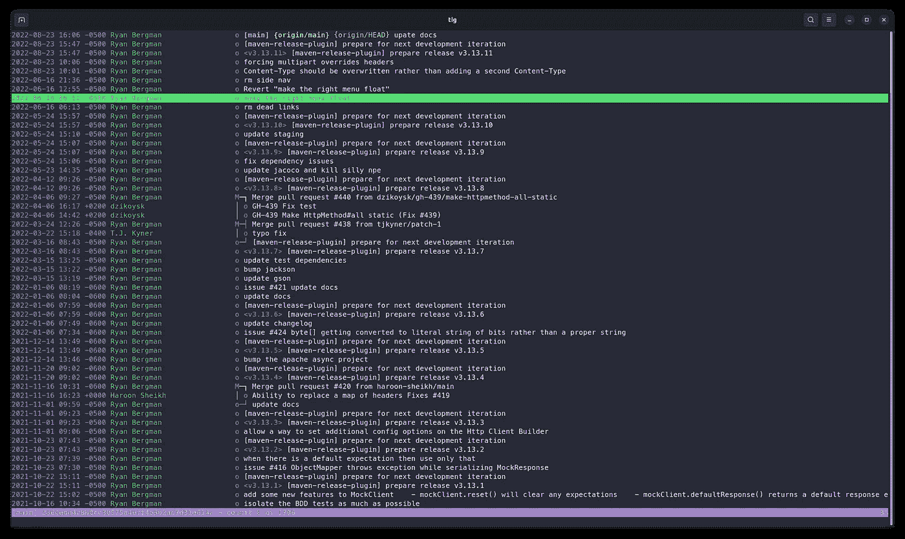
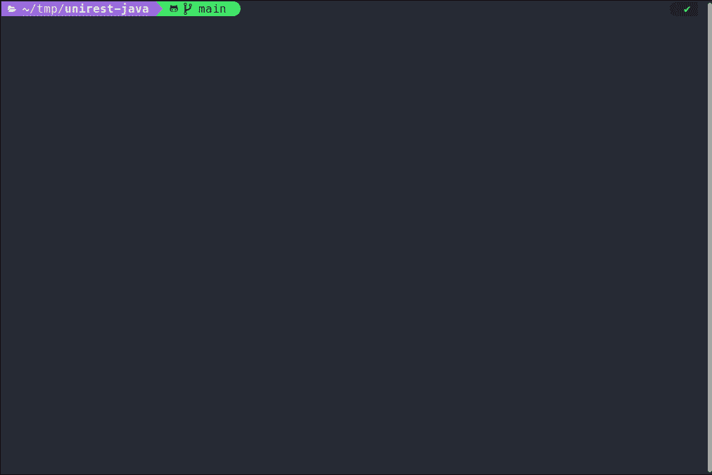
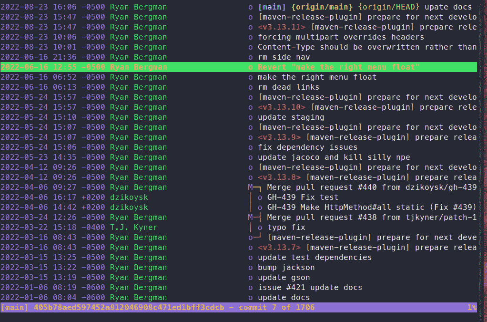
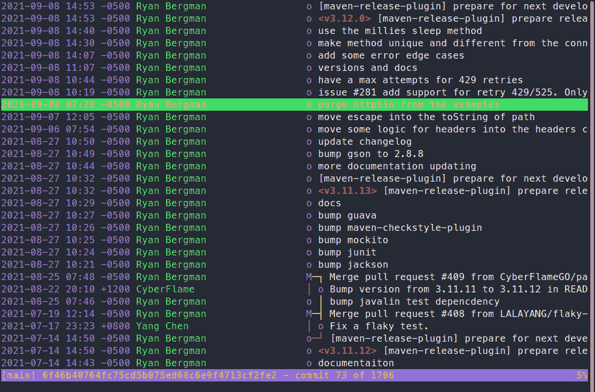
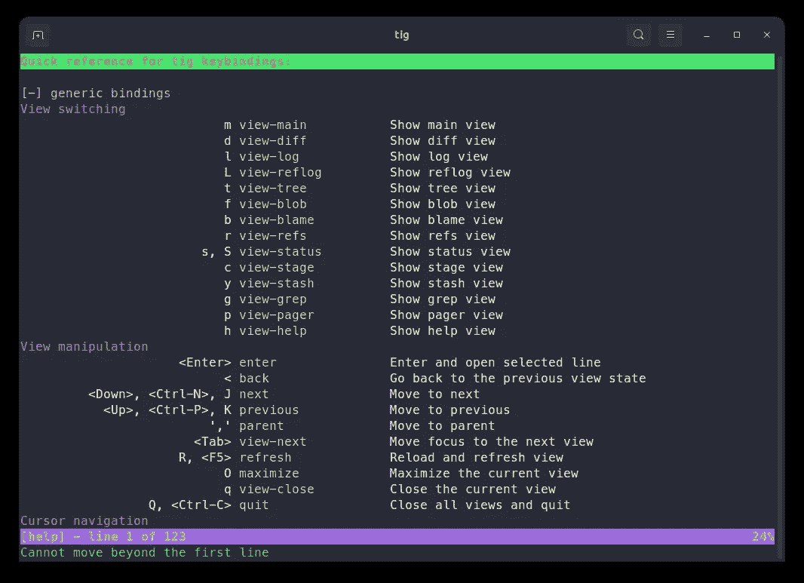

# Tig 比 GitKraken 强吗？在终端上浏览存储库

> 原文：<https://betterprogramming.pub/is-tig-better-than-gitkraken-browse-repositories-on-the-terminal-32a486b51c31>

## 利用命令行的强大功能浏览您的存储库



瑞安·伯格曼拍摄的图片

像 [SourceTree](https://www.sourcetreeapp.com/) 和 [GitKraken](https://www.gitkraken.com/) 这样的工具在很多开发者中很受欢迎。它们将提交树可视化，并使查找提交之间的差异变得容易。这使得浏览存储库很舒服。

你不能在终端使用这些工具。一旦你连接到远程服务器，你就失去了所有的优势。此外，SourceTree 和其他桌面客户端针对鼠标进行了优化，我们使用键盘的速度也更快了。

我们可以用命令行存储库浏览器`tig`来解决这个问题。

# 装置

您可以在所有常见的 Linux 发行版上用包管理器直接安装 tig。我在 Ubuntu 上用 apt 装的。

```
sudo apt install tig
```

Mac 用户可以使用[自制软件](https://brew.sh/):

```
brew install tig
```

Windows 用户应该使用 [Git for Windows](https://gitforwindows.org/) 。它带有已经安装的 tig。

如果您想使用最新版本，可以直接从源代码安装。详细说明可在 [tig 的网站](https://jonas.github.io/tig/INSTALL.html)上获得。

# 如何使用 Tig

安装 tig 后，转到包含 git 存储库的目录，从命令行运行`tig`:



底部窗格显示提交详细信息的主视图。

它显示了所有类似于`git log --oneline`的提交列表。使用箭头键浏览列表。如果您按下`Enter`，tig 会向您显示该提交的详细信息。您可以按`q`返回列表。按下列表中的`q`将关闭 tig。

Tig 有多个视图。提交列表被称为主视图。您可以随时按下`m`返回主视图。关于提交的信息(如上面底部窗格所示)显示在 diff 视图中。您可以通过按`d`打开所选提交的全屏比较视图。



按 m 或 d 在主视图和差异视图之间切换。

总而言之，tig 的控制类似于 vim 或更少。输入斜线将在当前视图中开始搜索:



在主视图和差异视图中搜索。

如您所见，tig 提供了许多查看和搜索存储库的方法。但这只是 tig 能力的一小部分。按`h`可以查看所有功能和热键。



tig 按键

# tig 的配置

Tig 提供了很多配置选项。在您的主目录下创建一个名为`.tigrc`的文件。添加设置的语法是:

```
set   *variable* = *value*
```

例如，使用以下配置，tig 将在每次差异前后显示 25 条线:

```
set diff-context = 25
```

在我看来，tig 具有合理的默认设置。然而，如果你不喜欢某样东西，你可以用设置来改变它，因为有很多设置。

你也可以在 tig 的网站上找到所有的配置选项。

# 概述

Tig 是一个优秀的命令行存储库浏览器。我认为 tig 比 SourceTree 和 GitKraken 更好，因为你可以用键盘轻松快速地控制它。如果您已经熟悉 vim 或更少，您会很快有宾至如归的感觉。

**给 tig 试试！**

文章中提到的有用链接:

*   [源代码树](https://www.sourcetreeapp.com/)
*   [GitKraken](https://www.gitkraken.com/)
*   [tig](https://jonas.github.io/tig/)
*   [家酿](https://brew.sh/)—MAC OS 的包管理器
*   [Windows 版 Git](https://gitforwindows.org/)