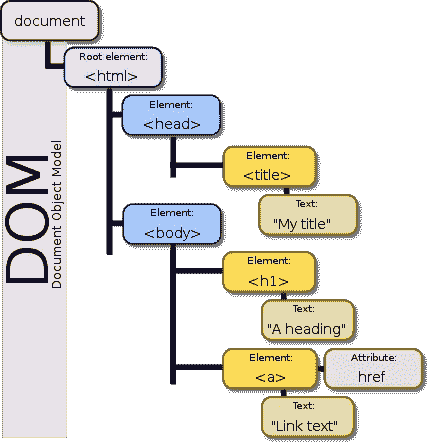

# 虚拟 DOM 是来源于文档片段吗？

> 原文：<https://betterprogramming.pub/is-virtual-dom-derived-from-document-fragments-74f8841f9e6d>

## DOM、文档片段、虚拟 DOM、反应片段、增量 DOM 和影子 DOM 的采访指南

在 [Unsplash](https://unsplash.com?utm_source=medium&utm_medium=referral) 上由 [Manuel Sardo](https://unsplash.com/@manuelsardo?utm_source=medium&utm_medium=referral) 拍摄的照片

虚拟 DOM 是 React 的核心概念。它是保存在内存中并与实际 DOM 同步的 UI 的表示。 [React DOM](https://github.com/facebook/react/tree/master/packages/react-dom) 通过本地协调差异来维护虚拟 DOM。根据 React 拉取时间表，更改被插入到实际的 DOM 中。

`[DocumentFragment](https://developer.mozilla.org/en-US/docs/Web/API/DocumentFragment)`是一个定义最小文档对象的接口，没有父对象。它被用作`Document`的轻量级版本，存储 DOM 对象。文档片段对实际的 DOM 没有影响。但是他们的孩子可以根据需要添加到实际的 DOM 中。

虚拟 DOM 和文档片段使用相同的概念来提高 UI 性能。虚拟 DOM 是从文档片段中派生出来的吗？

让我们深入了解一下这些 JavaScript、React 和 Angular 概念。

# 什么是 DOM？

[文档对象模型(DOM)](https://developer.mozilla.org/en-US/docs/Web/API/Document_Object_Model/Introduction) 是对象的数据表示，包括 web 上文档的结构和内容。DOM 是 HTML 和 XML 文档的接口。它表示页面，以便程序可以更改文档结构、样式和内容。DOM 将文档表示为节点和对象。通过这种方式，JavaScript 等编程语言可以连接到页面。

这是一个 DOM 树的例子:

图片来源:维基百科

你想在加载 100 万个节点的压力下评估性能吗？试试下面的`index.html`:

每次运行的持续时间不同，但大约是 2.5 秒。

DOM 操作是一项开销很大的操作。添加/移除元素会导致内容的中间重绘和重排。

# 为什么要使用文档片段？

`document.createDocumentFragment()`创建一个新的空的`DocumentFragment`, DOM 节点可以被添加到其中以构建一个离屏 DOM 树。在构建了屏幕外 DOM 树之后，可以根据需要将`DocumentFragment`的子节点更新到 DOM 中。

因为文档片段在内存中，不是实际 DOM 的一部分，所以向它追加子元素不会导致页面回流(元素位置和几何形状的计算)。很可能，用较少的文档片段更新来批处理更改，最终会获得更好的性能。

下面是如何使用文档片段的示例:

每次运行的持续时间不同，但大约为 1.5 秒。

在将子元素附加到实际的 DOM 之后(第 25 行)，文档片段变成了空的。如果想要重用更新的内容，在将文档片段附加到 DOM 之前克隆它。

有趣的是，空文档片段可以被重用来构建未来的更新。

# 虚拟 DOM 是如何工作的？

虚拟 DOM 是从文档片段中派生出来的吗？

不，虚拟 DOM 不使用任何文档片段。

是的，虚拟 DOM 来源于使用虚拟 DOM 来提高性能的概念。然而，虚拟 DOM 是为大规模更新而设计的。它还可以应用于不存在 DOM 的环境，比如 Node.js，React 是第一个使用虚拟 DOM 的主流框架。此外，虚拟 DOM 已经被 Vue、Ember、Preact 和 Mithril 采用。

从版本 16 开始，React 一直使用[光纤架构](https://github.com/acdlite/react-fiber-architecture)。

> “在 UI 中，没有必要立即应用每个更新；事实上，这样做可能会造成浪费，导致丢帧，降低用户体验。
> 
> 不同类型的更新具有不同的优先级，例如，动画更新需要比来自数据存储的更新更快地完成。
> 
> 基于推送的方法需要应用程序(你，程序员)来决定如何安排工作。基于拉的方法允许框架(React)变得聪明并为您做出那些决定。“— [在 GitHub 上反应光纤架构](https://github.com/acdlite/react-fiber-architecture)

React 被设计成具有独立的协调和渲染阶段。

*   **协调:【React 使用算法来区分不同的树，以确定哪些部分需要更改。不同的组件类型被假定为产生实质上不同的树。React 不会尝试改变它们，而是完全替换旧树。列表的区分是使用键来执行的。密钥应该是稳定的、可预测的和唯一的。**
*   **呈现:**该过程使用 diff 信息来实际更新呈现的应用程序。它可以将渲染工作分割成块，并分散到多个帧上。它使用一个虚拟堆栈框架来暂停工作并在以后返回，为不同类型的工作分配优先级，重用以前完成的工作，并在不再需要时中止工作。

这种分离允许 React DOM 和 React Native 使用它们自己的渲染器，同时共享同一个协调器。

这里有一个例子来展示虚拟 DOM 的优势。这是从[创建反应应用](https://medium.com/better-programming/10-fun-facts-about-create-react-app-eb7124aa3785)修改而来的`public/index.html`:

第 30 行和第 31 行是两个并排的`span`元素。

下面是一个修改过的`src/app.js`文件，它在 React 中呈现了一个`select`元素。从 React 17 开始，React 组件不再需要导入 React 来使用 JSX。

以下是修改过的`src/index.js`:

第 8-13 行使用实际的 DOM 呈现了一个`select`元素。

第 15-20 行使用虚拟 DOM 呈现一个`select`元素。

它显示了两个并排的`select`元素，其中`Apple`被选中。

当第 23 行触发更新时，每秒钟会重新创建两个`select`元素。

尝试为两个元素选择`Pear`。

左边的`select`直接渲染到 DOM。娱乐使人无法选择`Pear`。

右边的`select`先渲染到虚拟 DOM。频繁的重建发生在虚拟 DOM 上，而不是实际的 DOM 上。因此，`select`元件工作正常。

# 关于反应片段

为了让情况变得更有趣，React 创建了一种语法来对一系列子元素进行分组，而无需向 DOM 添加额外的节点。这个语法叫做`React.Fragment`。下面是一个`React.Fragment`的例子。

`React.Fragment`可以简化为空标签:

用显式`<React.Fragment>`语法声明的片段可能有键。这是官方文件提供的一个例子:

除了命名，片段与文档片段无关。

# 什么是增量 DOM？

增量 DOM 是一个用于构建 DOM 树并在数据改变时更新它们的库。它与虚拟 DOM 方法的不同之处在于没有创建中间树(现有的树在适当的位置发生了变异)。这种方法大大减少了对 DOM 树进行增量更新时的内存分配和 GC 抖动，因此在某些情况下显著提高了性能。

增量 DOM 删除 DOM 的附加副本。这导致了内存使用的减少，但也导致了寻找差异时速度的降低。减少内存使用对于移动或其他内存受限的设备至关重要。

增量 DOM 主要是作为 Angular 等模板语言的编译目标。从版本 9 开始，Angular 采用了 Angular Ivy，这是一个使用增量 DOM 的编译器和运行时。

这是来自[官网](http://google.github.io/incremental-dom/)的一个例子:

上述代码对应于:

使用上面的`renderPart`函数，`patch`函数可用于将所需的结构渲染到现有的`Element`或`Document`中。

# 影子 DOM 是什么？

影子 DOM 是一种确保代码、样式和结构封装在一个单独的、隐藏的 DOM 树中的技术。影子 DOM 可以附加到 DOM 中的一个元素上。Shadow DOM 是 Web Components 的一部分，Web Components 是一套用于创建可重用定制元素的不同技术。

下面是影子 DOM 的一个例子:

第 8-18 行定义了 Shadow DOM 中的一个元素类。这个类被定义为一个新的标签，`new-number-list-element`，注册到`window.customElements`(第 20 行)。新创建的定制元素在第 25 行使用。

在 Angular Ivy 之前，老的编译器和运行时是 View Engine，用的是 Shadow DOM。

# 结论

我们已经回答了“虚拟 DOM 是从文档片段中派生出来的吗？”

对于长的答案，我们已经走过了 DOM、文档片段、虚拟 DOM、React 片段、增量 DOM 和影子 DOM。这些知识对于面试和日常编码都很有用。

感谢阅读。我希望这有所帮助。你可以在这里看到我的其他媒体出版物。