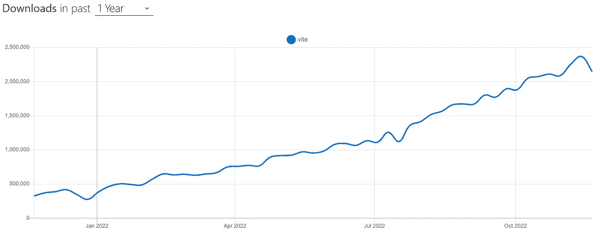
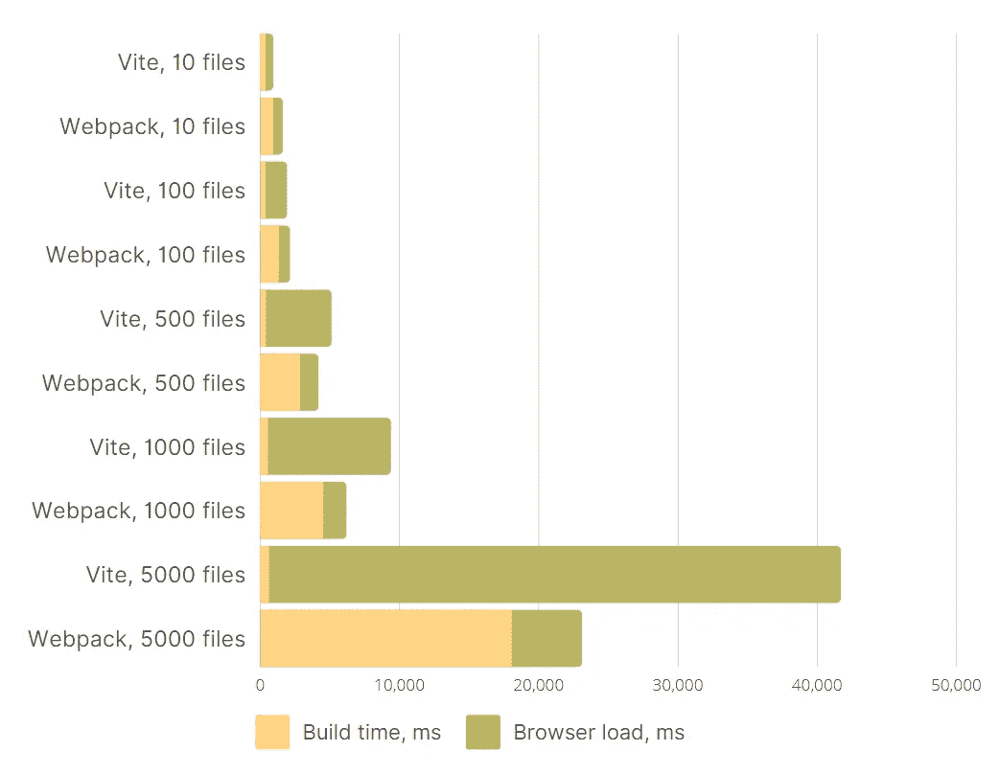
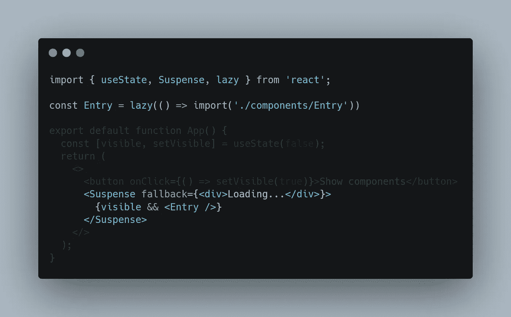
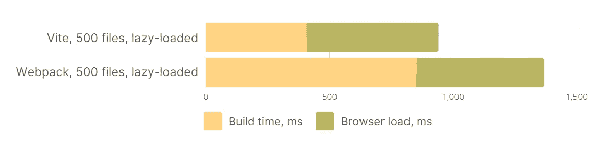

# Vite 真的比 Webpack 快吗？

> 原文：<https://betterprogramming.pub/is-vite-really-faster-than-webpack-b414f6cc751c>

## 对于较大的代码库来说，这就不那么简单了

[https://npmtrends.com/vite](https://npmtrends.com/vite)

[维特](https://vitejs.dev/)在前端社区制造了一些噪音。npm 上的下载量去年翻了两番，而且越来越受欢迎。

你在他们的网站上读到的关于 Vite 的第一件事是，他们的名字在法语中的意思是“快”。Vite 承诺显著提高性能，那么 Vite 是如何实现的呢？

Webpack 和其他传统的捆绑器使用古老的方法操作，读取所有的源代码并将其编译成几个 JS 文件。

所有主流浏览器都支持 ESM 已经有好几年了，所以 Vite 采取了不同的方法。它将您的源代码原样输入到您的浏览器中，并让它自己处理模块的导入。这大大加快了构建过程，因为开发工作不再需要捆绑。

但和往常一样，这里有一个陷阱。

浏览器需要时间来解析本机模块。打开一个包比打开数百个依赖项要快得多。那么表演到底有多大的不同呢？我用不同数量的文件制作了一些模拟项目来说明性能上的差异。

# 标杆管理

我制作了一个脚本，用 Vite 和 Webpack 自动生成一个现成的项目，还创建了预设数量的模拟组件，这些组件都呈现在一个页面上。你可以在这里找到 GitHub 链接。

我用`npm start`启动了一个自动生成的项目，并记录了两个指标:

1.  bundler 报告的建造时间。
2.  Chrome 开发工具报告的加载时间。

是的，这个图表不是对数的，很难看出较小项目的捆扎机之间的确切差异。那是因为在现实世界中使用它们时，你也不会感觉到区别！

对于较小的包大小，Vite 胜于 Webpack，但是对于 500 个以上的文件，Webpack 设法更快地编译一个包。文件越多，差别越大。当你的包大得不合理时，Vite 会让你慢几十秒。

浏览器不能在几秒钟内高效地获取数千个文件，这并不奇怪。因为你真的不应该在一个 JS 包中包含 5000 个文件。

# 代码分裂来拯救！

实际上，您应该在需要的时候随时加载 JS 代码。你的初始块应该尽可能小。这通常是通过路由实现的，当您导航到需要延迟加载模块的路由时，路由器会处理这些模块。[阅读 React 文档中的更多信息](https://reactjs.org/docs/code-splitting.html)。

使用 Vite 和代码分割，您的浏览器将只获取小批量的 JS 文件，从而获得更好的性能。

但是 Webpack 并没有人们想象的那么落后。从 5.20 开始，Webpack 可以延迟动态导入模块的编译。使用`[experiments.lazyCompilation](https://webpack.js.org/configuration/experiments/#experimentslazycompilation)` config 选项，您的构建性能也可以通过代码分割得到显著提高。

那我们就基准吧！

这一次，我使用相同的自动生成的项目，但是这数百个组件现在是延迟加载的，所以最初的部分基本上是一个几乎空的项目。

结果如下:

这与我们在项目中拥有的 10 个文件的图片相同。相差不到一秒，但维特确实在这里赢了。这不应该让任何人感到惊讶！当您延迟加载几乎所有东西时，您的初始构建时间会尽可能的短。如果你能保持你所有的块合理的小，Vite 将继续给你带来快速构建的好处。

# 结论

如果你能对你的应用程序进行代码分割，并保持你的程序块较小，Vite 将在这里和那里为你节省半秒钟。

但是 Webpack 并不像人们想象的那么落后，特别是因为像`lazyCompilation`和`[swc-loader](https://swc.rs/docs/usage/swc-loader)`这样的创新。如果您的 Webpack 构建需要 30 多秒，您可能希望首先使用这些更新的选项来优化您的配置。

如果您希望对模糊的用例有更广泛的支持，或者如果您的初始包块很大并且您不能分割它，Webpack 仍然是一个好的选择。

Vite 是更现代的方法，具有更简单的设置和配置，并且马上就有很好的性能。

最终，一切都取决于你和你的需求！