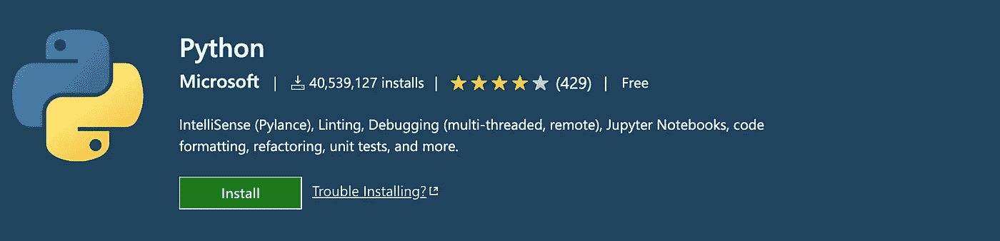
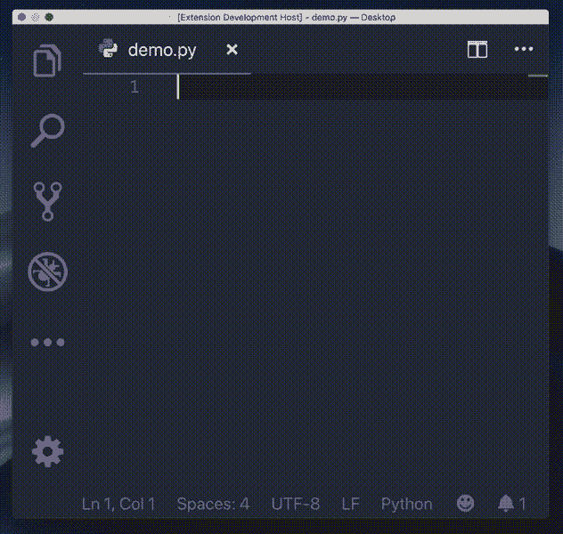
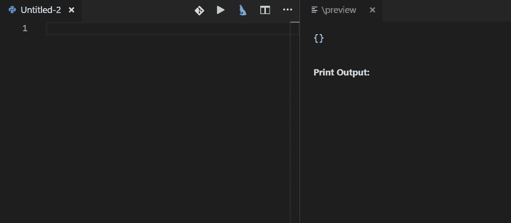
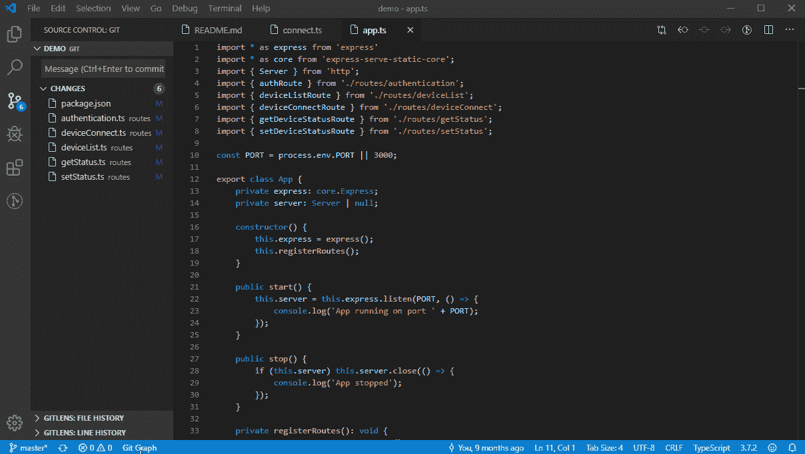

# VS 代码不是 Python 友好的吗？试试这 5 个扩展

> 原文：<https://betterprogramming.pub/is-vs-code-not-python-friendly-try-these-5-extensions-d4d51e41e072>

## 让 VS 代码更好地为您的 Python 项目服务


安迪·福尔摩斯在 [Unsplash](https://unsplash.com?utm_source=medium&utm_medium=referral) 上的照片

不是开玩笑——我认识一个专门用记事本编写 Python 代码的人。当我问他为什么喜欢这样做时，他的回答是“我只是喜欢敲击机械键盘上的键。使用自动完成提示让我厌烦，因为我喜欢记住所有的类、方法和函数。”我说“好吧…”

如果你不是生活在岩石下，你可能知道有一种叫做 IDE 的东西，是集成开发环境的缩写，它为开发人员提供了一套全面的工具和语言选择。在很多情况下，不同的语言有不同的 ide。例如，当您使用 Swift 进行 iOS 开发时，您可以使用 XCode，而如果您使用 Kotlin 和 Java 进行 Android 开发，Android Studio 是首选 IDE。对于 Python 开发者来说，PyCharm 是一个开发良好的 IDE。

除了这些特定于语言的(相对而言)集成开发环境，还有几个通用的集成开发环境，其中 Visual Studio Code (VSC)可以说是最著名的一个。由于它的通用目的，它的主干是轻量级的，与其他成熟的 ide 相比，它的加载速度更快。然而，主干不会做太多——诀窍是安装必要的扩展或插件，以更好地服务于特定语言的编码。在这篇文章中，我想分享五个有用的 VSC 扩展来改善你的 VSC Python 编码体验。

# 1.Visual Studio 代码的 Python 扩展

如果你在 VSC 使用 Python，你必须安装这个。该扩展由微软开发，集成了启动 Python 项目的基本工具。例如，它包括林挺分析你的代码与 Pylint，Flake，等等。最有用的生产力特性之一是自动完成和代码导航，它们是使用 IntelliSense 完成的。



[VSC 的 Python 扩展](https://marketplace.visualstudio.com/items?itemName=ms-python.python)(麻省理工学院许可)

如果你做数据科学，你的日常工作可能包括使用 Jupyter 笔记本，这也是 VSC 现在通过[这个 Python 扩展](https://towardsdatascience.com/getting-started-with-jupyter-notebooks-in-visual-studio-code-5dcccb3f739b)支持的。除此之外，激活和切换[虚拟环境](/4-python-concepts-that-beginners-may-be-confused-about-ea1fec769f7b)也很方便。

# 2.Python 文档字符串生成器

当你因为缺乏适当的文档而试图理解别人的代码时，你诅咒过多少人？在这种情况下，我可能太好了，不会诅咒别人，但我能感受到你的痛苦，因为你的时间浪费在这种无聊的事情上了。因此，作为一个负责任的程序员，让我们在自己的项目中编写适当的 docstrings。Python Docstring Generator 扩展就是为这项单调乏味的工作而开发的。


[Python Docstring 生成器](https://marketplace.visualstudio.com/items?itemName=njpwerner.autodocstring)(麻省理工学院许可)

如上图所示，您只需在函数头下输入三重双引号，扩展就会自动为您生成 docstring 模板，包括您的函数可以引发的异常。是不是很酷？

# 3.Python 缩进

与许多其他语言(例如 Swift Kotlin)不同，Python 使用缩进来表示不同的级别和范围，而不是使用花括号。除此之外，我采用的一个可读性技巧是在定义复杂(相对而言)数据结构的变量时使用多行，比如一个字典或不同数据类型的列表。然而，默认情况下，VSC 在这些用例中并不总是做得很好。Python Indent 扩展就是为了解决这个问题而开发的。以下代码片段(来源:[此处](https://marketplace.visualstudio.com/items?itemName=KevinRose.vsc-python-indent))向您展示了这样的对比，接下来是来自扩展网页的动画图像。

```
data = {'a': 0,
        | # <- pressing enter should put your cursor at the "|"
| # <- This is where default VS Code puts your cursor.
```



[Python 缩进](https://marketplace.visualstudio.com/items?itemName=KevinRose.vsc-python-indent)(麻省理工学院许可)

# 4.AREPL Python

如果你正在学习 Python，你一定做过一些与首字母缩略词 REPL 相关的事情，它代表读取-评估-打印-循环。本质上，在交互式 Python 控制台中，在您键入代码后，解释器会读取您的代码并对其进行评估，打印任何适用的输出结果，无论您进行多少次，这个过程都会重复。

但是，在 Python 文件(。py)，你就不能享受 REPL 的功能了，它可以让你实时反馈刚刚输入的代码。要将这个特性带回 VSC，AREPL Python 扩展是一个方便的选择。



AREPL Python (麻省理工学院许可)

# 5.Git 图

最后但同样重要的是，不要忘记版本控制——不管你是用 Python 还是其他语言编码。记录你正在做的事情总是一个好习惯。最常见的版本控制工具是 Git。要在 VSC 使用它，在 VSC 尝试几个 Git 扩展是个好主意，Git Graph 就是其中一个很好的。



[Git 图](https://marketplace.visualstudio.com/items?itemName=mhutchie.git-graph)(麻省理工学院许可)

正如您在图中所看到的，它提供了一个图形视图来显示这些变化。此外，它可以与常见的 Git 服务提供商集成，特别是包括 GitHub，这可能是最常用的一个。

# 结论

通过安装这五个扩展，您基本上完成了将 VSC 设置为轻量级 Python IDE 的工作，这对大多数 Python 开发人员来说应该足够了。然而，为了满足您的个人业务需求，在 VSC 的市场中还有更多扩展可以探索。

您可能会找到您需要的东西—记住:不要重新发明轮子—通过安装所需的扩展来节省您的工作时间。如果你真的找不到你需要的，请做一个来帮助别人！