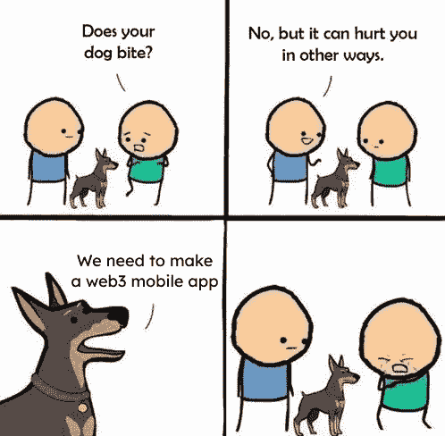
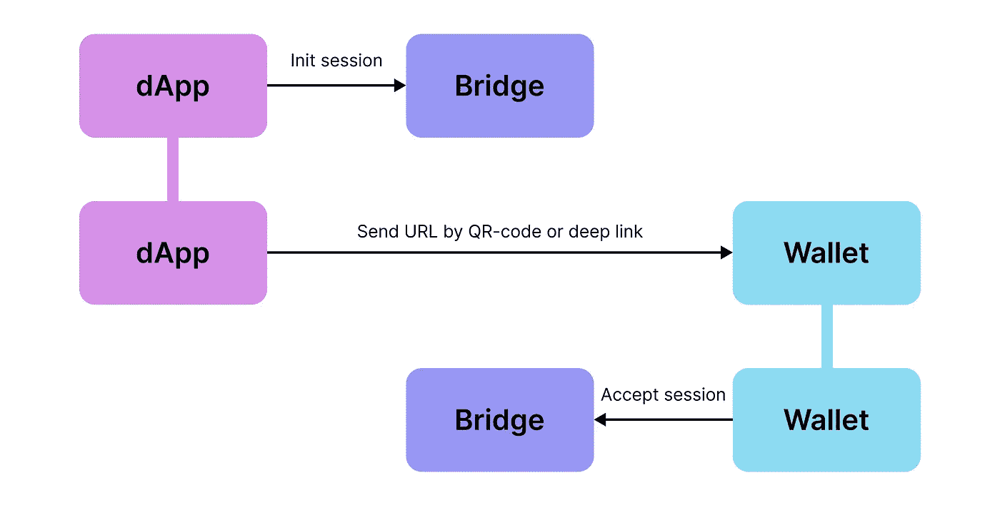

# 为 iOS 构建您自己的 dApp

> 原文：<https://betterprogramming.pub/is-web3-native-mobile-app-possible-b0497da964ad>

## Web3 原生移动应用是可能的

在这篇文章中，我将告诉你我们如何与我的同事从[定制应用](https://customapp.tech)实现移动 dApp，发布 [W3dding 应用](https://twitter.com/w3dding_io)(目前支持 iPhone X 和更高版本)，我们必须经历的事情以及如何为 iOS 制作自己的原生移动 dApp。如果你迫不及待地想制作自己的移动 dApp，这里有我们修改的开源[钱包连接库](https://github.com/penachett/WalletConnectSwift)和[示例应用](https://github.com/custom-app/wallet-connect-swift-example)的链接。

本文将主要讲述 dApp 在 iOS 平台上的开发。为了更好地理解，您应该熟悉 Swift 5 并具备一般的区块链知识。

# 简介**(旅程如何开始)**

几个月前，有一天，我的老板问我:“Lev，似乎有人在谈论移动 web3 应用，你听说过吗？”。之后，我去研究了这个问题，同时对加密世界的工作方式只有一个大致的了解(在此之前，移动开发者没有参与我们的加密项目)。

当然，在搜索了各种解决方案之后，我设法找到了许多支持 web3 的 Swift 库。然而，直接发送交易需要私钥，任何正常的用户都不会将私钥提供给第三方应用程序。因此，只使用这样的 web3 库可能适合编写自己的钱包应用程序，但不适合实现 dApp。

我还了解了在钱包应用程序中使用内置浏览器的可能性，但这并不能满足我，因为我对实现原生移动应用程序的可能性很感兴趣。

此外，我们决定寻找任何具有我们需要的特定功能的 dApp 示例。我查看了许多大型应用程序(nft 市场、交易所等)。)，但最初，我找不到一个可以通过钱包发送交易的本地移动应用程序。有些应用程序只能连接到钱包(例如 [OpenSea](https://opensea.io) )。在我看来，在最大的 NFT 市场的移动应用程序中，不可能进行交易并直接购买 NFT，这似乎很荒谬。我想——也许这是不可能的？

# 钱包连接

我后来发现，大多数区块链浏览器应用程序使用[钱包连接](https://walletconnect.com)技术来连接钱包并发送交易。钱包连接是 dApp 和钱包交互的协议。在交互过程中，dApp 和钱包使用中间桥梁。为了创建一个新的会话，dApp 向所选择的网桥发送一个请求，之后需要从钱包端确认连接。创建会话后，应用程序可以发送交易请求，这需要在 wallet 中确认。在浏览器中，这种连接的工作方式如下:web 应用程序发送一个创建会话的请求，并生成一个带有连接所需信息(网桥 url、会话 id 等)的 QR 码。)，钱包应用程序扫描该代码。

Wallet Connect 站点有大量的文档和在构建 web 应用程序时使用该协议的示例，但是这些信息不适用于移动本地应用程序。只有一个[移动链接部分](https://docs.walletconnect.com/mobile-linking)说，钱包连接可以在使用深度链接的移动应用程序中工作。当创建一个会话时，应用程序向桥服务器发送一个请求，并通过一个深层链接将用户定向到所选的钱包，用户在那里确认会话的创建。

Wallet Connect 连接方案

接下来，我找到了官方的 [Swift 钱包连接库](https://github.com/WalletConnect/WalletConnectSwift)和一个其用法的[例子](https://github.com/WalletConnect/WalletConnectSwift-Example)。似乎所有的部分都放在一起，你就可以创建自己的移动原生 dApp。然而，在运行了这个示例并使用了一段时间后，我意识到它并没有像预期的那样工作。使用示例时发现的问题:

1.  无法连接到一些钱包——一些钱包在通过深度链接启动后根本没有反应，另一些钱包在连接后崩溃了应用程序(当然我说的是支持钱包连接的钱包)。
2.  如果 wallet 连接成功，则会话管理不正确。当它在钱包应用程序中显示为活动时，它很容易从 dApp 端丢失。
3.  如果钱包连接成功，则直接发送交易可能不起作用。

总的来说，这个例子在目前的形式下是行不通的。之后，我开始寻找任何关于构建移动 dApp 的例子或文章。和以前一样，我看到了很多关于如何在实现 web 应用程序时取得成功的指南，但是没有关于移动应用程序的资料:(

我查看了上述存储库中的活动——最后一次提交是在几个月前，大量未解决的问题没有得到回应。我研究了一些问题，看到了几个图书馆用户自己解决发现的问题，而不需要作者的帮助。然后我发现，目前开发人员专注于 Wallet Connect v2(目前处于测试阶段)，第一个版本没有受到关注。因此，我意识到使用 Wallet Connect 并拥有适当功能的唯一方法是派生库并尝试修复问题。

# 钱包连接库更新

在进行更改之前，使用几个支持钱包连接和多边形区块链的钱包对该库进行了测试:Trust Wallet、MetaMask、TokenPocket、SafePal、Unstoppable Wallet、AlphaWallet 和 MathWallet。下面将简要描述对 Wallet Connect 库所做的更改。小的修正这里就不描述了，比如 Session struct 对可识别协议的实现。如果需要，绝对可以在[存储库](https://github.com/penachett/WalletConnectSwift)中查看所有提交。所做的更改:

1.  **钱包图标可选**

让我们看看`ClientMeta`结构:

ClientMeta 结构

`DAppInfo`和`WalletInfo`包含`ClientMeta`，当我们收到没有`icons`字段的`WalletInfo` JSON 时，应用程序将会崩溃。用几个钱包(比如 Safepal)连接就是这种情况。

**2。添加了缺失的百分比编码**

在原始库中，只有桥字段百分比编码，而协议需要完全百分比编码的深度链接。Metamask 可以处理这种情况并为您编码，但是您将无法连接到其他钱包。

**3。从钱包端断开时断开回拨**

在大多数钱包应用程序中，用户可以断开会话。因此，如果没有处理这种情况，你的应用程序会认为你有一个活跃的会话，但这不是真的。

**4。增加了** `**didSubscribe**` **回调**

当你想连接到一个钱包，你首先需要连接到桥，并发送一个新的会话请求。当一个请求被发送时，你就可以打开一个深层链接，并提示用户使用钱包应用程序。在原始库中，在打开深度链接之前有一个持续的延迟。因此，如果您的会话请求因任何原因未被发送，您将不会在 wallet 应用程序中看到任何消息。

**5。增加了重新连接标志来断开回拨**

在添加此标志之前，当收到断开连接的回叫时，无法了解断开连接是由钱包/用户发起的，还是由于其他原因(互联网不良)而失去连接，并且正在尝试重新连接。

**6。增加了断开请求的 id**

断开与某些钱包(例如，信任钱包)的连接时，缺少一个必需的 id 字段。

**7。增加 1 秒重新连接超时**

钱包连接库使用[红蜘蛛](https://github.com/daltoniam/Starscream)库来管理 websocket 连接。当用户由于任何原因(例如，糟糕的互联网连接)断开连接时，它会非常频繁地尝试重新连接，这对设备资源不利。

# 用法示例

现在让我们转到更技术性的层面。在这一大部分中，我们将通过一个例子来看看如何使用这个库，并构建一个独立的 dApp。该应用程序将使用 SwiftUI 和 MVVM 架构编写。将考虑创建这样一个应用程序的要点，但是一些部分(例如，视图组件和一些辅助功能)将被省略。完整的应用程序代码可以在[库](https://github.com/custom-app/wallet-connect-swift-example)中查看。

第一步是安装 Wallet Connect 库的修改版本。这可以通过使用 Swift 软件包管理器来完成:

1.  使用 Xcode 13 进入文件>添加包>点击右上角的搜索栏
2.  粘贴项目网址:[https://github.com/penachett/WalletConnectSwift](https://github.com/penachett/WalletConnectSwift)
3.  点击下一步并选择项目目标

我们的应用程序将包括使用 Wallet Connect 的所有基本功能:

*   能够连接到其中一个钱包(信任钱包或元掩码)；
*   发送交易的能力；
*   断开连接的能力；
*   处理所有会话更新事件。

让我们从我们的`Wallet`结构开始。

钱包结构

在这里，您可以看到一些常见的字段，如名称、主钱包 url 和应用商店 url。

我们还有两种类型的深度链接方案—通用和本地。虽然苹果建议使用通用方案，但一些钱包只有本机方案实现。此外，本机深度链接方案对于检查用户设备上钱包应用的可用性非常有用。

深度链接方案可能很难找到，并且不是所有的开发人员都在他们的文档中明确提到它们。

深度链接方案可以在 Gnosis 安全开源项目之一的[资源库](https://github.com/safe-global/safe-ios/blob/c8a761bf024ef98ef5076376a6270626f7e450fc/Multisig/UI/WalletConnect/Client/wallets.json)中找到。我们还需要不仅在需要创建连接时，而且在需要确认交易时，将用户引导到钱包应用程序。

为了这个目的，需要函数，因为一些钱包(在我们的例子中是信任钱包)显示一个错误警告，深层链接不能被解析，这使用户困惑。在这个例子中，我提供了一个在信任钱包中打开 Polygon 的链接。

钱包帮助结构

接下来，让我们继续考虑我们的逻辑，我们将用两个类来表示它:`WalletConnect`和`ExampleViewModel`。

在`WalletConnect`类中，我们将直接访问库，并使用我们将实现的委托向`ViewModel`传递回调。

让我们考虑一些与库回调无关的`WalletConnect`方法。

wallet 连接/重新连接方法

这里，在 connect 方法中，我们构建了一个 wallet connect URL，连接到桥服务器，发送一个创建会话的请求，并返回 URL，以便稍后将其放入深层链接中。

注意，这里我们使用的是一个公共桥[https://safe-wallet connect . safe . global](https://safe-walletconnect.safe.global)，还有另一个官方公共桥——[https://bridge.walletconnect.org](https://bridge.walletconnect.org/)。任何网桥有时都会出现故障，您将无法使用 Wallet Connect。

对于大型商业项目，我建议让[成为你自己的桥梁](https://docs.walletconnect.com/bridge-server)(在一个去中心化的 web3 世界里，如何保持私密是一个很好的问题:)。同样有用的是，您可以指定用户应该连接到的`chainId`。

但是对于 MetaMask，它什么也不做——用户连接到先前选择的网络并需要切换它。信任钱包默认使用提供的`chainId`，但用户无论如何都可以更改网络。所以你需要始终控制连接后`Session`对象中的`chainId`是什么。

另外，请记住，Wallet Connect v1 仅支持 EVM 兼容的区块链。如果我们在 UserDefaults 中保存了旧的会话，那么下一个方法`reconnectIfNeeded`会恢复它。每次应用程序初始化时都会调用它。

现在让我们转到钱包连接回调。

WalletConnect 委托功能

例如，我们在这里定义了我们的`WalletConnectDelegate`(由原始的`ClientDelegate`组成，不包括一些信息)来回调我们的 ViewModel，这将修改状态。

如果成功连接，我们将`Session`保存到用户默认值，如果断开，则执行相反的操作。我们忽略带有 URL 的`didConnect`,因为这里我们对连接到桥的时刻不感兴趣。

让我们在视图模型中检查这个委托实现。

ViewModel 委托实现

这里有趣的部分是`didSubscribe`回调。因此，当我们连接到桥并发送一个会话初始化请求时，我们准备打开一个深层链接并提示用户使用钱包应用程序。让我们继续前进。

ViewModel 常规方法

下面是通用的视图模型方法。可以从 UI 调用的`connect` / `disconnect`、每次启动该应用时调用的`initWalletConnect`、简单打开钱包(发送交易)的`openWallet`以及前述的`triggerPendingDeepLink`。我们的最后一块代码是事务发送逻辑:

交易发送逻辑

在交易中小心设置`gasPrice`。我们的钱包(Trust Wallet 和 MetaMask)会在没有我们的情况下计算它，但是比如 Safepal 如果你没有设置`gasPrice`就会抛出一个未知错误。

在发送交易之前获取用户的余额也是一个很好的做法，因为一些钱包在试图发送没有足够资金的交易时会简单地返回一个未知错误。是的，在这个年轻的 web3 移动世界，事情并不那么顺利:)

# 有用的移动 Web3 观察

*   苹果不懂 web3 应用。你应该做好准备，你提交给 App Store 的东西会被多次拒绝，你需要向苹果审查人员解释一些事情。在开始时，我们必须证明我们的应用程序不是一个钱包(我们有一个“钱包”选项卡，具有连接钱包的功能)。后来，在发送其中一个更新时，问题是我们通过第三方应用程序(钱包)使用授权。你总是可以尝试向他们解释本质作为回应，但万一失败，你将不得不做出一些改变。
*   你应该总是测试你所支持的所有钱包，因为它们通常有非常独特的行为。
*   当你发送一个交易并打开一个深度链接时，你的应用程序将有几秒钟的时间进入后台。因此，如果用户没有快速确认交易，那么您将无法收到关于发送交易的响应。为了解决这个问题，您可以使用[后台任务](https://developer.apple.com/documentation/backgroundtasks)，这将为具有活动 websocket 连接的应用程序提供额外的至少 30 秒的生命周期。
*   使用元掩码时，您需要了解几个“功能”:

1.即使交易成功发送，用户也可能会收到推送通知，告知[出现了问题](https://github.com/MetaMask/metamask-mobile/issues/3927)。这可能会让用户感到困惑，所以最好提醒他一下。

2.您不能强制用户选择特定的网络。连接后，它将始终拥有之前选择的网络，因此您需要观察会话对象中的 chainId。

3.默认情况下，metamask 仅适用于以太坊，但您可以添加其他网络。目前还没有办法在原生应用中使用[魔法按钮来添加网络](https://docs.metamask.io/guide/rpc-api.html#wallet-addethereumchain)，所以你需要发布这方面的任何说明。

# 结论

这就是创建原生移动 web3 应用程序的过程。是的，现在所有这些技术都不完美，但每个人都明白，近年来我们的生活一直在努力将尽可能多的功能转移到智能手机上。因此，web3 移动革命迟早会发生，我们只能努力让它更接近:)

此外，如果感兴趣的话，我可能会写一篇关于开发一个成熟的 web3 应用程序的文章，并且会有关于使用 web3 库、调用智能合约等等的信息(然而，这些信息比关于 Wallet Connect 的信息更容易找到)。

# 链接

[完整示例代码](https://github.com/custom-app/wallet-connect-swift-example)
[修改钱包连接库](https://github.com/penachett/WalletConnectSwift)
[我的 Twitter](https://twitter.com/baklanov_dev)
[W3dding app Twitter](https://twitter.com/w3dding_io)
[自定义 App 公司](https://customapp.tech)

你也可以看看我同事关于[将 NFT 智能合约与 OpenSea](https://medium.com/@shleshg/how-to-integrate-your-nft-smart-contracts-with-opensea-b2925789a62f) 整合的文章。