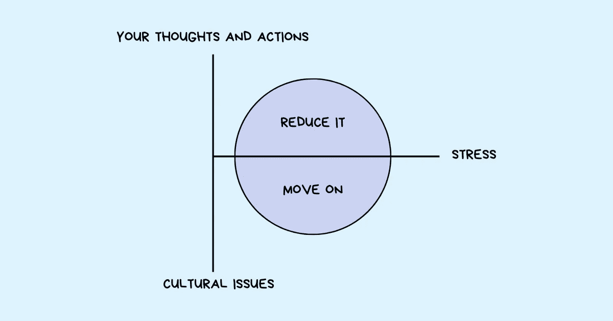

# 职场压力是否让你不堪重负？这里有 5 个策略来减少它

> 原文：<https://betterprogramming.pub/is-workplace-stress-overwhelming-you-heres-5-strategies-to-reduce-it-4bc89e33f862>

## 对如何支配时间缺乏控制是工作中焦虑和压力的隐藏来源之一

鸣谢:作者

工作是我们生活的一大部分。做得好，它可以成为快乐的源泉。但如果管理不善，它往往会导致压力、焦虑和不满。

在工作中有一定的压力是不可避免的，我们也不应该试图这样做。毕竟所有的压力都不是坏事。通常，这表明你在做有价值的工作。你关心增加价值和创造影响。压力也能让你充满活力，让你付出必要的努力去做某事。

但是如果你的压力使你虚弱怎么办？如果它妨碍了做出有意义的贡献呢？如果工作场所的压力没有让你充满活力，反而消耗了你的能量，伤害了你的动力，那该怎么办？

在工作中感到压力有很多原因。

有些压力可能完全在你的控制之外，比如来自你组织中一些坏人或有毒文化的压力。

*   动力动力学
*   刻薄的同事
*   微观管理老板
*   过度超负荷工作

你的另一个压力来源在很大程度上在你的控制范围内，因为它与你如何管理和应对工作中的各种事件有关。

*   你如何处理人际冲突？
*   当面临困难或意外情况时，你会怎么做？
*   你如何处理紧迫的截止日期？
*   你的压力经常是因为你的拖延和最后一分钟争先恐后地试图满足即将到来的最后期限吗？
*   你[在压力下如何表现](https://www.techtello.com/performing-under-pressure/)？
*   你是一个完美主义者，为自己和他人设定相当高的标准，并为达不到这些标准而感到压力吗？
*   你是否发现很难集中注意力，经常被周围的事情分散注意力，后来又因为在工作中投入了太多时间和精力，却没有达到预期的结果而感到压力重重？
*   你是否觉得自己像个冒名顶替者，担心别人会发现你是个骗子导致你过度工作以避免被发现？
*   你的组织混乱程度是否会影响你的工作效率，让你对自己的表现感到焦虑和压力？
*   你是否有在许多经常遗留的事情之间进行多任务处理的习惯，并且你感到无所适从和不知所措？

不管是什么原因，[研究](https://pubmed.ncbi.nlm.nih.gov/28804509/)显示，如果不处理，压力会导致身体和心理健康问题。它会影响你的工作效率和表现。它甚至会影响你周围的人。

# 管理工作压力的 5 个策略

我不会谈论来自你无法控制的事情的压力(糟糕的老板、[办公室政治](https://www.techtello.com/office-politics/)、其他负面文化因素)。

除了去一个不会给你带来日常压力的更好的工作场所，我不认为你有其他选择。你可以随意谈论这些问题，但是如果你的压力是由你的组织内更大的[文化问题](https://www.techtello.com/organization-culture-problems/)造成的，它不会随着时间的推移而好转。你需要采取强硬的立场，克服找不到另一份工作的恐惧，把你的时间和精力投入到实际的转变中去。

> 我们许多人犯的一个错误是，我们为自己或他人感到难过，认为生活应该是公平的，或者有一天会是公平的。不是，也不会是。当我们犯这个错误时，我们往往会花很多时间沉溺于和/或抱怨生活中的问题。“这不公平，”我们抱怨道，却没有意识到，也许这从来就不是理查德·卡尔森所说的“不要为小事烦恼:防止小事主宰你生活的简单方法”

现在我们来谈谈你能控制的事情。以下是我多年来管理工作压力的一些策略。

# 1.摆脱琐事

通常，工作场所的压力来自于对生活中小事的过多关注。从长远来看并不重要的事情。你并不真正关心的事情，但可能会觉得是生死攸关的决定。

有时候，是你的自我妨碍了你。其他时候，你缺乏视角去理解手头的问题不值得你花时间和精力。

你有很多机会把自己从这种琐碎的细微差别中隔离出来，却发现自己越来越被这种情况所困。

为了避免因生活中无关紧要的事情而陷入精神痛苦，问自己以下问题:

*   是什么让我有这种感觉？
*   这种情况在我的控制范围内吗？
*   为什么它对我很重要？
*   如果我不再关心它，会发生什么？
*   展望未来一年，为什么现在对我很重要？

知道是什么导致了你的压力可以让你摆脱那些不值得你花费时间和精力的琐事。

# 2.掌控你的时间和计划

对如何度过工作时间缺乏控制是工作中焦虑和压力的隐藏来源之一。

繁忙的日程安排、过多的会议和排得满满的日程表会让你觉得自己很重要，但这无助于你朝着目标前进。相反，忙碌了一天却没有完成任何有意义的事情会让你感到低效和不满足。

在家的一个紧张的早晨也可能被带到工作中。没有足够的时间吃一顿健康的早餐，努力把你的孩子送到学校，同时准时参加会议，这确实会很有压力。缺乏计划也会影响你对工作中各种事件的反应。如果你以一个充满压力的早晨开始一天的工作，即使是轻微的期望不匹配或工作中的不适都可能让你分心。你可能会觉得周围的一切都在崩溃，这进一步增加了你的压力和焦虑感。

当你没有有意识地计划和优先安排你的一天时，这经常发生。我不是说尽管有计划，事情不会出错。然而，有一个适当的计划会减少偶然性，给你足够的心理空间去[选择你的反应](https://www.techtello.com/how-to-take-control-of-your-life/)。

通过更好地控制你的时间表，你可以选择和做实际上推动你前进的工作，从而减少压力蔓延的机会。

# **3。推动澄清**

在工作中感觉没有效率是工作倦怠的主要来源之一。如果你不知道对你的期望是什么，或者你的工作如何符合你的团队目标，可能很难取得任何有意义的成就。

缺乏进步、目标和意义往往源于对目标和实现这些目标的机会缺乏清晰的认识。它导致不胜任感、归属感的丧失、对工作的愤世嫉俗和消极，所有这些都可能导致压力。

不要等待别人给你你需要的清晰，并期望他们为你做得更好，而是积极寻求清晰。你的感受对其他人来说是不透明的，老实说，每个人都忙于自己的工作日程，他们很难注意到你需要什么或你不理解什么。

为了避免压力，努力保持清晰。通过提问来更好地了解你的角色、工作期望和目标。安排时间和你的经理一起定期获得反馈。

> 将你的注意力转移到你认为可行的、可完成的任务上，将会真正增加积极的能量、方向和动力——杰克·纳普，“腾出时间:如何专注于每天重要的事情”

在工作中保持清晰能让积极的转变留给消极和压力更少的空间。

# 4.直面困难的对话

组织中的许多工作需要跨不同团队和职能部门的协作。与他人合作无疑创造了学习和成长的大好机会，但也可能带来很多压力。

意见分歧可能会导致分歧。优先级冲突、日程冲突和期望不匹配会导致你花更多的时间争论，而花更少的时间将你的想法付诸行动。

这种冲突容易引发的负面情绪可能会让你[把头埋进沙子里](https://www.techtello.com/ostrich-effect/)。你可能试图避免处理它们，或者拖延它们，希望它们会消失。然而，回避和不作为只会让事情变得更糟——小问题变成大问题，使寻求一致变得极其困难。没有一致，任何大事都做不成。

> 认识到我们有感觉的反面是否认我们的情感。好奇的反面是脱离。当我们否认我们的故事，脱离艰难的情绪时，它们不会消失；相反，他们拥有我们，他们定义我们。我们的工作不是否认这个故事，而是挑战它的结局——坚强地站起来，承认我们的故事，与真相一起咆哮，直到我们到达一个我们认为是的地方。事情是这样的。这是我的真理。我会选择这个故事的结尾——布琳·布朗《强势崛起》

所以如果你倾向于[避免冲突](https://www.techtello.com/managing-conflict/)，那就不要。直面他们。进行对话。试着理解另一个人的观点。问这些问题可以帮助你处理你的情况，避免因忽视它们而产生的压力:

*   我感觉到了什么——愤怒、悲伤、厌恶、恐惧…
*   为什么我会有这种感觉？
*   我在处理冲突吗？
*   此刻这种感觉对我有什么影响？
*   是什么引发了这场冲突？
*   我在努力实现什么或者害怕失去什么？
*   什么能让我改变主意？
*   如果我错了呢？
*   是什么让对方有这样的想法，还是我遗漏了什么？

# 5.重新评价消极的想法

当事情不按你的方式进行时会发生什么？你的第一反应难道不是假设最坏的结果吗？夸大事实吗？

没有做好应对意外的心理准备会让你偏离轨道。即使是很小的偏离正常或环境的微小变化都会让你高度焦虑和紧张，从而扭曲你清晰思考的能力。

消极还会导致你重复破坏性的行为模式(拖延、责备、分心),这会伤害你的结果，并导致更多的消极想法，从而强化你的消极信念，让你相信你以某种方式感受是正确的。某种自我实现的预言。

为了控制压力，每当你发现自己被负面情绪淹没时，就这样做:

1.  让那些感觉进来。不要忽视他们。
2.  承认它们只是你头脑的产物，并不总是正确的。
3.  提问并试着理解是什么让你有这种感觉。为什么你认为你有这种感觉是对的？你怎么可能错了？
4.  重新评估形势。真的有看起来那么糟糕吗？使用其他合理的替代方案或解释来评估你的情况。

> 我们不知道会发生什么——我们只是认为我们知道。通常我们会小题大做。我们在脑海中放大所有将要发生的可怕事情的场景。大多数时候我们都是错的。如果我们保持冷静，对可能性保持开放，我们可以合理地肯定，最终，一切都会好起来——理查德·卡尔森，“不要为小事而烦恼”

# 摘要

1.  如果你不明白是什么导致了你的工作压力，并积极采取措施来控制它，它会影响你的身体和心理健康，从而影响你的工作效率和表现。
2.  导致压力的事情可能超出你的控制范围，比如一个组织中有毒的工作文化。与其花时间沉溺于自怜，不如行动起来。
3.  要知道压力很大一部分来源于你能控制的事情。承认这一事实是对你的处境负责并主动采取措施减少它的唯一方法。
4.  你的很多压力来自于对琐事的过多关注——从长远来看并不重要的事情。认清并区分什么是重要的，什么是不重要的，不要再为琐事而烦恼。
5.  制定一个计划，有意识地花费你的时间和精力。更多地控制你的时间表会减少压力的空间。
6.  毫无疑问，如果你在工作中没有进步感、目标感和归属感，你会有压力。积极争取清晰。它让你有机会弥合这一差距，从而获得快乐、满足和成就感。
7.  不要回避会使情况恶化的冲突，而是要鼓起勇气进行艰难的对话。你可以为自己和他人省去很多来自未解决情绪的压力。
8.  最后，当事情没有如你所愿时，不要急于得出消极的结论，而是暂停下来，重新评估你的处境。大多数时候，事情并不像一开始看起来那么糟糕。

在 Twitter 上关注我，了解更多故事。

*这个故事最初发表于*[*【https://www.techtello.com】*](https://www.techtello.com/workplace-stress/)*。*