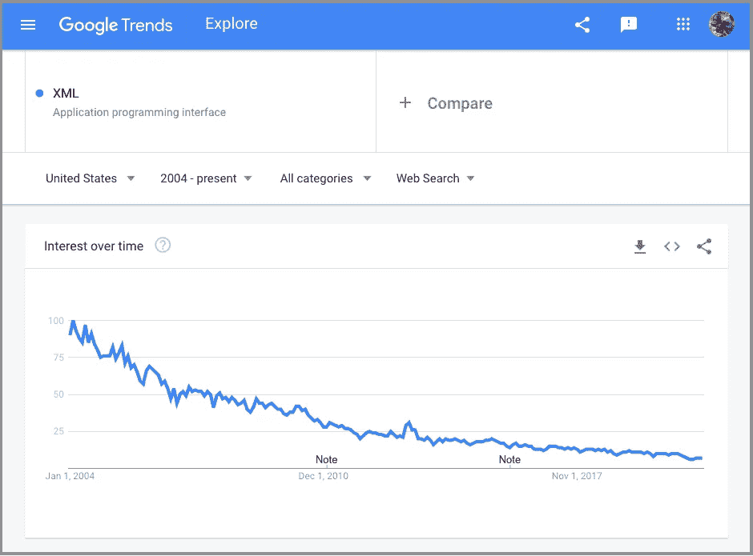
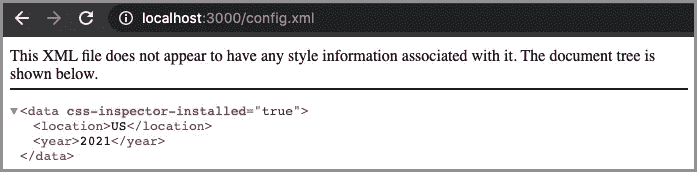
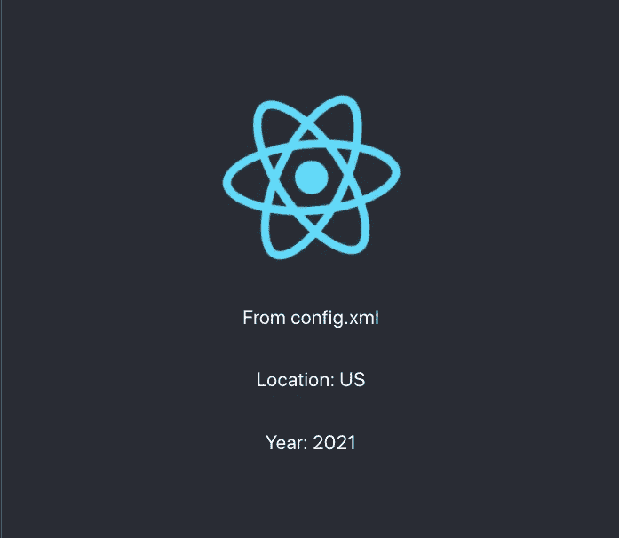
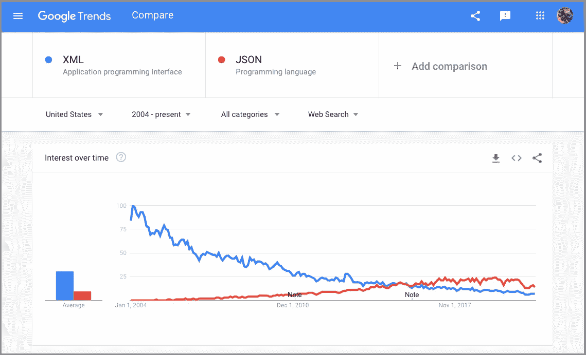
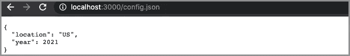
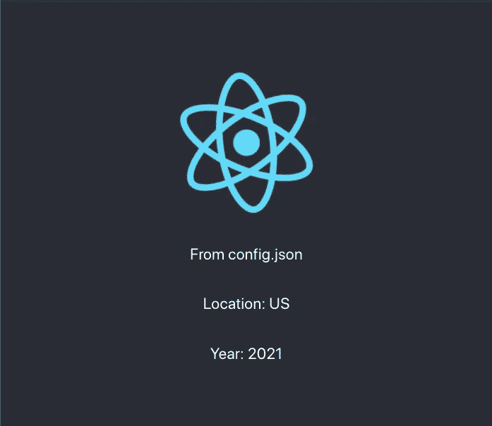
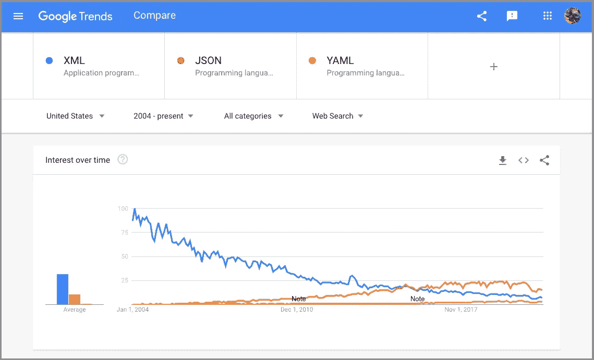
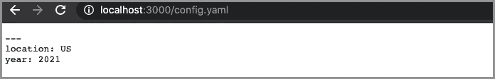
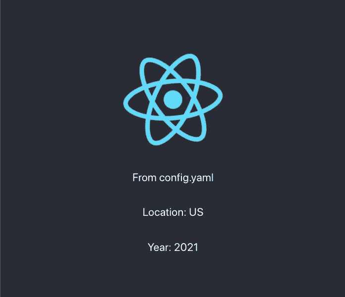
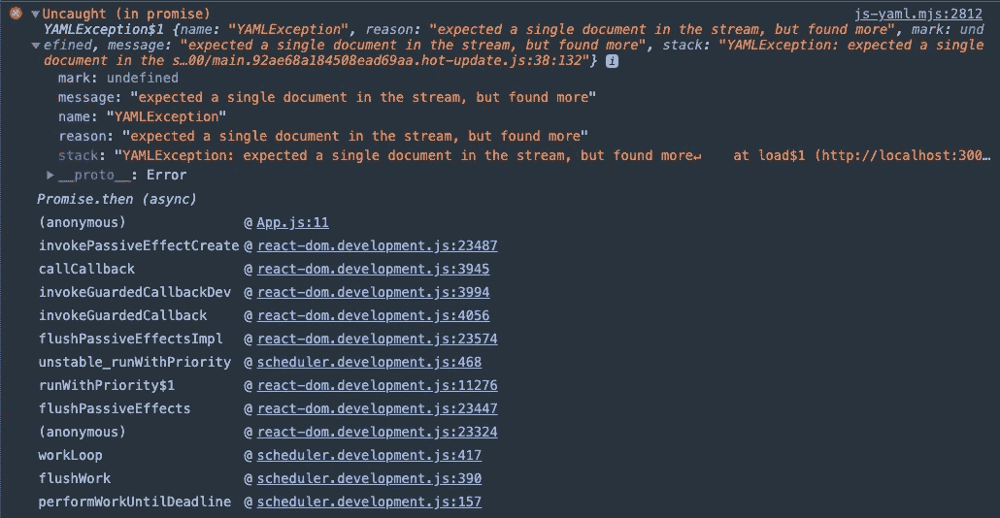

# YAML 准备好接受 JavaScript 了吗？

> 原文：<https://betterprogramming.pub/is-yaml-ready-for-javascript-b501c7a087c6>

## 比较 XML、JSON 和 YAML，了解数据格式化的趋势


图片来源:作者

世界上最流行的编程语言是什么？

[DevOps 厂商 Datree.io 说是 YAML](https://www.developer.com/news/is-yaml-taking-over-the-world/) 。在分析了数百万个开源 GitHub 项目后，Datree.io 发现了 6000 万个 YAML 文件。此外，它在 10，000 多个私人资料库中发现了至少一份 YAML 的文件。

什么是 YAML？

[YAML](https://en.wikipedia.org/wiki/YAML) ，是“YAML 不是标记语言”的递归首字母缩写，是一种人类可读的数据序列化语言。它通常用于配置文件和存储或传输数据的应用程序中。例如， [Swagger](https://jenniferfubook.medium.com/jennifer-fus-web-development-publications-1a887e4454af) 已经使用了 YAML，这是 OpenAPI 的一个工具集，是服务器和客户端的标准。YAML 经常用在用`C++`、Go、Java、JavaScript、Rust 和 Python 编写的项目中。

YAML 的故事从 XML 开始。

# XML(可扩展标记语言)

## 定义

XML 是一种标记语言，它定义了一组规则，用于以人类可读和机器可读的格式对文档进行编码。它使用标签来定义结构，类似于 HTML。

XML 是 SGML(标准通用标记语言)的应用。它的初稿于 1996 年在太阳微系统公司发表。XML 1.0 于 1998 年 2 月 10 日成为 W3C 的推荐标准。

XML 有三个主要功能:

*   它是一种标记语言。
*   它是在客户端和服务器之间传输的数据格式。
*   它用于定义配置。

XML 有过它的全盛时期，但是正在衰落。

作为一种标记语言，XML 可以用 XSLT(可扩展样式表语言转换)转换成 HTML。然而，现代 web 应用程序是由 JavaScript 框架/库编写的，如 React、Angular 和 Vue。XML 不再是构建网站的可行选择。

XML 是客户机和服务器之间发送数据的默认格式。AJAX 已经被用来描述部分刷新网页的`XMLHttpRequest`对象。尽管 AJAX 代表异步 JavaScript 和 XML，但 AJAX 经常使用 JSON 在客户机和服务器之间发送数据。

SOAP(简单对象访问协议)是一种流行的消息协议，它使用 XML 作为其数据格式。REST(表述性状态转移)API 已经大部分取代了 web 服务的 SOAP。虽然 REST API 支持 XML，但是它的主要数据格式是 JSON。有趣的是，使用 YAML 来记录和定义 REST API 越来越受欢迎。

XML 配置文件已经被许多不同的应用服务器使用，比如 Apache Tomcat 和 Jetty。你处理过那些庞大的文件吗？

较新的服务器，比如 [NodeJS](/whats-new-in-node-js-15-fc24e87e2590) ，默认情况下没有 XML 功能。今天的热门选择是 JSON 和 YAML。

## 谷歌趋势

以下是显示 XML 受欢迎程度下降的谷歌趋势:



## 创建 React 应用程序中的用法

我们下载一份 [Create React App](/upgrade-create-react-app-based-projects-to-version-4-cra-4-d7962aee11a6) :

```
npx create-react-app react-app
cd react-app
```

安装的存储库中包含哪些 XML 文件？

```
$ find . -name "*.xml"
./node_modules/json-schema/draft-zyp-json-schema-03.xml
./node_modules/json-schema/draft-zyp-json-schema-04.xml
```

整个应用程序中有两个 XML 文件。

## XML 格式的 Package.json

如果我们使用 XML 格式重写`package.json`,它将如下所示:

## 用 JavaScript 解析 XML

将以下 XML 文件添加到`/public`文件夹中。

该文件可以从网络浏览器访问(在`npm start`之后)。



我们用下面的代码替换`src/App.js`:

`public/config.xml`在第 10 行获取，并在第 11 行转换为文本。

第 13 行使用`DOMParser`将 XML 文本解析成 DOM 文档。

从 DOM 文档中检索出`location`值，并保存到 state 中(第 16 行)。

从 DOM 文档中检索出`year`值，并保存到 state 中(第 17 行)。

第 25 行表明这是`config.xml`的代码片段。

第 26 行和第 27 行显示了`location`和`year`值。



## 警告

您可能想知道为什么我们在示例中使用 XML 1.0，而不是 2004 年 2 月 4 日推出的 XML 1.1。

XML 1.1 从未被广泛采用，因为 W3C 在 XML 1.0 的第五版中引入了相同的变化。到目前为止，XML 1.0 仍然是最广泛采用和实现的版本。

下面的建议来自 Elliotte Rusty Harold 的书《有效的 XML:改进 XML 的 50 种具体方法》:

> “关于 XML 1.1，您需要了解的一切可以归结为两条规则:
> 
> 1.不要用。
> 
> 2.(仅供专家使用)如果您会说蒙古语、彝语、柬埔寨语、阿姆哈拉语、迪维希语、缅甸语或极少数其他语言，并且您想用这些语言编写标记(不是您的文本而是您的标记)，那么您可以将 XML 声明的 version 属性设置为 1.1。否则，请参考规则 1。"

# JSON (JavaScript 对象符号)

## 定义

JSON 是一种数据交换格式，它使用人类可读的文本来存储和传输数据对象。它由名称/值对和数组数据类型组成。记录用逗号分隔，名称和值都用双引号括起来。

JSON 是由道格拉斯·克洛克福特在 2001 年 3 月首先规定的。它基于 JavaScript 编程语言标准 ECMA-262 第三版(1999 年 12 月)的子集。它于 2013 年 10 月成为 ECMA 国际标准。

JSON 有两个主要功能:

*   它是在客户端和服务器之间传输的数据格式。
*   它用于定义配置。

JSON 是用于交换数据的轻量级格式。它广泛用于各种 AJAX 框架和工具包中，为远程调用提供简单的对象序列化。JSON 是独立于语言的，序列化/反序列化 JavaScript 对象只需很少的编码，甚至不需要编码。

JSON 语法简单，对数据类型的支持有限，包括`object`、`array`、`number`、`string`、`boolean`和`null`。JSON 没有名称空间、注释或属性支持。它可能不支持复杂的配置。这些限制也使它变得简单，因此它可以快速传输和解析。

JSON 文件不一定要命名为`.json`。事实上，它可能被命名为`.js`，因为 JSON 对象是一个有效的 JavaScript 文件。众所周知的例子就是`webpack.config.js`。

## 谷歌趋势

以下是显示 XML 和 JSON 之间比较的 Google 趋势:



## 创建 React 应用程序中的用法

Create React App 包含多少个 JSON 文件？

```
$ find . -name "*.json" | wc -l
    2374
```

整个应用程序中有 2374 个 JSON 文件，不包括那些命名为`.js`的 JSON 文件。

## json 格式的 Package.json

以下是 Create React App 中的`package.json`:

## 用 JavaScript 解析 JSON

将以下 JSON 文件添加到`/public`文件夹中。

该文件可通过网络浏览器访问(在`npm start`之后)。



我们用以下代码替换`src/App.js`:

`public/config.json`在第 10 行获取，并在第 11 行转换成 JSON 对象。

从 JSON 对象中检索出`location`值，并保存到 state 中(第 13 行)。

从 JSON 对象中检索出`year`值，并保存到 state 中(第 14 行)。

第 22 行表明这是`config.json`的代码片段。

第 23 行和第 24 行显示了`location`和`year`值。

获取和处理 JSON 不是比处理 XML 更容易吗？



# YAML (YAML 不是标记语言)

## 定义

YAML 最初被认为是另一种标记语言。然而，随着 YAML 将注意力从文件转移到数据，官方的定义已经改变。今天，它清楚地表明 YAML 不是标记语言。

查看官方 [YAML 站点](https://yaml.org/)，100%写于 YAML 1.2。你可以看到它是多么的人性化。以下是该网站的前几行:

YAML 创建于 2001 年 5 月 15 日。它没有正式的 W3C 规范。YAML 1.2 于 2009 年 7 月 21 日发布。

尽管它看起来与 JSON 不同，但 YAML 是 JSON 的超集(也就是说，一个有效的 YAML 文件可以包含 JSON)。此外，JSON 可以转换成 YAML。

《YAML》极具可读性。让我们看一些例子。

YAML 文件可以选择以文档分隔符(`---`，第 1 行)开始，也可以选择以文档附件(`...`，第 5 行)结束。

注释以数字符号(`#`，第 1 行)开始，可以从一行的任何地方开始，一直延续到该行的末尾。

列表的成员是从相同缩进级别开始的行，以一个`-` 开始(一个破折号和一个空格，第 2-4 行)。

上面的列表相当于下面类似 JSON 的格式(缩写形式，第 2 行):

一个字典用一个简单的`key: value`形式表示(冒号后面必须跟一个空格)，数据结构层次由轮廓缩进来维护。这里有一个 YAML 的例子:

上面的字典相当于下面类似 JSON 的格式(缩写形式，第 2–6 行):

YAML 提供了引用其他数据对象的能力。通过使用`$ref`引用一个定义，可以在 YAML 文件中编写递归。

以下是`TreeNode`的定义:

第 4–10 行定义了一个`TreeNode`的属性。

第 10 行使用`$ref`写递归，其中`#`到达当前文档的根，然后沿着路径`/definition/TreeNode`到达元素`TreeNode`。

第 11–20 行显示了一个定义树的例子。

对于所有的 YAML 语法，你可以查看 84 页的手册。

YAML 有三个主要功能:

*   它是在客户端和服务器之间传输的数据格式。
*   它用于定义配置。
*   它用于离线数据处理。

虽然在客户机和服务器之间传输数据比 XML 简单，但是 YAML——这种非常容易理解的语法——性能并不好。使用空白可以使 YAML 文件比 JSON 文件大，JSON 文件仍然是快速传输和解析数据的首选。

YAML 克服了 JSON 的限制(例如，名称空间、注释、属性和复杂的配置)。它正在接管配置文件的 JSON。此外，YAML 用于离线数据处理，它利用 YAML 的配置功能，不太关心性能。

YAML 有其自身的局限性。它的缩进格式容易出现语法和验证错误。由于缺乏跨所有语言的特性，某些类型的可移植性可能不存在。由于 YAML 的声明性，调试很困难。不存在断点和类似的功能。

## 谷歌趋势

以下是谷歌趋势，展示了 XML、JSON 和 YAML 之间的比较:



## 创建 React 应用程序中的用法

Create React App 中包含多少 YAML 文件？

没有。

## YAML 格式的 Package.json

如果我们用 YAML 格式重写`package.json`,它看起来会像下面这样:

## 用 JavaScript 解析 YAML

将以下 YAML 文件添加到`/public`文件夹中。

该文件可以从网络浏览器访问(在`npm start`之后)。



要用 JavaScript 解析 YAML， [js-yaml](https://github.com/nodeca/js-yaml) 是首选之一。需要安装的软件包:`npm i js-yaml`。

我们用下面的代码替换`src/App.js`:

`public/config.yaml`在第 11 行获取，并在第 12 行转换为文本。

第 13 行使用来自`js-yaml`的`load`将文本解析成一个 YAML 文档。`load`函数返回普通对象、字符串、数字、`null`或`undefined`，或者在出错时抛出`YAMLException`。

从对象中获取`location`值并保存到状态(第 15 行)。

从对象中检索出`year`值并保存到状态(第 16 行)。

第 24 行表明这是`config.json`的代码片段。

第 25 行和第 26 行显示`location`和`year`值。



如果`public/config.yaml`是多文档 YAML 文件怎么办？

我们将收到一个异常:



在下面的代码中，应该使用`loadAll`而不是`load`:

`loadAll`(第 4 行)类似于`load`，但是理解多文档源。

第 6 行输出`data`对象`[["Apple", "Orange", "Pear"], ["Red", "White", "Blue"]`。

除了输出`data`对象，我们还可以使用`dump`将`data`对象序列化为 YAML 文档。下面的一些代码显示:

第 6 行以 YAML 格式转储数据对象:

`load`、`loadAll`和`dump`是 YAML 解析器中的常用函数。

## 警告

`.yml and` `.yaml`你可能都看了。YAML 文件的文件扩展名应该是什么？

[官方推荐](https://yaml.org/faq.html)为`.yaml`。

> “请使用’。可能的话，就叫“yaml”

Windows 及其 8.3 规则强化了三字符扩展名的趋势。8.3 规则是一种文件格式，支持最大八个字符的文件名和最多三个字符的扩展名，尽管今天所有版本的 Windows 和其他现代操作系统都支持长文件名。

两个`.yml and` `.yaml`都可以，事实上，任何文件扩展名都适用于 YAML 文件。官方的说法应该是`.yaml`。

# 结论

我们比较了 XML、JSON 和 YAML。

*   XML 作为一种标记语言和数据格式已经衰落了。
*   JSON 是客户机和服务器之间传输的数据格式的赢家。
*   YAML 接管了配置文件的 JSON，并被用于离线数据处理。

YAML 准备好接受 JavaScript 了吗？

有点吧。如果浏览器决定开始支持 YAML，这一天可能会到来。

感谢阅读。我希望这有所帮助。你可以在这里看到我的其他媒体出版物。