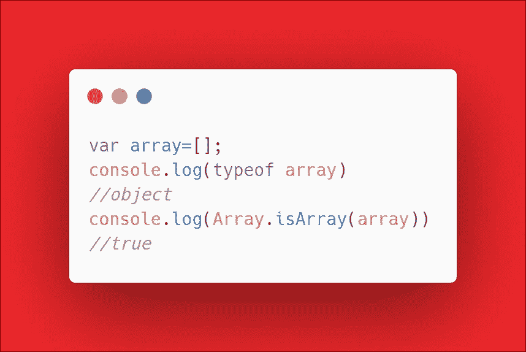
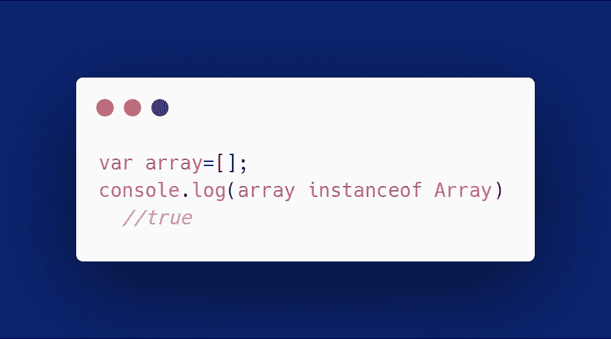

# 你的数组真的是数组吗？

> 原文：<https://betterprogramming.pub/is-your-array-really-an-array-c6a93788df5d>

## 在 JavaScript 中不是这样

Pierre Bamin 在 [Unsplash](https://unsplash.com?utm_source=medium&utm_medium=referral) 上拍摄的照片。

首先，你怎么知道一个数组是数组？JavaScript 卑微的创造者为我们提供了`typeof`操作符。`typeof`用于知道正在讨论的变量的类型。用于数组的`typeof`返回`Object`而不是`Array`。

我们得到这个结果是因为数组在 JavaScript 中并不是真正的数组。JavaScript 中的数组是对象。但是我们也提供了一个解决方案:`Array.isArray()`。为我们提供了一种简单的方法来检查一个变量是否真的是一个数组。如果变量是数组，它返回一个布尔值`true`，否则返回`false`。

如果有人是 JavaScript 新手，他们可能会认为`typeof`为数组返回`object`不是什么大问题。然而，当与`typeof`一起使用时，多个实体返回`object`。JS 就是这么构建的。普通对象将返回一个对象类型，这可能是混淆的来源。

此类检查还有另一种方法，称为`instanceof`。

# **问题**

当我们处理作用域，特别是多个上下文时，`instanceof`的问题就出现了。例如，考虑框架。

框架在其自己的执行上下文中有不同的范围。如果您在位于框架上下文中的数组上尝试`instanceof`，它将返回`false`，这是不正确的。这是一个令人困惑的高级概念，不是每个人都知道。要理解它，你必须知道 JavaScript 中的执行上下文。那是改天的话题。

# 结论

上面的方法有它们自己的问题，这就是为什么数组应该总是使用`Array.isArray()`而不是`instanceof`或`typeof`进行类型检查的原因。

感谢阅读。