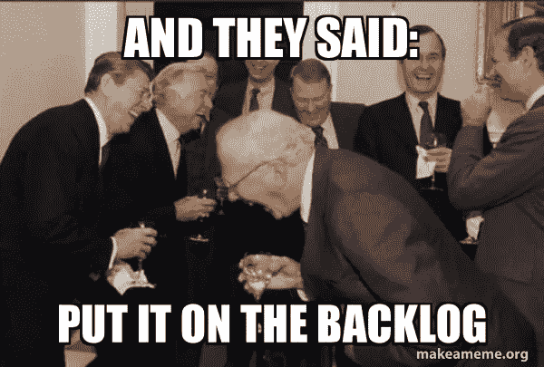
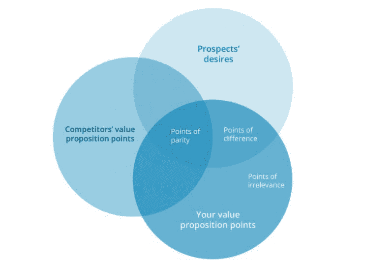

# 你的积压量是不是太大了？确定优先级的新技术

> 原文：<https://betterprogramming.pub/is-your-backlog-too-big-a-new-technique-for-prioritization-994562650662>

## 关注差异点，降低不相关点的优先级

照片由[亚历山大·巴甫洛夫·波德瓦尔尼](https://unsplash.com/@freestockpro?utm_source=medium&utm_medium=referral)在 [Unsplash](https://unsplash.com?utm_source=medium&utm_medium=referral) 上拍摄

你的产品积压中有多少项目？50?100?500?产品经理处理利益相关者建议的一个常用策略是告诉他们“将把它放在待办事项中”。

不幸的是，许多待办事项在被优先用于 Sprint 之前，会在待办事项列表中被搁置数月甚至数年。很多年前，我接手了一个 B2B SaaS 管理文件传输解决方案的产品管理。积压了 300 多项。

平均来说，我们每次冲刺完成 8 个项目。假设没有发现或添加新的项目，我们将花费 3 年时间来完成待办事项中的所有项目。你的积压量是不是太大了？有没有一些新的技术可以让你优先处理它？

在本文中，我们将讨论:

*   待办事项优先化的挑战
*   将项目放在 backlog 中以安抚涉众并不是一个解决方案
*   关注差异点，降低不相关点的优先级

# 待办事项优先化的挑战

正如在 [Scrum 指南](https://www.scrumguides.org/)中所描述的，产品积压是一个紧急的、有序的列表，列出了改进产品所需要的东西。一个好的 backlog 是动态的——新的项目被发现和添加，现有的项目被优先化，一些项目最终被删除。

好的积压产品表现出相似的特征。Roman Pichler 和 Mike Cohn 创造了首字母缩略词 DEEP 来总结好的积压产品的几个重要特征:详细、紧急、估计和优先。 [Bill Wake 说](https://xp123.com/articles/invest-in-good-stories-and-smart-tasks/)好的 backlog 故事证明投资(I——独立，N——可协商，V——有价值，E——可估计，S——小，T——可测试。

有很多方法可以区分待办事项的优先级。十种最受欢迎的方法包括:

1.  [艾森豪威尔的优先排序矩阵](https://slab.com/blog/eisenhower-matrix/#:~:text=The%20Eisenhower%20Matrix%20is%20a,you%20should%20delegate%20or%20delete.)
2.  [精益价值与努力矩阵](https://university.hygger.io/en/articles/2461512-value-vs-effort)
3.  [敏捷商业价值和风险](https://agilescrumguide.com/blog/files/tag-product-backlog---business-value-and-risk.html)
4.  [敏捷价值与复杂性矩阵](https://jexo.io/blog/backlog-prioritization-techniques-the-value-vs-effort/)
5.  [莫斯科方法](https://en.wikipedia.org/wiki/MoSCoW_method)
6.  [卡诺模型](https://www.productplan.com/glossary/kano-model/#:~:text=The%20Kano%20Model%20(pronounced%20%E2%80%9CKah,are%20likely%20to%20satisfy%20customers.&text=These%20feature%20categories%20can%20range,satisfy%20or%20even%20delight%20customers.)
7.  [机会评分](https://www.productplan.com/glossary/opportunity-scoring/)
8.  [故事映射](https://www.productplan.com/glossary/story-mapping/)
9.  [ICE 优先级排序](https://jexo.io/blog/backlog-prioritization-techniques-ice-method/)
10.  [大米优先顺序](https://www.intercom.com/blog/rice-simple-prioritization-for-product-managers/)

许多积压工作面临的挑战是它们包含太多的项目。2010 年，我接手了 B2B SaaS 管理文件传输解决方案的产品管理工作。积压了 300 多项。[谷歌告诉我们，待办事项不应该超过 50 项。然而，许多企业级 SaaS 产品包含数百个甚至数千个项目。你积压了多少项目？](https://www.google.com/search?q=how+many+items+should+a+product+backlog+contain&rlz=1C1CHBD_enCR845CR846&sxsrf=AOaemvLlmhDQNqGqhxYGlihf9BnOmXhjQQ:1641992367806&ei=r9DeYYS-MKSpqtsPi_qlqAk&start=0&sa=N&ved=2ahUKEwjE0bmeoqz1AhWklGoFHQt9CZU4FBDy0wN6BAgBEDU&biw=1242&bih=568&dpr=1.1)

# 将项目放在 Backlog 中以安抚涉众并不是一个解决方案

[Makeameme.org](http://makeameme.org)

产品经理和产品负责人很少想说不！利益相关者。他们告诉他们，他们将“把它放在待办事项中优先处理”，并希望他们不要管它们。每个组织都有一种方法来对他们的待办事项进行优先级排序——一些前面提到的十种技术的变体或组合。克里斯·高沃德在发布的[技术可以对这些技术进行补充，该技术专注于对等点、差异点和不相关点。](https://www.widerfunnel.com/blog/how-to-create-an-awesome-value-proposition/)

克里斯展示了这张简单的图表:

来自[克里斯博客](https://www.widerfunnel.com/blog/how-to-create-an-awesome-value-proposition/)的截屏

*   **对等点(POPs):** 这些是您提供的对您的潜在客户很重要的功能，您也将这些功能分享给了您的竞争对手。*大多数营销人员把时间花在这里，大声鼓吹他们如何能做他们的竞争对手也在做的事情，只是做得更好！这是一个失败的策略。*
*   **分差(豆荚)**:这就是你能赢得游戏的地方。这些功能对您的潜在客户非常重要，而您的竞争对手却不具备。
*   **无关要点(poi):**你可能花了很多精力开发伟大的功能，但如果没人要，*你应该干掉它们*。

大多数积压工作包含大量不相关的项目。

# 关注差异点，降低不相关点的优先级

您应该将 Chris 的标准添加到您的待办事项优先级计划中。建立一个“停车场”待办事项清单，把所有不相关的项目都放进去。构建你的待办事项清单，让它包含足够的项目来应对接下来六个月的冲刺。任何超出六个月时间范围的东西，都会被转移到停车场。

Lutz Mueller 写了一篇名为[的伟大文章，一个产品 Backlog 应该有多少项？他列出了一个很好的流程，根据你的冲刺速度来决定你的待办事项清单应该包含多少项。他提供了如何计算四个月周期、安全程序增量和 OKR 周期的例子。他将自己的方法总结如下:](https://www.lutz-mueller.com/how-many-items-should-a-product-backlog-have/)

使用以下步骤确定产品积压中的最大项目数:

1.  设定你的时间框架
2.  确定这段时间内的冲刺次数
3.  确定每次冲刺完成项目的平均数量
4.  计算:产品待定项的最大数量=时间范围内的冲刺次数*每次冲刺完成的平均数量
5.  可选:将数字四舍五入到一个容易记忆的数字。

# 摘要

积压管理是产品经理和产品所有者的核心职责。随着时间的推移，积压的工作会增长到难以控制的程度。

有许多技术可以对积压工作进行优先排序和合理化。您应该考虑添加一些新的标准、对等点和差异点。不相关的地方应该删除。

*原载于* [*开发公司*](https://developmentcorporate.com/2022/01/12/is-your-backlog-too-big-a-new-technique-for-prioritization/) *。*