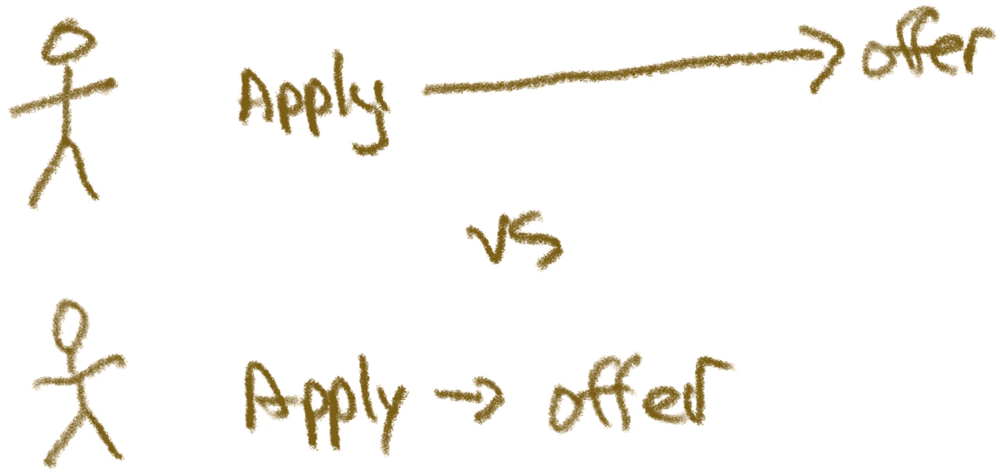
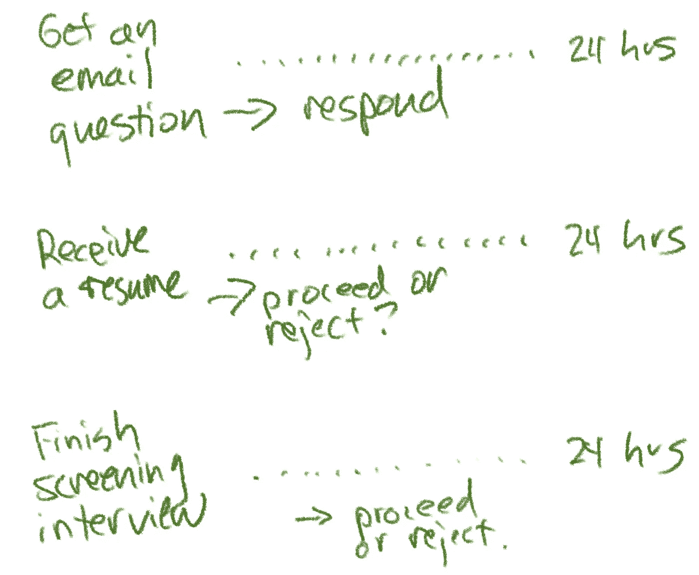
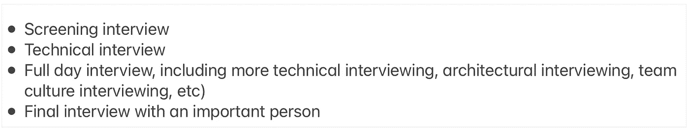
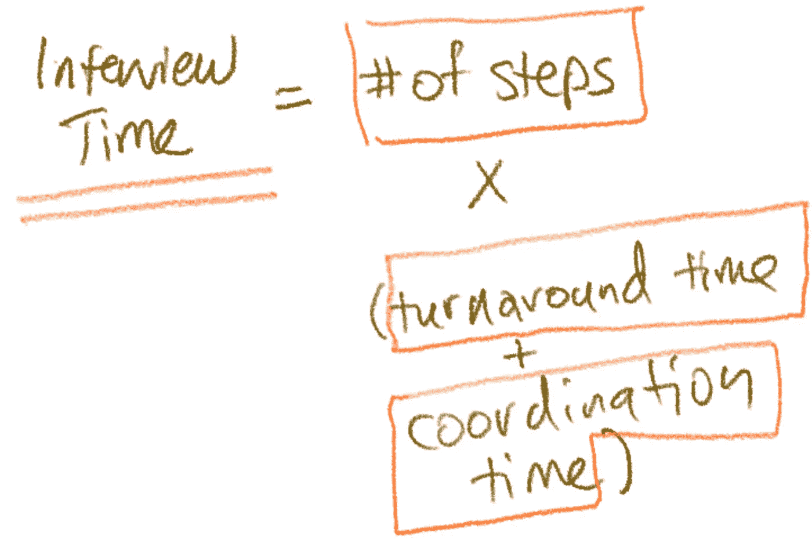
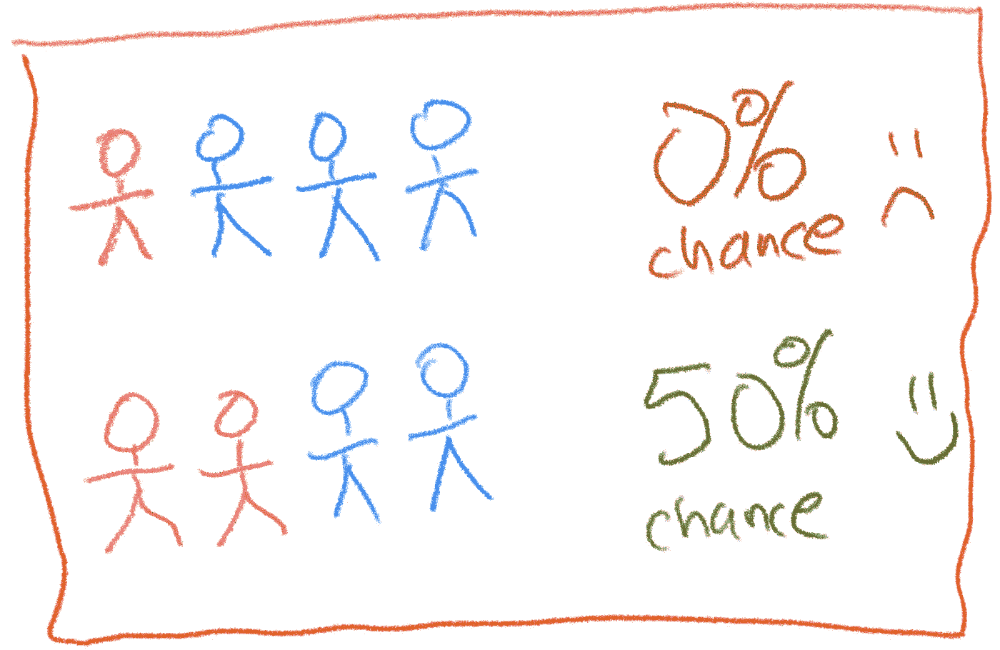

# 你的招聘过程太慢了吗？用这 5 个小贴士加快速度

> 原文：<https://betterprogramming.pub/is-your-hiring-process-too-slow-speed-it-up-with-these-5-tips-cf1a7a80d65f>

## 提高招聘效率最简单的方法就是加快速度。下面是如何做到这一点


# 更快的招聘可以推动巨大的进步

想象一下你对候选人了如指掌。你可以立即决定是否给他们一个提议。所以你给他们一个提议。他们会在接下来的几天内做出决定。你雇用该候选人的可能性有多大？



快速申请和获得聘用的对比

招聘时，时间窗口是一个差异化因素。候选人有足够的时间进行面试。他们有足够的时间做出决定。

如果你减少你的时间窗口，你与更少的公司竞争。你也加快了招聘的各个方面。

你可能会在一个月内填补一个职位，而不是在三个月内。这对一家成长中的公司的复合效应是巨大的。

# 给你的招聘团队一份服务水平协议(SLA)

我的建议是:给每个接触候选人的人 24 小时回复他们。理想情况下，你会在几个小时内回复应聘者。



需要 24 小时周转的事物的例子

即使你什么都不做，这也会给你比一般人好 2-10 倍的结果。

大多数公司需要一周或更长时间来回复候选人。这个小小的改变加速了你面试过程的每一步。最终结果是人们更快地完成整个过程。

这也会带来更好的体验。如果得到及时的回复，候选人会觉得自己受到了重视。

# 减少面试过程中的步骤

第二个要做的改变是删除面试过程中的步骤。

大多数面试过程包含三到五轮。例如，您可能有这样一个过程:



有很多步骤的面试

这些步骤中的每一步都会给你的面试过程增加新的周转时间。因此，取消步骤是与其他公司竞争的最佳方式:


少步骤面试

有了这些改变，你的时间窗口是一周或两周，而不是一个月或更长。

你的招聘渠道至少提高了 2-4 倍。你在和更少的公司竞争同一个人。这甚至没有考虑到候选人的体验要好得多这一事实。

# 提前安排好所有的步骤

你的面试需要多长时间的公式是:



面试时间的公式

```
(Number of steps) * (Turnaround time + Coordination time)
```

我们已经优化了步骤数量和周转时间。最后的优化是减少协调时间。

做到这一点的一个方法是预先安排好你的团队的面试时间，这样他们每周都有一定数量的面试时间。然后你可以提供眼前的时间，而不是遥远的未来。

这样做的另一个好处是，你可以确保你的面试团队每周都有合理的时间安排。

现在你在用火做饭！

# 面试直到找到合适的人，不要分批

你可以在面试中使用两种不同的模式:

*   批量面试。你面试了一群候选人，将他们相互比较，在面试了一大群人之后，你就有了决定。
*   滚动采访。你面试，直到找到合适的人。每当你找到适合这个角色的人，你就停下来。

批量面试比较慢，但是更公平，更彻底。

滚动面试一开始很难，因为你还没有校准你的候选人。他们在最后也很困难，因为当你还在面试有前途的候选人时，你可能不愿意发出邀请。

我推荐用*滚动面试*。你应该校准几周的，直到你对每个候选人有一个好的感觉。

# 两种模式的最佳多样性

如果你的招聘渠道不够多样化，你可以[分批招聘。](https://www.rubick.com/bundled-hiring/)

研究显示[如果你的候选人中只有一名女性，她被录用的可能性为零](https://hbr.org/2016/04/if-theres-only-one-woman-in-your-candidate-pool-theres-statistically-no-chance-shell-be-hired)，我想其他未被充分代表的群体也是如此。



我喜欢在面试完至少两个来自代表性不足群体的人之后再做决定。为了平衡快速招聘的需要，我给自己设定了一个时间限制。如果我没有达到这个限度，我可以继续，但是记下这个失败作为改进的信号。

这就是我如何试图平衡我对快速招聘的兴趣，以及我对公平招聘和从多样化的候选人中招聘的兴趣。

# 在最后一次面试的那天提交一份工作

加快速度的一个方法是监控“现场”面试的进展，在面试后立即与面试官交谈，或者让他们在面试后立即将其输入申请人跟踪系统(提示:在面试后立即为他们安排一次会议)。如果你看到了足够多的积极迹象，准备在一天结束时提出来。

我错过什么了吗？请和我分享你最喜欢的想法，我很想听听！

```
**Want to Connect?**This post was originally published [here](https://www.rubick.com/how-to-speed-up-hiring/). You can subscribe to my newsletter course on engineering leadership at [https://www.rubick.com/subscribe/](https://www.rubick.com/subscribe/).
```