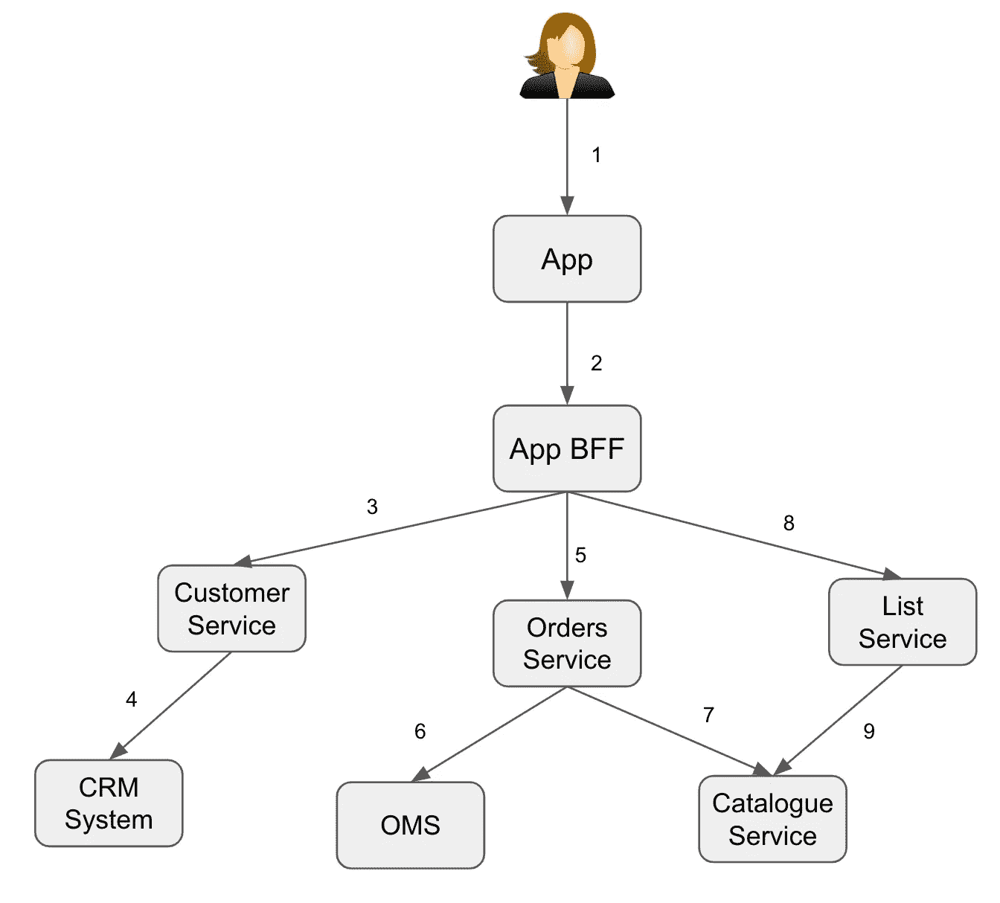
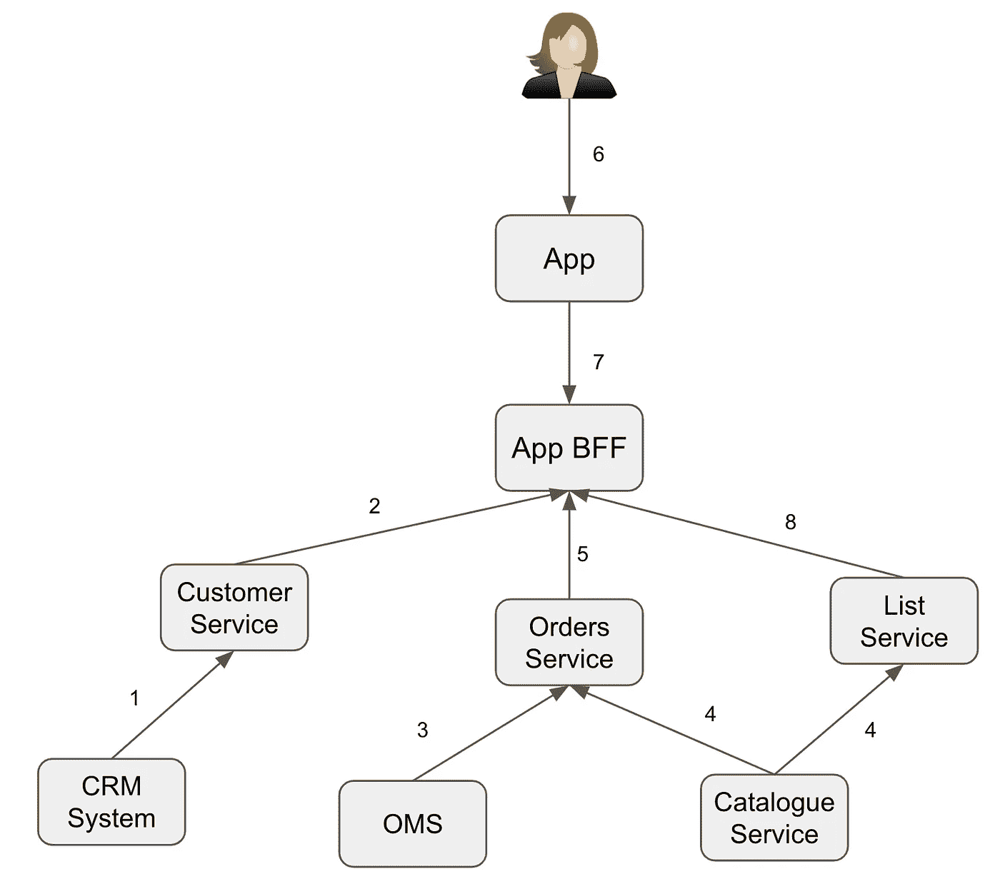

# 你的微服务架构是更弹球还是更麦当劳？

> 原文：<https://betterprogramming.pub/is-your-microservices-architecture-more-pinball-or-mcdonalds-9d2a79224da7>

## 了解您的系统从高处看起来的样子

韦斯·希克斯在 [Unsplash](https://unsplash.com?utm_source=medium&utm_medium=referral) 上的照片

微服务很棒。它们让我们能够打破传统的单一工业应用，用一系列灵活的服务取而代之。我不需要告诉你为什么这对现代组织来说很棒——有大量的资料会告诉你微服务的好处，以及同样重要的缺点。我假设你已经做了功课，并且很高兴地迁移到微服务(或者正在计划迁移)，或者已经这样做了，并且接受了结果。

我的微服务经验来自于处理面向客户的 web 和移动应用程序。当公司将网络/在线应用迁移到微服务时，我看到了两种截然不同的模式——一种我称之为弹球架构，另一种是快餐架构。

# 弹球建筑？

作为 70 年代和 80 年代的孩子，我深情地记得弹球机。你把你的钱放进投币口，它会打开一个金属球进入一个滑槽，你用一个活塞把它发射到游戏桌上。你通过击中特征和完成成套动作或简单地重复循环来累积分数。桌子的坡度和各种踢球的人都合谋把你的球送到桌子底部的排水沟，你唯一的防御就是用桌子边上的按钮控制的脚蹼击球。

照片由[斯蒂芬·西登](https://unsplash.com/@ssidde?utm_source=medium&utm_medium=referral)在 [Unsplash](https://unsplash.com?utm_source=medium&utm_medium=referral) 上拍摄

记忆之旅不错，但这与微服务有什么关系呢？想象一下，发射的球是一个进入你系统的 HTTP 请求。在顶部，它击中一个特征(服务)，然后被反弹到另一个方向，击中另一个特征(服务)，以此类推。

这并不是一个不常见的微服务架构。这是将现有的整体系统分解为微服务的结果，通常与云迁移相结合。在设计和构建您的解决方案时，保持这种请求服务的心态是正常的。但是，您最终得到的是一个服务/处理程序，它执行所有的跑腿工作，收集执行所需操作和返回所需响应所需的所有数据。

弹球架构:设计微服务时请求/响应思维的结果(图片由 Steve Cornish 提供)

如果你已经接受了无服务器或事件驱动的架构，这个问题会变得更加尖锐，更多、更小的“做好一件事”的服务有助于更大的系统。更多的消息/请求/事件在系统的不同组件之间传输会导致可观察性和操作上的挑战，需要一些严肃的检测工作来确定出错的根本原因。ThoughtWorks 在 2019 年 11 月称这是他们的[技术雷达](https://www.thoughtworks.com/radar/techniques/lambda-pinball)上的一个亮点(“Lambda pinball”)，尽管此后它已经下降。

这样的架构是完全合理的，但是额外的特性可能会不成比例地增加系统的复杂性。

随着时间的推移，随着系统的不断发展，弹球架构可能会成为一种负担。潜在的陷阱是:

*   意想不到的副作用——如果构建的服务预期由特定客户端使用(对于整体迁移来说并不少见),但现在接收到来自新客户端的调用，则可能会执行不需要的逻辑，例如，导致创建不准确的数据
*   竞争条件—如果服务 A 调用服务 B，然后调用服务 C，并且服务 B 和服务 C 都调用服务 D，那么如果服务 B 有一天很慢，服务 C 的调用首先被接收，该怎么办？
*   性能挑战——随着来自系统请求的更多内部负载，您将很快找到瓶颈所在。
*   非最优成本—您可以通过支出来解决云中的一些性能挑战(例如，增加 DynamoDB 上的读取 IOPS)。

因此，迟早你会感到一些痛苦，并决定减少内部系统负荷。有什么选择？

# 快餐建筑

快餐店的一个共同点是，为了实现快速的订单到口(请求/响应)时间，他们使用许多流程来提前**准备**和**呈现**部分餐点**、以满足需求。**

****

**[Jesson Mata](https://unsplash.com/@jessonmata?utm_source=medium&utm_medium=referral) 在 [Unsplash](https://unsplash.com?utm_source=medium&utm_medium=referral) 上拍摄的照片**

**我们来分析一下。**

## **准备和展示(食品版)**

**快餐店不等你点菜就开始为你做饭。能提前完成的事情通常会提前完成。零部件已经准备就绪，随时可以按照您的订单进行组装。示例:**

*   **汉堡店会做汉堡，希望很快会有人来点。他们会将汉堡与沙拉和小面包组装在一起，装盒，然后滑下滑道，让接单人员享用。**
*   **一辆装载薯条的街头食品车将会双倍或三倍烹制薯条，最终的薯条只需要几分钟就可以送到美味的、热的烹制好的薯条。热浇头将批量生产，并保持高温以备装配。准备好常温/冷浇头，放在服务员容易拿到的地方。**
*   **供应海鲜饭的市场摊位上有两个锅在忙碌着:一个已经煮好，可以上菜了，另一个准备在第一个锅卖完一部分后煮下一批。**

**这些“准备和展示”流程所实现的是履行订单的开端。你不需要等 20 分钟，等别人削土豆、切薯条，然后生吃——在你决定吃薯条之前，他们已经做好了！**

**但这与微服务架构有什么关系呢？好消息是你可以用相似的原则来达到相似的结果。**

## **作为食物准备的微服务**

**客户与您的系统的交互可以大致分为两种类型:**

*   **数据请求—例如，按类别分类的产品、产品详细信息、我的订单历史记录**
*   **操作请求—例如，更新我的个人资料、将商品添加到购物篮、结帐**

**行动请求有两种表现形式。客户要么等待请求的动作被确认(同步)，要么不等待(异步)。后者速度很快；前者受到负责操作的系统组件的限制，因此您没有太多的方法来提高性能。**

**对数据的请求也有类似的性能特征。客户需要等待请求的数据被获取并返回。如果系统需要从记录系统获取数据，则活动的性能会较慢；如果系统已经有可用的数据，则活动的性能会较快。**

## **准备并演示(系统版本)**

**就像快餐准备一样，系统可以准备和呈现数据。在这种情况下，我们讨论的是从后端系统(可能是多个后端)获取数据，并使其更接近处理客户请求的服务。**

**这根本不是什么新想法。历史上，许多后端不适合处理 web 级的请求量，因此在后端之前会放置一个缓存层。这使数据更接近客户，但是要真正获得快餐式架构的好处，您需要将它转换成接近客户需求的格式，并使它在本地可供处理客户请求的服务使用。**

****

**快餐式架构:准备数据以最小化请求深度的结果(图片由 Steve Cornish 提供)**

**我们该怎么做？**

# **快餐建筑的黄金法则**

## **1.当客户端等待时，最小化数据读取**

**显然，我们希望最大限度地缩短响应时间，因此消除 IO 是一个关键目标。默认的心态应该是准备好数据，除非有充分的理由不这样做。**

**这里有一些问题要问你自己:**

**我能早点得到这些数据吗？当客户提出要求时，您真的需要等待访问后端吗？**

****数据的波动性有多大？**数据是否经常变化，数据的准确性是否重要？请记住，客户看到的数据在他们看到时总是已经过时了 *x* 毫秒，所以真正的问题是“数据过时到什么程度还能被认为足够准确”对于像移动(蜂窝)电话数据限额或加密货币价格这样的事情，早期预取显然是不合适的，数据需要按需获取(可能需要一个短的生存时间缓存来减轻后端的负载)。**

**有什么方法可以通知我数据已更改？对于发生变化的数据，我是否必须等待下一个每日提要，或者我是否可以收到一个事件，告诉我应该刷新视图？**

## **2.最小化响应请求的数据转换**

**同样，我们希望最大限度地缩短响应时间，因此消除重复转换是另一个关键目标。我们希望最大限度地完成**而非**为满足客户需求而做的工作。**

**问自己更多的问题:**

****我是否在连续的请求上重复转换？**如果是的话，这是一个好迹象，表明您应该持久化转换后的数据，以避免不必要的工作。**

****所要求的数据可以按波动性细分吗？**也许转换是必要的，因为您将两个或更多数据源混合在一起以创建复合视图。如果是这种情况，请考虑组件数据部分的易失性。寻求将低变化数据一起预转换，并按需混合较高波动性的数据，从而最大限度地减少按需转换。**

****

**照片由 [S Migaj](https://unsplash.com/@simonmigaj?utm_source=medium&utm_medium=referral) 在 [Unsplash](https://unsplash.com?utm_source=medium&utm_medium=referral) 上拍摄**

**最大化未完成的工作——这在理论上非常容易，但还有其他实际问题需要记住。**

## **其他需要考虑的事情**

****准备好所有资料划算吗？**如果您在本地运行您的系统，您将需要配置大量存储。在云中，这没那么痛苦，但仍然是有成本的，在存储和 IO 方面都是如此。计算一下:每个系统都可以变得更快，但这样做并不总是划算的。这里一个可能的折衷方案是通过即时方法限制准备好的数据量。当您有可预测的需求模式时，这种方法非常有效，例如，使用客户登录事件来触发预取数据，以用于客户最有可能的下一个操作。**

****数据的安全要求是什么？**如果您将所有业务数据从后端取出并存储在离客户很近的地方，您就要对这些数据的安全性负责。思考:**

*   **是否有任何数据主权要求，例如，这些数据是否需要存放在欧盟数据中心？**
*   **我需要提供谁访问这些数据的审计线索吗？**
*   **我的数据保留和被遗忘权义务是什么？**
*   **我如何控制对这些数据的访问？以前，后端可能已经执行了授权检查，但如果它现在自愿将数据传送到您的系统，那么您就有责任重复授权检查。**

**所以继续吧，把你的业务数据当做食材。但是请注意，你仍然需要成为一个好的数据公民。**

# **弹球还是快餐？**

**那么哪个是最好的选择呢？就像生活中的大多数选择一样，这要视情况而定。弹球架构更容易理解、构建和操作，但是扩展起来更困难/更昂贵。快餐式架构的伸缩性和性能更好，但需要更高级别的工程成熟度。**

**你已经转向快餐式建筑了吗？如果是这样，我很想听听你的经历——好的或坏的！**