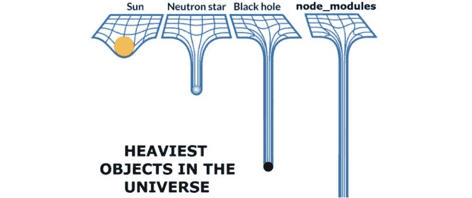
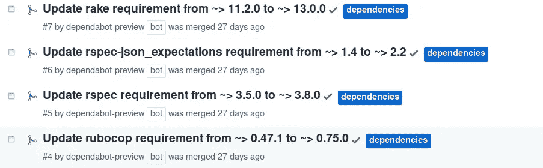
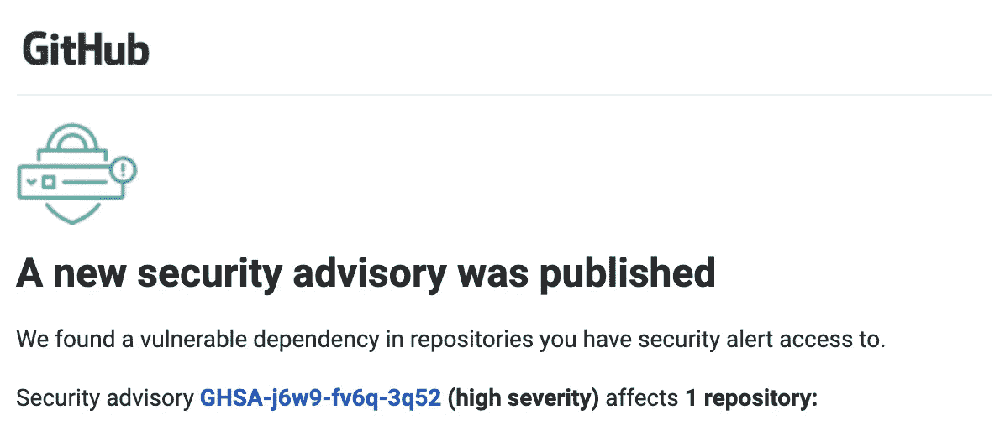

# 你的包文件比你老吗？

> 原文：<https://betterprogramming.pub/is-your-package-file-older-than-you-are-dd59d5dd5812>

## 您的依赖关系应该有多新？

来自[开发商](https://dev.to/leoat12/the-nodemodules-problem-29dc)的真正出色的图像。

我最近为我的一个 Android 项目设置了[dependent bot](https://dependabot.com/)。快速总结:Dependabot 会查看您的依赖文件(`.gradle`、pod 文件、`package.json`)，并按照设定的时间表自动打开 PRs 来更新您的每个包。它现在实际上是 GitHub 的一部分，安装就像签入文件一样简单。那你就有 PRs！这实际上再简单不过了，这一点你不能对许多系统说。

图片来自 [UnixDaemon](https://www.unixdaemon.net/tools/enabling-dependabot/) 。

这对于保持您的依赖关系是非常好的。如果您有针对 PRs 运行的 CI，您甚至可以得到一些确认，您的系统将使用这些更新。

但是…如果您不想更新您的依赖项呢？我安装了这个机器人，然后意识到我打开了这个巨大的蠕虫罐。配置 Dependabot 的有趣部分太短了，一旦所有的 PRs 打开，我意识到必须有人来解决它们。

所以我花了一整天的时间费力地进行冒烟测试，更新代码(修复一些较大的版本变更问题)，合并 PRs。

但是我做的改变越多，我就越像…“为什么？”

这个应用程序正在运行。我们不需要改变什么。现在我只是为 QA 测试了一些新的 alphas，并引入了更多的变化点，可能还有一些新的 bug。

我没有更新新功能或已知安全缺陷的依赖关系。我只是觉得我应该。那么，通过更新这些依赖关系，我实际上给表带来了什么价值呢？

# 我不能只锁定我的版本吗？

好吧，当然。锁定你的`package.json`或者你的年级版本将会使你不再担心你的依赖。我的意思是，升级您的软件包需要考虑很多因素:

*   我们应该什么时候升级？
*   我需要修改我的代码吗？
*   这些变化会导致什么样的错误？
*   新的依赖关系会相互兼容吗？我知道我在更新 npm 包时丢失了一些键盘。

这对于很多项目来说可能是好的，尤其是像学习项目或个人网站这样的小项目。这当然减少了你必须做的维护，你可以继续专注于建设。

## 你可以，但你可能不应该

锁定软件包的基本问题是您及时锁定了您的代码库。如果你关心软件的长期生存能力、可维护性，也许最重要的是安全性，你必须保持你的软件包是最新的。

## 安全掌握在您手中

你有过这样的经历吗？

作者照片。

GitHub 有一个自动服务，当你的依赖过期时，它会给你发一封电子邮件。这真是太棒了，因为“NPM 包安全分析师”不是一个真正的职位。

不幸的是，您的应用程序的安全性与您的依赖项的安全性联系在一起。如果你的程序服务于真实的用户，并且有真实的用户数据流经，你有责任确保这些包是安全的。

假设您收到一个已经*年没有更新的软件包的警告。*而你是四大版本背。如果你的代码超过 100，000 行。

突然间，你面前有一个季度的工作。这真的不是你可以搁置的事情。我的意思是，根据漏洞的不同，如果您泄露了客户的个人数据，您可能会面临严重的道德、法律和财务问题。

## 特色？是的，我想要

此外，您不希望您的应用程序现代化吗？开发人员不想在老旧的系统上工作。

另外，您可能希望软件包提供一些改进。这并不经常发生，但有时升级一个软件包可以让你获得*免费的*性能提升。当您需要重写所有服务时，您将无法做到这一点，因为您需要进行两个主要的版本更改。

# 所以，早点更新，经常更新

如果你真的关心你的项目的长期可行性，你必须关心你的依赖关系。你必须仔细阅读它们，并保持它们的一致性。

你应该多久更新一次你的依赖关系？这完全取决于你的团队和项目的构成。但是希望你至少可以每月运行一次像 Dependabot 这样的程序。

如果不是每月，甚至更频繁，因为在某些时候，你会有突破性的变化。您无法避免这些，但是您可以通过经常更新来使这些变化保持在较小的范围内，从而使您的生活变得更加轻松。

此外，当你*移除*依赖时，会有额外的奖励。每次去更新的时候，分析一下自己是不是真的需要那个依赖。如果你能轻易地去掉它，那就去做。只是一件事，以后不能破。

不要让你的系统因为疏忽而恶化。感谢阅读！