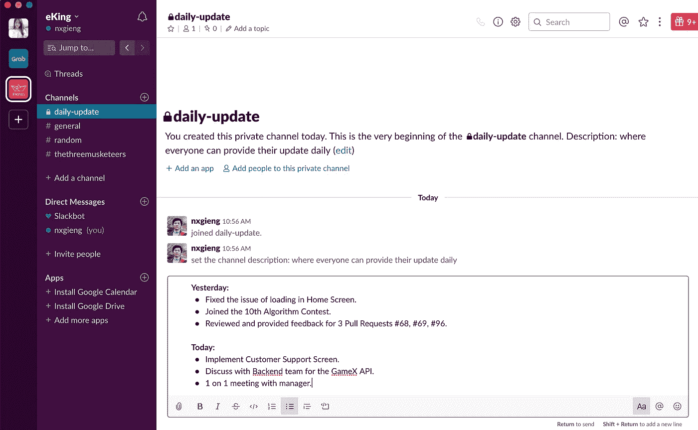
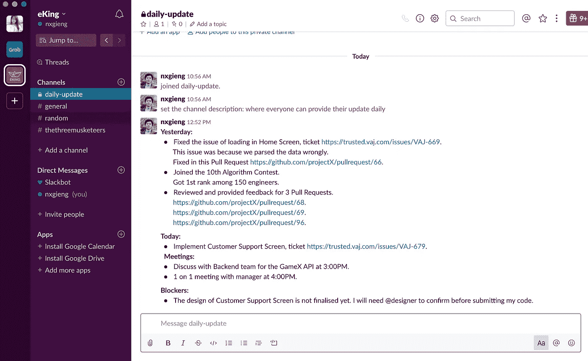

# 你传统的每日站立会议是在浪费你的时间吗？用不同的方式做

> 原文：<https://betterprogramming.pub/is-your-traditional-daily-standup-meeting-wasting-your-time-do-it-differently-f4692f409f1e>

## 我如何通过使用不同的方法每年为我的团队节省 2，200 个小时

索尼娅·兰福德在 [Unsplash](https://unsplash.com/s/photos/waste-time?utm_source=unsplash&utm_medium=referral&utm_content=creditCopyText) 上拍摄的照片

# 形势

我加入我的团队的时候，是 10 个人的团队。我们每天都举行每日站立会议。在会议中，每个人都有机会谈论他们的任务和阻碍因素。有时候，一群人会详细地谈论一个特定的话题，这只涉及到团队中的一些人。让我们说，一般来说，一个人试图在 5 分钟内给出他们的更新和解释。对于 10 个人来说，加上附带的故事和活动，会议将持续一个小时或更长时间。

那时候每天都是这样。我觉得没有生产力，我想我们需要改变。

# 解决方案

说话慢，打字更快。

你没听错。作为一个工程师团队，我们大部分时间都花在键盘打字上。我们中的一些人有时可能会在沟通方面遇到麻烦。因此，通过输入进行站立会议将提高速度，因为每个人都可以同时输入他们的状态和阻止者更新，甚至提前输入。

## **1。部分数字每日更新**

我之前的团队也有同样的浪费时间的问题。我们的团队站立会议很长，有时有些人没有必要一直呆到最后才听他们不需要的东西。我们决定创建一个 [Slack](https://slack.com/) 频道，让每个人在参加真正的单口相声会议之前提前写下他们的更新。

我曾经在 Slack 的每日更新频道上写过一个样本更新。

如你所见，我写的更新有两个时间点。

昨天是我写下昨天所做事情的地方。

今天是我列出今天计划要做的事情的地方。

*   ***优点***

我们将会议时间从 30 分钟减少到平均 7 分钟，节省了大量时间，比 ***快了 4 倍*** 。大部分时间，我们花在讨论我们的拦截器和移动笔记上，这些笔记代表我们在物理板上的 JIRA 门票。

*   ***弊***

由于我们仍然依赖于物理音符，这需要我们聚集在一起，将音符移动到正确的位置。有时候，阻挠者也在会议上花了很多时间。

# **2。数字每日更新**

由于我的团队没有使用 notes 来映射 JIRA 门票，我们可以很容易地消除前面解决方案的第一个缺点。对于屏蔽者，我们将它包含在更新中，然后每个人都可以在频道上讨论它。此外，当我们坐在一起时，被挡住的人可以很容易地绕过去，直接与他们需要交谈的人交谈。这有助于解放其他团队成员。

我每日更新的一个更好的版本现在是一天。

同样，我们有 ***昨天*** 和 ***今天*** 栏目，让人们了解我们做了什么和我们计划做什么。此外，如果你多看我的更新一会儿，你会看到更多的信息，可以帮助其他人更好地导航和理解，如链接和解释。我还将会议分成另一个类别，命名为 ***会议*** ，并提到每次会议的时间，以便我的队友可以轻松了解我一天的计划，以防他们想找到我。

*   ***优点***

我们不再有站立会议了。现在一切都被记录下来，我们都可以清楚地回到过去，知道我们过去做了什么。当我想知道自己在一个周期的绩效评估中取得的成绩时，这对我非常有帮助。这也会对你以后的简历有所帮助。

我们可以随时随地自由地写更新。这一优势使我们能够远程工作，而不用担心错过“重要的”团队会议。

*   ***缺点***

我们不再有站立会议了。这意味着我们需要其他活动来共度时光。

多打字，少说话。

# 结果呢

八个多月来，我们一直使用这些数字每日更新代替站立会议，我可以自信地告诉你，它大大提高了我们的生产力。现在，人们花五分钟写下他们的更新，再花五分钟阅读别人的更新。与我在文章开头提到的 60 分钟相比，我们团队节省了 83.3%的时间，也就是每天每场会议 50 分钟。一个团队中有 10 个人一个月工作 22 天，让我们做一个简单的计算来看看一年中的数字:

*50 分钟* x *10 人* x *22 天* x *12 个月= 132000 分钟=****2200 小时***

感谢阅读！