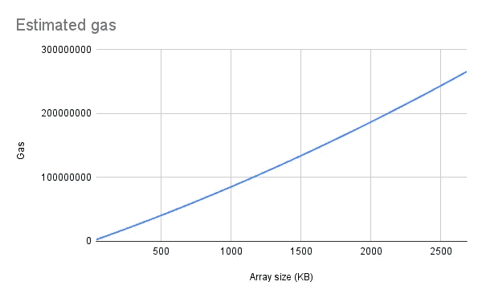
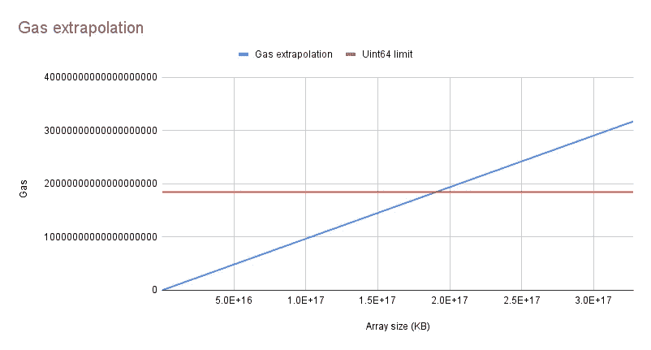

# Solidity 智能合约中动态大小数组的返回问题

> 原文：<https://betterprogramming.pub/issues-of-returning-arrays-of-dynamic-size-in-solidity-smart-contracts-dd1e54424235>

## 返回大数组的函数的局限性及其处理方法


作者图片

自从引入智能合约以来，基于智能合约的系统的复杂性已经增长了很多。它从简单的投票合同、 [ERC20](https://eips.ethereum.org/EIPS/eip-20) [代币](https://etherscan.io/address/0xdac17f958d2ee523a2206206994597c13d831ec7#code)开始，发展到复杂的架构，如 [Uniswap](https://github.com/Uniswap/v3-core) 、 [Aragon](https://github.com/aragon/core) 等。

现在更接近我们的故事:最近[定制应用程序(开发工作室)](https://customapp.tech/)，我工作的地方，正在开发一个 [Minter Guru dApp](https://apps.apple.com/tr/app/minter-guru/id1636761609) ，我正在研究系统架构和智能合同。根据 Minter Guru 的哲学，我们必须将尽可能多的逻辑转移到智能合约上。

在实现 read(from CRUD pattern)函数时，我们遇到了返回动态大小数组的问题，这些数组可能包含数百甚至数千个元素。因此，我们研究了实现这些功能的局限性。

在本文中，我们将讨论这些限制、处理它们的方法，以及用“使用智能合约实现 Web2 后端”的方法来构建应用程序的可行性。然而，如果你是一个有经验的 web3 开发者，我们的结果对你来说可能是显而易见的。:)

为了更好地理解，你应该熟悉[以太坊](https://ethereum.org/en/developers/docs/)区块链基础(或任何其他 EVM 兼容的区块链，如[多边形](https://polygon.technology/)或[币安智能链](https://bscscan.com/))、[坚固度](https://docs.soliditylang.org/en/v0.8.16/)和[安全帽](https://hardhat.org/)。示例中的所有代码以及如何运行它的说明都可以在我们的 [GitHub 资源库](https://github.com/custom-app/contract-call-return-limit)中找到。

# 气体极限

我们首先想到的是，理论上，我们可以达到气体极限。

在 EVM，每个函数调用都需要汽油。由于通话不花实气，我们可以设置任何气限，但由于 EVM 实施最大气限等于最大值为`uint64`式，即等于`18446744073709551615`。

让我们看看在简单的契约示例中，我们将多快达到这个限制。我们将使用一个与`uint256[]`存储变量的简单契约，将`n`值推送到数组函数和 getter 方法。此外，我们需要两个脚本来部署合同，并测试所需的气体限制。我们将使用 [Hardhat](https://hardhat.org/) 用于我们的本地网络和与合同的交互。

气体消耗基于阵列大小，因为 EVM 会将阵列数据复制到内存中。因此，我们将研究气体消耗和数组大小(以字节为单位)之间的依赖关系。为了简单起见，我们使用了`uint256[]`数组。对于其他数据类型，以字节为单位的编码数组大小的计算有所不同。根据[坚固性规格](https://docs.soliditylang.org/en/v0.8.15/abi-spec.html)、`Enc(uint256[])=Enc(array.size)(Enc(array[0],…,array[array.size-1]))`。因此，数组的字节大小等于`size(uint256)+size(uint256)*array.size=32+32*array.size`。

运行这个脚本时，我们看到 for 循环迭代开始变得非常慢。第 10 次迭代花了 10 多秒，第 50 次迭代花了 4 多分钟。顺便说一下，让我们检查一些结果(整个表格可以在[我们的 GitHub 库](https://github.com/custom-app/contract-call-return-limit/blob/main/results/result.csv)中找到):

某些阵列尺寸的估计气体值



估计气体对阵列尺寸的依赖性

在图表上，我们可以看到估计的气体线性地依赖于阵列大小，所以让我们建立外推来估计阵列的理论大小。我们已经使用谷歌电子表格和线性回归完成了这项工作。你可以在这里查看[。](https://docs.google.com/spreadsheets/d/1jnWNhqhUCnUP__fHJFF_Mk22Ow1SlQ2P3_m7k_ah50U/edit#gid=0)



估计气体外推

可以看到，理论上的 uint256 数组大小限制大约等于以千字节为单位的`1.8e+17`(以太字节为单位的`163709`)，这实际上是无法实现的。然而，正如我们已经看到的，执行时间是一个大问题。

# 执行时间

先提一下我们是在 [Hardhat](https://hardhat.org/) 网络上做测试，用 Node.js 实现，所以性能会比以太坊节点用的 [Golang 实现](https://github.com/ethereum/go-ethereum)差一些。然而，智能合约功能的性能受 EVM 设计的影响比受 EVM 实现语言的影响更大。

进行测试的机器的参数:

*   CPU —第 11 代英特尔酷睿 i7–1165 G7 @ 2.80 GHz×8
*   内存— 16 GB
*   操作系统— Ubuntu 22.04 LTS
*   磁盘— 512 GB 固态硬盘

现在让我们修改测试脚本来测量执行时间。我们只需要在测试脚本中修改 for 循环来记录执行时间。代码如下:

获取某些大小的数组的执行时间

现在我们可以看到，高执行时间问题出现得很快。对于 320 千字节的数据来说，12 秒的执行时间太长了，所以时间成为我们需要克服的主要问题。

# 页码

不幸的是，没有神奇的方法可以在合理的时间内获得大尺寸的数组。但是如果您的应用程序不需要一个完整的数组，您可以像 Web2 一样使用分页模式。然而，如果是这样，这是架构问题的标志，这在智能合约系统或经典的 Web2 应用程序中是无法解决的。

开发人员通常使用分页来限制一次 API 调用中返回数据的大小。这种方法减少了延迟，并减少了为浏览器和移动应用程序呈现的 UI 元素的数量。

分页的实现包括以下步骤:

*   在我们的数组上定义排序
*   向 API 方法添加页码和页面大小(在我们的例子中是契约函数)。您的新方法应该返回排序数组的一部分:`array[page*size:min((page+1)*size, array.length)]`
*   将一个数组中的元素总数添加到响应中，可以得到客户机上的页面数量。

现在让我们修改我们的测试智能契约，如下所示:

和测试脚本。我们还将为每个 get page 调用节省执行时间，以表明它对任何页面都保持不变。代码如下:

让我们检查我们的结果。同样，完整的结果可以在我们的库中找到。此外，为了减小表的大小，我们将只显示 get page 调用的平均和最大执行时间:

按页获取数组的执行时间

所以现在我们可以在合理的时间内得到数组的一部分。

最后一个细节:如果您想遍历一个状态可能被频繁修改的数组，您可以在调用函数时使用一个固定的块号。这保证了在每次单页调用时状态保持不变。使用 Hardhat 契约绑定，可以按如下方式完成:

# 结论

所以，我们发现了两个要点:

1.  函数返回大数组的主要问题是调用执行时间。
2.  通过分页，我们可以使调用时间足够合理，以获取部分数据。如果应用程序的 for 逻辑可以同时处理数组的各个部分，那么可以使用这种模式。

我们已经用最简单的 getter 逻辑完成了所有的测试，但是在您的应用程序中，getter 逻辑可能要复杂得多，所以在设计您的架构时，您应该小心地将所有东西移动到智能契约中。

部署到 mainnet 后，您可能会面临无法解决的问题(如果您的合同不可升级)。如果你觉得你的系统太复杂，不能全部放在智能合约中，结合智能合约和经典的 Web2 解决方案将是一个更好的应用程序。

# 参考

*   [带有示例的 GitHub 库](https://github.com/custom-app/contract-call-return-limit)
*   [我的同事兼好朋友写的一篇被严重低估的关于开发 Web3 原生 iOS 应用的文章](https://medium.com/better-programming/is-web3-native-mobile-app-possible-b0497da964ad)
*   [我的另一篇关于 NFT 智能合同与 OpenSea 整合的文章](/how-to-integrate-your-nft-smart-contracts-with-opensea-b2925789a62f)
*   [Minter Guru 应用](https://apps.apple.com/tr/app/minter-guru/id1636761609)
*   [Minter Guru Twitter](https://twitter.com/MinterGuru)
*   [定制 app 网站](https://customapp.tech/)

```
**Want to Connect?**[Twitter](https://twitter.com/shleshg_dev) | [LinkedIn](https://www.linkedin.com/in/oleg-shatniuk-5166b9234/)
```