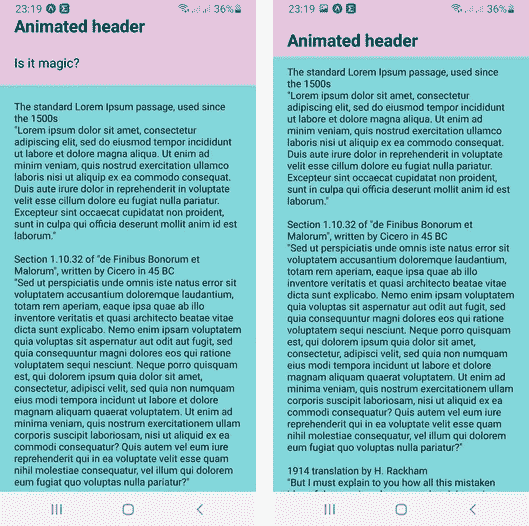
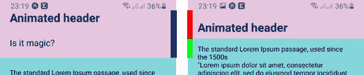
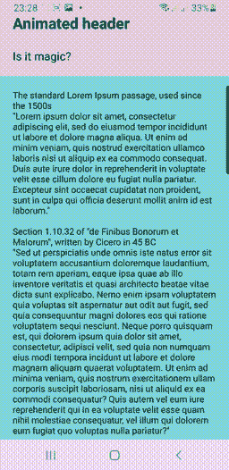

# 在 React Native 中创建漂亮的动画

> 原文：<https://betterprogramming.pub/it-is-moving-a68b89aee1e5>

## 动画让你的应用在视觉上更有吸引力。在 React 原生应用中制作标题动画

运动很吸引人(照片由 [Ahmad Odeh](https://unsplash.com/@aoddeh) 在 [Unsplash](https://medium.com/r?url=https%3A%2F%2Funsplash.com%2Fphotos%2Fckm1yAe6jhU) 上拍摄)

# 动画 API

如 [React 原生文档](https://reactnative.dev/docs/animated)所述:

> "`Animated`库旨在使动画流畅、强大，并且易于构建和维护."

换句话说，`Animated`帮助我们在屏幕上创造运动。创建动画的常见工作流程是:

*   创造一个`Animated.Value`
*   将其与动画组件的样式属性挂钩(例如，`Animated.View`)

听起来很简单，但实际上并不容易。

# 移动标题

假设我们的视图由一个标题和可滚动的内容组成。当我们滚动时，标题应该折叠一点，为内容腾出更多的空间。

页眉折叠，为内容腾出更多空间

实现类似行为有两种可能性:

*   粘性视差标题
*   差动夹钳接头

他们之间的区别非常微妙。您对它们的外观以及如何实现它们感兴趣吗？继续读！

# 成分

首先，我们需要定义一些常数:

它们定义了页眉在展开和折叠时的大小(见上面的蓝色/红色/绿色)。

该应用程序由标题和滚动视图组成。

标题和滚动视图组件定义如下:

以上要点中最重要的是:

*   `Animated.View`和`Animated.ScrollView`是允许动画的库组件。
*   当滚动视图滚动时(`onScroll`)，内容偏移的 y 值被分配给一个`scroll`变量。
*   `scroll`变量被转换成`translateHeader`(参见下面要点中的转换)，然后用于滚动标题(`translateY: translateHeader`)。

现在你可能会问自己`translateHeader`是如何计算的，以及`scroll`变量到底是什么。让我们来看看它们。

# 动画片

`scroll`保存滚动 y 轴偏移量的当前值。它是一个`Animated.Value`，用它来驱动所有的动画。

例如，`translateHeader`是`scroll`的插值。从范围`[0, X]`到`[0, -X]`进行插补。这仅仅意味着当我们向下滚动时，标题向上，当我们向上滚动时，标题向下(我打赌你猜到了)。如果`scroll`值超出规定范围，则`translateHeader`值被“钳位”以保持在界限内。

在上面的代码中，还有两个到目前为止还没有提到的变量:

*   `translateHeaderText`是相乘的`translateHeader`。`1.5` multiplier 表示文字移动速度比页眉快，`-`符号表示文字向相反方向移动。
*   `fadeOut`与`translateHeader`非常相似。它也是一个插值`scroll`，但是插值发生在不同的范围。

刚刚描述的两个变量用于动画标题中的两个动画文本。

让我们来分解一下:

*   它们都是`Animated.Text`组件——这是使用`Animated`库的先决条件。
*   `headerText`正在 y 轴上平移。
*   `fadingOutText`有动画不透明度(所以神奇的消失了)。

如果你对动画看起来很好奇，向下滚动一点。

# 式样

现在是创建动画视图的最后一个元素——样式。

上面的一些值只是为了使景色变美才重要。(只？那也很重要！)

对动画来说至关重要的是:

*   `height: HEADER_MAX_HEIGHT` —定义割台的初始高度。
*   `position: "absolute"` —使`header`独立于`scrollView`定位。
*   `zIndex: 1` —因为`header`是绝对定位的，所以它必须在`scrollView`的上方。
*   `marginTop: HEADER_MAX_HEIGHT` —由于`header`被绝对定位，`scrollView`被锚定在`container`组件的顶部。这意味着如果没有上边距，`scrollView`最初会隐藏在`header`后面。

在所有的理论和代码示例之后，是时候看看动画是什么样子了。

# 粘性视差标题

向下滚动滚动视图时，粘性视差标题会折叠。只有当滚动内容到达顶部时，标题才会展开。

粘性视差标题

# 差动夹钳接头

当滚动视图向下滚动时，比较箝位标题折叠。每当滚动内容向上滚动时，标题就会展开。

差动夹钳接头

是如何实现的？与粘性视差头的区别实际上非常微妙:

*   `headerDiffClamp`使用`diffClamp`实现所需的行为。`scroll`值保持在范围`[0, HEADER_SCROLL_DISTANCE]`内。动画值使用当前值和上一个值之差(`value = clamp(value + diff, min, max)` *)。*因此，即使`scroll`远离边界，当值开始再次接近时`headerDiffClamp`也会改变。
*   `translateHeader`和`fadeOut`基于差分箝位值，而不是之前的原始`scroll`。

# 源代码

如果您想深入了解并尝试使用演示应用程序，可以在 GitHub 上找到源代码:

 [## kwiecien/animated-header-rn

### 此时您不能执行该操作。您已使用另一个标签页或窗口登录。您已在另一个选项卡中注销，或者…

github.com](https://github.com/kwiecien/animated-header-rn) 

感谢阅读！