# 在两个 S3 桶之间移动数据需要两天时间和七名工程师

> 原文：<https://betterprogramming.pub/it-took-2-days-and-7-engineers-to-move-data-between-s3-buckets-d79c55b16d0>

## 在 S3 存储桶之间传输大数据的最佳选择


照片由来自 [Pexels](https://www.pexels.com/photo/photo-of-person-typing-on-computer-keyboard-735911/?utm_content=attributionCopyText&utm_medium=referral&utm_source=pexels) 的[苏米尔·库马尔](https://www.pexels.com/@soumil-kumar-4325?utm_content=attributionCopyText&utm_medium=referral&utm_source=pexels)拍摄

一个工程师团队试图将 25TB 的数据从一个 S3 存储桶快速转移到另一个[1]。他们的要求是移动大量的小日志文件(*在 MB* 的范围内)，最好是在接下来的两个小时内。事实证明，他们需要两个完整的工作日和一个由七名工程师组成的团队来完成这项任务。很容易称它们效率极低——从商业角度来看，这个问题似乎很简单。但事实是，在没有准备的情况下，执行如此大的数据传输不是在两个小时内可以轻松完成的事情。

让我们从他们的错误中吸取教训，看看我们如何更快更有效地完成这项工作。

# 哪里出了问题？

从最初的 Reddit 帖子中，除了他们希望快速传输 25 TB 的数据(主要由小日志文件组成)之外，我们没有获得很多背景信息。我们不知道他们必须将这些数据传入和传出哪些 AWS 区域。关于他们的方法，我们所知道的是，他们简单地进行了研究并得出结论，所有选项都太耗时，因此他们决定通过使用 AWS CLI、运行并行上传来迁移数据，如下所示:

```
aws s3 cp s3://source-bucket-name/ \
s3://destination-bucket-name/ --recursive \
--exclude "*" --include "2020-10*" \
--include "2020-09*" --include "2020-08*" \
--include "2020-07*" --include "2020-06*"
```

通过这种方式，他们利用多线程将数据传输分成多个操作[2]。每个`--include`块为以特定前缀开始的文件生成一个新的上传线程。`--exclude "*"`块确保我们在开始仅`include`具有特定前缀的文件之前排除所有文件。在上面显示的命令中，我们只包括以每个上传线程的特定年份和月份前缀开始的日志文件。

该命令将由一名工程师执行和监控，而另一名工程师(*或同一名工程师，但在另一个终端会话*中)可以运行其他月份的传输:

```
aws s3 cp s3://source-bucket-name/ \
s3://destination-bucket-name/ --recursive \
--exclude "*" --include "2020-05*" \
--include "2020-04*" --include "2020-03*" \
--include "2020-02*" --include "2020-01*"
```

尽管这是 AWS [2]推荐的在 S3 桶之间移动大量数据的选项之一，但它让我想起了一个 map-reduce 问题:如何统计图书馆的图书数量。在几个人(工人/流程)之间分配工作，在他们之间平均分配工作，这样每个人只清点特定书架上的书籍，每个工人将结果报告给协调人(主人)。

这种方法可行，但是会产生大量的开销(他们需要七名工程师和两天的时间来协调)。一定有更好的办法！

*注意:即使我们使用了* `*aws s3 cp*` *，我们也可以使用* `*aws s3 mv*` *来确保数据不仅被复制到目的地，还被从源桶中删除。*

# 设置从存储桶 A 到存储桶 B 的复制

理想情况下，我们不想单独迁移单个文件。我们倾向于只配置将数据从存储桶 A 传输到存储桶 b，有一个选项可以让我们做到这一点:复制。

复制允许我们将存储桶 A 配置为始终与存储桶 B 同步，并自动确保所有文件都被复制。

如果我们想将数据从生产存储桶复制到某个开发存储桶，复制就特别有用。通过这种方式，我们可以确保我们的开发环境拥有生产数据的精确副本，从而实现可靠的开发设置。

**AWS 允许我们使用** [3]:

*   CRR(跨区域复制)
*   SRR(相同区域复制)

这两个选项允许我们在跨地区(CRR)或同一地区(SRR)的存储桶之间移动数据。

注意，只有当两个 S3 存储桶都启用了*版本控制*时，复制才有效。

为了实现这一点，我们转到管理控制台，在我们的源 bucket 中，我们选择*管理→复制→添加规则*。然后，我们按照下面屏幕截图中所示的三个步骤，实现从 bucket A 到 bucket B 的版本控制和复制:

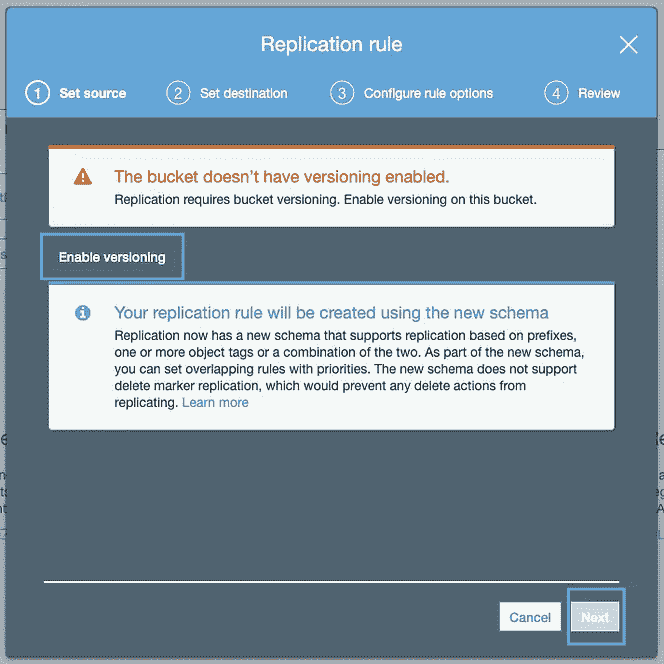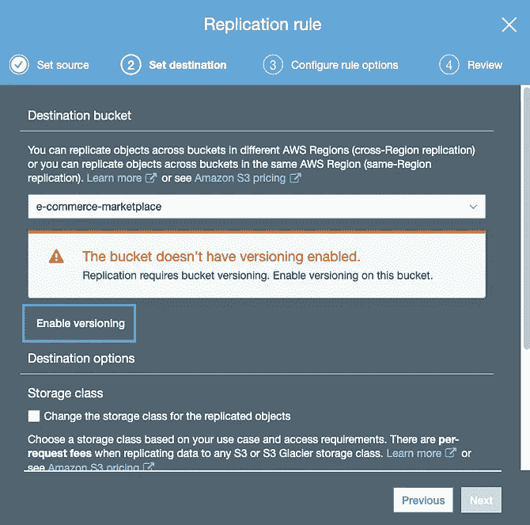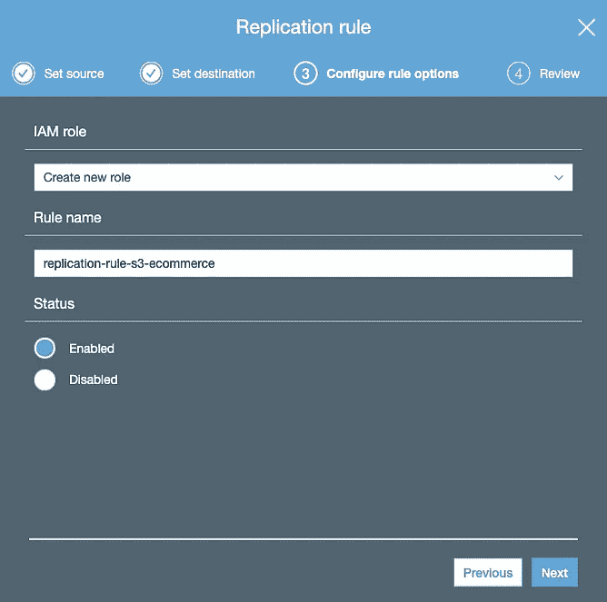

设置复制-按作者排列的图像

最后，我们应该会看到一个屏幕，确认复制已经建立:

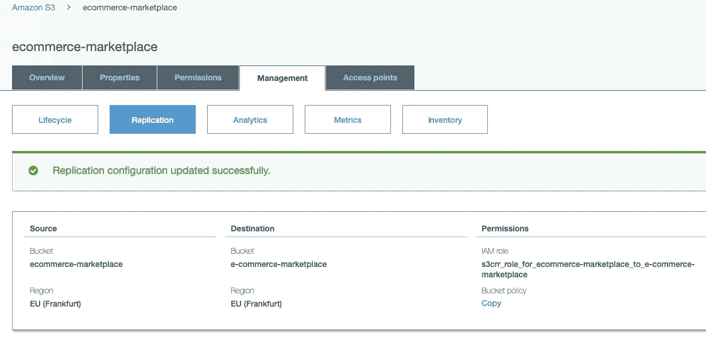

复制成功-按作者排序的图像

完事了吗？不完全是。

总的来说，复制听起来很棒，因为只要我们配置一次，就没有其他事情要做:AWS 自动将对象从 bucket A 复制到 bucket B。但是有一个警告:在我们设置好之后，复制只对我们将来上传的文件有效，它不会复制现有的对象！

不过，有一个技巧:改变 S3 存储桶的存储类别(或者，改变加密状态)就足够了。这可能涉及将存储类别从`Standard`更改为`Intelligent` 分层，但要点是:必须从一个类别更改为另一个类别。试图从`Standard`更改为`Standard`不会修改对象。通过更改存储类别，我们可以确保所有文件都:

*   从存储桶 A 移回到存储桶 A(但使用新的存储类别)。
*   自动复制到存储桶 b。

我们可以通过下面的命令[2]来实现这一点:

```
aws s3 cp s3://source-bucket-name s3://source-bucket-name --recursive --storage-class INTELLIGENT_TIERING
```

您可以从控制台执行同样的操作:

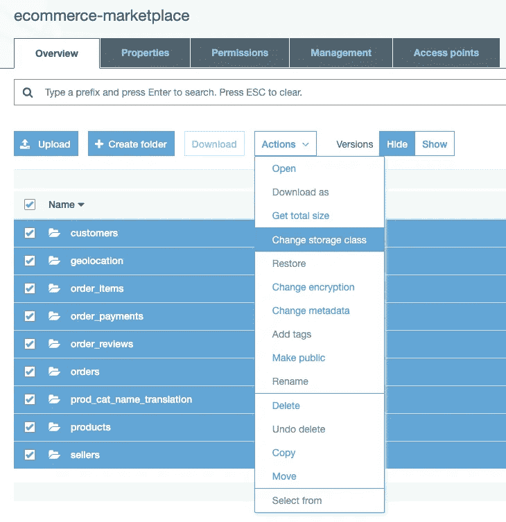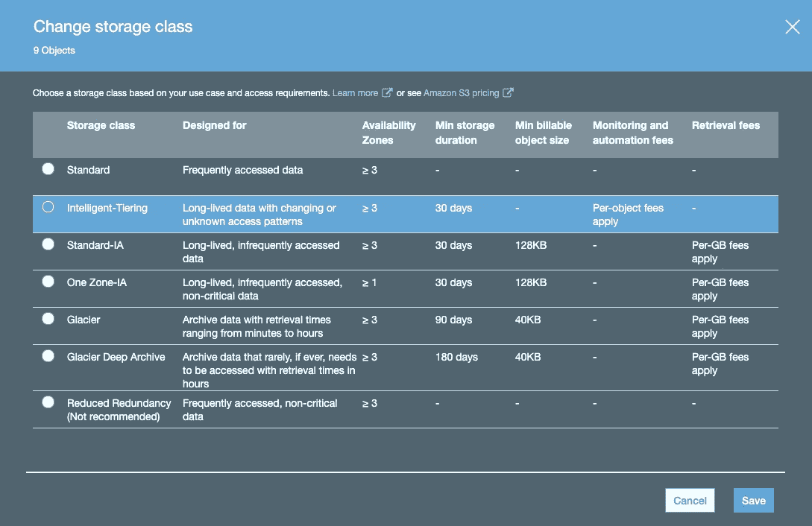

更改存储类别—按作者分类的图像

完成这些更改后，所有数据会自动从一个存储桶复制到另一个存储桶:

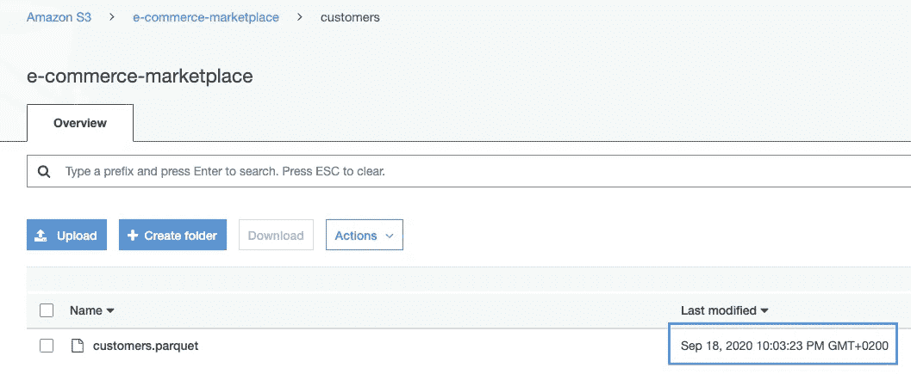

我们现在可以变回之前的存储类。

# S3 批处理操作

我们引入的第一种方法(AWS CLI)的缺点是，我们需要做大量的工作(我们自己的“map-reduce”)并进行许多 API 调用，这会产生较大的成本。第二种方法(复制)的缺点是这个过程是异步的，这意味着所有对象最终都会被复制。根据 AWS:

> “大多数对象在 15 分钟内完成复制，但是[有时复制可能需要几个小时或更长时间](https://docs.aws.amazon.com/AmazonS3/latest/dev/replication-troubleshoot.html)。”[4]

潜在的延迟可能是这些工程师没有选择这个选项的原因，他们希望在两个小时内完成数据传输。

在这种情况下，服务“ *S3 批处理操作”*似乎是一个有吸引力的替代方案。它承诺在单个 API 请求中快速处理大量 S3 对象[2]。

## S3 批量操作:过程

将数据从存储桶 A 移动到存储桶 B 的整个过程需要以下步骤:

*   设置库存报告(*它可以存储在同一个桶中，我们希望将数据复制到* → *桶 B* )以生成需要从桶 A 复制到桶 B 的所有对象的列表。

1.  为 S3 批处理操作创建 IAM 角色，为作业提供从两个存储桶(*或三个存储桶，如果您配置了将库存报告存储到第三个存储桶*)读取和写入数据的权限。
2.  在 AWS 管理控制台(*或 AWS CLI* )中，创建一个带有`PUT`复制操作的 S3 批处理作业，根据库存作业的输出进行实际的数据传输。
3.  运行作业并查看完成报告，以验证所有对象都已成功传输。

整个过程需要几个小时。

*请注意，在 S3 批处理操作中创建作业的一个重要先决条件是准备好库存报告(步骤 1)。*

## S3 批量操作在行动:实施

我们首先为我们的存储桶 A 创建一个 S3 库存报告(*选择您的存储桶→管理→库存*)，它将(*当完成*时)列出我们的 S3 存储桶中的所有对象:

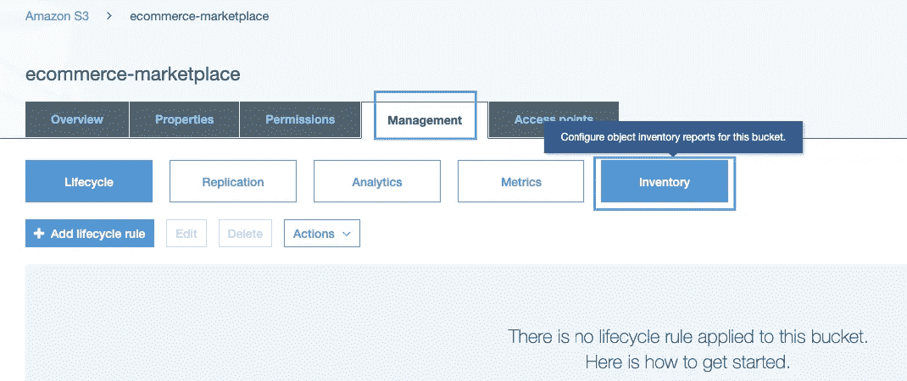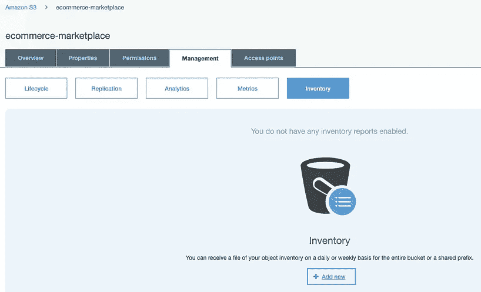

配置库存报告—按作者分类的图像

现在，我们可以自定义报告:选择目标存储区，选择是每天还是每周创建此报告，添加可选字段以包括额外的元数据，如对象大小、上次修改日期或对象是否加密。我们应该选择 CSV，因为这是唯一可用于 S3 批处理操作的格式:

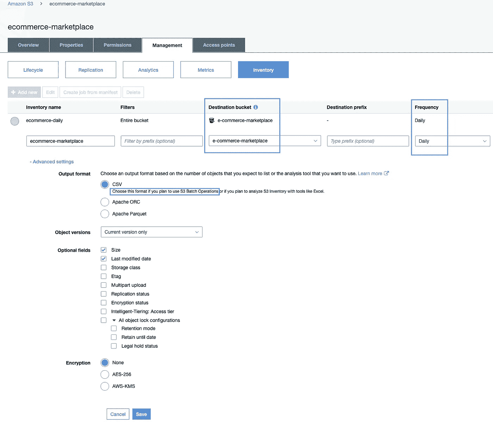

在 S3 配置库存报告-按作者分类的图像

单击“保存”后，配置就完成了。但是，AWS 通知我们可能需要 48 小时才能提交第一份报告！

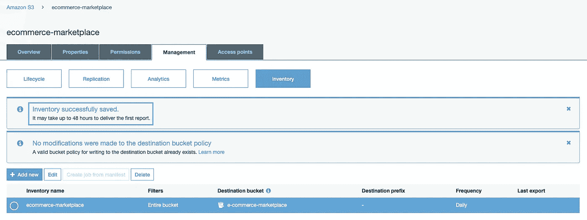

库存报告应在 48 小时内交付—图片由作者提供

我试图通过 AWS CLI 列出文件，将结果保存到一个 CSV 文件中，并上传到我的 S3 存储桶，来伪造它并自己生成库存报告:

```
# create the file manually
aws s3 ls s3://ecommerce-marketplace --recursive > manifest.csv# upload to S3
aws s3 cp manifest.csv s3://e-commerce-marketplace/manifest.csv
```

但是这个服务似乎要求库存报告采用特定的格式，这导致我的“S3 批处理操作”尝试失败:

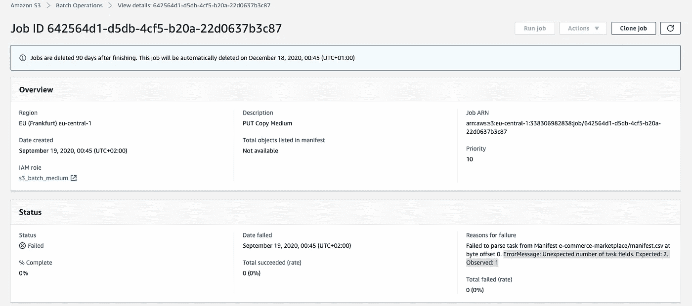

试图“伪造”库存报告—作者图片

显然，没有库存报告就意味着没有 S3 批处理作业！

如果我们已经有了这个库存，我们可以继续如下创建一个 S3 批处理操作作业:

*   创建新工作:

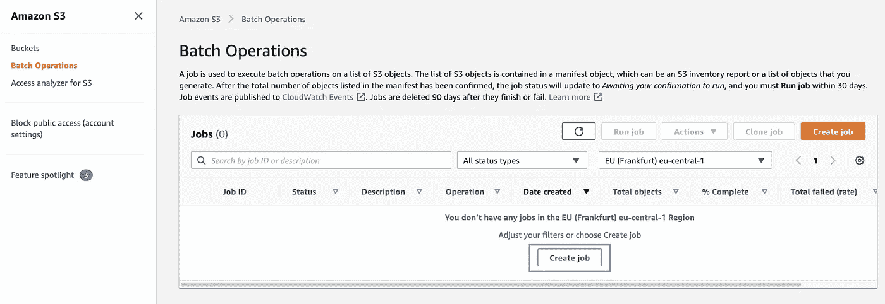

创建工作-按作者创建图像

*   指定 CSV 库存报告的路径和 S3 目的地( *bucket B* )，然后选择我们要执行的操作类型( *Copy* ):

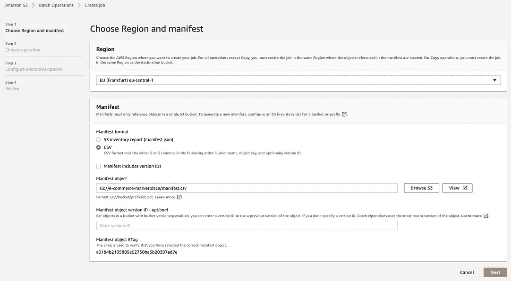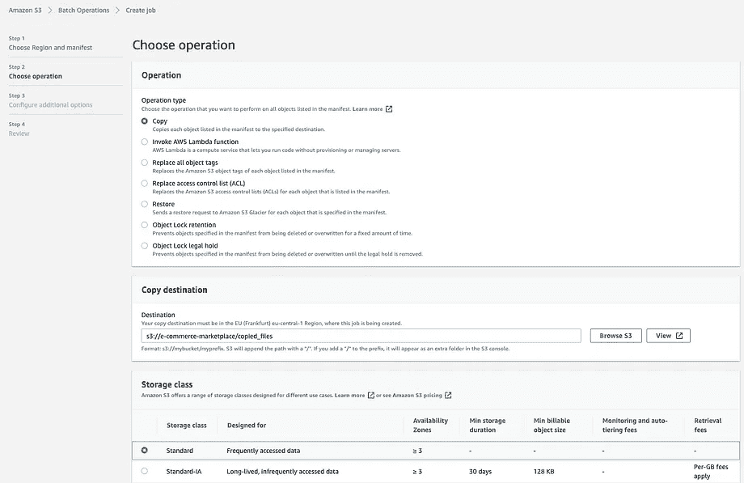

配置作业-按作者分类的图像

最后一步是配置完成报告和 IAM 角色，以授予作业访问我们的 S3 资源的权限:

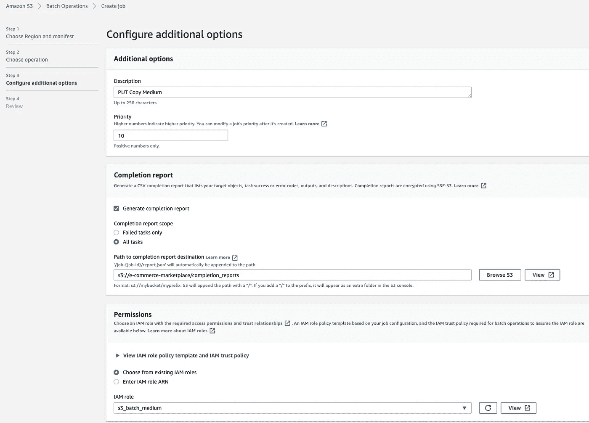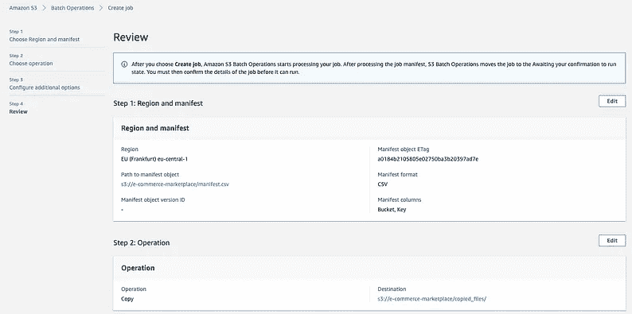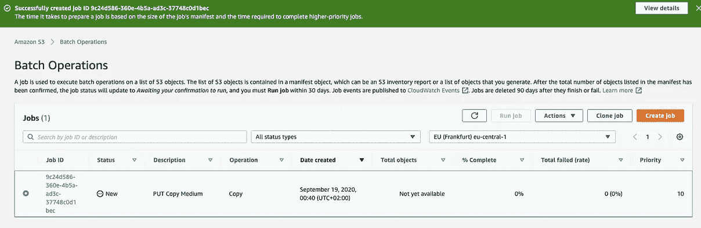

完成 S3 批处理操作作业以在 S3 存储桶之间移动大数据所需的所有后续步骤—图片由作者提供

# 替代选项

除了上述方法，AWS 还提供了在 S3 存储桶之间传输大量数据的其他方法:

*   AWS SDK:这需要您编写一个定制的应用程序(例如，用 Java)来完成这个简单的`COPY`操作。
*   在亚马逊 EMR 上运行 Hadoop 集群，执行`[S3DistCp](https://docs.aws.amazon.com/emr/latest/ReleaseGuide/UsingEMR_s3distcp.html)` [操作](https://docs.aws.amazon.com/emr/latest/ReleaseGuide/UsingEMR_s3distcp.html)，将大数据从 S3 复制到新的目的地。这涉及到运行并行复制命令，将数据从 bucket A 下载到 Hadoop 集群，并将文件并行写入 bucket B。

如果你问我，我会说这些选项似乎是**过度工程**的一个例子，但是在某些情况下它是有意义的，特别是如果你有一些意想不到的需求，比如必须在几个小时内移动数兆字节的数据。

# 结论

在本文中，我们讨论了在 S3 存储桶之间移动大量数据的几种选择:AWS CLI 复制命令、复制和 S3 批处理操作。我们可以得出这样的结论:如果不为此类迁移计划更多的时间(*例如，计划一个足够大的缓冲区以等待清单报告生成，或者等待复制来为我们处理这个过程*)，移动大量数据的过程会非常复杂。它需要定制的、通常过度设计的解决方案，例如:

*   用 AWS SDK 编写定制应用程序。
*   在 Hadoop 集群上执行 S3DistCp。
*   甚至尝试通过将 AWS CLI 复制过程分成单独的会话并将工作分配给七名工程师来执行自己的 map-reduce 工作。

我们不应该要求单个工程师在两个小时内完成如此大的数据传输。此外，提前规划可以首先消除对这种大数据传输的需要。

总的来说，我希望企业主和经理们能够认识到，工程中有许多事情不会在一夜之间发生(当然不会在两个小时内)。一切都需要计划、准备、收集和与涉众讨论需求、基础设施设置和大量测试。这是为业务问题提供高质量 IT 解决方案的唯一途径。

我从这些工程师的经历中学到了很多，我很感激他们分享了他们的故事。我希望它对你也有用。感谢您的阅读！

# **参考文献**

[1] Reddit 帖子:[https://www . Reddit . com/r/AWS/comments/irkshm/moving _ 25tb _ data _ from _ one _ S3 _ bucket _ to _ another/](https://www.reddit.com/r/aws/comments/irkshm/moving_25tb_data_from_one_s3_bucket_to_another/)

[2] AWS 知识中心:[https://AWS . Amazon . com/premium support/Knowledge-Center/S3-large-transfer-between-buckets/](https://aws.amazon.com/premiumsupport/knowledge-center/s3-large-transfer-between-buckets/)

[3]亚马逊 S3 —复制:[https://docs . AWS . Amazon . com/Amazon S3/latest/dev/Replication . html](https://docs.aws.amazon.com/AmazonS3/latest/dev/replication.html)

[4] S3 CRR 复制时间:[https://AWS . Amazon . com/premium support/knowledge-center/S3-crr-Replication-time/](https://aws.amazon.com/premiumsupport/knowledge-center/s3-crr-replication-time/)