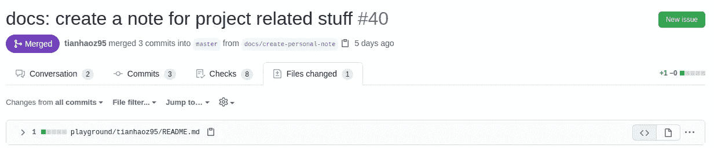

# 通过自动代码审查加快迭代速度

> 原文：<https://betterprogramming.pub/iterate-faster-with-automatic-code-review-2138731b55a6>

## 让开发人员不必审查琐碎的拉取请求

[通过 GitHub 批准人](https://github.com/tianhaoz95/approveman)

在软件开发中，代码评审对于维护代码质量非常重要。

为了帮助项目维护人员实现代码评审策略，GitHub 提供了一种方便的方法， [*保护分支*](https://docs.github.com/en/github/administering-a-repository/about-protected-branches) *，*在合并之前强制执行拉请求以满足某些评审策略。

# 实施代码审查策略的负面影响

虽然受保护的分支听起来像是一个很好的计划，但在实践中，它们可能很烦人，因为不是所有的拉请求都需要人的注意。

例如，如果我想在 markdown 文件中更新我的联系信息，就没有必要让另一个开发人员来审核我的更改。

# 潜在的变通办法

有几个解决方法:

*   将一个 monorepo 项目拆分为具有不同评审策略的子项目
*   为不太重要的变更建立分支

两种我都试过。

第一种方法的问题是，存储库的数量增长很快，开发人员很快就会讨厌在存储库之间切换。此外，很难记录每个存储库的用途。

对于第二个选项，分支之间的同步需要大量的工作。

对于这两者来说，将不太严格的区域中的代码迁移到评审策略下的位置也是一项重要的工作。

# 构建更好的解决方案

在处理了一段时间的混乱之后，我决定是时候用一种系统的方法来解决这个问题了:

如果有一个自动化的代码审查应用程序，让存储库所有者定义哪些拉请求是安全的/琐碎的，并自动批准它们，让受保护的分支方法处理其余的，那就太好了。

例如，应用程序可以检测到拉取请求只修改为我自己指定的区域下的文件——这可能是以我的 GitHub 用户名命名的目录:

它可以自动批准，为其他开发人员节省一些时间:

我觉得不错！我们如何才能做到这一点？

由于该应用程序需要通知拉请求活动，并需要与 GitHub 交互，这符合 [GitHub 应用程序](https://developer.github.com/apps/building-github-apps/)的定义，我选择在 GitHub 应用程序基础架构的基础上构建 [Probot](https://probot.github.io/) (一个抽象 GitHub 应用程序 API 底层细节的框架)。

用户在存储库的根目录下定义一个配置文件，该文件描述了确定拉请求是否安全/普通的规则。

每次打开一个 pull 请求，应用程序都会收到一个通知，并从存储库中读取上面提到的配置文件。

然后，如果规则适用，应用程序应该留下批准审查。

## 设计规则

为了帮助开发人员同时工作，配置的第一稿支持插入用户名。

一开始听起来可能有点抽象，但是让我们用一个例子来解释一下。

例如，用户可以定义以下配置，以允许针对以用户的 GitHub 用户名命名的目录中的文件的拉请求:

如果还是有点不清楚，我们在例子中插入一个真实的用户名。

以我的 GitHub 账号`tianhaoz95`为例，如果我打开一个 pull 请求来修改`plaground/tianhaoz95/README.md`，上面的配置会自动被批准。

## 实现应用程序

由于完整的实现可能会变得复杂，所以我将在本文中只展示一个过于简化的版本。

如需完整的源代码，请参阅资源库:

 [## 天昊 95/批准人

### ApproveMan 是一个 GitHub 应用程序，帮助批准安全更改的拉请求。为了维护存储库的健康…

github.com](https://github.com/tianhaoz95/approveman) 

**1。订阅拉取请求活动**

Probot 是一个方便的框架，它将传入的 webhook 事件映射到处理函数，因此我们不需要做管道工作。

以下代码将指示 Probot 订阅所有拉请求活动，并在检测到活动时运行处理函数:

如果拉式请求符合标准，函数`maybeApproveChange`发布一个批准审查。在步骤 5 中有关于这个函数的更多细节。

**2。从 pull-request 事件中获取已修改文件的列表**

GitHub 提供了一个方便的 API 来从 pull 请求中获取文件更改列表。我们可以使用以下代码访问 API:

**3。从存储库中读取配置**

由于 Probot 的抽象，阅读标准 GitHub 配置文件(`.github`目录中的文件)很容易。我们可以简单地调用 Probot `context`上的`config`方法来获得解析后的`yml`配置:

上面的代码读取`.github/approveman.yml`中的内容，解析`yaml`文件，并将其转换为 JavaScript 对象。

**4。将修改文件列表与配置进行比较**

为了确保拉取请求是安全的，拉取请求中的所有文件都需要遵循至少一个规则:

**注:**

*   第一个函数检查单个文件是否匹配单个规则
*   第二个函数检查单个文件是否匹配至少一个规则
*   第三个函数检查所有文件是否匹配至少一个规则

**5。也许批准拉动请求**

验证拉取请求是否安全后，下一步是批准它是否安全:

**注:**

*   第一个函数向 GitHub API 发送一个请求，在 pull 请求上添加一个批准
*   第二个函数是一个高级包装器，它使用了我们在步骤 1-4 中构建的所有东西。

# 外卖食品

如果你也对困难的代码审查政策有疑问，这里有一个应用程序适合你！

我在开源社区中遇到过一些开发人员，他们抱怨硬编码的代码审查政策降低了速度，或者为第一次贡献者设置了障碍。

如果你问了同样的问题，我开发的应用程序 [ApproveMan](https://github.com/marketplace/approveman) ，可以帮助你提高开发效率。

该应用程序可从以下网址获得:

 [## ApproveMan - GitHub 市场

### 为了将代码签入受保护的分支，通常需要进行审查。然而，为了允许早期阶段的快速迭代…

github.com](https://github.com/marketplace/approveman) 

## 如果你有更多创造性的方法来配置自动代码审查，欢迎投稿！

用 GitHub 用户名定义安全拉取请求是我想到的第一个模式——但肯定不是唯一有用的模式。

如果你有任何创造性的配置规则，ApproveMan 是开源的，你的好主意是一个拉请求。

## 如果您有关于如何简化开源开发的想法，可以把这看作是构建 GitHub 集成的教程

代码审查不是我们可以改进工作流程的唯一地方。

对于那些已经想象出更好的工作流的人，我希望这篇文章，作为一篇端到端的 GitHub 集成构建经验，可以帮助你开始。

感谢阅读！