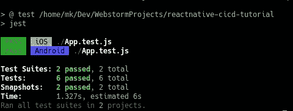
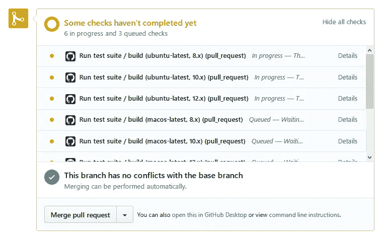
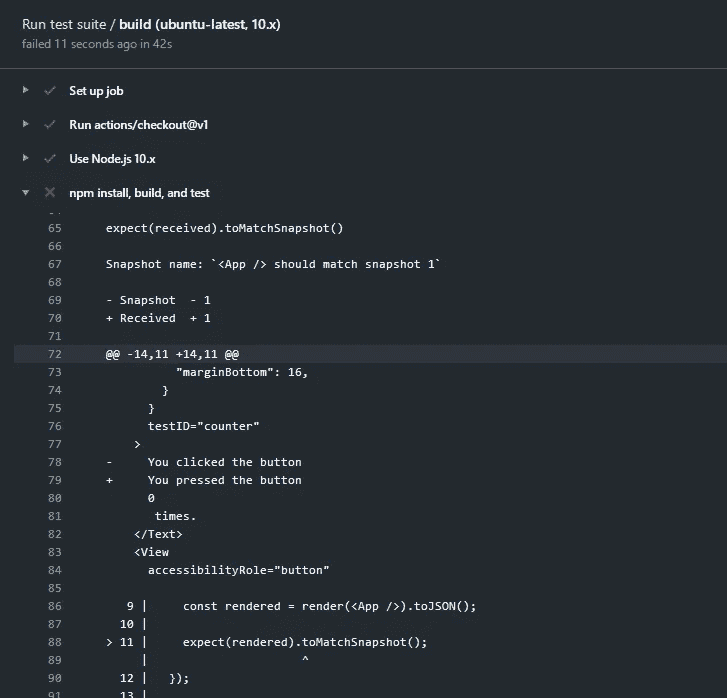
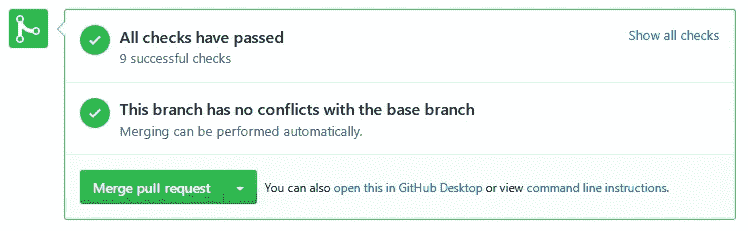
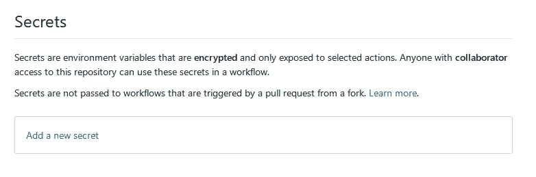
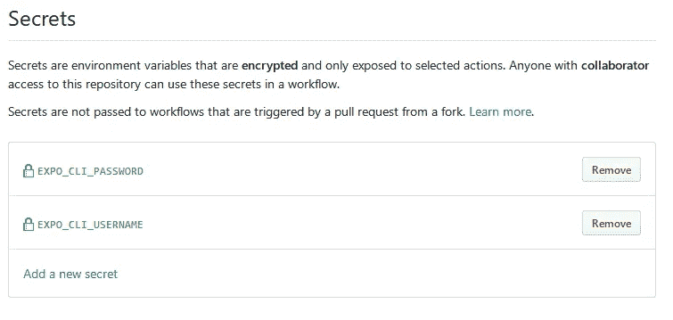
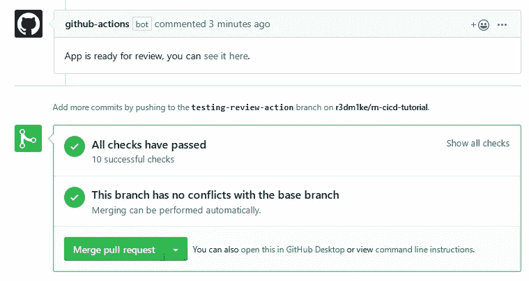

# 使用 Github Actions for React Native 加快迭代速度

> 原文：<https://betterprogramming.pub/iterate-faster-with-github-actions-for-react-native-55297e9975b4>

## 通过自动化工作节省时间、金钱和神经细胞


图片由 [Free-Photos](https://pixabay.com/photos/?utm_source=link-attribution&amp;utm_medium=referral&amp;utm_campaign=image&amp;utm_content=918735) 来自 [Pixabay](https://pixabay.com/?utm_source=link-attribution&amp;utm_medium=referral&amp;utm_campaign=image&amp;utm_content=918735)

[React Native](https://reactnative.dev/) ，连同 [Expo SDK](https://expo.io/) ，极大地加速了移动 app 开发的进程。如果说您可以通过采用持续集成和部署实践来进一步推动它*呢？*

# 什么是 CI/CD？

CI/CD 代表持续集成和持续部署。[持续集成](https://en.wikipedia.org/wiki/Continuous_integration)是将代码中的一些变化集成到代码库的其余部分中的实践，以确保它不会破坏任何东西(使用单元测试和集成测试)。

[持续部署](https://en.wikipedia.org/wiki/Continuous_deployment)是部署过程的自动化，允许团队节省时间和更快地迭代。结合起来，这些实践减少了拥有大型团队和代码库的开销，确保您的代码是干净和一致的，并允许开发人员专注于代码而不是基础设施。

# 什么是 Github 动作？

[Github Actions](https://github.com/features/actions) 是一些小脚本，可以插入常见的 Github 特性，比如打开一个 pull 请求、创建一个问题、合并到 master 等等。

已经创建了数千个可以在项目中使用的操作。Github Actions 可以让你自动完成你能想到的任何事情，包括运行测试、将构建部署到生产环境、根据更改的文件标记 PRs 等等。

哦，我提到过 Github 动作对公共存储库是完全免费的吗？

# 创建一个示例项目

为了向您展示 Github Actions 的强大功能，我将带您创建一个简单的 Expo 移动应用程序，并设置 Github Actions 来自动化其测试和部署。本教程不是关于 React Native 的，所以我假设你对移动开发有所了解。如果没有，[先看看这个教程。](https://reactnative.dev/docs/tutorial)

要创建一个新的 Expo SDK 项目，首先通过运行以下命令确保您已经安装了`expo-cli`:

```
npm i -g expo-cli
```

现在您可以创建一个项目:

```
expo init
```

Expo 会问你几个配置问题。选择“空白”作为应用程序模板，并输入项目的名称。几分钟后，项目将被创建。您可以通过打开项目文件夹并运行以下命令来检查一切是否正常:

```
expo start
```

*注意:您需要一部手机或安装了 Expo 客户端的模拟器来运行您的应用程序。*

它应该是这样的:


# 在 Github 上发布您的项目

要使用 Github 动作，你的项目需要托管在 Github 上(显然！)

为此，在 Github 上创建一个 repo。[此链接](https://github.com/new)将带您进入新的回购页面。输入新回购的名称和描述(如果需要)。创建好 repo 之后，就可以将项目发布到 Github 了。在项目文件夹中打开终端，并在其中运行以下命令:

```
git remote add origin remote YOUR_REPO_URL_HERE 
git push origin master
```

现在你可以在 Github 上打开你的回购，并验证一切都在那里。我还公布了我的回购协议，并公之于众，你可以在任何时候[参考](https://github.com/r3dm1ke/rn-cicd-tutorial)它。

# 添加单元测试框架

最流行的 CI 操作之一是对每个 pull 请求运行单元测试。当然，要运行单元测试，我们首先需要有单元测试。在这里，我不会详细介绍 React 本地项目的单元测试，但是可以随时查看本文以供参考:

[](https://medium.com/@mihalkrasnov/testing-react-native-apps-with-jest-1d575ded6a2c) [## 用 Jest 测试 React 本地应用

### 在这篇文章中，我将解释为什么单元测试是重要的，单元测试的一些原则，并向你展示它是如何…

medium.com](https://medium.com/@mihalkrasnov/testing-react-native-apps-with-jest-1d575ded6a2c) 

为了设置单元测试，我们需要更多的包:

```
npm i -S jest jest-expo react-native-testing-library
```

`jest`是试车员。它将收集我们的测试，运行它们，并报告结果。`jest-expo`有一些专门针对世博项目的配置。`react-native-testing-library`有一组帮助器来渲染和触发组件上的动作。安装好所有东西后，创建一个文件`jest.config.js`,其中包含以下代码:

这个配置告诉`jest`使用`jest-expo`预置，并针对 Android 和 iOS 运行两次测试。要运行测试，请将这一行添加到 package.json 的脚本部分:

```
"test": "jest"
```

您可以尝试现在用`npm test`运行测试，但是它会失败，因为我们现在没有任何测试。

# 添加功能和单元测试

要添加单元测试，我们需要测试一些东西。让我们添加一个计数器和一个按钮，这将增加一个计数器。将此代码添加到`App.js`:

它在手机上应该是这样的:


现在我们需要测试它。默认情况下，jest 会在每个以`test.js`结尾的文件中选取测试。创建一个文件`App.test.js`并将以下代码添加到其中:

该测试套件将检查:

1.  快照
2.  计数器初始值为 0
3.  当按下按钮时，计数器增加到 1

你可以用`npm test`来运行它。输出应该如下所示:



# 添加您的第一个 Github 动作

Github 动作是用 [YAML](https://yaml.org/) 编写的。YAML 是一种配置语言——非常像 JSON，但是更易于阅读。这些配置存储在`.github/workflows`中。

用以下内容创建一个文件`.github/workflows/tests.yml`:

这个文件定义了一个名为`Run test suite`的 Github 动作(第 1 行)。

我指定它在任何拉请求时运行(第 3 行)。

`jobs`部分定义了要完成的任务。在我们的例子中，它只有一个:`build`(第 5-6 行)。

`strategy` */* `matrix`部分是为了确保我们的测试在不同的环境中是一致的。它可以测试操作系统(win、lin、mac)和节点版本(8、10、12)的所有组合。

这是一个非常健壮的解决方案，但是将占用大量资源(每个测试用例将运行 3*3=9 次)。如果你在付费计划中，你应该考虑取消一些选项。

`steps`部分定义了要采取的具体步骤。`-uses: actions/checkout@v1`行(14)使用另一个动作将代码从分支中签出到环境中。然后，`actions/setup-node@v1`(第 17 行)动作将 Node 安装到相同的环境中。

最后，第 21-23 行列出了将要运行的实际终端命令。`npm ci`与`npm install`相同，但设计时考虑了 CI/CD 环境。首先，它从`package-lock.json`而不是`package.json`获取依赖信息。

最后一个命令运行测试。如果任何测试失败，jest 将返回一个非零代码，Github 会将其视为失败。

# 测试您的第一个动作

在您将您的更改提交并推送到 Github 之后，您的操作将是活动的。为了测试它，创建一个新的分支:

```
git checkout -b testing-tests-action
```

为了创造一个公共关系，我们必须改变一些事情。让我们更改`App.js`中的文本，这样我们的快照会失败，我们稍后会更新它们以使测试通过。我只是把第 12 行的`clicked`改成了`pressed`。现在，提交并将您的分支推送到 GitHub:

```
git add . 
git commit -m 'dummy commit' 
git push origin testing-tests-action
```

之后上 Github 开个 PR:


一旦您打开 PR，Github 将立即运行您的操作:



几分钟后，测试将会失败。这是因为我们更新了 UI，但没有更新快照。您可以通过单击“详细信息”来检查脚本的输出:



事实上，Jest 告诉我们快照正在失败。要修复它，运行项目文件夹中的`npm test -- -u`。这将更新`snap.android`和`snap.ios`文件。一旦它们被更新，提交并再次推送它们。由于您对 PR 进行了更改，Github 将再次运行您的操作。几分钟后，您的测试应该会通过:



# 用 Github 动作简化评论

单元测试是好的，但是你通常也想在你的手机上测试。当然，您可以在 PC 上克隆 PR 并构建它，但这听起来工作量太大了。让我们实现自动化吧！

回到`master`分支，用以下代码创建一个文件`.github/workflows/review.yml`:

你会注意到这个动作也在每个 PR 上运行，并且使用现在熟悉的`checkout`和`setup-node`动作。这里的三个新概念是`expo/expo-github-action`、`unsplash/comment-on-pr`和`secrets`。

`expo-github-action`具有操作`expo-cli`的功能。它允许我们测试、构建和发布世博会项目。要工作，它需要一个工作博览会帐户。如果您没有，请在此处创建一个[。此操作使用 PR ID 将应用程序发布到特定的发布渠道。](https://expo.io/signup)

`unsplash/comment-on-pr`行动用于对 PR 上的世博会构建链接进行评论。URL 是在第 24 行构建的。请务必将`YOUR_APP_SLUG_HERE`更改为您实际的应用程序块(您可以在`app.json`中找到它)

`secrets`是一种将凭证传递给动作而不在回购中暴露它们的安全方式。如果您检查代码，您可以看到我们需要`EXPO_CLI_USERNAME`、`EXPO_CLI_PASSWORD`和`GITHUB_TOKEN`。世博秘笈是您之前创建的世博账户的凭证。`GITHUB_TOKEN`是 Github API 的访问令牌，由 Github 自动为您注入。

要将这些凭证添加到 secrets，请打开 repo 的`Settings`部分，然后选择`Secrets`:



现在添加世博会证书:



你的行动应该准备好了。要检查它，创建一个新的分支，改变一些东西(我把背景颜色设为绿色)，然后打开一个 PR。我们之前已经做过了，所以我不打算再按部就班地做了。完成后，此操作将构建您的应用程序，发布它并在 PR 上评论一个链接:



现在，您团队中的任何人都可以在他们的手机上点击这个链接，打开这个非常公关！这与 Github 移动客户端配合得特别好。

# 使用 Github 动作自动化您的部署

你可能会在这一点上停下来，但我非常懒惰，这就是为什么我们也将自动部署 Expo 应用程序。它将在每次提交/合并到`master`分支时运行。一般来说，你的开发会集中在类似于`develop`分支的东西上，你会通过把它合并到`master`中(或者使用一个中间分支，比如`release-candidate`)来做一个发布。

幸运的是，部署操作非常简单，与上一个相似。用以下代码创建一个文件`.github/workflows/deploy.yml`:

如我所说，此时一切都应该看起来很熟悉。我们检查代码，安装 Node 和 Expo，运行测试，然后发布。运行测试似乎是多余的，但是我们这样做只是为了确保不完整的版本不会进入生产。

现在，您可以通过将任何内容推送到主分支来测试这个脚本(不过，要确保测试通过)。然后，您的应用程序应该可以通过 Expo 客户端获得，如果您进行了任何生产构建，它们也应该得到更新。

# 结束语

感谢您的阅读，希望本指南能对您的项目有所帮助。请在评论中告诉我你的想法以及你能想到的其他 CI/CD 行动！

# 资源

*   [同伴回购](https://github.com/r3dm1ke/rn-cicd-tutorial)
*   [CI/CD 的 5 个常见陷阱](https://www.infoworld.com/article/3113680/5-common-pitfalls-of-cicd-and-how-to-avoid-them.html)
*   [持续集成、交付和部署:对方法、工具、挑战和实践的系统审查](https://ieeexplore.ieee.org/document/7884954)
*   [Github 行动市场](https://github.com/marketplace?type=actions)
*   [Github 动作的安全含义](https://www.widgetsandburritos.com/posts/2019-01-09/important-security-implications-github-actions)
*   [CI/CD 上的 Expo SDK 文档](https://docs.expo.io/versions/latest/guides/setting-up-continuous-integration/)