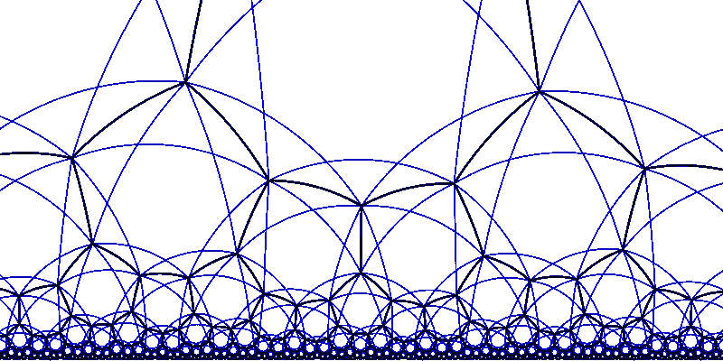

# 迭代器设计模式是什么？

> 原文：<https://betterprogramming.pub/iterator-pattern-in-php-b7624f6bdbcf>

## 遍历数据而不需要知道它的真实结构

克劳迪奥·罗奇尼在[维基媒体](https://de.wikipedia.org/wiki/Datei:Poincare_halfplane_heptagonal_hb.svg)上的照片

迭代器的思想是将与数据遍历相关的逻辑移到一个单独的类中。迭代器使得处理复杂的数据结构变得更加容易，而不必修改它们的实现。

PHP 提供了一个现成的接口来实现迭代器。SPL 迭代器的使用使得用内置循环遍历数据变得非常容易。

假设我们在一家有很多部门的公司工作。每个部门内部可以有另一个部门，也可以有很多人，所以我们必须处理树形结构的数据。我们想要检查给定人员的下属的完整列表及其总数。

模式由四个元素组成:
1。迭代器(`Iterator`):定义迭代器的接口
2。具体迭代器(`EmployeeTeamIterator`):迭代器
3 的实现。聚合(`IteratorAggregate`):定义聚合的接口并使用迭代器
4。混凝土骨料(`CompanyEmployeeTeam`):骨料的实现

迭代器和具体迭代器只包含与迭代相关的逻辑。所有业务规则和其他逻辑都应该放在聚合或其他组件中。集合有时也被称为集合。

让我们从嵌套数据的迭代实现开始。我们检索给定人员的所有下属(包括他们的下属)，并将其存储在`$teamMembers`中。

稍后通过迭代器接口的方法提供对这个变量的访问。知道我们在和多少人打交道也很重要，所以我们也使用 SPL 可数接口。

[EmployeeTeamIterator.php](https://gist.github.com/jkapuscik2/19e32024c8306975ec8eaa1cbce1b0f5)

为了简单起见，我们的雇员迭代器非常简单。它只有两个公共属性:名称和位置。

我们现在可以轻松地遍历员工，但是我们需要一个地方来添加、删除和管理关于我们团队的信息。这是聚合的完美角色。

现在管理我们公司的员工成了小菜一碟。如果我们想获得关于人们的信息，我们可以很容易地做到。

迭代器是一种非常简单的模式，但是非常有用，可以让你的代码更加整洁。

迭代器的伟大之处在于它封装了关于我们正在遍历的数据类型的信息。它可以是:树结构、平面数组、来自文件的数据等。客户端不必关心这些细节，因此可以使用不同类型的数据，而不改变其实现。

打开-关闭和单一责任原则实际上是构建在这种模式的设计中的。

# 源代码

完整的源代码和一些其他模式的描述可以在这里找到:

 [## jkapuscik 2/设计-模式-php

### 这个项目是一组在现实世界中使用不同设计模式的简单例子。每个人都有一个…

github.com](https://github.com/jkapuscik2/design-patterns-php) 

如果您想了解一些更有用的设计模式，您可以在以下文章中找到它们:

*   [工厂方法](https://medium.com/@j.kapuscik2/getting-started-with-design-patterns-in-php-4d451ccdfb71)
*   [创作模式](https://medium.com/@j.kapuscik2/creational-design-patterns-in-php-db365d3245ce)
*   [观察者](https://medium.com/@j.kapuscik2/observer-pattern-in-php-2ba240f89fb2)
*   [状态&策略](https://medium.com/@j.kapuscik2/state-strategy-design-patterns-by-example-f57ebd7b6211)
*   [模板方法](https://medium.com/@j.kapuscik2/template-method-pattern-in-php-6116fd7e8ccc?source=friends_link&sk=ac4c483446bd5a5323c09a662bd54116)
*   [飞锤](https://medium.com/swlh/flyweight-design-pattern-in-php-edcda0486fb0?source=friends_link&sk=a0fa3083d5afd7e41af8a4f7a1df05f1)
*   [代理](https://medium.com/better-programming/proxy-design-pattern-and-how-to-use-it-acd0f11e5330)
*   [装饰者](https://medium.com/better-programming/decorator-c04fae63dfff)
*   [依赖注入](https://medium.com/better-programming/dependency-injection-8f09a93ec995)
*   [复合](https://medium.com/swlh/composite-908878748d0e)
*   [适配器](https://medium.com/swlh/building-cloud-storage-application-with-adapter-design-pattern-8b0105a1bda7)
*   [立面](https://medium.com/better-programming/what-is-facade-design-pattern-67cb09ce35d4)
*   [桥](https://medium.com/better-programming/what-is-bridge-design-pattern-89bfa581fbd3)
*   [责任链](https://medium.com/@j.kapuscik2/what-is-chain-of-responsibility-design-pattern-ff4d22abd124)
*   [来访者](https://medium.com/@j.kapuscik2/what-is-visitor-design-pattern-8451fb75876)
*   [命令](https://medium.com/@j.kapuscik2/what-is-cqrs-command-design-pattern-5d400fd9f93a)
*   [空对象](https://medium.com/@j.kapuscik2/what-is-null-object-design-pattern-f3b4d3d28636)
*   [流畅的界面](https://medium.com/@j.kapuscik2/what-is-the-fluent-interface-design-pattern-2797645b2a2e)
*   [规格](https://medium.com/@j.kapuscik2/what-is-the-specification-design-pattern-4051dd9e71c3)