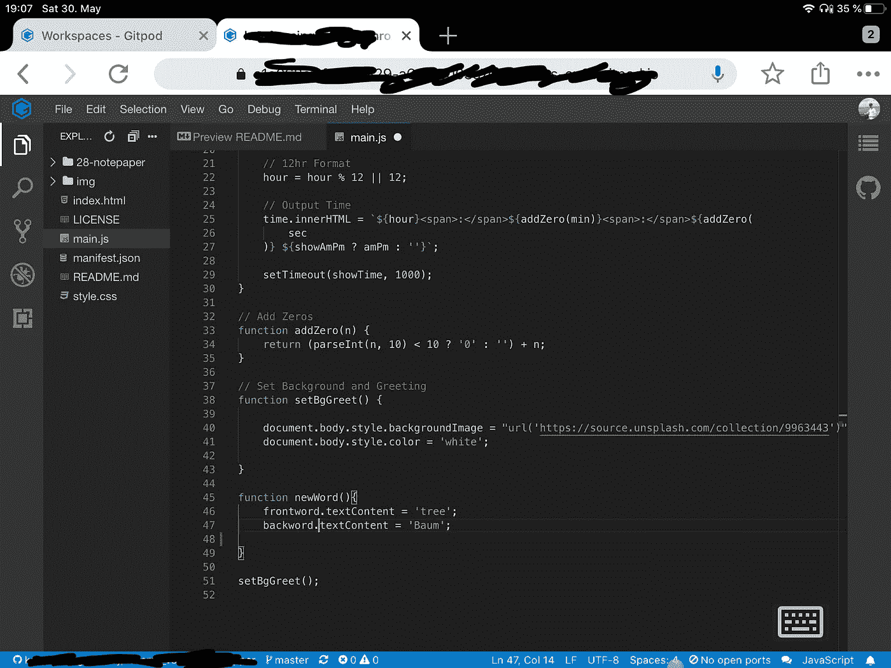

# 现在是 2020 年，在 iPads 上编码终于变得令人愉快了

> 原文：<https://betterprogramming.pub/its-2020-and-coding-on-ipads-is-finally-enjoyable-ab10c9e4d3d2>

## 这花了很长时间——让我们看看有什么可能

[LinkedIn 销售导航员](https://unsplash.com/@linkedinsalesnavigator?utm_source=medium&utm_medium=referral)在 [Unsplash](https://unsplash.com?utm_source=medium&utm_medium=referral) 上的照片

时间是 2020 年。这位孤独的英雄最后一次尝试使用他的 2017 年旧 iPad 完成真正的工作——瞧，他成功了！

在这篇文章中，我想和你分享我是如何最终用我的 iPad 来写作和编码的，而后者是多年来都不可能的。今天它甚至很有趣，我认为我们正在慢慢地达到一个点，即更多的人可以考虑用 iPad 进行实际工作。

# 警告:你仍然需要上网才能玩得开心

即使在 2020 年，也没有像 VS Code 这样的原生编码应用——至少我没有发现任何令人愉快的应用。

[Working Copy](https://workingcopyapp.com/) 是一个 Git 客户端，它工作得非常好，并带有基本的编辑功能，但在这一点上，你最好只使用在线 GitHub 编辑器，在那里你可以很容易地对分支进行小的修改。

然而，只要你有互联网接入，你现在可以使用几个伟大的选项之一，使编辑代码实际上很有趣。

# 让编辑代码变得有趣的选项

## GitPod 在浏览器中为您提供完整的 vs .代码

这非常好

还有一些其他的选择，比如 [Codeanywhere](https://codeanywhere.com/) ，但是我发现 GitPod 正是我多年前想要的流畅体验*。它运行在你的浏览器中，带有所有的扩展，键盘快捷键工作(甚至多插入符号！)，最棒的是:你只需在任何 GitHub 网址前输入“https://gitpod.io/#”，它就会自动将该网址作为工作区打开。*

最后一个对我来说是真正的改变。它消除了尝试在 iPad 上打开 Git 项目，然后尝试用您选择的程序打开该文件并最终进行编辑的所有麻烦。

相反，您得到了与 VS 代码完全集成的 Git，这使得一切变得更加容易。

## 键盘现在可以完美地工作，鼠标至少可以用来编码

我无法告诉你现在终于有了高质量的无线键盘的感觉有多好。你可以得到大量的机械键盘，但我现在已经为我的鼠标改用了罗技 MX 键和 MX Master，结束了对机械键盘长达五年的上瘾。

不管你选择什么，这些天它们都很完美。它们像预期的那样工作，不会碍事，并且您可以在设备之间无缝切换。我经常用我的电脑在我的工作电脑和我自己的电脑之间切换，然后回到 iPad，甚至在我想写一个长答案但不想登录 WhatsApp Web 的时候回到我的手机。

我想我们现在已经到了我终于可以停止购买新键盘的时候了。我还认为我们不再有这些东西坏掉的问题。我已经用了罗技的那台好像好几年了，它没有一点磨损的迹象。

这让一切都变得不同，因为我现在真的很喜欢在无线键盘上打字，而在以前，这是可怕经历中又一个可怕的部分。

## 你可以在五分钟内把 RDP 变成一台 Windows 机器，这太神奇了

我记得几年前我试图建立一个与我家电脑的远程连接——这个想法听起来不错。然而，实际上，这非常糟糕，部分原因是缺少键盘和鼠标支持，部分原因是系统永远不知道是否应该打开屏幕键盘。

然而现在，它只需要五分钟(不要相信我的话，试试看！)要下载 iPad 应用程序，只需轻触桌面电脑上的开关，就能立即访问电脑。

键盘工作得很好——我有时在键盘布局上有些小毛病，但没什么大问题。此外，当我是一个讲英语的德国人，使用 Windows 键盘，用 iPad 与 Windows 机器交互时，这也是意料之中的。即使这样，我也不得不适应修饰键稍微不同的位置。

鼠标是我最喜欢的部分。在平板电脑上，这实际上是比拿起笔或点击屏幕更快的输入方式。总的来说，这种体验相当不错。

这样做的好处是，你的指尖上有一个完整的 Windows 机器，运行所有那些只在 Windows 上运行的脚本和东西——当然，缺点是需要你的计算机运行和使用电力。

尽管如此，如果你需要一种在家与电脑交互的方式，那么这比过去好十倍，实际上是一种很好的工作方式。

## GitHub 现在也有一个相当不错的界面

不久前，我在一台旧电脑上安装本地 Git 时遇到了一些困难。这让我意识到，你可以在 GitHub 中获得一个相当不错的在线界面。那可能不是新的，但是我发现它至少是可用的，你可以直接编辑文件。

这样做的好处是，它迫使您做出更容易在 Git 版本历史中跟踪的增量更改——必要时，您可以用它很好地编辑您的存储库。

因为它显然可以在浏览器中运行，所以你也可以在 iPad 上使用它，它在 iPad 上也很不错。

# 要点:iPad 终于回到了它几年前应该在的地方

我仍然感到震惊的是，在一台试图将自己定位为笔记本电脑替代品的平板电脑上，我们竟然无法使用像 IDE 这样基本的东西。但是我想这是另一个怪癖，当你决定把 1000 美元扔出窗外去买一台带电脑铅笔的漂亮电脑时，你会为此付出额外的代价。

然而，我们最终可以编辑代码并享受 VS 代码。它开始越来越像我在路上工作的理想工具。