# 将软件开发实践转化为数据驱动的基于流程的方法的案例研究

> 原文：<https://betterprogramming.pub/its-mostly-about-the-flow-a-journey-of-transformation-f665419121a7>

## 它主要是关于心流——一个转变的旅程

几年前的一个夏末，我开始了一项重要的工作，它将我塑造成了一名敏捷实践者，影响了我们的组织如何为客户交付软件。

我们在工作方式中引入的两个主要变化是:在我们的工作方法中关注**建立可预测性**和**转向预测未来交付日期的**。

这一切都始于伦敦海德公园的一次讨论，接着是阅读丹·瓦坎蒂的优秀的《可预测性的可操作敏捷度量》一书[1]，接着是几个月的艰苦工作，最后是拥有一个我们如此信任的系统，我们基于它的可预测性创建了商业协议。

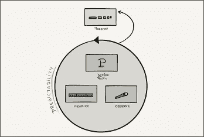

在这个转变过程中，我们从一个基于 Scrum 的系统转移到一个基于流程的系统，其中使用了:

*   及时(JIT)承诺
*   使用蒙特卡罗模拟发布预测
*   基于收集的流量度量数据调整其策略的系统

让我告诉你这个故事。

# 从 Scrum 开始

当我们进入两年前开始的约定时，我们继续使用项目一直使用的过程，这是我们最熟悉的东西——Scrum。

在发现的初始阶段之后，我们组建了两个特性团队，任务是继续构建。团队是跨职能的，包含业务分析师、开发人员和测试人员的角色。我们的客户提供了产品所有者。在这两个团队中，有一个由交付领导、项目经理、解决方案架构师、项目管理支持、业务分析师领导、UX 领导、测试领导和作为技术领导的我组成的管理团队。

我们适应得很好，并开始使用两周一次的 Sprints 进行交付。我们实现了一个典型的 Scrum 过程，从零用户故事开始 Sprint，在 Sprint 开始时运行 Sprint 规划仪式，在最后进行演示和回顾。我们的目标是通过完成所有为 Sprint 选择的用户故事来完成 Sprint。与此同时，我们运行了一个持续的 backlog 精化过程。我们通过使用在每个 Sprint 结束时更新的发布燃耗进行报告。

# 变革的火花

在这个过程的早期，我们创建了一个物理看板，它可视化了两个团队所做的工作。该板包含以下代表我们的工作阶段的栏:*接下来，分析进行中，分析完成，签署进行中，签署完成，开发进行中，开发完成，技术质量保证进行中，技术质量保证完成，测试进行中，测试完成和惊人。*

每个“Done”列都是一个队列列，其中没有工作发生。虽然我们引入了这些队列列，但在项目的那个阶段，我们并不知道它们以后会提供什么好处。这是一种直觉上的变化，并不植根于任何理论。

Scrum 团队负责完成工作的所有阶段，不包括“正在进行中的签字”和“令人惊奇”，这是产品所有者的责任。“惊奇”阶段代表产品负责人对故事的正式接受。

以每两周一次的频率，所有“惊人”的故事都被部署到生产环境中。

不安的第一个迹象出现了，因为一个工作项目通常需要超过两周的时间才能通过董事会，从“下一个”到“令人惊讶”。这个领域相当复杂，故事需要仔细分析立法。即使是很小的文字改动也必须仔细审查，以避免可能导致法律后果的误解。这尤其具有挑战性，因为我们真心希望为我们的用户构建一个尽可能直观的解决方案，一个考虑到最终用户的解决方案。

另一个令人不安的地方是冲刺的边界。我们从“签署完成”阶段开始冲刺，并逐步发展到“测试完成”阶段。这就提出了如何跟踪“分析”和“签署”阶段的问题？考虑到需要注意分析和获得故事的签署，这些阶段消耗了构建软件所需的总时间的很大一部分。业务分析师和后来的 UXers 是团队不可或缺的一部分；没有他们，我们的开发人员不能有效地完成他们的工作。我们的跨职能团队类似于两个子团队——在 Sprint 边界外工作的业务分析师和 Sprint 内的开发人员和测试人员。

有时，我们开发了为 Sprint 选择的大部分故事，把它们推下来进行测试，并注意到我们在开发阶段有多余的能力用于其他工作。在这些案例中，我们在 Sprint 中一无所获，尽管我们已经有了现成的故事。我们应该接受这些故事吗？我们需要举行一个特别的冲刺计划吗？

然后我们不得不处理这个问题:故事什么时候完成？

我们尽了一切努力来构建和测试这个故事，但是如果产品负责人不能参加 Sprint 演示来接受这个故事，一些不理想的事情可能会发生，我们能认为这个故事真的完成了吗？即使他们参加了 Sprint 演示，一些产品负责人也希望，也应该这样，花时间，按照他们自己的进度仔细回顾这些故事。玩系统，检查功能，偶尔向他们的同事寻求反馈(比如政策代表)。这个过程可能需要一些时间。

总而言之，我们有三个工作阶段:

*   一个重在分析；
*   开发和测试相结合；和
*   接受之一(“惊人”的故事)。

不知何故，Scrum 的冲刺边界并没有反映出我们是如何工作的。感觉就像我们在推动过程适应规定的方法。在那之前，我是一个狂热的 Scrum 粉丝，我曾经使用 Scrum 成功地运行过项目，但是这一次，我感到比以前更加不安。

我们不得不处理的另一个问题是常年的‘**发布会什么时候完成？**

为了回答这个问题，我们使用了传统的“释放燃耗”。为了创建这些版本燃耗，我们使用故事点进行估算，并在每个 Sprint 结束时产生新的燃耗，考虑交付的故事点数量和任何潜在的范围移动。我们根据最后几次冲刺的平均速度来计算完成日期。

正如我们将了解到的，这种方法存在一些问题，我将在后面详细介绍。当时我们就知道不能相信这些燃耗。我们知道这是一个指南，我们将需要做其他检查，看看我们是否能达到这些估计的日期。这些检查非常耗时，并且是基于与各种团队成员的长时间讨论以及临时构建的复杂模型，这些模型给人一种虚假的确定感。

这引出了另一个问题，**我们衡量什么？**'

我们认为故事是在“测试完成”时完成的，还是在“惊人”之后完成的？正如前面所指出的，在开发和测试之后，令人惊奇的经过测试的故事可能需要一些时间。在“惊人的”阶段之前计算故事将测量团队的“速度”,不包括客户的接受程度，并且这个“速度”将在未来版本的估计中被烘焙。然而，故事并不精彩的风险总是存在的，这将使评估无效。事实证明，这不是一个问题，因为我们最终只有几个不令人惊讶的故事。

到目前为止，我故意使用“计划”或“估计”这个词来确定和发布即将到来的发布日期。当时，我将这些术语与“预测”互换使用，但我现在知道那些不是预测。稍后提供更多预测！

# 寻找灵感

我们开始问自己，‘肯定有更好的方法来做这件事吧？’。项目开始几周后，我们在一次团队郊游中打了圆场。当我坐在那里看着场地和我的同事们打球时，我问我的一位导师兼项目主管马丁·阿斯佩里:“马丁，我们如何才能做得更好？”。他回答说，‘你看过最近发布的看板书吗？’。我不知道他指的是哪本书，最近还读过一本关于看板的书。起初，我不想探究，以为他指的是同一本书，但当我离开那天，我问马丁是否可以给我发一个这本书的链接，以防万一。我很高兴我做到了！

事实上，这是一本不同的书，是丹的《可操作的可预测性敏捷度量》(AAM)。我把它下载到我的 Kindle 上，开始在往返伦敦的短途通勤航班上阅读。它很快吸引了我的注意力，并成为影响你职业生涯的书籍之一。在完成这本书之前，我开始应用一些技巧，引发了我们工作方法的新方向。我认为自己在软件开发方面相当博学，我认为 Dan 的书是能够以一种实用的方式改变工作实践的最好的书之一。

# 转向测量和观察过程

第一个突破是首先引入“测量和观察”你的工作系统的概念，了解你在引擎盖下得到了什么。我发现这是一个令人信服的概念。当我和同事谈论这个概念时，我经常用汽车来比喻。想象一下，如果你的汽车没有仪表，没有测量速度和距离的方法，也没有警告信号来指示你的燃油或机油不足，会发生什么。你还能开车吗？是的，你可以。为您提供这些测量和警告系统会更好吗？当然，那是肯定的。

同样，我们喜欢了解我们如何工作，测量我们的“汽车”，并为我们的工作系统提供遥测技术。

这就是我们要做的。我们已经定义了看板，当我们将它设置为包含工作列之间的队列列时，我们受到了足够的启发(例如，'*开发完成*'是插入两个工作列之间的队列列，'*开发进行中*和'*技术质量保证进行中*')。我们使用数字版本支持的物理板。

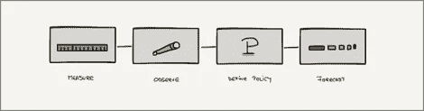

图 1:在我们的新旅程中，从“测量和观察”范例开始

为了查看我们的数据(主要由用户故事组成)，我们从数字存储库中提取了数据，并使用“可操作的敏捷度量工具”(AA)对其进行分析。

我仍然记得第一次浏览报告时的兴奋，渴望看到以前看不到的东西。我在工具提供的报告之间快速切换。我还不明白他们的意思，但这没关系。我知道有足够的时间去学习和理解它们的含义。事实证明，在接下来的几个月里，在报告之间的切换变得更加结构化，并发展成为早晨的例行公事。我在我们每天的单口相声之前就这样做了，我的目的是根据我观察到的情况，看看是否有什么我想和团队讨论的。感觉像看到了另一个维度。

随着时间的推移，我们增加到了九个特性团队，我负责他们交付的技术质量。以前不可能在低层次上参与每个团队；然而，新发现的分析系统的能力使我能够更容易地放大感兴趣的点。这让我可以向每个团队提出精确的问题。

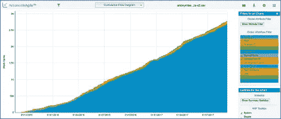

图 2——我看到的关于我们系统的第一种报告是 CFD。注意，这个截图是在项目生命周期的后期拍摄的，大约两年。

我们想要实现的第一件事是知道我们系统的一些事实上是正确的。我们使用散点图来了解我们的周期时间。我们发现的有好有坏。好是因为现在我们有了一些数据(我们 95%的项目花了 29 天或更少的时间完成)，但坏是因为它显示我们分批交付，大多数项目在一天内完成。

图 3——项目早期捕获的散点图；显示我们在同一天完成所有项目的图表。

# 定义我们衡量的内容

定义我们测量什么成为一个重要的话题，因为如果不明确讨论它，任何测量都没有任何意义。在你测量任何东西之前，你需要知道你在测量什么。我们测量的定义，我们工作的界限，是一个简单的概念，但是我们以前没有明确地讨论过。它看起来并不重要，但它确实很重要。

我们想要达到一个点，在这个点上，我们度量我们所有执行的活动。正如前面所指出的，在那个时候，业务分析师通常主要在活跃的 Sprint 的边界之外工作，为即将到来的 Sprint 准备故事。虽然我们知道这项工作正在进行，但它在很大程度上是不可见和未被跟踪的。我们如何知道这个阶段的工作是否有效？我们是否有合适的能力？我们是否及时处理了任何延迟或瓶颈？我们如何跟踪开发人员和测试人员给出的支持时间来塑造这些故事？这次我们可以“借”吗？这种影响如何反映在工作的其他阶段？我们希望对我们的工作有一个整体的看法。反过来，我们也想澄清一下，待办事项列表中的项目不能算作正在进行的工作，我们把待办事项列表看作是我们某一天可能会着手的*选项*。

考虑到这一点，我们明确表示，我们的“进行中的工作”是在这些阶段中的任何一个阶段出现在我们的板上的一切:*接下来，分析进行中，分析完成，签署进行中，签署完成，开发进行中，开发完成，技术质量保证进行中，技术质量保证完成，测试进行中，测试完成，以及*惊人。尽管我们在这个阶段还在使用 Sprint，但是 Sprint 是从“签署完成”阶段开始的。

在这个新世界中，时钟从一个项目从“Backlog”中删除并放入“Next”列开始，当它到达“Amazing”时停止。最初，这种坚持是沉默的，它是临时发生的，但不同的是，我们知道当我们将一个项目移动到我们的“正在进行的工作”中时，计时器开始计时。时间上，我们介绍了一个正式的补给仪式，并开始谈论承诺。

我们通过在我们的物理看板上画出草图并向团队解释来引入这个概念。我们倾向于与不同角色的团队成员进行一对一的对话，从业务分析师到开发人员和测试人员。

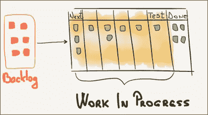

图 4 —我们用来解释概念的草图

上面的草图反映在我们的物理看板上，如下所示。

图 5——在我们的看板板上划分正在进行的工作

您可能想知道创建和细化 backlog 所需的工作。稍后我会解释我们是如何处理的。在转型的这个时候，我们很高兴向前迈出了这一步。

# 流量指标

一旦我们定义了“工作的边界”,我们就开始使用 Dan 在他的 AA 书中介绍的流程度量来度量它:周期时间、吞吐量和在制品计数。

我不打算详细说明这些指标是什么，Dan 在定义它们方面做得更好，但是我概述了团队使用的定义来介绍这些概念:

*   **工作进展计数:**我们系统中的项目数量
*   **周期时间:**以日历天数表示的物料通过系统所需的时间
*   **吞吐量:**在给定期间(例如，每周)测量的离开系统的产品数量

当我们开始查看流量指标时，我们已经开始了新旅程大约一个月。我们正在运行关于吞吐量的双重报告——一个基于我们发送给客户的故事点，另一个基于故事计数，我们只在这个阶段内部使用(好吧，对于你们当中的学究来说，是基于*速度*的故事点报告，而不是吞吐量)。我们收集了周期时间，但还没有对外公布。我们使用基于故事点的发布烧屏来创建静态发布计划。我们开始关注蒙特卡洛模拟，但现在引入它们还为时过早。

在早期，我们讨论了为什么我们认为度量是重要的，以及这将如何改变我们在项目中的工作方式和交付方式。它会改变我们的工作方式吗？我们心存疑虑，但充满希望。

# 跨越多个边界进行测量

引入度量和工作边界概念的一个有趣的副作用是，如果我们想要度量不同的子系统，我们可以突然添加新的边界。

例如，虽然我们都知道只有当故事“令人惊叹”(提醒一下，这是产品负责人接受故事的阶段)时，我们才“*完成”*，但是我们可以灵活地度量我们想要的任何其他子系统。我们可以测量和分析从“*下一个“*”到“*测试完成”*的案例。

如果我们回到之前的散点图，并删除'*神奇'*阶段，该图将如下所示。

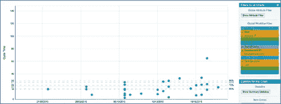

图 5 —与之前的散点图中的数据相同，但没有完成(惊人)栏

团队运行这些类型的分析的能力非常有用。继续上面的例子，他们可以说故事的“惊奇”超出了他们的控制和影响，这大体上是正确的(尽管你总是可以说团队有责任与产品负责人一起工作，尽快接受故事)。因此，如果排除了“*惊人的”*阶段，分析团队的表现是有益的。

# 移除冲刺边框

当我们开始向越来越多的团队介绍*度量和观察*的概念时，我们仍然在运行 Scrum。这意味着使用 Sprint，从零个故事开始 Sprint，目标是在 Sprint 结束时完成所有的故事。

感觉开始和结束冲刺花费了太多的精力。我们在第 1 天和第 2 天以及冲刺的最后几天花了很多时间。这感觉就像走在一条有许多红绿灯的长路上，每个红绿灯代表一次冲刺的边界。我们都花费了大量的精力去闯红灯和加速驶出红灯。在随后的项目中，在我们从 Scrum 过渡到 Flow 之前，我们的客户将每周三举行的 Sprint 的“第一天”称为“血腥星期三”。

对于接下来的几个问题，我们得到了更简单的答案——如果我们去掉 Sprint 的边界并继续前进会怎么样？如果我们的目标不是在冲刺阶段结束时让系统失去活力，而是让系统保持活力，那会怎样？就像“我们开始吧”一样简单。不再有开始/停止；只需继续交付故事，演示一次，开始新的故事，报告进展，每两周回顾一次。

节奏的概念很重要，这是我们希望从最初的工作方式中保留下来的东西。例如，我们不想花超过两周的时间通过回顾和报告进展来检查我们做得怎么样。我们的报告每两周发布一次，我们在我们的数字跟踪工具中关闭/打开 sprint，这保持了我们仍在进行 sprint 的错觉，但我们已经停止了所有预期的目的。

这个转变并没有花很长时间，不超过一两次冲刺。这是一项相对不太费力的练习。我们只需要在补给过程中向系统添加新的项目。

# 船长日志

大约在这个时候，我们意识到我们正在引入一系列的变化，并将在以后观察这些变化的影响。我们如何将变化的影响联系起来？为了有机会做到这一点，我们必须记住我们所做的所有改变。为了帮助我们，我们开始记录日志。我们开始捕捉所有被认为相关的事件，或大或小。

这个系统很简单，我们把所有的“事件”都保存在一个维基页面上。一个“事件”具有:

*   约会
*   受影响的团队列表
*   描述

事件的例子包括交换团队成员，记录团队何时开始新的工作，解散团队，或者改变我们报告进展的方式。

我们发现，当想要使用*累积流程图*或*散点图*分析过去时，这非常有用。

我们可以在图表上叠加事件，尝试追溯因果关系，并向 Martin 和客户提交报告，如下图所示。

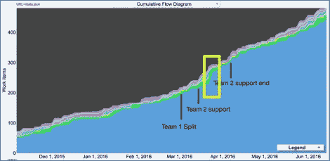

图 6 —团队活动覆盖的 CDF

通过这样做，我们不能总是把原因和结果联系起来；然而，它确实有助于理解我们行为的影响，并且比试图回忆前几周和/或几个月的事件更准确。它使得通过报告对系统的分析更加丰富。

# 一种新的承诺方式

回到补给上。虽然结束“虚拟”Sprint 很容易，但计算已完成故事的数量，包括计数和故事点(我们仍在进行双重报告)，演示这些已完成的故事，更新发布烧屏并进行回顾，继续工作稍微有些微妙。

我们需要从 Sprint 计划(通常，我们会选择下一个 Sprint 的工作)过渡到一种更持续的方式，向我们的系统添加工作。

为了实现这一目标，我们推出了每周补给会议。在引入这个概念的时候，我们只有三个团队。我们从其中一个团队开始这个过程，紧接着是第二个和第三个团队。

在这些补货会议中，我们必须回答几个问题，例如:

*   我们要在工作中增加多少项？
*   我们能承诺实现它们吗？
*   在什么时间范围内？

在回答上述问题之前，先快速提醒一下“进行中的工作”的定义。我们的“进行中的工作”从“*下一个”*开始，这个阶段是我们系统的入口点，也是我们循环时间计数器开始的点。从'*积压'*到'*下一个'*的过渡成为了我们的承诺点。

“*分析”*阶段是致力于充实故事、添加验收标准(AC)和其他事情的阶段，紧随其后的是“*下一个”*阶段。这意味着在补给仪式上，当我们从“*积压”*过渡到“*下一个”*时，这些故事相当环保——只有几个要点，以便我们可以在会议上讨论它们，没有场景，没有 ACs。最初，这有点令人不安，我们的业务分析师不确定我们是否能把这样一个绿色的故事带到会议中。在早期，他们会花时间在幕后为故事添加更多的细节，甚至在“承诺”之前。随着时间的推移，我们信任了这个系统，backlog 中的故事仍然是绿色的，没有被触及，留下了在“提交”点之后进行的大量分析工作。

回到我们需要回答的第一个问题——在会话期间，我们的系统中应该有多少个故事？我们使用'*保持流动'*的原则来回答这个问题，每周向系统添加尽可能多的项目，直到达到“惊人”的水平。我们查看了最近的每周吞吐量，并向系统添加了故事，以匹配吞吐量加 1。例如，如果我们最近的周吞吐量是 4，我们的目标是引入 4 到 5 个项目。早期，我们担心如果我们添加的故事太少会发生什么——我们会让系统挨饿，让团队成员没有工作吗？随着时间的推移，我们了解到这不是一个问题。由于我们成功地将“补充”的成本大大降低了，典型的“补充”会议不超过一个小时，如果需要引入更多的故事，我们可以运行临时的“补充”会议。我们为一个故事所做的一切，包括分析，使我们能够引入我们没有完全充实的绿色故事。

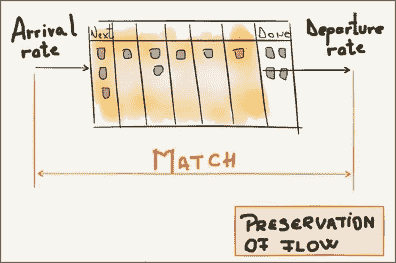

图 7 —保持流程

为了保持流程，使出发率(吞吐量)与到达率(添加到'*下一个'*'的项目数)相匹配，我们称'*下一个'*列为在制品(WIP)限制器。在每次“补货”课程结束时，我们的目标是在“*Next”*栏中留下几个与 WIP 限制条件相匹配的故事。例如，如果我们上一期的生产量为 4，我们使用公式将 WIP 限制设置为 5，即*实现的生产量+ 1* 。如果我们从“*下一个”*栏中的一个故事开始“补充”环节，我们将增加四个故事。如果在会话开始时该列是空的，那么我们将引入 5 个故事。相反，如果“*下一个”*列是“满的”(包含 5 个故事)，我们将取消“补货”。

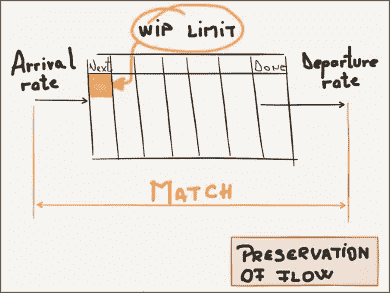

图 8-在系统的入口边界设置 WIP 限制，以帮助加强流程的保护

接下来要回答的问题是“完成这些项目需要多长时间？”“当我们承诺时，我们应该设定什么样的目标时间框架？”在考虑这些问题时，另一个问题不断出现，“我们应该让所有的故事都有相同的大小吗？”。

让我们首先讨论承诺一。最初，我们想引入 SLA 的概念，就像 Dan 在他的书中建议的那样。SLA 大致建议“对于我们带入系统的每个故事，我们承诺在 X 天或更短时间内完成它的 SLA”。我们没有设法引入术语 SLA，它淡化了承诺问题，但是保持了尽最大努力在目标时间内完成每个故事的原则。

我们从散点图中选择了目标时间。我们从这个散点图中选择了一个有代表性的时间样本，并读取了 85%的项目的周期时间。以日历天数表示的周期时间成为我们的目标时间。

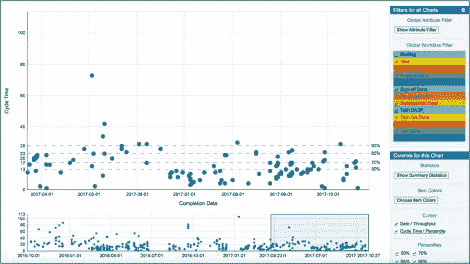

图 9 —用于选择 SLA 目标时间的散点图

在上面的例子中，85%的周期时间是 23 个日历日或更少。承诺问题变成了:“鉴于这个故事，我们即将引入系统，我们能在 23 天或更短时间内交付它吗？”如果是，我们会将项目带进来；否则，我们停下来进一步讨论。这个问题变成了“大小合适的问题”。出于某种原因，我们觉得问这个“合适的尺寸”问题很不舒服。我们不完全知道为什么，可能因为这不是一个要问的‘典型问题’，以前从来没有人问过。经过反思，我们也认为我们应该坚持最初的“SLA”概念，因为它可以帮助团队理解为什么要问这个问题。然而，这些团队密切监控周期时间，并在“补货”会议中作为指导。

在我继续之前，我希望你注意在上面的散点图中屏幕底部的时间样本的选择；我们必须仔细考虑我们可以信任的代表性样本。如果样本错误，我们就会得到错误的参考数据点。这个警告适用于我在这个案例研究中描述的所有技术。这种工作方法是令人信服的，但人类仍然需要在选择时期和解释数据时运用判断力。

这种新的补给方式极大地改善了我们的工作方式。我们在尽可能晚的时间“承诺”。我们每周“提交”(在项目的后期，一些团队采用每周多次补充)。我们可以说，与基于 Sprint 的方法相比，使用两周的 Sprint，这并不是一个显著的优势。细微的区别是，使用这种类型的承诺意味着我们减少了在分析或设计等活动上“浪费”的时间，因为这种活动是我们“正在进行的工作”的一部分。如果你使用基于 Sprint 的方法，从零故事开始，有必要在 Sprint 之前准备好故事；否则，一些团队成员会挨饿几天(甚至更长时间)的工作。提前准备故事意味着在下一个 Sprint(我们可以更好地用在其他工作上的时间)中处理甚至可能不会被拾起的故事，而错过团队喜欢的故事。另一个积极的副作用是我们没有将工作分解成孤立的阶段。业务分析师和 UX 设计师在一个阶段工作，开发人员和测试人员在另一个阶段工作。在阶段之间仍然有一个交接，但是我们以更小的批量来做这件事(一次一个故事)。

我们在实现连续的工作流和“及时”承诺(JIT)的道路上走得很好。

你可能会问自己，这种工作方式是否会产生其他类型的浪费，这可能是由于不断地在较低的水平上工作而忽略了大局，从而建造了错误的东西或建造了太多的东西。这些都是合理的问题，我将在稍后回答。

到目前为止，我们与团队成员就这些概念进行了多次讨论。在这个过程中，我们使用了从 AA 工具中提取的草图和报告——我们绘制草图，查看数据，辩论，尝试，听取反馈，重复我们认为有效的内容，并消除无效的内容。有时一些问题的答案是错误的，但只要我们继续学习，这没什么。

# 继续学习曲线

当我们推出每周“补充”和“及时承诺”时，我还没有读完丹的书。我知道还会有更多，尤其是在预测方面。我们玩了蒙特卡罗模拟，但还没有准备好使用它们。

大约就在这个时候，我们和丹见了面，讨论了我们正在做的事情，他向我们保证我们正在正确的轨道上，这很重要，鼓励我们继续旅程。在任何旅途中，坚持不懈都很重要。我们的目标是有一个更好的工作方式，但我们没有太关注最终目标。我们更关注实现目标的过程。毕竟，在这个阶段，我们并不完全知道它会把我们带到哪里。

最具挑战性的问题之一是“我们需要所有的故事都一样大吗”？这个问题经常出现，我们的回答是“不，没有”。我们当时说“不”,主要是因为丹建议这样做。但这是为什么呢？这和可预测性有联系吗？

我重读了侧重于小定律假设的章节。对于我们运行的系统类型，以下假设适用:

1.  平均到达率应该等于平均离开率(吞吐量)
2.  所有启动的工作最终都会完成并退出系统
3.  在为计算选择的时间间隔的开始和结束时，WIP 的数量应该大致相同
4.  在制品的平均寿命既不增加也不减少
5.  周期时间、在制品和生产量都必须使用一致的单位来衡量

此外，每当利特尔定律的一个假设被违反，这个过程就变得更难预测。为了避免这种情况，我们需要引入旨在保护这些假设的工作政策:

1.  我们将在完成旧工作的同时开始新工作
2.  我们将尽最大努力完成所有已经开始的工作
3.  如果工作受阻，我们将尽一切可能尽快疏通
4.  我们将围绕我们提取项目的顺序来监控我们的策略，以便工作项目不会不必要地老化

在旅程的这一点上，我们已经默默地介绍了前两个。其余的仍有待介绍。

但这仍然没有回答这个问题——“所有的故事都需要一样大吗？”。我们认为可预测性有助于部分回答这个问题，因为在讨论规模之前，我们需要相信来自系统的测量和读数。可预测性在这里很有帮助。

一旦我们相信我们有一个可预测的系统，我们就可以相信数据和对数据的解释。其中一个解释是*周期时间直方图*。

Dan 在他的第一本书中对此做了更好更详细的解释，但只是为了便于理解，直方图代表了共享相同周期时间的项目(在我们的例子中是故事)的频率。

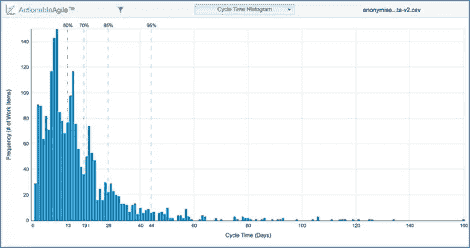

图 10 —我们的周期时间直方图

以上是我们项目直方图的摘录。这张快照直方图涵盖了九个团队两年的数据。该图表显示:

*   我们在一天内完成了 29 个项目，占在一天或更短时间内完成的项目总数的 1.3%
*   我们在两天内完成了 91 个项目，占我们在两天或更短时间内完成的项目总数的 1.4%
*   大多数项目花了 9 天时间完成，代表 150 个项目(占我们在 9 天或更短时间内完成的项目总数的 6.7%)
*   随着长尾的出现，图表开始变平——一些项目需要越来越长的时间才能完成，最长的一个项目需要 160 天才能完成

得到的直方图是威布尔形状。

那么问题的答案是不是所有的项目都需要一样大？‘是不是，他们不必是。他们必须遵循这个形状。只要未来的项目落入这个形状，我们就很好，我们可以相信我们的散点图数据提取目标周期时间并提交它。

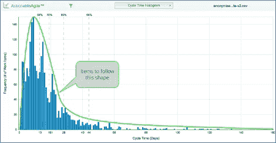

图 11 —可预测系统中物品落入的安全区域

以我们的直方图为例，从可预测性的角度来看，如果我们在 40-60 天的周期时间内获得频率超过 20-30 的项目的显著峰值，这将是有问题的。这将扭曲形状，表明系统不太可预测。在这种情况下，我们需要谨慎使用我们的数据进行未来预测。

SLA 问题很重要，它作为一种保护机制，强调了团队不能在目标周期时间内完成的项目。在预先知道团队不能承诺目标周期时间的情况下，将项目引入系统是没有意义的。丹称这个问题为“合适的尺寸”问题。

# 监控老化项目

从可预测性的角度来看，如果我们应用先进先出(FIFO)工作拉取策略，我们将拥有最可预测的系统，其中我们将按照项目进入系统的顺序来处理项目。然而，当处理多个项目时，这很少实现。

我们可以通过使用产生良好结果的代理工作策略来解决这方面的可预测性，即使它可能没有严格遵循 FIFO 策略。

一个项目在工作中每过一天，它就老化一天。我们有一个合适的方法，只要我们监控项目的工作阶段的年龄。

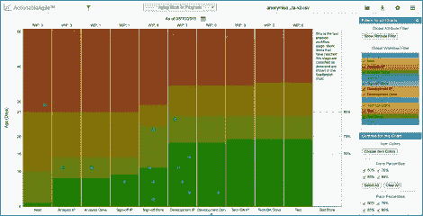

图 12 —老化项目

在上面的快照中，我们可以看到当前正在进行的工作中的项目。每个项目在对应于其当前工作阶段状态和在系统内经过的时间的列中显示为一个点。圆点越高，该物品在系统中存在的时间越长。作为参考，该图还显示了过去周期时间的百分比。我们承诺在项目 85%的目标周期内交付一个项目。只要这些产品停留在绿色区域，它们就有很大的机会实现我们的承诺。在上面的例子中，有三个项目已经错过了 SLA，还有一些项目面临风险。这些在下面的快照中以红色和琥珀色方框突出显示。

图 13 —需要立即注意的突出显示的项目

通常，我们在站立时使用这些老化的物品。在站立会议期间或结束时，我们查看处于风险中的项目，并再次问自己“知道我们已经承诺在目标周期时间内完成这些项目，我们是否正在我们的能力范围内尽一切努力来完成它们？”。有时它会提醒我们去寻求团队之外的人的回应，或者我们掉了球，忘了捡起东西。有时答案可能是我们已经尽力了——我们不能再做什么了。

即使我们对处于风险中的项目无能为力，尽早了解风险情况的发展仍然是有价值的。例如，仅仅通过提高意识和与产品所有者交谈，我们就可以探索团队从未想过的其他途径；如果做不到这一点，尽早与客户沟通是一个强有力的工具。当你可以预见潜在的问题时，为什么要等到错过目标时间呢？

这让我想到了另一个启示:不同的团队是如何采用新的工作方式和工具的。如前所述，我们一度扩展到 9 个团队，如果包括管理支持，大约有 100 个团队成员。这是否意味着所有的团队都以同样的方式使用工作方式和工具？不，他们没有。例如，一些溜溜球带着*老化物品*，每天严格监控它们，然后每周，然后停止一段时间。当他们觉得丢失了一些有用的东西时，他们会回来使用它。有些人非常擅长限制他们的“进行中的工作”,以至于他们再也不会回头去监控老化的项目。他们仅仅通过看他们的冲浪板就设法保持领先。一段时间以来，其他团队通过在看板附近手工绘制他们的 CFD 来进行试验。其他人在他们的墙上挂了一张每周吞吐量表。

尽管团队使用的工作方法略有不同，但他们的前进方向是一致的。我们在做一个连续的流程，一种没有起止的工作方式，一种有明确工作政策的工作方式，一种基于测量我们的工作系统并使用指标来帮助我们做出更好决策的工作方式。在我们开始工作的四五个月里，我们在这种工作方式上相当“流畅”。但是还有更多的事情要发生。

到目前为止，我们的工作方法主要涉及过去和现在。CFD、散点图和吞吐量图着眼于过去和现在的老化项目。未来呢？在过去的几年里，我们普遍的想法还适用吗？还是有不同的方式？这是我们希望解决的下一个问题。

# 估计

评估的问题和软件开发本身一样古老。不用担心；我不会带你回到软件开发的开始，只是我们项目的开始。

在项目开始时，我们的估计是基于故事点的。我们使用了斐波那契数列，旨在估计我们的大部分故事。所有进入 Sprint 的故事都必须被评估，加上我们积压的相当一部分。在我职业生涯的这一点上，我是这种方法的忠实粉丝，甚至拥有和携带我的规划扑克卡，尽管我知道这种方法有几个缺点:

*   这很费时间。如果我们想为接下来的 2-3 个月计划一个发布，我们没有其他选择，只能估计所有的故事或子集，并假设其余的将遵循相同的模式。
*   拆分故事的逻辑很复杂——我们花时间讨论如果一个故事被拆分了，该如何处理故事点。我们应该如何分割故事之间的要点？当我们突然不得不将故事分割得如此之大，以至于我们最终得到的分数比开始时更多时，会发生什么？这是否被视为范围扩大？
*   我们不同意什么是故事点。我们知道它是一个代理值，但是它是复杂性、持续时间或者两者的代理吗？
*   当我们认为故事比最初想象的更大/更复杂时，我们必须就该做什么达成一致。我们应该增加更多的故事点吗？如果是，这将被归类为范围蔓延还是复杂性蔓延？
*   一个故事点对每个团队来说可能有不同的意义。他们可以自由选择他们的参考故事，甚至可以自由分割他们的故事。这产生了一些问题，特别是对于拥有相同产品所有者的团队。
*   产品所有者期望故事点是兼容的，但是我们不能保证。
*   将故事点转化为持续时间(转化为人工日)的诱惑一直存在。我们不得不不断地与这种愿望作斗争，很清楚这不是他们的目的。
*   最后，我们不能仅仅依靠我们的估计和发布基于故事点的烧屏作为准确的交付预测。除了我们使用故事点的事实之外，还有基于平均值的烧钱问题，这进一步降低了评估和计划的可靠性。我们用它作为指南，但当我们接近发布里程碑时，我们感到紧张。

在上一段中，我提到了“范围蔓延”和“范围扩大”这两个术语。毫无疑问，这些术语是在软件交付中使用的，但是在敏捷交付的环境中使用它们是不健康的。毕竟，我们应该不断寻找巧妙的解决方案来解决我们日益复杂的问题。我们应该接受范围不固定的事实，而不是与之抗争。有趣的是，当我们依赖故事点的概念时，我们更经常使用这些术语，当我们放弃它时，就不那么经常使用了。

我们需要找到一种更好的方法来估计。对于上下文，我们正在寻求解决如何更好地估计多个项目，通常是一个发布。我们已经在补货仪式中使用我们的承诺流程实现了单项估算。

解决方案以蒙特卡洛模拟的形式出现。

# 实现可预测性，然后进行预测

在我继续描述我们的预测方法之前，我想重申，使用数据进行预测的一个基本前提是拥有一个可预测的系统。这就是为什么我们在尝试蒙特卡洛模拟之前，花了几个月的时间研究我们的*测量和观察*方法。除了我们用来满足好奇心的厚颜无耻的模拟。

图 14—一旦实现了可预测性，我们就可以将注意力转向预测

你可能已经注意到了，我已经从*估计*切换到*预测*。回顾过去，我们在这个过程中很早就开始使用“预测”这个术语，但这主要是因为 Dan 在他的 AA 书中使用了这个术语。实际上，我们花了一段时间才从确定性方法(提供一个完成日期)转向概率性方法(提供一系列可能的日期)。尽管我们在早期使用了术语*预测*，但它们实际上是使用*蒙特卡洛*模拟进行的估计。

# 蒙特卡洛预测

简单介绍一下，蒙特卡罗模拟(MC)是一种基于统计的基于采样的模拟，它利用随机性来解决原则上可能是确定性的问题[1]。

它使用过去的数据样本来预测未来的情况。我们用这种方法预测:

*   从给定的开始日期开始，完成几个项目需要多长时间；
*   在两次约会之间，我们会完成多少项目？

我们更多地使用前者，因为它符合我们的工作方法。我们倾向于给每个团队分配一个通常持续几个月的发布版本。为了获得发布预测，我们必须做一些事情:

*   确定一些我们仍需完成的项目；
*   从过去选择一个有代表性的数据样本，我们认为它可以反映未来的工作；
*   运行几个场景。

我们总是使用来自团队的数据，从不跨团队共享数据。

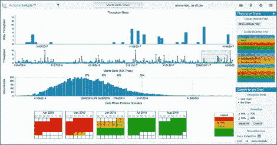

图 15——完成 45 个项目所需时间的模拟

我们称这些模拟为“假设”情景。我们可以在很短的时间内运行大量的场景。我们可以问，“如果我们只有 35 层而不是 44 层，新的预测会是什么样的呢？”或者“如果我们采用过去三周而不是五周的历史数据，这将如何改变预测？我们注意到了这些场景，并选择了一些数字来传达我们的计划。

# 双重报告、燃耗和蒙特卡罗模拟

与迄今为止引入的所有变化一样，这种转变发生在几个月内。它始于我们玩 MC 模拟，没有别的原因，只是为了满足我们的好奇心。

一旦我们的好奇心得到满足，我们就开始更认真地对待它。我们倾向于发布双重报告。当我们并行运行模拟来比较日期时，团队使用基于故事点的燃尽图来报告进展和创建评估。我们注意到了不同点的比较，并等到我们完成发布后，才确定哪个预测更准确。

随着我们对 MC 模拟的信任增加，我们逐步淘汰了基于故事点的烧屏。我们一次做一个团队。

我记得 MC 预测没有基于故事点的预测乐观——MC 预测倾向于预测更长的完成日期。当我们在等待真正的结果时，我们想知道哪个会更准确。事实证明，基于 MC 的预测更好。

MCs 更现实的原因之一是它们也处理平均值。这些计划不再基于平均值(平均分数)。相反，它们是建立在过去参差不齐的现实基础上的。我们从过去的成就中取样。在过去，有时我们发布两个故事，有时我们一个也没发布。有时我们会因为一些意想不到的原因而几天没有送货。我们知道，尽管我们尽了最大努力来管理未来，但它将继续充满不可预见的问题，这些问题将阻止我们按设想交付成果。MC 模拟在这方面帮助很大。

# 再见故事点

当我们远离了基于故事点的烧纸，我们一起远离了故事点。我们不再需要估计一个故事有多大/多复杂。再也没有无休止的计划扑克日。它们服务于一个目的，它们是帮助我们的拐杖，但最终，我们可以摆脱它们。多年来，我一直在策划扑克和估算故事点；我们公司也一样。这是我们标准的估算方法。找到一个替代方案，不再需要这样做，发现一些有意义的事情，感觉棒极了。感觉很自由。

拥有一种廉价的预测方法是我们武器库中的一个强大机制。我们可以在很短的时间内运行许多“假设”场景。当我们开始嵌入 MC 模拟时，我们更有信心改变我们的工作方式。

# 一页纸的完成日期

一旦我们有了新的信息(如范围变化或吞吐量变化)，我们就重新预测并公布新的日期。在早期，我们曾经打印 MC 直方图，并把它贴在专用于我们刚刚预测的发布的泳道中的物理看板上。

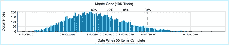

图 16—MC 模拟直方图示例

我们认为这看起来很棒，但它似乎只让开发团队感兴趣，而不是项目经理。它包含所有的预测元素、开始日期、项目数量、日期范围以及达到这些日期的可能性。现在的问题是形式。

当时，AA 工具的版本没有提供输出数据的替代方式，我们必须想出一种新的格式。我们将新格式称为“*单页发布状态*”，看起来像这样:

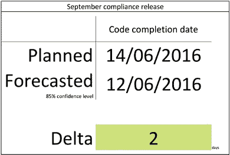

图 17 —我们的单页发布状态

这张单页纸取代了我们看板墙上的 MC 直方图，包含上次计划(上次承诺)交付日期、使用 85%置信水平的当前预测以及*计划*和*预测*日期之间的差值。这种格式很受欢迎，我们用了几个月。

为了进一步简化格式，我们迭代了一个版本，我们称之为*红枣*和*蓝枣*以满足我们客户的要求。在这个阶段，我们和九个团队一起运行，这意味着看板墙包含至少九条泳道，甚至更多。越来越难一眼看出我们是否陷入了困境。为了解决这个问题，我们采取了以下措施:

*   在我们对发布日期没有信心的地方，我们没有发布任何特定泳道的日期。这些情况通常发生在发布周期的早期，或者当团队组成或者工作类型发生根本性的变化时。这些事件使我们得出结论，要么我们没有数据，要么我们的数据不具有代表性。我们的目标是尽快缩小这一差距。
*   当我们对某个日期的信心水平相对较低时，我们将该日期添加到泳道，但用*红色*标记。该日期是使用代表性数据样本在 50%置信水平下模拟的 MC 日期，或者是具有 85%置信水平和一些数据样本问题的日期。
*   如果我们对某个日期有很高的把握，我们会用蓝色的*发表。这是一个模拟的 MC 日期，通常有 85%或 95%的置信度，由预测的代表性数据样本支持。*

我们过去使用预先安排的发布窗口，每两周部署一次产品。每个发布窗口都有一个相关的发布号。一个发布号取代了我们在发布日期上的下一次迭代。我们选择了发布日期接近我们预测日期的发布号。我们保留了无/红/蓝标签的惯例——如果我们对预测没有信心，就没有发布号，红色和蓝色分别表示低、高信心预测。我们将发布时间表放在看板墙的旁边，这样可以很容易地将发布号转换成发布日期。

现在浏览看板，更容易集中你的注意力，忽略蓝色的发布，放大红色或未定义的发布。因为团队知道他们必须在最早的机会提供一个日期，大多数情况下，讨论围绕着那些红色版本以及如何将它们变成蓝色。

有一条重要的规则。当预测发生重大变化时，即我们必须更改发布号时，不允许隐瞒这一变化。我们的每日项目站立宣布了这一点，一个与客户和交付团队代表的 scrum-of-scrum 风格的同步会议。为什么我们必须改变版本号的重要讨论发生在发布之后，通常是与相关的团队成员和涉众离线讨论。我们的数据经常支持这些讨论。

# 路线图

我们在一个高级路线图中聚合了所有的流，以补充通过看板共享的信息——这提供了相同数据的不同视图，示意性地看起来像下图。

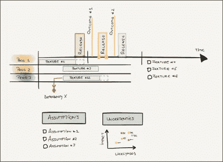

图 18 —路线图草图

我们的路线图包含水平绘制的功能，持续时间以日期范围表示。我们可视化了特征之间的依赖关系，捕捉了支撑预测的假设，并强调了我们的主要风险。这些因素加在一起，使得向那些不参与日常运营的人展示我们的计划变得更加容易。

那些熟悉计划或管理项目的人可能会想，“这与用甘特图来说明项目进度有什么不同？”虽然这种格式相当“粗俗”，但它被证明是最容易理解的格式。它与甘特图“驱动”项目的不同之处在于它的构建方法。如以上章节所述，它使用数据驱动的方法，由观察和测量过程支持，并且创建成本低廉。

我们的路线图方法和传统的“甘特图”交付之间的另一个区别是随后的对话和决策。我们使用路线图来显示我们所处位置的最后视图，以帮助我们了解我们是否朝着正确的方向前进。一旦我们有了新的信息，我们重新预测，更新路线图，并讨论我们是否仍在正确的轨道上。我们没有判断我们的项目是否成功，我们是否“按计划进行”或者我们是否遵循我们的路线图。我们项目的成功是通过我们是否基于我们所知道的和我们客户不断发展的需求来交付正确的特性来衡量的。路线图是我们帮助导航前方道路的使能因素之一。

# DevOps 的相同工作方法

在这个项目中，我们选择运行一个集中的 DevOps 团队。该团队为开发、测试和生产提供了基础架构，监控所有系统并对生产事件做出响应(要么是对支持请求的响应，要么是基于我们的监控警报的主动响应)。功能团队负责部署代码和修复任何与代码相关的问题，包括产品修复。DevOps 团队有积压的工作，并承担了跨越数月的主要项目，例如从一个云提供商迁移到另一个云提供商。这个团队实际上是我们的第 10 个团队，也是我们看板墙上的另一个泳道。

我们 DevOps 团队承担的工作类型远比我们的功能团队更加多样化。它包括从临时的和不太可预测的请求到战略性的和更可预测的开发工作。问题在于如何对他们的工作建模，以及功能团队使用的系统是否也适用于我们的 DevOps 团队。

在早期，我们以一种相当无流程的模式运行。团队有一个简单的看板，但是功能团队和 DevOps 团队之间的严格程度是不同的。我们一度认为这已经足够了，因为他们的工作性质不同。然而，随着我们增加了更多的团队，他们的吞吐量也增加了，压力开始显现。事情进行得并不顺利，团队被工作压得喘不过气来，因为有一个非常大的(不太明显的)WIP，他们努力完成许多项目。几乎不可能计划任何战略性的工作。这些是连贯和相关的要素，将跨越数周甚至更长时间，使整个方案受益。例如，重做整个备份系统，更换监控系统，或者更大的事情，例如转移到不同的云提供商。

很明显，我们必须对此做些什么。我们决定采用与专题小组相同的工作方法。一种基于明确定义的工作边界(正在进行的工作)的方法，在度量的帮助下测量和观察系统，随着我们的进展提高可预测性，并引入 MC 模拟和预测交付日期范围。到这个时候，我们已经掌握了特性团队的方法，所以我们渴望将它应用到我们的 DevOps 团队中。

这个过程出奇的快。整个改造大概花了一个月左右的时间。我们从准备阶段开始，在此期间，我们花时间了解大量积压的工作。我们把所有的问题都摆在桌面上，并把它们聚集在一起，决定哪些问题不会很快被关注，或者根本不会被关注。哪些需要快速修补，需要哪些额外的监控和警报来更快地发现问题，以及我们必须做哪些战略性工作。后一类将被视为项目。我们让客户参与进来，共同商定了一个攻击计划。

我们将团队能力分成几个部分:

*   **现场事故容量** —我们使用过去事故的现有数据来计算此容量。我们假设未来的事故水平将与过去相似。这竟然是一个好(幸运？)假设。
*   一个小的，严格的 WIP 限于一个，**T3 畅通**车道
*   **引入新服务** —支持功能团队构建需要新基础设施的功能所需的基础设施工作(例如，需要新型数据库的服务)
*   **技术债务** —我们将这种能力用于需要快速修补的工作类型
*   **战略工作** —战略平台增强，涵盖用战略补丁替换快速补丁的工作类型。这也涵盖了主要的移民工作类型。

一旦我们建立了存储桶，我们就为每个存储桶分配了一定百分比的容量。我们调整了这些百分比，以反映我们在前进过程中面临的新现实。

一旦我们的看板反映了这种能力预算，并且完成了每个铲斗/工作类别的一个泳道的分配，我们就开始了新的工作方式，密切关注保持流程。我们对总吞吐量进行了有根据的猜测，并使用计算出的百分比来确定每个桶的到达率。我们这样运行了几个星期，测量吞吐量并重新调整到达率。随着系统快速稳定，我们开始运行。我们在每周补货会议开始时测量了我们的生产量。我们与这个团队一起手动获取了吞吐量，在我们的看板旁边保存了一个每周吞吐量的表格。该表包含每个桶的一列，允许我们通过保留每个桶的流量来补充。

这一变化的影响是，我们交付了更多，我们可以在战略工作上投入更多的精力，这极大地有利于该计划。我们向自己证明了这种工作方法可以在 DevOps 团队中成功地使用，这些团队承担的工作类型不同于特性团队的典型开发工作。

# 积压创建和细化

在*定义我们测量什么*部分，我没有回答我们如何处理创建和细化待办事项清单的工作。毕竟，创建和细化 backlog 也是一项工作。

我们用多种方法处理这个问题。首先，我们通过将塑造故事的过程转移到分析阶段，尽可能地降低成本，这是我们 WIP 的一部分，并进行度量。在补货会议期间，我们还通过“及时承诺”消除了大部分改进。最后，我们进行了“史诗”级别的发现。

在我解释“史诗级别的发现过程”之前，我需要解释一下我们是如何在项目中使用“史诗”的。

我们发现将范围分解成更小的逻辑块是成功应用这种工作方法的一个重要因素。它允许我们以更小的批量工作，这反过来给我们带来了多种好处:

*   它使仪式更加有效；
*   它让我们获得更快的反馈；
*   它让我们看到了全局，我们通过史诗般的看板对全局建模。

“史诗看板”使用以下工作流程建模:*积压、发现、准备组装、组装、准备私有测试、私有测试、准备升级、升级、准备公开测试*和*公开测试*。

*装配*、*私有 beta* 和*提升*建模为工作列，其他建模为队列。这意味着当一部“史诗”出现在一个工作栏目中时，它会得到一个团队的服务。我们还在一个更低粒度的看板中建模了在其他地方完成服务所需的活动。

对于每个“史诗”，我们运行一个发现阶段(大多数时候，这是一个有时间限制的阶段)，为我们的构建阶段准备“史诗”，我们称之为*组装*。一旦“Epic”建立起来，我们就让它通过了一个*私人测试*阶段，我们用真正的最终用户执行真正的交易来测试它。然后，我们通过将产品带回到一个更短的构建阶段来迭代它，这个阶段被称为*升级、*，在这里我们实现了在私有 beta 阶段中确定的变更。该阶段为产品在*公测*阶段的最终公开发布做准备。每次一个‘史诗’在*组装*或者*隆起*的时候，它就出现在我们的主看板上，在主板上走泳道。

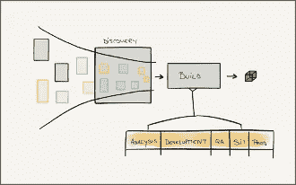

图 19——工作漏斗——发现在主要构建之前运行，从我们的想法/请求漏斗中获取大量信息

值得一提的是，虽然“Epic”可能会在*装配*阶段停留数周或数月，但我们每两周持续部署到生产中，并且“Epic”功能完全关闭。

从用户研究的角度来看，我们有一个由用户搜索专家、交互和内容设计师组成的专门的 UX 团队。他们在*发现*阶段作为一个团队工作，并在*组装*和*提升*期间嵌入到特征团队中。他们从*发现号*到*组装号*和*提升号*的早期原型开始迭代设计。

一旦我们建立了“史诗”工作流程的模型，我们就开始测量它。毕竟，这是一个流动系统，尽管是一个粗粒度的系统。这意味着它没有用户故事流动得快，而是流动的。因此，我们使用它提供的数据进行特别分析和报告，而不是对我们团队的运营进行日常分析。它对高级利益相关者的报告价值大于必要的分析价值。我们可以用我们的“史诗”展示我们每月进展的高级视图。这是正确的粒度级别，有助于对项目进行方向性的更改。

结合这些使我们能够消除异常庞大的积压优化会议。我们将项目存储在 backlog 中，作为将来某一天可能会变成承诺的选项。然后，我们从中提取大块数据，让它们通过一个发现过程。事实上，这是工作，但它是有分寸的工作，被认为与工作的任何其他阶段一样重要和明显。

# 这一切是如何联系在一起的——项目的中心枢纽

引入这种工作方法并使之成功的一个基本要素是项目的“枢纽”，一个整合一切的中心。这包含了基于“史诗”的看板、主看板、发布时间表，以及我们的风险和依赖的列表和地图。它也是我们每天与来自高级管理层、每个团队和每个职能部门的代表同步的地方。远程工作的团队通过视频会议拨入。

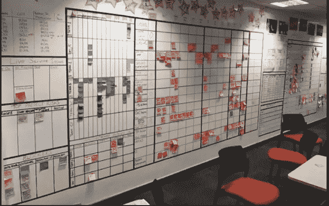

图 20 —我们的“看板空间”；epic 工作流程——蓝色便利贴看板；主看板橙色便利贴看板；结尾是红色和蓝色的枣

董事会和每日同步会议是我们工作不可或缺的一部分。例如，团队将在会议前运行分析，并准备好报告故事层面的任何问题。正是在这里，我们宣布了对我们的版本的任何日期更改，或者在宏观层面上讨论了决定哪些“史诗”要比其他版本进步的更改。这也是我们庆祝成功的地方，任何重要的里程碑都会被挂在我们黑板上的星星所反映。

这种工作方式是我们对敏捷宣言中的'*个人以及过程和工具的互动的体现。我们在人的层面上进行互动，但我们通过围绕测量和观察建立的工作流程丰富了这些互动，在这些流程中，数据以及提取和分析数据的工具成为我们工作方式的一个组成部分。我们让他们成为一等公民。*

# 完整的圆圈

在这个案例研究的开始，我说过我们发现了一种新的工作方式，这有意义地改变了我们的方法。我们如此信任它，以至于我们在它的基础上建立了商业协议。我们工作方式的透明度是实现这一目标的重要因素，有助于巩固我们和客户之间的信任。

实现这一目标需要所有相关方的高度成熟。愤世嫉俗者可能会说，这种基于度量标准的模型会倾向于游戏，人们会被诱惑去玩这个系统。我的反驳是，如果你在整个项目中以一种有意义的方式共享和使用数据，这样的尝试不会不被发现。对我们来说，这从来都不是问题。

# 结束语

大约一年后，我们可以流畅地运用新的工作方式。所有团队和职能部门都在使用这种工作方法。在我离开这个项目后，这个方法一直沿用至今。

没有丹的书和马丁的信任，这一切都不会发生。更重要的是，没有他们不懈的反馈和耐心，没有信任我们的队友，这一切都不会发生。谢谢大家！

## **参考文献**

[1]https://actionableagile.com/resources/publications/aamfp/

[2]维基百科