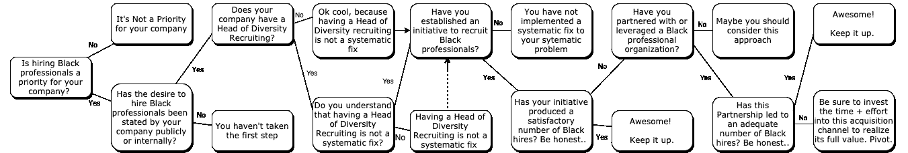

# 雇佣黑人并不难

> 原文：<https://betterprogramming.pub/its-not-hard-to-hire-black-people-2312e657db24>

## 贵组织雇用更多黑人人才的可行步骤

图片由 [Jopwell](https://jopwell.pixieset.com/internedition/) 提供

在过去的一年里，我参加了许多招聘活动，开发了一个人工智能招聘引擎，与招聘人员和招聘经理建立了关系，并获得了一个新角色。我一直沉浸在招聘的世界中，但我也着迷于似乎每个公司都有相同的招聘人员困境——显然，很难找到并雇用黑人。

我想改变这一点，特别是考虑到我的背景以及我经历的到目前公司的无缝过渡。

这篇文章*不是*旨在重新引用[令人沮丧的工作场所多元化统计](https://www.wired.com/story/five-years-tech-diversity-reports-little-progress/)或[激励多元化团队绩效统计](https://inside.6q.io/benefits-of-cultural-diversity-in-the-workplace/)或甚至说服雇主你*应该*雇用黑人专业人士。它旨在发人深省，并告诉你可以采取的行动。

虽然这篇文章倾向于技术和 STEM，但我将列出一些你的组织可以采取的可行步骤，以获得更多的黑人人才。我希望招聘人员和招聘经理能够发现他们在招聘方面的不足，并实施系统的解决方案，这些方案将会产生持久的影响。

# **说出来**

首先，说你想雇佣更多的黑人并没有错。

我认为最大的障碍之一是公司不愿说出事实。你的组织中缺少黑人专业人士。你需要更多。它创造了一个更好的工作环境。我们同意。相信我，我们不会向你抱怨的！

如果你对说这话感到犹豫，因为你担心做做样子，或者你“不想成为……你知道，”我理解。这是一个合理的观点。词语和交流很重要。我最好的建议是以真诚、诚实和深思熟虑的方式来交流。

尽管如此，如果你似乎找不到合适的词，那就跳到下面题为“去游泳”的部分

# 为什么黑而不多样？

想象一下，如果不是把二月当作黑色历史月，而是叫做多样性历史月。会是给谁的？会是什么样子？

多样性这个词并不具体。它可以被拉长和扭曲来表示许多不同的意思。这种描述可能过于笼统。一项旨在包容黑人并赋予他们权力的计划很容易吸引太多的候选人，偏离其最初的目的，或者对黑人的影响很小。

黑色是特定的。巧合的是，它也包括来自不同种族、文化背景和生活经历的人。然而，它传达了一个清晰的想法来激励周围。

此外，虽然许多群体在职业领域的代表性不足，但黑人[可以说是最差的](https://www.pewsocialtrends.org/2018/01/09/blacks-in-stem-jobs-are-especially-concerned-about-diversity-and-discrimination-in-the-workplace/)，这表明我们是最难找到的。因此，如果一家公司可以为黑人人才创造一个成功的渠道，那么他们可以用这种经验作为吸引其他边缘化群体的模式。

# 系统性问题需要系统性的解决方案

我观察到，许多公司无意中变得缺乏多样性。他们建立了一个公认成功的内部员工推荐计划，随着每一轮新的融资或增长，都会出现新一轮的推荐招聘。如果它没坏，就不要修理它——对吗？嗯，可能是坏了。

同样的公司也在谈论让员工多样化的必要性。然而，他们没有实现一个系统的解决方案。这很奇怪——因为实施的系统导致了多样性的缺乏。员工指的是他们关系网中的亲密同事。如果你现有的员工队伍中没有黑人，你可能就不会有黑人推荐渠道。你需要通过利用其他资源来改进你的渠道策略——见下文。

如果你发现你的组织缺乏多样性，那就进行一次坦诚的对话，并大声说出你的想法。寻找黑人天才。获得员工的认同，然后行动！

年轻的公司和团队可以通过从一开始就优先考虑多元化来避免这种不幸的现实。

附注:招聘多元化招聘和包容主管并不是一个系统性的解决方案。

# 游泳

当你在海里游泳时，找到水并不困难。把自己放在吸引黑人人才的地方。

有一次，我和一位人力资源总监讨论如何雇佣更多黑人分析师。具有讽刺意味的是，她当时在华盛顿特区，这个城市拥有美国历史上最著名的黑人学院和大学之一。所以我的建议是，“从霍华德大学招聘。”她说这所大学不在她的目标学校名单上。该公司言行不一，如今他们的黑人员工为零。

HBCUs 只是一个来源。有无数的组织和活动致力于召集志同道合的黑人专业人士。大多数都有可以利用的会议、聚会或大型电子邮件列表服务。

比如我本科期间，我大学的很多黑人工科学生都参加了[全国黑人工程师协会](https://www.nsbe.org/home.aspx)大会。NSBE 有大型的招聘会，公司会在现场进行面试。一些公司甚至在这次会议上严格保留招聘名额。

有道理！关于黑人工科学生毕业和留校率的统计数据令人沮丧(T2)。不管为什么，一些工程公司认识到这一点，并利用 NSBE 作为一个简单的一站式黑 STEM 人才。这是一个无缝的解决方案。我们中的一半人在周末结束时带着实习和全职工作机会离开了会议。太棒了！

这样的几个组织有: [Jopwell](https://www.jopwell.com/) ， [AfroTech](https://experience.afrotech.com/) ， [We Build Black](https://webuildblack.com/) ，[全国黑人 MBA 协会](https://nbmbaa.org/)， [ADCOLOR](http://adcolor.org/) ，[全国黑人会计师协会](https://www.nabainc.org/)，[黑人女性动画](https://blackwomenanimate.com/)。。。这个清单还在继续。其实你大概可以在任何一个主要的专业行业前输入“黑”，找到一个机构。你只需要看看。

> “做你的谷歌。”——美国黑人谚语

# 我是如何被聘用的

去年，当我决定是时候迈出职业生涯的下一步时，我更新了我的简历和在线资料，并参加了招聘活动。几周之内，我收到了去[卢卡](https://lukka.tech/)面试的邮件。他们通过 [Jopwell](https://www.jopwell.com/) 找到了我的资料，带我去面试，允许我见团队成员，然后——我被录用了！

是的，方式！

我被 Lukka 吸引是因为他们创新的加密货币会计产品，但我致力于他们，因为他们负责并采取行动确保多元化的工作场所。

# 你有多努力？

遵循下面的行动树，看看你的努力是否会带来更多的雇佣。

无论你的回答是“是”还是“否”，这个练习的目的是促使你批判性地思考你的招聘工作的有效性，决定你的行动是否符合你的期望，并实施*实际上*导致改进的招聘系统。

# 结论

希望你觉得这篇文章有启发性和娱乐性。我希望你能让你的组织更容易吸引黑人人才。一旦你解决了这个问题，那么我们就可以处理下一个问题——**保留！**