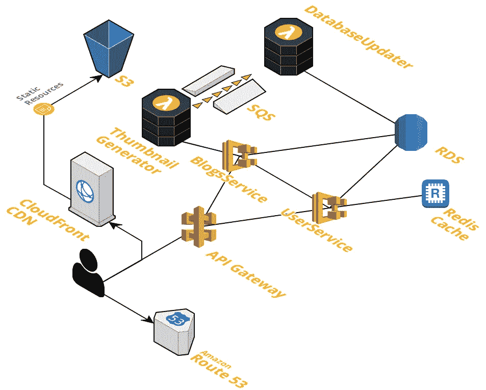
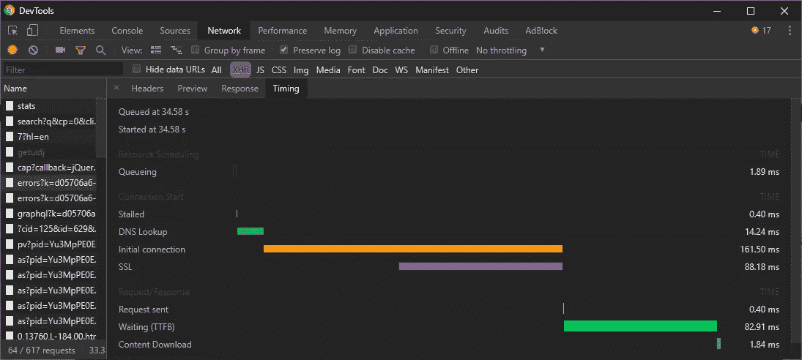
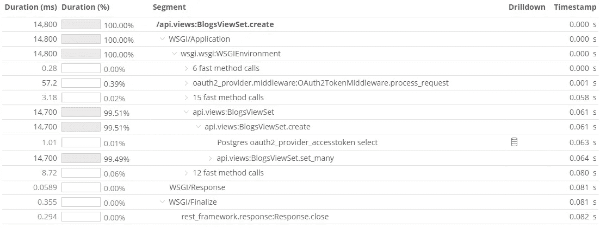
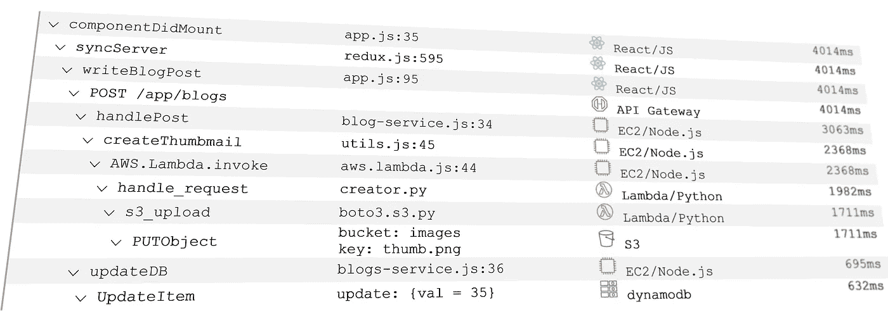

# 是时候使用全栈开发工具了

> 原文：<https://betterprogramming.pub/its-time-for-fullstack-dev-tools-4f0ec38628d8>

## 拿出你的工具箱

由[谷仓图片](https://unsplash.com/@barnimages?utm_source=unsplash&utm_medium=referral&utm_content=creditCopyText)在 [Unsplash](https://unsplash.com/search/photos/toolbox?utm_source=unsplash&utm_medium=referral&utm_content=creditCopyText) 上拍摄

随着时间的推移，JavaScript 证明了自己是世界上最流行的语言。如今，在 web 上进行开发非常容易，许多新开发人员将 JavaScript 作为他们的第一语言来学习。

但是新开发人员并不是唯一找到 JavaScript 门路的人。 [Node.js](https://nodejs.org/en/) 本身是最流行的框架，经验丰富的后端开发人员，不管他们喜欢与否，也会加入 JavaScript 社区。

由于 web 应用程序如此受欢迎，并且您也可以使用 JavaScript 运行后端，更多的开发人员发现他们同时在前端和后端工作，并且需要掌握同时调试两个系统的复杂技能。

但是复杂性并没有就此结束。如今，大多数后端架构看起来像一片茂密的森林。随着云服务的发展，无服务器解决方案的成熟，以及微服务架构的流行，后端架构变得比以往任何时候都更难理解。

即使一个简单的后端架构也可以包含许多资源。下面是两个后端服务的简单示例，worker lambdas 通过队列进行通信，CDN 具有静态内容存储、数据库和缓存服务器:

*一个简单的建筑，用 cloudcraft.co 的草图*

现在，想象你点击 [React](https://reactjs.org/) 应用程序上的一个按钮，导致意外数据被写入数据库。您必须首先调试客户端代码，并检查您是否用正确的参数调用了正确的 API。一旦清除了这些，您将继续调试服务器。但是您注意到您的服务器调用了一个 lambda，该 lambda 将一个项目插入到一个队列中，该项目后来被另一个 lambda 选中，最终可能会将错误的数据写入数据库。

这个调试过程可能会占用你一整天的时间，以及你的好心情。

# 我呼吁全栈开发工具

今天，为了调试所讨论的流程，您可能需要 Chrome DevTools、IDE、一个日志浏览器和一些超能力来将特定的 API 请求与两个 lambda 调用相关联。

观察一下 Chrome DevTools 上的计时面板:

*Chrome DevTools 网络>计时面板*

绿色条隐藏了辣的信息。这段时间后端发生了什么？有用的监控工具可以详细说明这一点。

[**NewRelic**](https://newrelic.com/) 有几个监控解决方案，主要关注后端性能和健康状况。在它的特性中，NewRelic 通过检测代码来跟踪后端事务。以下是同一条绿条的阐述，从后端来看:

*NewRelic 应用性能监控(APM)痕迹*

这无疑提供了更多的信息。但是如果您的 API 服务器调用额外的资源，可能是另一个微服务，或者甚至异步调用一个 lambda，这可能稍后会失败，该怎么办呢？在当今的多服务世界中，在开发过程中，您经常需要整个端到端流程的细节。

[**Epsagon**](https://epsagon.com) 是监控多服务和无服务器应用的先驱。它可以自动跟踪您的整个云架构，识别资源之间的重要链接，并绘制端到端流程的详细阐述。下面是一个复杂流程的示例，从 API 调用开始，涉及队列、存储、数据库和外部 API:

Epsagon 事务跟踪

Epsagon 可以进一步阐述；如果你点击一个资源，你会得到更多的细节，比如 S3 文件的位置，甚至是 HTTP 请求和响应的主体。

Fullstack 社区需要在浏览器中实时组合这些**。深度调查工具将:**

1.  将整个流程的时间线可视化，从客户端开始，到涉及的最后一个云服务结束。
2.  通过在客户机、服务器和 lambdas 的任何地方检测代码，生成一个庞大的调用堆栈。

全栈调用栈

Chrome 基于其 DevTools 赢得了网络。Firefox 和 Edge Canary 正在通过投入人力来超越它，并且他们已经开发了一些差异化的功能。微软独一无二地抓住了两端，并有可能将其应用洞察集成到 Edge Canary 中。

今天是十年来浏览器第一次争夺开发者社区。如果浏览器厂商通过集成云监控解决方案来开发更好的开发工具，不断增长的 Fullstack 社区可能会让他们成为第三次浏览器战争的赢家。Fullstack 社区值得拥有这样的工具；是时候做出选择了。