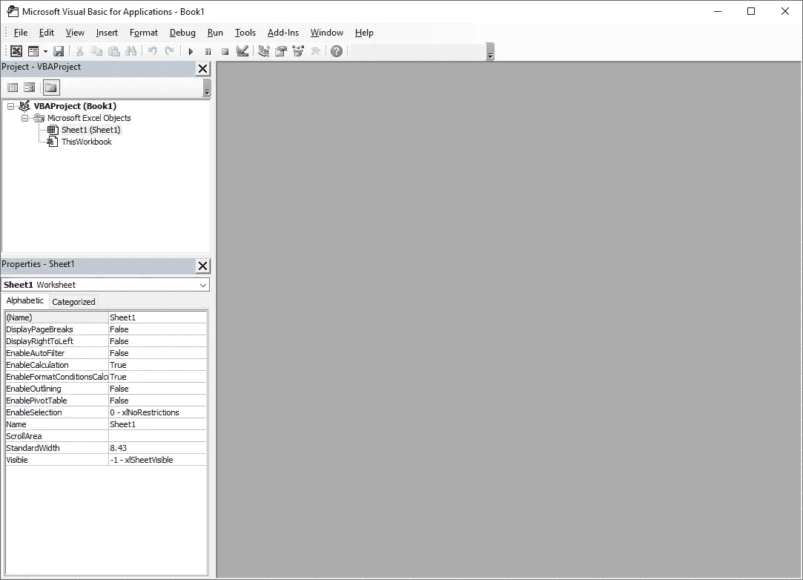
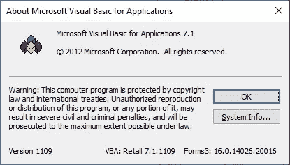
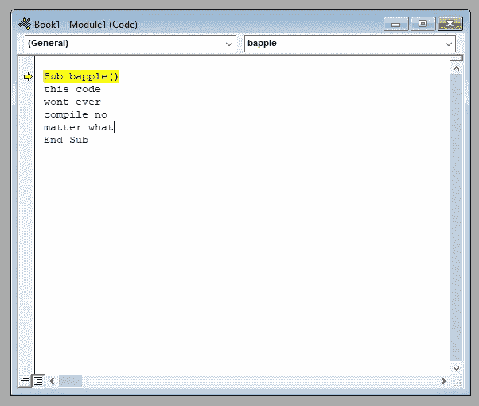
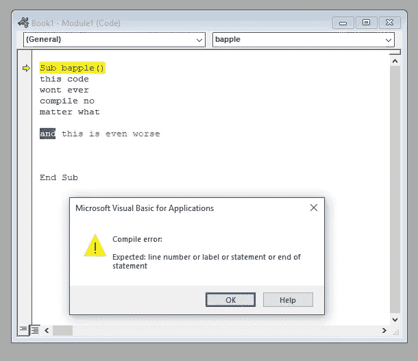

# 是时候干掉 Visual Basic 了

> 原文：<https://betterprogramming.pub/its-time-to-kill-visual-basic-ed6bab4f437a>

## 这对每个人都不好，包括你

机器人神童在 [Unsplash](https://unsplash.com?utm_source=medium&utm_medium=referral) 上的照片

Visual Basic (VB)在许多开发人员心中占有特殊的地位。对于很多人来说，他们写的第一个代码是用 VB 写的。如果你懂 VB，你可以创建桌面和网络应用程序，甚至可以在 Excel 或 Word 等应用程序中自动完成任务。在 PowerShell 出现之前，我们可以使用 VBScript 直接与 Windows 交互，自动执行任务，甚至处理更复杂的事情。

但是我们真的需要停止使用它。这对我不好，对你不好，对所有人都不好。如今的 Visual Basic 与大约 30 年前开始时完全不同。这个区别很大程度上可以归结为说，在 1991 年，它是有前途的。今天，它没有。

30 年前的那一年，全世界都接触到了 Visual Basic。大约在这个时候，RAD(快速应用开发)开始流行。开发人员可以将控件拖放到表单上，然后轻松地连接一些功能，这一想法立即吸引了任何对创建应用程序感兴趣的人，而 VB 使这一点变得更加容易实现。为了补充这一点，Visual Basic 被证明是易于学习和理解的，这在当时被证明对初露头角的开发人员是有用的。

然而，现在我们是在 2021 年，在 Visual Basic 最初发布的三十年后。这是一次伟大的奔跑，但是是时候离开了。为什么呢？嗯，VB 有三种主要形式，让我们来看看每一种。这些是。NET (VB。NET)、Visual Basic for Applications(用于在 Word 或 Excel 中创建宏)和 VBScript。让我们想想为什么是时候继续前进了。

# Visual Basic。网

VB。NET 和 C#几乎同时出现。然而，Visual Basic 的概念已经存在于 VBScript 和 Visual Basic for Applications 中。这意味着人们开始使用 VB.NET 比学习一门全新的语言如 C#更容易。当时，它比使用 Visual Basic 6 要好，但现在，使用它来启动新项目是一个坏主意，任何现有的项目都开始积累越来越多的技术债务。为什么？

## 缺乏简洁性

几乎每种语言都有 lambdas。Lambdas 是将参数从一个函数传递到另一个函数的简单表达方式。当我们想要将一个条目列表从一种类型映射到另一种类型时，我们通常会使用 lambdas。

一种更合理的语言通常通过以下方式实现这一点:

我不确定有多少种语言以这种方式实现了 lambdas，但据我所知，C#、Dart、TypeScript 和最近的 JavaScript 版本(ES6)都支持使用 arrow 函数。如果您将这些代码展示给任何使用这些语言的开发人员，他们可能会明白发生了什么。

Visual Basic 非常冗长，没有任何原因。也许人们认为更多的单词意味着对于刚起步的开发人员来说更容易理解，但是我认为更多的单词意味着更容易误解正在发生的事情。Visual Basic 不支持箭头函数。相反，你得到了这个。

Visual Basic 抛出了一个毫无意义的关键字`Function`,并让我们将操作符放在括号中。而且记住，微软还做了 C#和 TypeScript，它们都有箭头函数支持。这里到底发生了什么？添加箭头功能是否违背某种语言指南？如果是这样，我们应该感到担忧。

也许最奇怪的是，这正是在 ES6 之前 JavaScript 处理 lambda 的方式。感谢那些制作 Babel transpiler 的好人，JavaScript 开发人员可以随心所欲地编写箭头函数，Babel transpiler 会用旧的`function` lambda 操作符替换它们。但是对于 VB.NET 来说，没有这样的平移解决方案，所以你在使用 VB.NET 的时候，总是被这些奇怪的 lambda 算子所困扰。

因为没有其他语言(至少据我所知)像 lambdas 这样，并且因为作为一个全栈开发人员，你可以在一天之内编写一些 VB.NET、Javascript、C#和 Dart，你偶尔会记错，并在你拍脑袋记住你当时没有使用 VB.NET 之前在编辑器中编写错误的语法。

你的头脑中有两套规则，一套针对人们实际使用的最新语言(如 C#、JavaScript、Dart 等)。)和另一套只能应用于 Visual Basic 的 VB.NET 规则。你的大脑只能容纳这么多东西，你真的想用只适用于一种语言的语法规则来提升它吗？

## 缺乏互操作性

如果有人说他们是 Python 开发者，你知道他们是什么意思。如果他们说自己是 Java 开发人员，你还是知道他们的意思的。如果有人说他们是 Visual Basic 开发人员…他们是什么意思？他们是否已经完成了一个快速的 Visual Basic 脚本(VBS)来自动化一些任务？还是用 Visual Basic for Applications (VBA)为 Word 或 Excel 编写宏？还是他们用的是 Visual Basic。NET (VB。网)？

当然，这三者中没有一个是相互兼容的。是的，它们的相似之处多于不同之处，但是你不能仅仅从编写 VBScript 到编写 VB.NET 应用程序。这可能有一个很好的理由，但在我看来，没有什么理由可以解释为什么这些语言会发展到如此地步。为什么 VB.NET、VBA 和 VBS 之间的语法不能更相似，如果不是相同的话？

## 糟糕的编辑选择

如果您使用 C#、Java 或几乎任何其他语言(除了，我不知道，COBOL)进行开发，您可以很好地选择使用什么 IDE 来编写代码。事实上，COBOL [也有一个非常好的编辑器](https://github.com/OpenCobolIDE/OpenCobolIDE)。尴尬。

如果你想用 VB.NET 或者 VBScript，你可以用 Visual Studio 或者 VS 代码加上必要的插件，就可以了。但是，如果你想尝试使用 VBA 来创建一个 Excel 插件，你是在为这个可憎的。

看看那些线条。直接退出 Windows 2000。

考虑到 Excel 2019 实际上看起来相当不错，事实上，你从这种外观和感觉中被抛到看起来像是从 90 年代末开始的东西，这无异于不和谐。哦，等等，这东西是哪年的？

数字

版权声明中的年份可能不是软件最后一次被修改或构建的最可靠指标，但它确实让人感觉 VBA 编辑器已经有近十年没有被修改过了。

更糟糕的是，在我不得不使用这个东西的几次中，我花了大约一半的时间与编辑器本身斗争。现代编辑器用曲线突出显示您的代码，或者在您键入代码建议和编译时错误时为您提供一些视觉指示。另一方面，VBA 编辑器更像一个竞赛裁判，隐藏分数直到你写完一行并按下回车键，这时它要么通过语法检查，要么用一个神秘的错误扇你一巴掌。我这么说是什么意思？让我们来看看这个可怕的、无用的、永远无法编译的代码。

这是一个函数，我没有声明任何变量名。我刚刚在编辑器里写了垃圾。在这种情况下，因为我每行写了两个单词，所以编辑器很乐意让我每行都按 return 键，而不会抛出错误。你希望你的代码错误下面有弯弯曲曲的线条吗？你怎么敢。你说 VBA 不会直接编译进你的大脑是什么意思？

但是当我在这条线上添加更多的单词时，它就爆炸了。

悲伤的长号噪音。

短语“编译错误”似乎暗示 VBA 的编辑试着编译了我之前的代码，完全没问题。这根本不可能是真的；它不能编译那些垃圾。在 VBA 编辑器中，当你在一行的末尾按回车键时，会发生一些事情，这是某种程度的验证，它会被严重命中和错过。

## 鼓励坏习惯

在我的职业生涯中，我花了令人失望的时间来清理和解决一个相当大的 Visual Basic 项目的问题，这个项目从关闭`Option Strict`开始。这基本上意味着隐式转换可以在类型之间发生，并且不会引发编辑时警告。例如，如果您的函数返回一个`Object`，并且您试图将它赋给类型为`String`的东西，那么编辑器将会认为运行时转换是正确的，不会将其标记为编译时错误。

这句话真的很可怕，它是对单词*运行时*的重复使用。也就是说，如果你要有一个问题，那么它将发生在运行时，而不是编译时，这不是你想要的。如果你像我一样，继承了一个 VB。NET 项目中有数千行代码，而您启用了`Option Strict`，那么您将面临数千个与类型相关的错误。在代码编译之前，您必须手动修复每一个错误。当然，这样做，你提高了代码的质量，减少了代码的味道，但是这是一个愚蠢的问题。为什么这甚至是一个选项，哪个疯子宁愿关掉它，放弃一些那种类型的安全？令人难以置信。

## 语言不再有改进

微软宣布他们将把 Visual Basic 发展成一门语言。NET Core ，然后，四个月后，把那个思想改成“[其实，还是不要](https://devblogs.microsoft.com/vbteam/visual-basic-support-planned-for-net-5-0/)了。”在我看来，将整个语言移植到。NET Framework 5.0，但却立即放弃了它，这让我有些吃惊。

也许你对今天的 VB.NET 语感到满意，如果你满意，那也没关系。但是时代在变，在像 C#甚至 Dart 这样的语言中，我们在处理`null`的方式上得到了改进，在 Dart 和 Flutter 的最新版本中，我们甚至获得了像默认不可空(NNBD)这样的特性。这些并不是你制作应用程序所需要的东西，但是随着时间的推移，一些小的改进会让开发者的生活变得稍微轻松一些。因此，除非微软开源 Visual Basic，否则随着时间的推移，这些进化式的改进不会应用于 Visual Basic。最终，它会变得过时，甚至比今天更加过时。如果这对你来说还不够，在 Stack Overflow 的 2020 年开发者调查中， [VBA 是最讨厌的语言](https://insights.stackoverflow.com/survey/2020#technology-most-loved-dreaded-and-wanted-languages-dreaded)。如果人们讨厌使用它，那么按理说可供选择的开发者会越来越少，对吗？

# 我该怎么办？

如果你专门为 Excel 或 Word 创建 VBA 解决方案，你很可能会被现有的东西困住。似乎确实有一些工具可以帮助，而且看起来相当不错(但是我还没有试过)。到目前为止，最糟糕的事情是，如果你的思维固定在 VBA 的做事方式上，试图学习任何其他语言都会有巨大的困难。

如果你还在用 VBScript，嗯，很难。脚本语言对于自动化来说是很棒的，所以改变成其他语言的提议可能没有那么吸引人。但是有没有想过学习 [PowerShell](https://docs.microsoft.com/en-us/powershell/) ？如果您进行了这种转换，您也可以使用 Powershell Core，这样您创建的东西就有可能在 Linux 或 macOS 上运行，这可能是一个很大的动力。

如果你还在使用 VB.NET，如果你把它和 web forms 这样过时的编程模式结合使用，那就更是如此了，我认为你写的每一行新代码都在增加你的技术债务。在不久的将来，招募和维持擅长 VB.NET 的开发人员将变得困难。因为你的。NET 项目编译成解释语言(IL)，你可以同时运行一个 [C#](https://docs.microsoft.com/en-us/dotnet/csharp/programming-guide/) 项目和你的 VB.NET 项目，并且彼此依赖。这是开始用 C#编写新的应用程序或者用 C#重写部分应用程序的好方法。同样，如果你使用的是 web 表单之类的东西，那么理想情况下，你用 C#编写的代码应该是 API 控制器，你应该选择一个前端 JavaScript 框架来与它们交互。这就是我正在用我的传统 VB.NET 网络应用程序做的事情，它让世界变得不同。

过去有一段时间，我不得不从 VB.NET 转到 C#，是的，我花了几个月的时间才完全转换过来。但我很高兴我做到了。如果没有 VBA 在微软办公套件中的紧密结合，我不确定它是否需要存在。当然，值得注意的是，这些年来很多人都在使用 Visual Basic，有些人可能是通过使用 VB 开始软件开发的。我并不是专门针对这些人——创造一种语言将是一项巨大的事业，最终，世界上更多的软件开发者可能是一件好事。但是作为一门语言，现在我们当然有更好的选择。

同样值得注意的是，这个世界将永远需要一些 Excel 和 Word 宏的 VBA 开发者，因为在这个产品中没有其他选择来编写东西。但是我们更需要谁呢:VBA 专家还是亚马逊网络服务(AWS)专家？肯定是后者。如果你有 1000 个知道 AWS 的人和 1000 个知道 VBA 的人，更多的 AWS 人最终会被雇用，因为有更大的需求。

当 Visual Basic 第一次出现时，它使软件开发变得容易，但是当它开始实现与此直接相反的目标时，现在是它离开的好时机。再见，Visual Basic，感谢所有的类型错误。